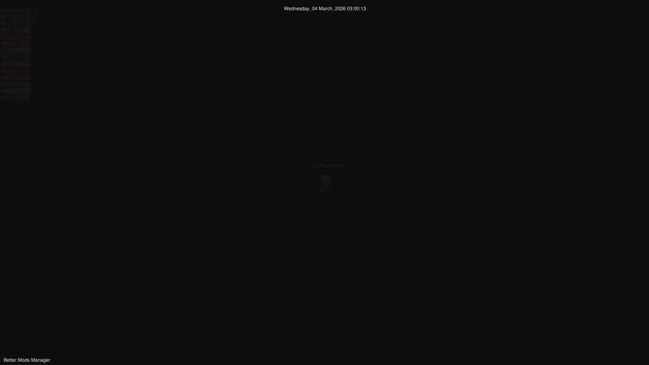

<div align="center">
  
  
  # Better Mod Manager

  **Un gestionnaire de mods universel, moderne et haute performance pour Windows**

  
  
  
  
  
  

  [Site officiel](https://freeproject089.github.io/BMM_Web/) •
  [Discord](https://discord.gg/CTaaEF9R75) •
  [Nous soutenir sur Ko-fi](https://ko-fi.com/I2I31ZIPPG)

  ---

</div>

## Qu'est-ce que Better Mod Manager ?

Better Mod Manager est un **gestionnaire de mods nouvelle génération** conçu de A à Z pour la performance, la sécurité et l'expérience utilisateur. Contrairement aux gestionnaires traditionnels qui reposent sur des liens symboliques fragiles ou gèrent mal les conflits, BMM introduit le **moteur Smart Physical Copy** — une approche par copie physique qui offre un contrôle absolu, une fiabilité totale et une intégrité garantie des données.

Que vous gériez des mods pour DCS, Skyrim, Fallout, Cyberpunk ou n'importe quel autre jeu, BMM transforme le chaos des conflits de mods en un flux de travail propre et automatisé.

---

## Le moteur Smart Physical Copy

Les gestionnaires classiques utilisent des liens symboliques ou des liens durs — dépendants de l'OS, fragiles et difficiles à déboguer. BMM adopte une autre approche :

| Aspect | Gestionnaires traditionnels | Better Mod Manager |
|--------|---------------------------|-------------------|
| **Isolation** | Liens symboliques (fragiles) | Copies physiques (fiables) |
| **Sécurité** | Sauvegardes manuelles | Sauvegardes automatiques avant TOUT changement |
| **Récupération** | Restauration complexe | Restauration atomique en un clic |
| **Détection des conflits** | Limitée ou absente | Vérification SHA-256 par fichier en temps réel |
| **Risque de perte de données** | Élevé | Nul — protégé par 3+ couches indépendantes |

**Comment ça fonctionne :**
1. L'activation d'un mod copie physiquement ses fichiers dans le répertoire du jeu
2. Les fichiers originaux sont automatiquement sauvegardés avec leurs empreintes SHA-256
3. Les conflits sont détectés en temps réel avec gestion configurable des priorités
4. Un clic restaure n'importe quel jeu à son état exact avant modification

---

<div align="center">
  

  *Visualisation Gource de l'historique de développement de BMM*
</div>

---

## Fonctionnalités clés

### Gestion et organisation

- **Profils multi-jeux** — Créez un profil entièrement indépendant pour chaque jeu de votre bibliothèque. Chaque profil dispose de son propre chemin de jeu, dossier de mods, état d'activation, thème personnalisé et configuration. Passez de DCS à Skyrim, Cyberpunk ou n'importe quel autre jeu en un clic, sans contamination croisée.

- **Utilisation disque par profil** — Un scan asynchrone en arrière-plan vous indique précisément combien d'espace disque consomme chaque profil en temps réel — plus besoin de calcul manuel.

- **Détection intelligente des conflits** — Dès que deux mods tentent d'installer le même fichier, BMM le détecte instantanément. Le système de priorités vous permet de définir quel mod l'emporte, et le panneau des conflits liste chaque collision avant toute application.

- **Mise en commun locale des mods** — Si deux profils partagent le même fichier de mod (DLL, texture, etc.), BMM réutilise automatiquement la copie physique unique. Économise des gigaoctets pour les grandes collections de mods multi-jeux.

- **Explorateur d'archives** — Prévisualisez l'arborescence complète d'un `.zip`, `.7z` ou `.rar` sans l'extraire. Sélectionnez uniquement les fichiers à installer par glisser-déposer dans l'arbre.

- **Gestionnaire visuel (Mapper)** — Un visualiseur d'arborescence pan/zoom conçu pour la masse : rendu de plus de 10 000 fichiers à 60 FPS, détection des liens symboliques circulaires, navigation en temps réel dans votre dossier de jeu ou de mods sans gestionnaire de fichiers.

- **Historique et journal d'audit** — Chaque activation, désactivation, mise à jour et retour arrière est enregistré avec horodatage, auteur, tag de version et note optionnelle. Idéal pour déboguer des régressions : "quel mod ai-je ajouté hier qui a cassé le jeu ?"

---

### Sécurité et intégrité

- **Moteur d'intégrité profonde** — BMM calcule une empreinte SHA-256 pour chaque fichier géré lors de l'activation. Vous pouvez relancer un scan d'intégrité complet à tout moment pour détecter les fichiers silencieusement modifiés, corrompus ou supprimés hors de BMM.

- **Sauvegardes triple-couche automatisées** — Avant d'écraser un fichier original du jeu, BMM le sauvegarde dans trois emplacements indépendants : un cache de session, un dossier de sauvegarde persistant, et un snapshot lié au registre. Même si une couche échoue, votre jeu reste récupérable.

- **Opérations I/O thread-safe** — Toutes les opérations sur fichiers sont protégées par des verrous Rust Mutex. Les activations parallèles, les scans en arrière-plan et les mises à jour de l'interface ne se parasitent jamais — aucune écriture corrompue, sans exception.

- **Contrôle d'accès système** — Le *mode Complet* offre un accès filesystem non restreint (utilisateurs avancés). Le *mode Limité* confine entièrement la couche JavaScript à vos dossiers de profils déclarés — le code JS ne peut littéralement ni lire ni écrire quoi que ce soit en dehors de vos dossiers de mods.

- **Creator ID** — Une paire de clés Ed25519 permanente est dérivée de l'empreinte matérielle de votre machine (CPU, numéro de série de la carte mère, UUID du disque, etc.) et scellée dans le registre Windows. Elle vous identifie de façon unique en tant qu'auteur de mods lors de la publication sur un serveur de dépôt — et reste stable après un changement de GPU, une mise à niveau RAM ou un remplacement de carte réseau.

- **Application du CLUF** — Un visualiseur CLUF bilingue (EN/FR) s'affiche au premier lancement avec acceptation obligatoire après défilement complet. Garantit une prise de connaissance explicite avant toute utilisation.

---

### Partage de mods et synchronisation

- **Mode Serveur de dépôt** — Transformez n'importe quelle machine en serveur de mods LAN ou public en un clic. Les clients se connectent par URL et reçoivent un snapshot signé du dépôt. Seuls les fichiers modifiés sont transférés lors d'une synchronisation (delta sync) — économique en bande passante, même pour des packs de 50 Go.

- **Signature Creator ID** — Chaque snapshot de dépôt est signé avec la clé Ed25519 privée de l'auteur avant publication. Les clients vérifient automatiquement la signature avant d'appliquer toute mise à jour — aucune attaque man-in-the-middle ne peut injecter des mods falsifiés.

- **Installation directe (`bmm://`)** — Les pages web peuvent lier des mods via le schéma URI personnalisé `bmm://`. Cliquer sur le lien ouvre BMM et pré-remplit la boîte de dialogue d'installation — installation en un clic directement depuis le navigateur.

- **Système de modpacks (.bmp)** — Regroupez toute une configuration de mods (fichiers + métadonnées + ordre de priorité + checksums SHA-256) dans une seule archive `.bmp`. Les destinataires peuvent installer, vérifier ou réparer automatiquement le pack complet en une action.

- **Format d'export .MM** — Exportez une configuration complète de profil — liste de mods, priorités, arbre de dépendances et manifestes — en un seul fichier `.MM` importable sur n'importe quelle machine.

---

### Automatisation et intégration IA

- **Launch Packs** — Regroupez n'importe quelle combinaison de `.exe`, `.bat` et `.ps1` dans un pack de lancement nommé. Un clic démarre silencieusement DCS, une app de communication vocale, un pilote TrackIR et un script personnalisé dans le bon ordre — plus besoin de chasser dans la barre des tâches.

- **Serveur MCP** — Exposez toutes les capacités de BMM à des agents IA via JSON-RPC 2.0. Claude, Gemini ou tout agent compatible MCP peut lister des mods, activer des profils, vérifier l'intégrité, synchroniser des dépôts et analyser des logs de crash — le tout en langage naturel.

- **CLI avancée** — Contrôle sans interface pour les scripts et pipelines CI : `bmm-mcp-server.exe list-mods --profile dcs`, `sync-profile`, `activate-mod`, `export-modpack`, `analyze-crashes`. Toutes les commandes retournent du JSON structuré.

---

### Communauté et écosystème

- **i18n dynamique** — Interface entièrement disponible en anglais et en français avec changement à chaud (sans redémarrage). Le système de traduction est basé sur des fichiers JSON — ajouter une nouvelle langue ne nécessite qu'un fichier de traduction.

- **Aide & Docs interactives** — Plus de 35 diagrammes d'architecture Mermaid avec navigation pan/zoom, un moteur de recherche sémantique qui comprend les concepts (chercher "sécurité" trouve les sujets sauvegarde/intégrité/restauration), la mascotte Tasky pour des conseils contextuels, et des tutoriels interactifs pas à pas.

- **Discord Rich Presence** — Affiche votre profil de jeu actif, le nombre de mods en cours et si vous hébergez un serveur de dépôt — visible par vos amis dans Discord sans aucune configuration.

- **Intégration BetaHub** — Rapports de bugs structurés envoyés directement depuis BMM en un clic. Inclut la capture automatique du contexte (version OS, état du profil, actions récentes) et une protection anti-spam par preuve de travail.

---

### Performance et optimisation

- **Limiteur d'I/O disque** — Définissez une vitesse de transfert maximale (Mo/s) pour les activations de mods. Empêche BMM de saturer votre disque et de provoquer des ralentissements dans d'autres applications.

- **Moniteur de performances en temps réel** — Un overlay déplaçable suit le CPU, la RAM et l'I/O disque pendant l'exécution de BMM. Le scrubbing de chronologie permet de rejouer le graphique de performances, et l'export CSV alimente les outils d'analyse externes.

- **Gestionnaire de stockage** — Analyse complète du système de fichiers sur tous les lecteurs : espace utilisé/libre, détection SSD/HDD, alertes d'espace critique et décomposition du stockage par profil.

- **Benchmark intégré** — Mesure la vitesse de lecture/écriture séquentielle de votre disque sans quitter BMM — utile pour diagnostiquer une activation lente ou vérifier la santé d'un SSD.

---

## Pile technique

| Couche | Technologie | Détails |
|:-------|:-----------|:--------|
| **Backend** | Rust (stable) | Tauri v1, Tokio, Reqwest, Serde, Zip-rs, Mutex thread-safe |
| **Frontend** | TypeScript 5.7 (Strict) | Compilé en ES2022, DOM vanille, zéro framework |
| **Styles** | CSS3 | Propriétés personnalisées, glassmorphisme, responsive |
| **Cryptographie** | ed25519-dalek 2.x + sha2 0.10 | Signature Ed25519, intégrité SHA-256 |
| **Persistance** | serde_json | Stockage local AppData/Roaming |
| **IPC** | Commandes et événements Tauri | Communication type-safe et asynchrone Rust ↔ TS |
| **Intégration Windows** | winreg 0.52 | Persistance registre pour le scellage du Creator ID |


---

## Démarrage rapide

### Prérequis
- **Windows** 10 ou 11 (64 bits)
- [Node.js](https://nodejs.org/) LTS
- [Rust](https://www.rust-lang.org/tools/install) (toolchain stable)
- [Prérequis Tauri v1](https://tauri.app/v1/guides/getting-started/prerequisites) (WebView2, outils de build Visual C++)

### Installation et développement

```bash
# 1. Cloner le dépôt
git clone https://github.com/FreeProject089/BetterModsManager.git
cd BetterModsManager

# 2. Installer les dépendances JS
npm install

# 3. Lancer le serveur de développement (rechargement à chaud)
npm run dev

# 4. Construire un installeur de production
npm run build
```

### Scripts disponibles

| Commande | Description |
|----------|-------------|
| `npm run dev` | Serveur Tauri dev avec watch TypeScript |
| `npm run build` | Compilation TS + construction de l'installeur Windows |
| `npm run watch` | Mode watch TypeScript seul |
| `npm run typecheck` | Vérification des types sans compilation |

---

## Documentation et guides

| Ressource | Lien |
|-----------|------|
| **📚 BMM Docs — le site de documentation complet** (guide utilisateur, fonctionnement interne, référence API, FR/EN) | https://freeproject089.github.io/BMM-Docs/ |
| Aide intégrée | **Help & other** dans BMM — articles bilingues, 41 diagrammes interactifs, tutoriels. Appuyez sur **Ctrl+K** n'importe où pour chercher dans toute l'app. |
| Aperçu des fonctionnalités | [App_Features_FR.md](Update/Documentation/App_Features_FR.md) |
| Architecture technique | [Technical_Analysis_FR.md](Update/Documentation/Technical_Analysis_FR.md) |
| Système Creator ID | [creator_id.md](.Assets/.md/creator_id.md) |
| Guide Serveur de dépôt | [REPOS_GUIDE_FR.md](Update/Guides/REPOS_GUIDE_FR.md) |
| Déploiement Docker | [DOCKER_GUIDE_FR.md](Update/Guides/DOCKER_GUIDE_FR.md) |
| Référence outils MCP | [MCP_Tools_List_FR.md](Update/Guides/MCP_Tools_List_FR.md) |
| Référence CLI | [BMM_CLI_Guide_FR.md](Update/Guides/BMM_CLI_Guide_FR.md) |
| Guide de traduction | [TranslationGuide_FR.md](Update/Documentation/TranslationGuide_FR.md) |
| Journal des modifications v1.0.0 | [changelog_v1.0.0_FR.md](Update/changelog_v1.0.0_FR.md) |

### Obtenir de l'aide
- **Site officiel** — https://freeproject089.github.io/BMM_Web/
- **Discord** — [Rejoindre le serveur](https://discord.gg/CTaaEF9R75)
- **Signaler un bug** — [Issues GitHub](https://github.com/FreeProject089/BetterModsManager/issues) ou le bouton **BetaHub** intégré à l'application
- **Soutenir le développement** — [Ko-fi](https://ko-fi.com/I2I31ZIPPG)

---

## Licence

Better Mod Manager est distribué sous la **GNU General Public License v3.0 (GPL-3.0)**.

Vous êtes libre de l'utiliser, le modifier et le distribuer. Consultez [LICENSE.md](LICENSE.md) pour les détails complets.

---

<div align="center">

  **Créé avec ❤️ pour la communauté de modding**

  [Site officiel](https://freeproject089.github.io/BMM_Web/) •
  [GitHub](https://github.com/FreeProject089/BetterModsManager) •
  [Discord](https://discord.gg/CTaaEF9R75) •
  [Ko-fi](https://ko-fi.com/I2I31ZIPPG)

</div>
