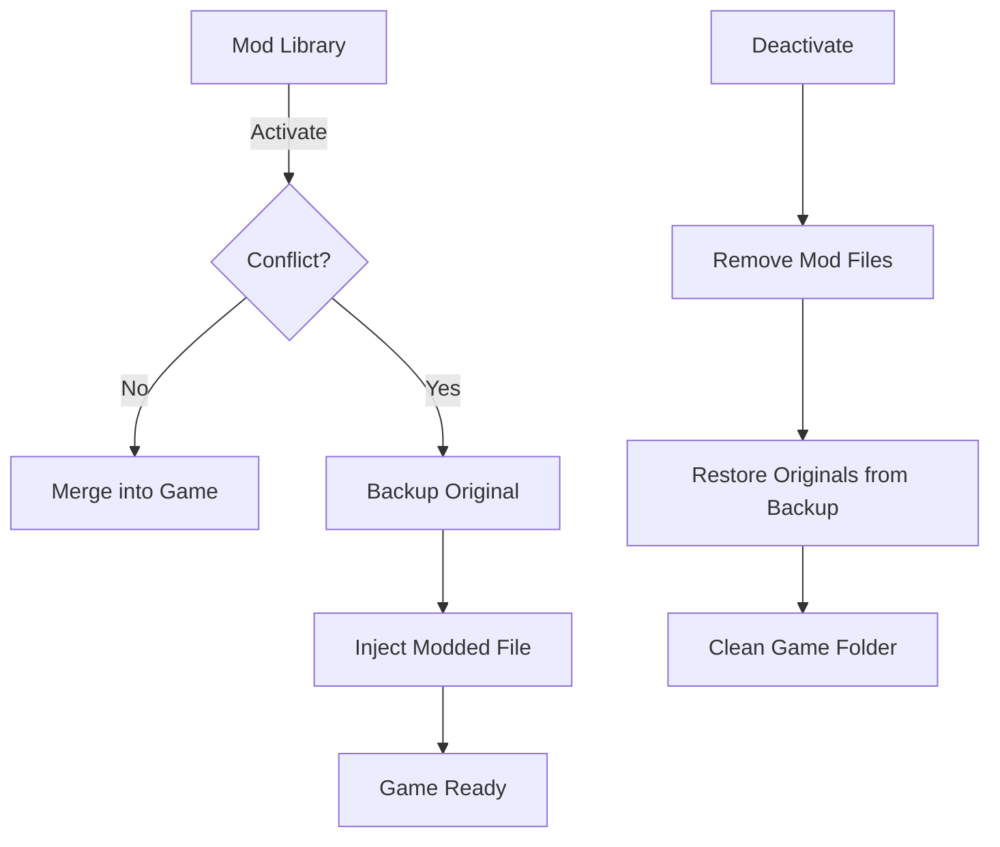

# Modding Mechanics in BMM

Better Mod Manager (BMM) is designed to be powerful yet safe. This guide explains how BMM interacts with your game files using simple visualizations.

## 1. Game vs Mod Structure

To understand BMM, you must see the game and the mod as two folders that overlap. For a mod to work, its structure must match the game's structure exactly.

### Game structure (example)
```
DCS World/
 ├── Mods/
 │    └── aircraft/
 │         └── F-16C/
 ├── Scripts/
 │    └── main.lua
```

### Mod structure (correct)
```
MyMod/
 ├── Mods/
 │    └── aircraft/
 │         └── F-16C/
 │              └── textures/
 │                   └── skin.dds
 ├── Scripts/
 │    └── main.lua
```

---

## 2. Dynamic Operations

### 1. Adding new files (Merge)
If a file does not exist in the game, BMM adds it cleanly.
```
Mod:  Scripts/helper.lua
→ Added to DCS World/Scripts/helper.lua
```

### 2. Replacing files (Replace)
If a file has the same path and name, BMM backups the original and replaces it.
```
Game: Scripts/main.lua
Mod:  Scripts/main.lua
→ Mod file replaces game file (Original is backed up)
```

### 3. Merging folders
If a folder already exists, BMM merges the content without deleting other files.
```
Game: Mods/aircraft/F-16C/
Mod:  Mods/aircraft/F-16C/textures/skin.dds
→ The 'textures' folder is added into the existing F-16C folder.
```

---

## 3. Core Principles Summary

*   **Same file** → replaced (with backup)
*   **New file** → added
*   **Existing folder** → merged
*   **Structure** → must match the game exactly

---

## 4. Conflict Management & Priority

When two active mods modify the same file:
1.  **Load order wins:** BMM stacks active mods in their activation order; the mod applied later takes precedence. Re-ordering the active list or re-enabling a mod changes which one wins — there is no separate numeric "weight" value.
2.  **Restoration:** Disabling a mod automatically restores the previous version — from another mod still active on that file, or the original from backup.

---

## 5. The Backup System (Zero Risk)

BMM follows a **No Data Loss** policy.
*   **Originals are Sacred:** Any file overwritten is moved to the profile's configured **backup folder** (chosen per profile — BMM requires it when you create one).
*   **Auto-Recovery:** If BMM is closed unexpectedly, it checks the game folder and offers a full restoration.

---

## Interaction Diagram


