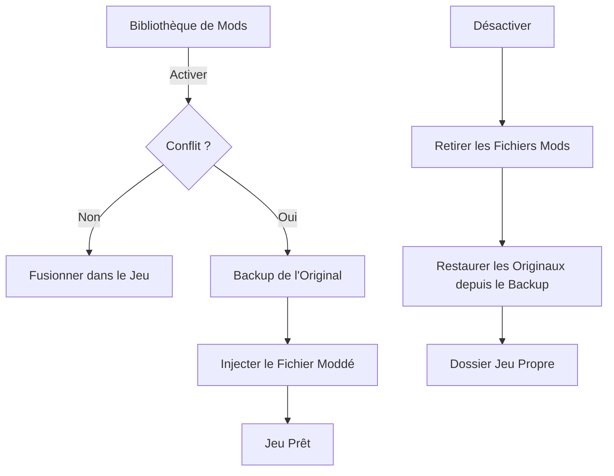

# Mécaniques de Modding dans BMM

Better Mod Manager (BMM) est conçu pour être puissant tout en restant sécurisé. Ce guide explique comment BMM interagit avec vos fichiers de jeu via des visualisations simples.

## 1. Structure Jeu vs Mod

Pour comprendre BMM, il faut voir le jeu et le mod comme deux dossiers qui se superposent. Pour qu'un mod fonctionne, sa structure doit correspondre exactement à celle du jeu.

### Structure du jeu (exemple)
```
DCS World/
 ├── Mods/
 │    └── aircraft/
 │         └── F-16C/
 ├── Scripts/
 │    └── main.lua
```

### Structure du mod (correcte)
```
MonMod/
 ├── Mods/
 │    └── aircraft/
 │         └── F-16C/
 │              └── textures/
 │                   └── skin.dds
 ├── Scripts/
 │    └── main.lua
```

---

## 2. Opérations Dynamiques

### 1. Ajout de nouveaux fichiers (Fusion)
Si un fichier n'existe pas dans le jeu, BMM l'ajoute proprement.
```
Mod :  Scripts/helper.lua
→ Ajouté dans DCS World/Scripts/helper.lua
```

### 2. Remplacement de fichiers (Replace)
Si un fichier a le même chemin et le même nom, BMM sauvegarde l'original et le remplace.
```
Jeu : Scripts/main.lua
Mod : Scripts/main.lua
→ Le fichier du mod remplace celui du jeu (l'original est sauvegardé)
```

### 3. Fusion de dossiers
Si un dossier existe déjà, BMM fusionne le contenu sans supprimer les autres fichiers.
```
Jeu : Mods/aircraft/F-16C/
Mod : Mods/aircraft/F-16C/textures/skin.dds
→ Le dossier 'textures' est ajouté dans le dossier F-16C existant.
```

---

## 3. Résumé des Principes Clés

*   **Même fichier** → remplacé (avec backup)
*   **Nouveau fichier** → ajouté
*   **Dossier existant** → fusionné
*   **Structure** → doit correspondre exactement au jeu

---

## 4. Gestion des Conflits et Priorité

Lorsque deux mods actifs modifient le même fichier :
1.  **L'ordre de chargement gagne :** BMM empile les mods actifs dans leur ordre d'activation ; le mod appliqué en dernier prend la priorité. Réordonner la liste active ou réactiver un mod change lequel gagne — il n'y a pas de valeur numérique de « poids » distincte.
2.  **Restauration :** Désactiver un mod restaure automatiquement la version précédente — venant d'un autre mod encore actif sur ce fichier, ou de l'original depuis la sauvegarde.

---

## 5. Le Système de Backup (Zéro Risque)

BMM suit une politique de **Zéro Perte de Données**.
*   **Les originaux sont sacrés :** Tout fichier écrasé est déplacé dans le **dossier de sauvegarde** configuré du profil (choisi par profil — BMM l'exige à la création).
*   **Auto-Récupération :** Si BMM se ferme inopinément, il vérifie le dossier du jeu et propose une restauration complète.

---

## Diagramme d'Interaction


