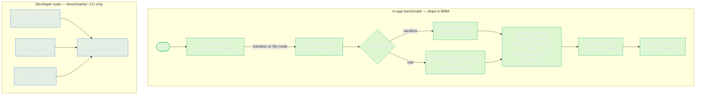

# BMM In‑App Benchmark

BMM ships a **benchmark you can run from inside the app** — no toolchain, no command
line. Open the **Benchmark** modal (the activity-pulse button), switch to the
**Benchmark** tab, and hit **Run Benchmark**. It exercises BMM's *real* hot‑path
operations on a controlled dataset and shows you exactly how fast each one is.

> This is the user‑facing counterpart to the developer suite in this folder
> ([README.md](README.md) — Criterion / hyperfine / JS micro‑benchmarks). The dev
> suite is for regression tracking in CI; the in‑app benchmark is for *“how does
> this run on **my** machine?”*.

---

## How it fits together

Both halves drive the **same real code paths** (`fs_utils`, `archive`); the in-app
side runs them once per click on your machine, the dev side runs them hundreds of
times for statistical regression tracking.

---

## What it measures — and yes, it's the *complete* set

The benchmark runs the same code BMM uses in normal operation. Every operation BMM
performs on your mods is covered:

| # | Operation | Category | What it actually does (real code path) |
|---|-----------|----------|----------------------------------------|
| 1 | **Scan mod files** | scan | Recursive directory walk (`jwalk`) — used on every mod read (hashing, conflicts, file explorer). |
| 2 | **SHA‑256 integrity hash** | hash | Hashes every file with 1 MiB buffered reads — the integrity / content‑id workload that detects changed mods and verifies downloads. |
| 3 | **Copy — full speed** | io | `std::fs::copy` of the whole mod — raw disk throughput with Smart I/O off. |
| 4 | **Copy — Smart I/O** | io | 256 KiB chunked copy with periodic micro‑yields so the UI stays responsive during big activations. |
| 5 | **Extract archived mod (.zip)** | archive | Decompresses a zipped mod to the cache dir — what happens the first time an archived (`.zip/.7z/.rar`) mod is read or activated. |
| 6 | **Activate a mod** | activation | The real `apply_mod_stacked`: backs up original game files, then copies the mod's files into the game folder (stacked, parallel). Exactly what **Enable** does. |
| 7 | **Deactivate a mod** | activation | The real `unapply_mod_stacked`: restores backed‑up originals (or removes mod‑added files) and cleans empty dirs. Exactly what **Disable** does. |
| 8 | **Cancel an operation** | activation | Starts a large (~48 MB) activation, requests **Cancel**, and measures how fast it actually stops. Lower = snappier cancellation. |

So: **activation, deactivation, cancel, scan, hash, copy (both modes), and archive
extraction** — the full surface of what BMM does to your mods.

---

## Two dataset modes

Pick the dataset with the **Sandbox / My mods** switch:

- **Sandbox (default, safe).** BMM generates a synthetic mod tree (seeded, so it's
  reproducible) in a temp folder, runs every operation on it, then deletes it.
  Nothing of yours is touched. Pick a size: **S / M / L** (more files / bigger files).

- **My mods (advanced).** A **profile picker** appears — choose which real mods to use
  as the dataset:
  - **one profile** (click its chip),
  - **several** profiles (multi-select chips),
  - **all** of them (the *All* button), or
  - a **custom folder** (the *Folder* button — for anything not in a profile).

  BMM uses **a copy of those files** as realistic test data (the combined selection is
  capped at 200 MB / 6000 files so a huge multi-profile pick can't hang the run).
  **Your game folder is never modified** — activation/deactivation in the benchmark
  always run against a throwaway temp “game” directory. The selected folders are only
  **read**.

In both modes, all writes happen inside a temporary workspace that is removed when the
run finishes.

---

## Reading the results

Every operation is **sampled several times** (7× / 5× / 3× for S / M / L) so you get a
real distribution, not one noisy number — like Criterion. Results show:

- the **median** time (µs / ms / s) plus the **min–max range** of the samples,
- a **throughput** (MB/s) where it makes sense,
- two **inline SVG charts** at the top — *Operation time* (with the min–max spread drawn
  as a faint band behind each median bar) and *Throughput*,
- a one‑line **explanation** per operation.

The header strip shows the **mode**, **dataset size** (files + MB), **CPU core count**,
the **samples/op**, and the **total** wall time. **Copy JSON** copies the full structured
result (including every sample) to your clipboard; **Export report** saves a
self-contained **HTML report** (the same SVG charts + table) you can attach to a bug
report — the same presentable style as the dev-suite deck.

### Interpreting it
- **Smart I/O vs full‑speed copy** — Smart I/O is intentionally a little slower; the gap
  is the price of keeping the window responsive. A *large* gap can indicate a slow disk.
- **Activate ≈ copy + a bit** — activation is copy plus original‑file backup; if it's
  much slower than the raw copy, backups (first‑time touches) dominate.
- **Cancel time** — how long after pressing Cancel the work truly stops. BMM checks the
  cancel flag between files, so this scales with how big a single in‑flight file is.
- **Archive extract throughput** is measured against the *uncompressed* size, so it's
  comparable to a plain copy.

---

## Notes
- Results vary with disk type (NVMe vs SATA vs HDD), free RAM (OS file cache), and
  background load. Run a couple of times on an otherwise‑idle machine for stable numbers.
- The benchmark is read‑only with respect to your real data in every mode. The only
  disk writes are inside a temp workspace that is deleted at the end.
- Backend: `commands::benchmark::run_app_benchmark` (emits `app-benchmark-progress`).
  UI: the **Benchmark** tab in `frontend/src/features/bench/benchmark.ts`.
