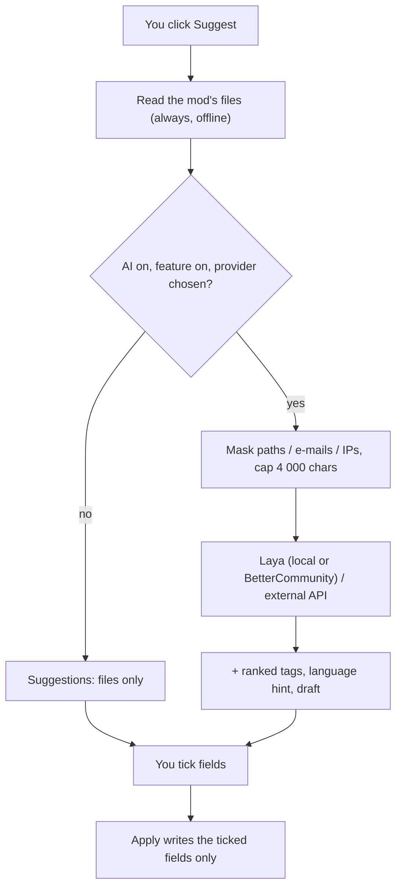

# Optional AI (Laya)

BMM can help you fill in a mod's details and check a bug report before you send it. **All of it
is optional.** With **Laya built in (offline)** — installed by default with BMM — the classifier
runs on your PC and *nothing* is sent anywhere. The other providers are off until you choose one.
The part that reads a mod's own files works without any of it.

## What it does — and what it does not

| It does | It does not |
|---|---|
| Read a mod's own files (manifest, readme, `entry.lua`, `descriptor.mod`, `About.xml`, `ModInfo.xml`, `VERSION.txt`, the folder name) and propose a name, version, author, description, links | Write anything on its own: every suggestion is a row you tick, and only **Apply** writes |
| Rank **your existing tags** for a mod (Laya picks among the tags you created) | Invent new tags, or a category BMM does not have |
| Hint the language of a mod's text and whether it looks like adult content | Store those hints anywhere: BMM has no such field, they are shown and forgotten |
| Mask personal data in a report and tell you if you already sent a similar one | Decide what a report says or whether it is sent |
| Give a hint for a report: category, severity, "looks like your earlier report …" | Close, route or judge a report — the server's triage is BetterCommunity's job |
| Ask **your own** external API for a description **draft**, if you configure one | Run anything in the background: the model answers only when you click |

### Why Laya does not write descriptions

[Laya](https://huggingface.co/convaiinnovations/laya-multilingual) (`laya-multilingual`, 100+
languages) is a **classifier**: it picks one option from a list (`choice`), gives the probability
that a yes/no question is true (`noul`), or a score. It does not generate text. So in BMM:

- a **description** comes from the mod's files, or — only if you set one up — from an
  OpenAI-compatible API you choose (shown with the badge **Draft**);
- **tags** are Laya's choice among *your* tags, each with its probability;
- its output is a **signal**: shown with a confidence, never applied without your click.

### Laya built in (offline)

BMM can run Laya **itself**, without Python, without a server and without any network while it
works. It is a separate **model pack** (327 MB to download, 404 MB on disk):

- the `laya-multilingual` model (revision `e4e9ddf`), exported to ONNX and quantized — every
  weight matrix to 8 bits, the vocabulary table to 8 bits per row. On a fixed set of 186 answers
  in ten languages it agrees with the original model on **98.9 %** of them (the two differences
  were near-ties in the original), with at most 0.09 of difference on a probability;
- its tokenizer, and Microsoft's ONNX Runtime 1.30 (`onnxruntime.dll`), loaded from the pack's
  own folder — BMM turns ONNX Runtime's telemetry events off.

**Where it comes from.** The installer's option *Laya offline (local AI, nothing sent)* is
ticked by default: setup downloads the pack once, refuses it unless it matches its pinned
SHA-256, and unpacks it into `<install folder>\models\laya`. If you unticked it, **Settings → AI
→ Laya built in → Install the model** downloads the same pack into
`%LOCALAPPDATA%\com.bettermm.desktop\models\laya` (with a progress bar; an interrupted download
resumes). **Remove the model** deletes that copy; the installed one goes with the uninstaller.

**What it costs.** Nothing until you click: the model is loaded on the first question (about
1.5 s), off the interface thread, with two CPU threads, and released after 5 minutes without
use. Loaded, it takes about 0.5–0.75 GB of memory; one mod takes about 0.7 s on a laptop CPU.
Each file is checked against its pin before it is loaded.

When the pack is installed and you have not picked a provider yourself, the built-in engine is
the provider. Every feature still waits for your click, and the master switch still turns it all off.

## Providers

| Provider | Where the text goes | What you need |
|---|---|---|
| **Off** | Nowhere. Suggestions come from the files only | Nothing |
| **Laya built in (offline)** (default when the model is installed) | **Nowhere** — read on this PC by BMM itself | The model pack (installer option, or *Install the model* in Settings) |
| **BetterCommunity** | `bettercommunity.ch`, which runs Laya on its server | A BetterCommunity account linked to BMM, and ticking the consent box in Settings |
| **My own Laya server** | Your `laya-serve`, by default `http://127.0.0.1:8000` — this PC | `pip install "laya[serve]"`, then `laya-serve` (with `LAYA_MODELS=multilingual`) |
| **External API** (writing only) | The OpenAI-compatible address you enter | Its URL, a model name and your key |

Rules BMM enforces before anything is sent — in the Rust core, not in the page:

- **http(s) only**, never a `user:password@` inside the address.
- **Local Laya** must be on this PC (`127.0.0.1`, `localhost`, `::1`). Another machine needs an
  explicit tick, and BMM warns that the text then leaves the PC.
- **External API** must use `https://` (plain `http://` only on this PC), and a private or
  reserved address (`10.x`, `192.168.x`, `169.254.x`, …) is refused: your key would go there.
- **BetterCommunity** requests only ever go to `bettercommunity.ch`.
- Requests do not follow redirects, time out (20 s by default), and read at most 1 MB back.
- Keys are stored by the OS — Windows DPAPI, or the macOS/Linux keychain — and never shown to
  the page again. Without either, a key is kept for the session only and asked again next time.

## What is sent, and when

Only when **you** click: *Suggest details* on a mod, *Also ask for a description draft*, or
*Get an AI hint* on a report. Never in the background.

- **With Laya built in:** nothing at all. The same text is read in memory by BMM and the dialog
  says *Nothing was sent*.
- **For a mod (other providers):** its name, author, description, excerpts of its readme/manifest, up to 40 file
  names, and the names of your tags. User names inside paths, e-mail addresses and IP addresses
  are masked first; the text is capped at 4 000 characters. The dialog shows the exact text sent.
- **For a report hint:** the report text, after masking.
- **Never:** the contents of your files, your keys, your mod list, anything while the switch is off.

## Suggesting a mod's details

Open a mod, then **Suggest details (optional AI)** above *Save*. Each row shows:

- the field and the proposed value (with the current one underneath);
- its **source** — *File* (which file), *Folder name*, *Laya*, *BetterCommunity* or *External API*;
- a **confidence**: for a file, how reliable that kind of file is (a manifest beats a folder
  name); for a model, its own probability.

Nothing is ticked. Tick what you want and click **Apply selection**; one value per field (ticking
a second description unticks the first), tags are added up to the usual three per mod, links are
appended. The change is recorded in the mod's activity history like any other edit.

## Before a report is sent

When you click **Send** in *Report a bug / Suggestion*, BMM first checks the text locally:

1. **Masking** — every secret BMM holds (the same pass the crash zips get), user-folder names in
   paths, e-mail and IP addresses, your Windows account and PC names. You see what was found
   (counts only) and a *Mask them before sending* box, ticked.
2. **Already sent?** — compared with the reports sent from this PC in the last 30 days.
3. **AI hint** (optional) — a button that asks the classifier for a category, a severity and
   whether it looks like one of your earlier reports. A hint: it changes nothing.

If the first two find nothing, the report goes straight out, as before. Otherwise click **Send**
again to send it the way you chose. Crash zips attached to a report were already stripped of
secrets when they were written.

## Turning it off

- **Settings → AI (optional)**: the master switch. Off means no AI network request anywhere in
  BMM; this is covered by an automated test that counts requests.
- **The installer**: *Laya offline (local AI, nothing sent)* on the options page, ticked by
  default because nothing leaves the PC. Ticked installs the model pack and turns the master
  switch on with the built-in engine as the provider; unticked installs no model and leaves AI
  off. From a command line: `--set=ai_features=false` (or `true`).
- **For one session**: start BMM with `--no-ai`, or set the environment variable `BMM_NO_AI=1`.
  Settings then says AI is off for this session and the switch cannot be turned on.

The switch lives in `ai-settings.json` beside `data.json`; keys are in `ai-secrets.json`
(DPAPI-sealed, Windows) or the system keychain.

## For AI clients (MCP) and the command line

| MCP tool | CLI | What it does |
|---|---|---|
| `bmm_ai_status` | `ai-status` | The settings and what may reach the network (never a key) |
| `bmm_ai_suggest_mod_metadata` | `ai-suggest <mod-id> [--offline] [--draft]` | The same suggestions as the dialog. **Writes nothing** |
| `bmm_ai_apply_mod_metadata` | `ai-apply <mod-id> --fields '{…}'` | Writes the fields named, with the dialog's validation |

The CLI and the MCP server use the same built-in engine as the app when the model pack is
installed (the same files, the same caps), so they work offline too. An agent must show the
suggestions to you and apply only what you pick. See the
[MCP reference](doc-page:reference/mcp) and the [CLI reference](doc-page:reference/cli).

## See also

- [Privacy, telemetry & offline](doc-page:features/privacy-telemetry)
- [Feedback & bug reports](doc-page:features/feedback)
- [Settings](doc-page:features/settings)
