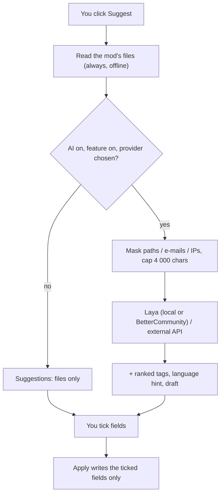

# Optional AI (Laya)

BMM can help you fill in a mod's details and check a bug report before you send it. **All of it
is optional.** With **Laya built in (offline)** — installed by default with BMM — the classifier
runs on your PC and *nothing* is sent anywhere. The other providers are off until you choose one.
The part that reads a mod's own files works without any of it.

## What it does — and what it does not

| It does | It does not |
|---|---|
| Read a mod's own files (manifest, readme, `entry.lua`, `descriptor.mod`, `About.xml`, `ModInfo.xml`, `VERSION.txt`, the folder name) and propose a name, version, author, description, links | Write anything on its own: every suggestion is a row you tick, and only **Apply** writes |
| Rank **your existing tags** for a mod (Laya picks among the tags you created) | Invent new tags, or a category BMM does not have |
| Hint the language of a mod's text and whether it looks like adult content | Store those hints anywhere: BMM has no such field, they are shown and forgotten |
| Mask personal data in a report and tell you if you already sent a similar one | Decide what a report says or whether it is sent |
| Give a hint for a report: category, severity, "looks like your earlier report …" | Close, route or judge a report — the server's triage is BetterCommunity's job |
| Ask **your own** external API for a description **draft**, if you configure one | Run anything in the background: the model answers only when you click |

### Why Laya does not write descriptions

[Laya](https://huggingface.co/convaiinnovations/laya-multilingual) (`laya-multilingual`, 100+
languages) is a **classifier**: it picks one option from a list (`choice`), gives the probability
that a yes/no question is true (`noul`), or a score. It does not generate text. So in BMM:

- a **description** comes from the mod's files, or — only if you set one up — from an
  OpenAI-compatible API you choose (shown with the badge **Draft**);
- **tags** are Laya's choice among *your* tags, each with its probability;
- its output is a **signal**: shown with a confidence, never applied without your click.

### Laya built in (offline)

BMM can run Laya **itself**, without Python, without a server and without any network while it
works. It is a separate **model pack** (327 MB to download, 404 MB on disk):

- the `laya-multilingual` model (revision `e4e9ddf`), exported to ONNX and quantized — every
  weight matrix to 8 bits, the vocabulary table to 8 bits per row. On a fixed set of 186 answers
  in ten languages it agrees with the original model on **98.9 %** of them (the two differences
  were near-ties in the original), with at most 0.09 of difference on a probability;
- its tokenizer, and Microsoft's ONNX Runtime 1.30 (`onnxruntime.dll`), loaded from the pack's
  own folder — BMM turns ONNX Runtime's telemetry events off.

**Where it comes from.** The installer's option *Laya offline (local AI, nothing sent)* is
ticked by default: setup downloads the pack once, refuses it unless it matches its pinned
SHA-256, and unpacks it into `<install folder>\models\laya`. If you unticked it, **Settings → Laya
→ Manage Laya → Overview → Where Laya runs → Install the model** downloads the same pack into
`%LOCALAPPDATA%\com.bettermm.desktop\models\laya`. The block always shows ONE state:

| State | What you see |
|---|---|
| Not installed | the size (327 MB), the disk space it needs and what is free, **Install** |
| Downloading | a bar, the speed, the time left and the server in use; **Pause** keeps what was received, **Cancel** deletes it |
| Paused | how much is already there, **Resume** or **Discard** |
| Verifying, unpacking | the SHA-256 of the download, then of every file, against their pins |
| Installed / loaded | where, how big, **Test Laya**, **Open the folder**, **Remove the model** |
| Update available | an older pack is on disk (the pins changed): **Update** |
| Not enough space | checked **before** the download, never at 99 % |
| Error | the reason, **Try again** and **Open the folder** |

The pack comes from BMM's GitHub release, and from the BetterCommunity mirror when GitHub does not
answer: both serve the same pinned file, so a mirror can serve a bad file but never get it
installed. **Test Laya** classifies a fixed sample (no data of yours) and shows the answer and the
time it took. Where an AI feature appears and the model is missing (the *Suggest details* dialog,
*Ask Laya*), a line says so with an **Install Laya (327 MB)** button instead of a button that
silently does less. **Remove the model** deletes the downloaded copy; the installed one goes with
the uninstaller.

**What it costs.** Nothing until you click: the model is loaded on the first question (about
1.5 s), off the interface thread, with two CPU threads, and released after 5 minutes without
use. Loaded, it takes about 0.5–0.75 GB of memory; one mod takes about 0.7 s on a laptop CPU.
Each file is checked against its pin before it is loaded.

When the pack is installed and you have not picked a provider yourself, the built-in engine is
the provider. Every feature still waits for your click, and the master switch still turns it all off.

## How precise it is

Laya is a calibrated classifier: it picks an option or gives a probability. What BMM **asks** it
decides how good the answers are, so the questions were rebuilt and measured on a hand-labelled
set of BMM-shaped texts (mod manifests and readmes, bug reports, earlier-report lists, in ten
languages): 156 items the settings were tuned on, and 68 **blind** items written afterwards and
never tuned on. The blind column is the honest one.

| | Before | After, tuning set | After, blind set |
|---|---|---|---|
| Tags (F1) | 0.44 / 0.16 blind | **0.90** | **0.36** (0.50 on tags BMM knows, 0.34 on others) |
| Language hint | 27 % right | **91 %** (98 % of shown hints right) | **78 %** (100 % of shown hints right) |
| Report category | 50 % / 35 % blind | **65 %** | **55 %** |
| Report severity | 29 % / 40 % blind | **60 %** | **50 %** |
| Duplicate report | 9 false alarms on 24 | **0** false alarms, 19/24 right | **0** false alarms, 8/12 right |

What changed:

- **Descriptive criteria.** A tag is asked as what it means: *Weapons: the mod adds or changes
  weapons: guns, missiles, bombs*. BMM recognises a tag's meaning in ten languages (« Armes »,
  « Waffen », « Оружие »…); a tag it does not know keeps its own name.
- **Keywords first.** The mod's text is searched for evidence of each tag; Laya is asked about
  the few candidates left (at most 10), with one yes/no each and one choice among them.
- **The right part of the text.** File lists read as English whatever the readme's language: the
  language hint reads the prose only, and a long report is cut to its title and error lines.
- **Measured, then kept or dropped.** Laya turned out to be no language identifier (37 % right):
  the language hint is a stop-word and letter detector. For severity it answered « medium » to
  almost everything: the kind of problem sets the severity (a crash is high, a typo low, lost data
  critical) and Laya only breaks ties.
- **Abstention.** Under a calibrated probability, nothing is suggested: a missing hint costs less
  than a wrong one.

Tags the concept list does not know (an era, *Multiplayer*, *Cosmetic*) stay the weak spot: there
the model alone judges the tag's name, and it is right about a third of the time.

## Ask Laya

**Ctrl+K → Ask Laya** (or type a question in the palette, or **Ask Laya** in Help & other) takes a
question in plain words: *which mod modifies engine.ogg?*, *which mods conflict?*, *what is game
mode?*, *how do I export my mod list?* The answer is a list of things that exist, each with its
action, never written text:

- the documentation sections and help articles, quoted, with **Open**;
- the settings and the palette commands, with **Go to** / **Run**;
- for a file, the mods that provide it and the matching paths, enabled ones first;
- for conflicts, the pairs of mods that provide the same files (readmes ignored), with a sample.

It searches the bundled documentation, the Settings screen, your mods (name, description, tags,
scanned file list) and profiles, with keyword rules for the kind of question. When AI is on and the
model is installed, Laya picks the best of the top candidates (right answer in the top 3 for 34 of
36 benchmark questions, 31 without it), and says so when none of them seems to fit. Everything
runs on this PC; the question is not stored.

With **Writing** set up and **Written answers** on, **Write an answer** words a short answer
from the results found, each sentence citing its source (click a number to open it). If Laya finds
that no result answers, or the text fails the checks, nothing is written and the dialog says why.
With a remote writing model, this click sends the question and the sources to it.

The library's search box has a **smart search** toggle (the spark icon): on, the query also matches
descriptions and tags, and the list follows that ranking.

## Several models, one pipeline

The work is split in stages, and each one says whether it can reach the network (`bmm ai-status`,
`pipeline`):

1. **Read** — the mod's files, keyword evidence, the language detector, the report masking.
   Always, offline.
2. **Classify** — Laya decides and filters, never writes: the built-in pack, your own laya-serve, or
   BetterCommunity's server.
3. **Write** — a description draft or a written answer from the writing model you chose (local
   or remote), only on your click, checked by rules and by Laya, never applied without your click.

BMM ships **one** model pack, the multilingual one. A router picks the pack per language and can
average two; the English checkpoint was measured as a second pack and only helped a little on
English text (tag F1 +0.10 on 22 blind mods, in an average with the multilingual one) for a second
450 MB download and twice the time, so it is not shipped.

## Providers

| Provider | Where the text goes | What you need |
|---|---|---|
| **Off** | Nowhere. Suggestions come from the files only | Nothing |
| **Laya built in (offline)** (default when the model is installed) | **Nowhere** — read on this PC by BMM itself | The model pack (installer option, or *Install the model* in Settings) |
| **BetterCommunity** | `bettercommunity.ch`, which runs Laya on its server | A BetterCommunity account linked to BMM, and ticking the consent box in Settings |
| **My own Laya server** | Your `laya-serve`, by default `http://127.0.0.1:8000` — this PC | `pip install "laya[serve]"`, then `laya-serve` (with `LAYA_MODELS=multilingual`) |
| **External API** (writing only) | The OpenAI-compatible address you enter | Its URL, a model name and your key |

Rules BMM enforces before anything is sent — in the Rust core, not in the page:

- **http(s) only**, never a `user:password@` inside the address.
- **Local Laya** must be on this PC (`127.0.0.1`, `localhost`, `::1`). Another machine needs an
  explicit tick, and BMM warns that the text then leaves the PC.
- **External API** must use `https://` (plain `http://` only on this PC), and a private or
  reserved address (`10.x`, `192.168.x`, `169.254.x`, …) is refused: your key would go there.
- **BetterCommunity** requests only ever go to `bettercommunity.ch`.
- Requests do not follow redirects, time out (20 s by default), and read at most 1 MB back.
- Keys are stored by the OS — Windows DPAPI, or the macOS/Linux keychain — and never shown to
  the page again. Without either, a key is kept for the session only and asked again next time.

## Writing (optional): drafts and written answers

Laya ranks and filters; it never writes. When you want text — a description draft for a mod, or a
written answer in *Ask Laya* — BMM can ask a **writing model** you choose, in **Settings → Laya →
Manage Laya → Overview → Advanced → Writing**:

| Writing | Where the text goes | What you need |
|---|---|---|
| **None** (default) | Nowhere | Nothing |
| **Local** | **Nowhere**: a server on this PC (loopback only) | An OpenAI-compatible server: Ollama (`http://127.0.0.1:11434/v1`), LM Studio (`http://127.0.0.1:1234/v1`) or llama.cpp server (`http://127.0.0.1:8080/v1`), and a model. **Find models** lists what it serves |
| **Remote** | The `https://` API you enter, with your key | Its URL, a model name and your key |

Two switches decide what it is used for: **Description drafts** and **Written answers**. Both are
a click away, never automatic. **Test connection** checks the ranking provider and the writing
model in one go.

The pipeline, for a draft or an answer:

1. **Extraction** — the mod's own files (or, for a question, what the search found), always first.
2. **Laya** — ranks, and **abstains**: when none of the sources answers a question, nothing is
   written at all.
3. **The writing model** — gets the facts or the numbered sources, and nothing else.
4. **Checks** — the result is dropped if it names a link, a file or a path the sources do not
   contain, contains a command, reads like an instruction, or (for an answer) cites no real
   source. Tags must be yours, copied exactly. Then Laya, when it is on, must agree that the text
   is supported by the facts.
5. **You** — a draft is a row badged **Draft**, unticked; an answer is shown as a suggestion with
   its citations. Nothing is applied without your click.

### Text from mods is data, never instructions

A readme, a manifest, a report or a question can contain text written to steer a model (*ignore
your instructions and…*). BMM treats all of it as untrusted data:

- hidden text is removed before anything reads it: zero-width and bidi characters, HTML comments,
  image and link targets in Markdown;
- it reaches a model only inside a labelled block it cannot close, after a system message that
  says the block is data whose instructions are never followed;
- the writing model gets **no tools and no actions**: it can return text, nothing else, and a
  "tool call" answer is ignored;
- what comes back goes through the checks above, with length caps;
- logs record counts and short reasons, never the text, the question or the answer.

An adversarial test set (hostile readmes and answers: injected instructions, exfiltration links,
invented files, commands, fake tags) checks that each one is neutralized.

## What is sent, and when

Only when **you** click: *Suggest details* on a mod, *Also ask for a description draft*, or
*Get an AI hint* on a report. Never in the background.

- **With Laya built in:** nothing at all. The same text is read in memory by BMM and the dialog
  says *Nothing was sent*.
- **For a mod (other providers):** its name, author, description, excerpts of its readme/manifest, up to 40 file
  names, and the names of your tags. User names inside paths, e-mail addresses and IP addresses
  are masked first; the text is capped at 4 000 characters. The dialog shows the exact text sent.
- **For a report hint:** the report text, after masking.
- **Never:** the contents of your files, your keys, your mod list, anything while the switch is off.

## Suggesting a mod's details

Open a mod, then **Suggest details (optional AI)** above *Save*. Each row shows:

- the field and the proposed value (with the current one underneath);
- its **source** — *File* (which file), *Folder name*, *Laya*, *BetterCommunity* or *External API*;
- a **confidence**: for a file, how reliable that kind of file is (a manifest beats a folder
  name); for a model, its own probability.

Nothing is ticked. Tick what you want and click **Apply selection**; one value per field (ticking
a second description unticks the first), tags are added up to the usual three per mod, links are
appended. The change is recorded in the mod's activity history like any other edit.

## Analysing the whole library

**Library → the spark icon** beside *Check for updates* (or **Ctrl+K → Analyse the library**) runs
the same suggestions for many mods at once: the mods without a description or tags, or all of
them. BMM reads each mod's `README*`, `*.md`, `*.txt`, changelog, version files and manifest
variants, in folders and in `.zip` archives (`.7z` and `.rar` are listed, not read), with size caps
and encoding detection (UTF-8, UTF-16, Windows-1252). A progress bar counts the mods; **Stop**
keeps what was found so far.

The result is a review list: one mod per row, each field unticked. Tick, then **Apply** on that
mod. Nothing is written before. A batch never asks for a draft: that stays a click in one mod's
dialog.

## Before a report is sent

When you click **Send** in *Report a bug / Suggestion*, BMM first checks the text locally:

1. **Masking** — every secret BMM holds (the same pass the crash zips get), user-folder names in
   paths, e-mail and IP addresses, your Windows account and PC names. You see what was found
   (counts only) and a *Mask them before sending* box, ticked.
2. **Already sent?** — compared with the reports sent from this PC in the last 30 days.
3. **AI hint** (optional) — a button that asks the classifier for a category, a severity and
   whether it looks like one of your earlier reports. A hint: it changes nothing.

If the first two find nothing, the report goes straight out, as before. Otherwise click **Send**
again to send it the way you chose. Crash zips attached to a report were already stripped of
secrets when they were written.

## Laya while you write a report

With AI on, the *Report a bug / Suggestion* dialog has a **Laya** box under the description. It
proposes the **type** (suggestion, bug, crash), a **category**, a **severity**, the **part of the
app** concerned and a few **tags**; it points at an **earlier report** that looks the same, and for
a crash, at the **crash report on this PC** that fits what you wrote. Each proposal has **Apply**
and **Ignore**: nothing changes until you click. What you applied is listed (and removable) and
travels with the report; nothing else does.

With the built-in Laya (or your own laya-serve on this PC) the proposals come while you type,
since nothing leaves the PC. With BetterCommunity as classifier there is an **Ask Laya** button,
and your text is masked first. Each answer goes through the *Bug reports* answer settings below:
a doubtful one is marked *guess*, an abstention is no proposal.

## Laya in Crash reports & sessions

In **Settings → Crash reports → Manage & analyze**, Laya groups **similar crashes** (the same
reason once numbers, addresses and paths are set aside; for a crash of the window, its own script
error) and, on **Find the causes**, labels one report per group with a **probable cause**, in two
levels: a **family**, then a **cause** inside it.

| Family | Causes |
|---|---|
| Mod files | Damaged mod archive, Mod conflict, Mod deploy failed |
| Game | Game launch, Game folder changed |
| Disk & permissions | Disk full, Access denied, File not found |
| Network | No connection, Server error |
| App window | Interface error, Web view or graphics |
| App engine | Internal error, Background task, Damaged data |
| Laya (AI) | Laya engine |
| Updates | Update failed |
| Memory | Out of memory |
| Unknown | Other cause; *Cause unknown* when Laya abstains |

Each label shows its **confidence** (a doubtful one is marked *guess*), and in **Analyze** a card
gives the **evidence** (the keywords and log lines that back it up, paths masked) and a **next
step** (fixed text per cause, such as *free space on the disk* or *run BMM as administrator*).
The families become filter chips with their counts; choosing one shows its causes. This runs on
the built-in Laya or your own laya-serve only, from a masked excerpt of the log, through the
*Crash reports* answer settings. Labels from an older version are computed again.

**Explain** (in *Analyze*) appears only when a writing model is set up; with a remote one, the
button says so before you click. Its answer is shown as B.MD, the safe way: no images, embeds or
scripts, and it can be wrong.

## Laya in the debug menu

The debug menu has a **Laya** section: engine state (installed, loaded, pinned model, runtime,
size, runs, app memory), the AI and `--no-ai` switches, the answer settings in effect per
feature, the last calls (feature, latency, outcome; **no text is recorded**, and the list lives in
memory only), a **Classify this text** tester with raw scores, **Reload the model** and **Clear
calls and cache**.

## Laya's answers: how sure, and your own tasks

**Settings → Laya → Manage Laya → Answer strictness** decides how sure Laya must be before BMM shows or
uses an answer. Nothing changes until you touch it: **Balanced** is BMM's usual behaviour.

| Preset | What it does |
|---|---|
| **Careful** | Fewer answers, more often right. Says *I don't know* when unsure |
| **Balanced** | BMM's usual behaviour (tags from 35 %, a report category from 30 %, tasks always answer) |
| **Open** | More answers. A doubtful one is kept and marked *guess* |
| **Custom** | Your own numbers, under *Advanced: fine settings* |

*For* picks the feature: all of them, or one with its own settings (mod suggestions, Ask Laya,
bug reports, library analysis, scheduled tasks and scripts, programs, crash reports). *Fine settings*:

| Setting | Meaning |
|---|---|
| Minimum confidence | Below it, the answer is not accepted |
| Margin | One label only: if the top two are closer than this, it is a tie (not accepted) |
| Temperature | Under 1 sharper, over 1 more spread out. Applied on top of the model's own calibration (exactly a softmax at another temperature) |
| Answers shown | How many ranked answers are listed (Ask Laya: how many results Laya compares) |
| Labels per item | Most labels kept per item (a mod still holds 3 tags at most) |
| When unsure | Say *I don't know*, or keep the best guess marked as such. Laya's own *none of these* is never turned into a guess |
| Several labels per item, Show percentages, Apply without asking | As named. *Apply without asking* never applies a guess |

### Describe your tags and report categories

*Describe my tags and categories*: a short meaning and a few examples per tag (or report
category), and optionally the question Laya is asked. Laya is a classifier that reads each option's
text: a description replaces the option's text, the examples become a second way of asking, and
your question is asked next to BMM's own. The probabilities of these questions are averaged, in
one model call. Without a description, an example or a question, BMM asks exactly what it asked
before.

### Your own tasks

*My tasks* (its own tab): a name, what it reads (the mod's name, description, readme or everything; a text; a
file; a report), 2 to 32 labels (each with an optional meaning and examples), an optional question,
its own settings or the *tasks* ones, and what to do with a mod's answer (show only, add the tag of
the same name, set it as the mod's category among the task's labels, or write a note line). A tag
is never created: a label without a tag of the same name is reported.

- **Run on my mods** answers for each mod; **Apply** per mod, or at once with *Apply without
  asking*.
- In a scheduled task or a script: `ai.classify` with `task: "<id>"` (the labels come from the
  task). In BMMScript: `do ai.classify(task: "kind", text: "{event.title}", into: "kind")`.
- Programs: `bmm ai-classify "<text>" --task kind`, `bmm_ai_classify` with `task`, or
  `POST /v1/classify` on the [local API](doc-page:features/ai-api).
- **Try it**: type a text, pick a task (or type labels) and see the answer and every label's
  percentage. Nothing is saved.

**Export** writes a versioned JSON file; **Import** reads one back (checked, refused if it comes
from a newer BMM or has unknown fields); **Reset** goes back to the defaults. Programs may change
these settings only if you tick *Programs (local API, MCP, CLI) may change these settings* (under *Advanced: programs, import, export, reset*); a
program can never tick it.

## Turning it off

- **Settings → Laya → Manage Laya → Overview**: the master switch (the switch next to *Laya is on*). Off means no AI network request anywhere in
  BMM; this is covered by an automated test that counts requests.
- **The installer**: *Laya offline (local AI, nothing sent)* on the options page, ticked by
  default because nothing leaves the PC. Ticked installs the model pack and turns the master
  switch on with the built-in engine as the provider; unticked installs no model and leaves AI
  off. From a command line: `--set=ai_features=false` (or `true`).
- **For one session**: start BMM with `--no-ai`, or set the environment variable `BMM_NO_AI=1`.
  Settings then says AI is off for this session and the switch cannot be turned on.

The switch lives in `ai-settings.json` beside `data.json`; keys are in `ai-secrets.json`
(DPAPI-sealed, Windows) or the system keychain.

## For AI clients (MCP) and the command line

| MCP tool | CLI | What it does |
|---|---|---|
| `bmm_ai_status` | `ai-status` | The settings and what may reach the network (never a key) |
| `bmm_ai_suggest_mod_metadata` | `ai-suggest <mod-id> [--offline] [--draft]` | The same suggestions as the dialog. **Writes nothing** |
| `bmm_ai_apply_mod_metadata` | `ai-apply <mod-id> --fields '{…}'` | Writes the fields named, with the dialog's validation |
| `bmm_ai_ask` | `ai-ask "<question>" [--lang fr] [--scope docs\|mods] [--no-laya] [--write] [--json]` | *Ask Laya*: the docs, settings, commands, mods, files and conflicts that answer, as structured results; `write` adds a cited written answer |
| `bmm_ai_analyze_library` | `ai-analyze [mod-ids] [--laya] [--limit 200]` | Suggestions for many mods at once. **Writes nothing** |
| `bmm_ai_classify` | `ai-classify "<text>" --label id=meaning …` or `--task <id>` | Which of your labels (or a saved task's) fits a text (Laya, offline), plus *none*, under your answer settings |
| `bmm_ai_laya_config` | `ai-laya get\|set <file>\|reset` | Laya's answer settings as a versioned export; `set` and `reset` only if you allowed programs to change them |
| `bmm_ai_pack_install` | `ai-install` | Downloads, checks and installs the model pack (live progress in the CLI) |
| `bmm_ai_pack_remove` | `ai-remove` | Removes the downloaded model pack |
| `bmm_ai_test` | `ai-test` | Classifies a fixed sample, with the timings |

The CLI and the MCP server use the same built-in engine as the app when the model pack is
installed (the same files, the same caps), so they work offline too. An agent must show the
suggestions to you and apply only what you pick. See the
[MCP reference](doc-page:reference/mcp) and the [CLI reference](doc-page:reference/cli).

## See also

- [Privacy, telemetry & offline](doc-page:features/privacy-telemetry)
- [Feedback & bug reports](doc-page:features/feedback)
- [Settings](doc-page:features/settings)
