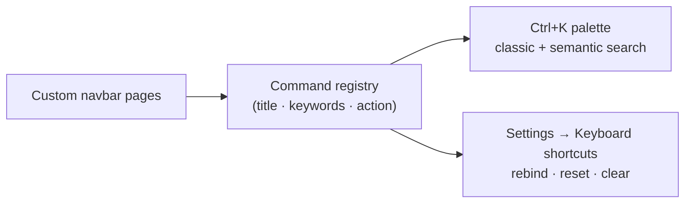

# Command palette & shortcuts

Press <kbd>Ctrl</kbd>+<kbd>K</kbd> (<kbd>Cmd</kbd>+<kbd>K</kbd> on macOS) anywhere in BMM to open the
**command palette** — a single search box laid over every page and every action. Type a few letters,
move with <kbd>↑</kbd> / <kbd>↓</kbd>, and press <kbd>Enter</kbd> to run.

## What it can reach

The palette is built from the live app, so it always matches what's actually in front of you.

- **Go to any screen** — Library, Profiles, Modpacks, Server Repo, .MM Lists, App Catalog, Plugins,
  BetterCommunity, Help & other, Settings — **including your own [custom navbar pages](doc-page:features/plugins)**.
  A page you pinned yesterday is searchable today; nothing to register by hand.
- **Run an action** without hunting for its button:
    - *Mods* — add a mod, scan the folder, verify integrity, show history, enable/disable all, check for updates.
    - *Profiles* — new profile, import from OvGME / OMM, disable every profile.
    - *Server Repo* — open the Sync or Host tab, browse saved repos, generate a standalone server, start/stop the built-in server, open monitoring, check subscribed repos, copy your creator ID.
    - *Tools & Settings* — check for app updates, restart the onboarding tour, open storage & disk usage, open hashing stats.

## Classic vs. semantic search

Two modes, toggled inside the palette:

- **Classic** — literal substring match on the command's title and keywords.
- **Semantic** — expands your words through a synonym map, so `update` also matches
  *upgrade* / *new version*, and `delete` also matches *remove*. Handy when you know *what* you want
  but not what BMM calls it.

## One registry behind both

The palette and the shortcuts manager are not two lists that have to be kept in step — they are two
views of **one command registry**. A command is registered once, with its title, keywords and the
function it runs; the palette renders it as a search result and the shortcuts page renders it as a
bindable row.

That is why a custom page you added yesterday is searchable *and* bindable today without registering
anything by hand, and why a command can never appear in one place and be missing from the other.

## Rebind any shortcut

The same actions live in **Settings → Keyboard shortcuts**. Click a shortcut, press the keys you
want, and it's bound; the row's buttons also **reset to default** or **clear** it.

!!! tip "Custom pages get shortcuts too"

    Your custom navbar pages appear in this list, so you can bind a hotkey that jumps straight to
    one. Rebindings are stored per action, so renaming or reordering the navbar keeps them intact.

!!! note "Use a modifier"

    Combos that include <kbd>Ctrl</kbd> or <kbd>Alt</kbd> are recommended — a plain letter would
    fire while you're typing in a field. While a text field is focused BMM dispatches **only**
    chords carrying Ctrl or Alt; everything else waits until you leave the field.

    <kbd>Shift</kbd> does not count here. <kbd>Shift</kbd>+<kbd>S</kbd> is treated like a bare
    letter, so it will not fire while you are typing — useful if that is what you wanted, and a
    surprise if you expected it to work everywhere.

## Stopping something that is already running

Enabling or disabling a mod copies files, and a big one takes a while. Two commands stop it:

| Command | Default | What it stops |
|---|---|---|
| **Cancel the running mod operation** | <kbd>Ctrl</kbd>+<kbd>Alt</kbd>+<kbd>Z</kbd> | The one currently copying. Anything queued behind it carries on. |
| **Cancel every queued mod operation** | <kbd>Ctrl</kbd>+<kbd>Alt</kbd>+<kbd>Shift</kbd>+<kbd>Z</kbd> | All of it, including what has not started. |

Both undo what they stop — a half-finished enable is put back the way it was, not left
half-applied — and both are the same actions as the cancel button's click and right-click.

!!! note "Why not Ctrl+Z"

    Shortcuts are dispatched on capture and modified chords fire even while you are typing in a
    field. <kbd>Ctrl</kbd>+<kbd>Z</kbd> bound globally would therefore reach into the
    scheduler's task editor and undo a step of your automation instead of cancelling a copy.
    Rebind it there if you want it — it is your keyboard — but that is why it is not the
    default.

    Pressing either with nothing running says so rather than doing nothing quietly.
