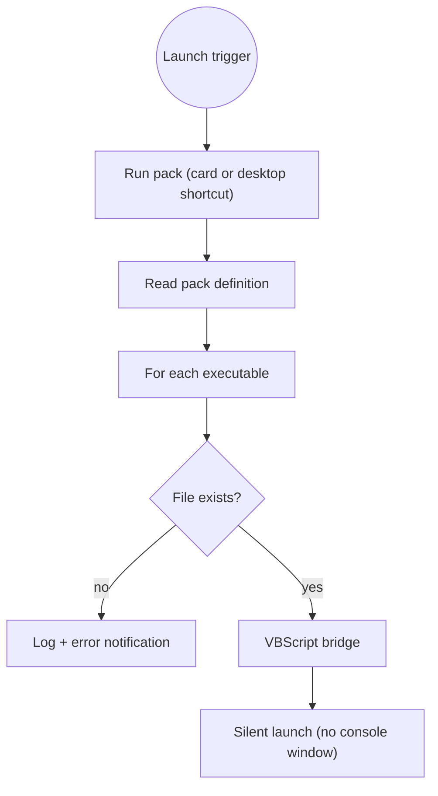

# Launch packs

A **launch pack** is a named group of **applications** started together in one click — your
game plus the companion tools you always open with it (a voice app, a tracker, a head-tracking
tool…).

## Creating one

In **Settings**, create a pack, name it, then add executables (`.exe`, `.bat`, `.ps1`, `.cmd`,
`.lnk`) two ways:

- the plain **file picker**, or
- the built-in **app picker**, which lists your installed programs Steam-style (it reads the
  Windows registry's installed-apps entries and your Start-Menu shortcuts, icons included).

Add a custom icon if you like — it's converted to a proper `.ico`.

## Running it

- **From the card** in Settings — every app starts **silently**: no console windows flashing.
- **From the desktop** — each pack also gets its own generated **shortcut**, so you can launch
  the whole group without opening BMM.

Under the hood, creating a pack generates a tiny `launcher.vbs` that starts each executable
invisibly, and a `.lnk` shortcut pointing at it:

!!! tip "Edit any time"

    Editing a pack regenerates its launcher and shortcut in place — the desktop shortcut keeps
    working. Deleting a pack removes its folder and shortcut cleanly.

## Handing one to somebody

A launch pack was, for a long time, the one thing in BMM that could not be given away.
Modpacks, plugins, profiles, themes, automations and whole catalogues all export; the pack —
which is precisely the thing you build once and four friends would want — had to be rebuilt
by hand on every machine.

**Export** writes a `.bmmlaunch` beside the pack's card. **Import** sits next to *New launch
pack*.

What the file carries is the **decisions**: the name, which programs, and the icon inlined as
bytes. It deliberately does *not* carry what a pack IS on disk — the `launcher.vbs` is full of
absolute paths and the `.lnk` points into your own app-data folder, so none of that would mean
anything on another machine. The import regenerates all of it locally, through the same code
that creates a pack from scratch, so the shortcut works on the machine that received it.

!!! warning "Two things the import will not do quietly"

    **A file that is not one of ours is refused.** A `.bmmlaunch` carries
    `kind: "bmm-launchpack"`. A pack is a list of programs to start; any JSON with a name and
    an array of strings must not be readable as one.

    **Paths that do not exist here are reported, not dropped.** A pack whose games sit on
    `D:` for the author and `C:` for you is the ordinary case for a shared pack. Importing
    something that starts nothing, and quietly discarding half of it, are both worse than
    saying "3 programs were not found at their paths on this PC".

The icon goes back through the image encoder rather than being written straight in as
`icon.ico`, and the name through the same filename sanitiser a typed name uses — both now
arrive from a file a stranger wrote.

!!! tip "Read one before you run it"

    Paste a `.bmmlaunch` into the file inspector and it will tell you how many programs it
    starts, print every path exactly as written (never resolving one, never opening one), and
    say **which of them go through a shell** — a `.ps1` in a pack is run with PowerShell's
    execution policy bypassed, and a `.bat` through `cmd`. An `.exe` announces itself as a
    program; somebody else's script does not.

A repo can carry launch packs too — see [Server repos](doc-page:features/repo).

## Running one from outside BMM

A pack is not only a button in Settings. It is addressable, which is what makes it useful in a wider
setup:

| From | How |
|---|---|
| A link, a `.bat`, a website, another app | `bmm://launchpack/run?id=<pack id>` |
| The local HTTP API | `POST /api/launchpack/run` with `{"id": "…"}` |
| The scheduler | the *Run launch pack* action — so a pack can fire on a trigger, not just a click |
| The script generator | the same action, emitted as a deeplink or an HTTP call |

See the [Action reference](doc-page:reference/actions) and the [API reference](doc-page:reference/api).

## Why nothing flashes

Every process BMM spawns goes through a helper that sets Windows' `CREATE_NO_WINDOW` flag. Without it,
console programs (`cmd`, `powershell`, `python`, a `.bat`…) pop a black window for a split second in a
release build — which is exactly the kind of flicker a user learns to ignore. Making the legitimate
ones silent is what makes an unexpected window meaningful.

!!! note "A pack name is sanitised before it becomes a path"

    The name you type becomes a folder and a shortcut on disk, so it is confined to the pack directory
    — *"so the shortcut can never be written outside the pack dir (e.g. the Startup auto-run folder →
    persistence)"*. That guard exists specifically because a shortcut planted in Windows' Startup
    folder is a persistence mechanism, not just a stray file. See
    [Security](doc-page:how-it-works/security).
