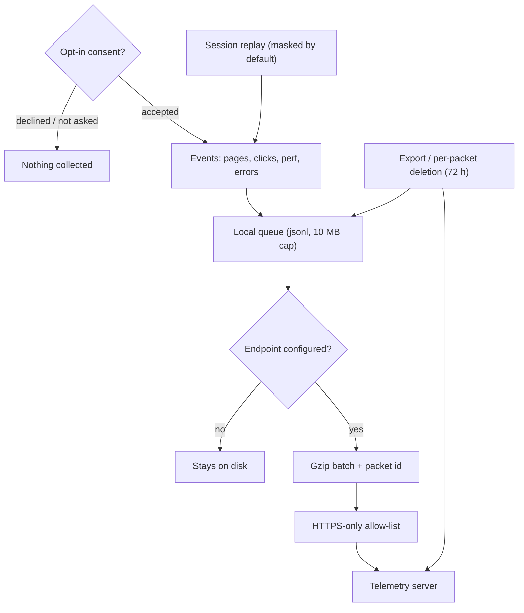
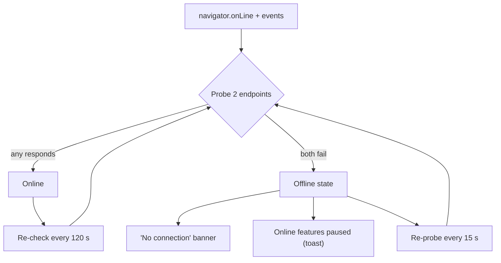

# Privacy, telemetry & offline

## Telemetry is opt-in

Until you explicitly accept the consent dialog, **nothing is collected at all** — the tracker
is a no-op. Declining (or never answering) collects zero data, and declining also wipes
anything previously buffered.

## If you opt in

- **What's sent:** pages visited, clicks (**labels only — never what you type**), performance
  samples, errors, and an anonymous hardware profile. No file paths, no mod contents, no name
  or e-mail; your identity is an anonymous id.
- **Session replay** (optional, on by default when telemetry is on) records the UI **masked**:
  mod names, profile names and paths appear as `••••`. Unmasking is a separate, explicit toggle.
- Everything buffers to a **local file (10 MB cap)** first and is only uploaded as gzip batches
  over **HTTPS** — if no endpoint is configured, data never leaves your machine.

## What a session replay actually looks like

Rather than describe it, here is one. This is a real `.bmmreplay` played back in the browser by the
same rrweb player the app uses — the DOM is replayed, so it is **not a video**: text stays text, and
you can see the masking in action.

!!! note "It loads on demand"

    The player only fetches the recording when you press play — a replay is a JSON event stream and
    this one is around 25 MB, so it is never pulled in just by opening the page.

Notice that mod and profile names read as `••••`. That is the default masking, and it is what gets
recorded — the unmasked values never enter the file at all, so there is nothing to leak later. The
*Full* switch is what changes that, and it is deliberately separate.

### Where a recording lives while it is being made

The **local session recorder** (the one that feeds crash reports and the replay list) writes to disk
as it goes rather than holding the session in the app:

| | |
|---|---|
| While recording | Events are appended to a spool under `Spool/` in the app-data folder, in batches of at most 512 KB or 200 events, flushed at least every 3 seconds |
| Memory cost | About half a megabyte, whatever the session length — the assembled `.bmmreplay` is never built inside the app, even when you export it |
| History kept | A rolling **512 MB** window on disk. Oldest segments are dropped first, and each segment starts with a full snapshot, so what remains always plays |
| If BMM is killed | At most the last few seconds are missing. A half-written final entry is detected and skipped when the file is assembled |
| Saved replays | Capped separately by your retention settings (count + total size) |

This is why a long or idle session no longer costs you anything: it used to keep everything in memory
and re-serialise all of it every 45 seconds, which is what made a long session expensive and forced
it to throw history away.

!!! note "The DevTools Replay Studio works differently"

    The Studio (a deliberate, attended recording with a capture frame, pause/resume and a trim) keeps
    its events in memory, because it needs them to compress pauses and apply the trim. It is bounded
    at 64 MB and **stops the take** when it gets there, telling you so — what it already has is
    complete and playable.

## Your controls (Settings → Privacy)

- Master toggle, plus separate toggles for the 7-day benchmark / extra-hardware report and
  session replay.
- **Export** the raw buffer as JSON any time.
- See every **sent packet** (event names and counts only) and request its **deletion** —
  honoured within 72 hours.

Crash reports and saved session replays stay **local** under retention limits you control
(default: 30 sessions / 2 GB) — a crash report is only ever shared when *you* export or send it.

## Offline mode

BMM doesn't just trust the OS "connected" flag — it **probes** two lightweight endpoints; if
neither answers within 5 seconds, you're offline.

- A discreet **"no connection" banner** appears, and network features (repo syncs, catalogs,
  update checks) pause with a warning toast instead of failing cryptically.
- **Everything local keeps working** — library, profiles, activation, the mapper, themes.
- Recovery is automatic: while offline BMM re-probes every **15 seconds**; online, a 2-minute
  re-check catches connections that died silently.

