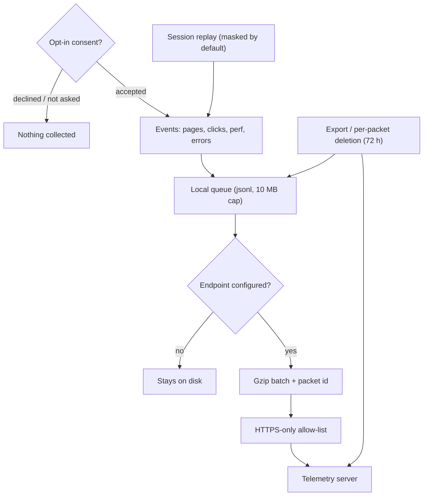
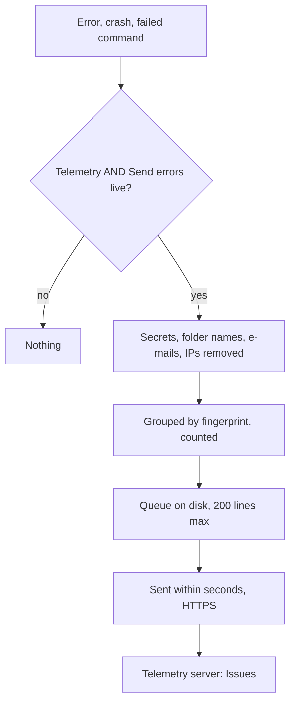
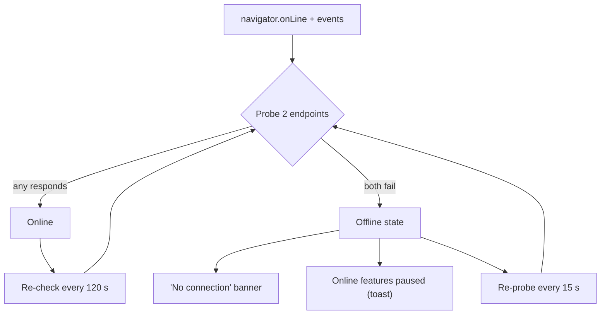

# Privacy, telemetry & offline

## Telemetry is opt-in

Until you explicitly accept the consent dialog, **nothing is collected at all** — the tracker
is a no-op. Declining (or never answering) collects zero data, and declining also wipes
anything previously buffered.

The dialog has four buttons and nothing else counts as an answer (a click beside it does nothing):

| Button | What it does |
|---|---|
| **Turn all on** (recommended) | The five categories below |
| **Choose** | A switch per category, then *Save* |
| **No thanks** | Off, remembered |
| **Later** (or Escape) | Nothing saved, nothing sent; asked again at the next launch |

```mermaid
graph TD
    CONSENT{Opt-in consent?} -- "declined / not asked" --> NOTHING["Nothing collected"]
    CONSENT -- "accepted" --> EVENTS["Events: pages, clicks, perf, errors"]
    REPLAY["Session replay (masked by default)"] --> EVENTS

    EVENTS --> QUEUE["Local queue (jsonl, 10 MB cap)"]
    QUEUE --> ENDPOINT{Endpoint configured?}
    ENDPOINT -- no --> LOCAL["Stays on disk"]
    ENDPOINT -- yes --> GZIP["Gzip batch + packet id"]
    GZIP --> ALLOWLIST["HTTPS-only allow-list"]
    ALLOWLIST --> SERVER["Telemetry server"]

    GDPR["Export / per-packet deletion (72 h)"] --> SERVER
    GDPR --> QUEUE
```

## If you opt in

Telemetry is split into categories, each with one line of what it sends:

| Category | What is sent |
|---|---|
| Usage statistics | Pages and features used, clicks, session length. Never what you type |
| Performance | FPS, memory use and load times |
| Errors, live | Errors and crashes as they happen ([below](#errors-sent-live)) |
| Laya usage statistics | Which Laya feature, provider, speed, fields kept or rejected; never any text ([below](#laya-usage-statistics)) |
| Session replay (masked) | The BMM window only, typed text masked |

Two options are never part of *Turn all on*: the **weekly hardware report** (precise hardware
IDs) and **unmasked replay**. The full list, with what each one contains, is in the
[privacy policy](https://github.com/FreeProject089/BetterModsManager/blob/main/PRIVACY.md).

**No IP or location lookup.** BMM does not put an IP address in what it sends (neither the local
one nor the public one) and never asks a third-party service where you are. The telemetry server
only sees the address the connection comes from, like any web server, and keeps it cut down to its
network.

- **Session replay** (on by default when telemetry is on) records the UI **masked**:
  mod names, profile names and paths appear as `••••`. Unmasking is a separate, explicit toggle.
- Everything buffers to a **local file (10 MB cap)** first and is only uploaded as gzip batches
  over **HTTPS** — if no endpoint is configured, data never leaves your machine.

## What a session replay actually looks like

Rather than describe it, here is one. This is a real `.bmmreplay` played back in the browser by the
same rrweb player the app uses — the DOM is replayed, so it is **not a video**: text stays text, and
you can see the masking in action.

!!! note "It loads on demand"

    The player only fetches the recording when you press play — a replay is a JSON event stream and
    this one is around 25 MB, so it is never pulled in just by opening the page.

Notice that mod and profile names read as `••••`. That is the default masking, and it is what gets
recorded — the unmasked values never enter the file at all, so there is nothing to leak later. The
*Full* switch is what changes that, and it is deliberately separate.

### Where a recording lives while it is being made

The **local session recorder** (the one that feeds crash reports and the replay list) writes to disk
as it goes rather than holding the session in the app:

| | |
|---|---|
| While recording | Events are appended to a spool under `Spool/` in the app-data folder, in batches of at most 512 KB or 200 events, flushed at least every 3 seconds |
| Memory cost | About half a megabyte, whatever the session length — the assembled `.bmmreplay` is never built inside the app, even when you export it |
| History kept | A rolling **512 MB** window on disk. Oldest segments are dropped first, and each segment starts with a full snapshot, so what remains always plays |
| If BMM is killed | At most the last few seconds are missing. A half-written final entry is detected and skipped when the file is assembled |
| Saved replays | Capped separately by your retention settings (count + total size) |

This is why a long or idle session no longer costs you anything: it used to keep everything in memory
and re-serialise all of it every 45 seconds, which is what made a long session expensive and forced
it to throw history away.

!!! note "The DevTools Replay Studio works differently"

    The Studio (a deliberate, attended recording with a capture frame, pause/resume and a trim) keeps
    its events in memory, because it needs them to compress pauses and apply the trim. It is bounded
    at 64 MB and **stops the take** when it gets there, telling you so — what it already has is
    complete and playable.

## Errors sent live

A separate switch, **Send errors live**, lets BMM tell the team about an error within seconds
instead of waiting for a bug report. It only works while telemetry is on: turning telemetry off
stops it and deletes what was waiting to be sent.

- **On with telemetry.** Accepting telemetry turns it on (*Turn all on*, or the master toggle in
  Settings). *Choose* lets you leave it off, and Settings → Privacy turns it off on its own.
- **What is sent.** JavaScript errors, crashes of the Rust side, commands that failed with a real
  error (a cancel, being offline or a message already shown to you are not reported), and failed
  deploys, installs, backups and scheduled tasks. For each: the error message, where it happened
  in BMM's own code (function and file, no line numbers), the BMM version and the OS. For a crash,
  the *name* of the local crash report, never its content.
- **Cleaned on your PC first.** Every secret BMM stores (tokens, keys, your BetterCommunity key),
  your user-folder name, e-mail addresses, IP addresses and your PC name are removed before
  anything leaves. The telemetry server removes them a second time on arrival.
- **Grouped, not repeated.** The same error again within 10 minutes only adds 1 to a counter. At
  most 60 new errors an hour are sent, the waiting list is capped at 200 lines, and it is kept on
  disk so an offline PC sends it later.
- **Not linked to your other telemetry.** The report carries a one-way hash of your install id,
  which the dashboard cannot match to anything else. A data request or an erasure still covers it.

```mermaid
graph TD
    ERR["Error, crash, failed command"] --> SWITCH{"Telemetry AND Send errors live?"}
    SWITCH -- no --> DROP["Nothing"]
    SWITCH -- yes --> CLEAN["Secrets, folder names, e-mails, IPs removed"]
    CLEAN --> GROUP["Grouped by fingerprint, counted"]
    GROUP --> DISK["Queue on disk, 200 lines max"]
    DISK --> SEND["Sent within seconds, HTTPS"]
    SEND --> SERVER["Telemetry server: Issues"]
```

## Laya usage statistics

A category of its own, so the team can see whether Laya actually helps. Content-free: for each use
of a Laya feature, BMM sends the feature, where it ran (built in, BetterCommunity server, your own
server, an external API, or rules), a latency range, whether it answered or declined, the **names**
of the fields it suggested and which ones you kept, how many Ask Laya results there were and the
*kind* of result you opened, model install / removal, and errors as short codes.

Never your question, a suggestion's value, a mod, file or profile name, an id or an error message.
The team reads it on the telemetry dashboard's **Laya** page (adoption, acceptance per field,
latency, providers, errors).

## Your controls (Settings → Privacy)

- Master toggle, then one switch per category (with **Turn all on** while one is off), plus the
  weekly hardware report and unmasked replay.
- **Export** the raw buffer as JSON any time.
- See every **sent packet** (event names and counts only) and request its **deletion** —
  honoured within 72 hours.

Crash reports and saved session replays stay **local** under retention limits you control
(default: 30 sessions / 2 GB) — a crash report is only ever shared when *you* export or send it.

## Offline mode

BMM doesn't just trust the OS "connected" flag — it **probes** two lightweight endpoints; if
neither answers within 5 seconds, you're offline.

- A discreet **"no connection" banner** appears, and network features (repo syncs, catalogs,
  update checks) pause with a warning toast instead of failing cryptically.
- **Everything local keeps working** — library, profiles, activation, the mapper, themes.
- Recovery is automatic: while offline BMM re-probes every **15 seconds**; online, a 2-minute
  re-check catches connections that died silently.

```mermaid
graph TD
    NAVIGATOR["navigator.onLine + events"] --> PROBE{Probe 2 endpoints}
    PROBE -- "any responds" --> ONLINE[Online]
    PROBE -- "both fail" --> OFFLINE[Offline state]

    OFFLINE --> BANNER["'No connection' banner"]
    OFFLINE --> GATES["Online features paused (toast)"]
    OFFLINE --> FAST["Re-probe every 15 s"]
    FAST --> PROBE
    ONLINE --> SLOW["Re-check every 120 s"]
    SLOW --> PROBE
```
