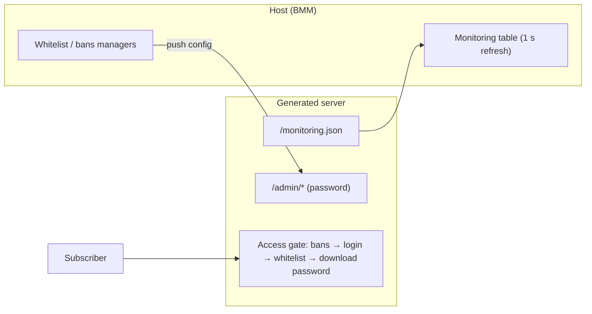

# Server Repo

A **Server Repo** is a shared, versioned collection of mods. Two things flow through it: you
**sync** mods *from* a repo into a profile, and BMM uses the repo to tell you when those mods
have an **update**. You can also **host** one yourself. Without a repo, a mod you installed by
hand stays at the version you installed, forever, silently.

> Browse Server Repositories — official and partner server repositories.

| | | |
|---|---|---|
| **1** | **Repo list** | Sources you've added. |
| **2** | **Browse** | Official and partner repos. |
| **3** | **Add** | Point BMM at a repo URL. |

## Connecting to a repo

Browse the official and partner list, or paste a repo URL directly. Once connected, the
repo's mods appear in your [Library](doc-page:features/library) alongside your local ones, marked with the
repo's name.

## Syncing mods from a repo

Syncing pulls the repo's mods onto your machine and into a profile. BMM does a **delta-sync**:
it compares what the repo has against what you already have and downloads **only the changed
files**, so updating a 5 GB repo after a small patch costs a few megabytes, not five gigs. A
long sync can be **cancelled** mid-flight, and you can cap its download speed so it doesn't
saturate your connection.

## Update detection

Once a mod is linked to a repo, *Check for mod updates* compares your installed version to the
repo's current version and offers the update when they differ. Linking is a separate step from
connecting:

> Link this mod to one or more repos so BMM can detect updates for it.

One mod can point at several repos. That's deliberate: if a source disappears, the mod is
still tracked by the other. There's also a **global update repositories** setting in
[Settings](doc-page:features/settings) — list a repo there and *every* installed mod is checked against it.

### Direct downloads have no version

Worth understanding, because it looks like a bug and isn't:

> No update detected. A direct download has no version, so BMM cannot tell if it is newer.

A raw file URL carries no version number, so BMM has nothing to compare. It offers a **direct
re-download** instead of pretending to know. If you want real update detection, link the mod
to a repo that publishes versions.

## Hosting your own repo

You can turn your own mods into a repo other people sync from. It happens in two steps:

**Generate.** BMM builds a repo from the profiles you choose — a `mods/` folder plus a
`repo.json` manifest that lists every mod, its version, per-file SHA-256 hashes, and an author
changelog. The manifest is **cryptographically signed with your creator key**, so anyone
syncing it can confirm it really came from you and hasn't been tampered with.

**Host.** Serve the generated repo over BMM's built-in HTTP server so others can reach it.
Optional switches make it public without port-forwarding gymnastics:

| Option | What it does |
|---|---|
| **Cloudflare Tunnel** | Exposes your local server at a public URL with no router config. |
| **UPnP** | Opens the port on your router automatically, for a direct connection. |
| **Upload limit** | Caps outbound speed so hosting doesn't starve your own connection. |
| **Download password** | Optional. Subscribers must enter it on first connect (sent as `X-Repo-Password`); blank = open repo. Distinct from the admin password. |

Repo owners also get **access control** — whitelists and bans by IP or creator key — so a
private repo stays private.

## Admin panel & monitoring

Hosting comes with two host-side tools, both on the Server Repo screen:

**Monitoring** — a live table refreshed every second: each connected client's IP, creator ID,
protocol (**Local / LAN / WAN**), the file being downloaded with progress and speed, plus idle
sessions and totals (clients, combined speed, active files). From any row you can **whitelist**
or **ban** that client in one click. It also aggregates a running standalone server's
`monitoring.json`, so both servers show in one place.

**Whitelist & bans** — two managers with search, manual add (by IP and/or creator key),
one-click removal and JSON export. The whitelist has a master on/off switch: off = everyone may
download (minus bans); on = only listed identities pass.

The generated standalone server exposes matching endpoints:

| Endpoint | Access |
|---|---|
| `/dashboard`, `/monitoring.json` | Public, read-only status. |
| `/admin/data`, `/admin/update`, `/admin/logs` | Admin password (Authorization header, constant-time compare). |

### Publishing a new version

When you update your mods, use **Update an existing repo**: an incremental flow that bumps
versions and lets you write a per-mod changelog (shown to users when the update is detected).
It only rewrites what changed, mirroring the delta-sync on the download side. The mod-author
walkthrough lives in the developer guide *Making your mod updatable*.
