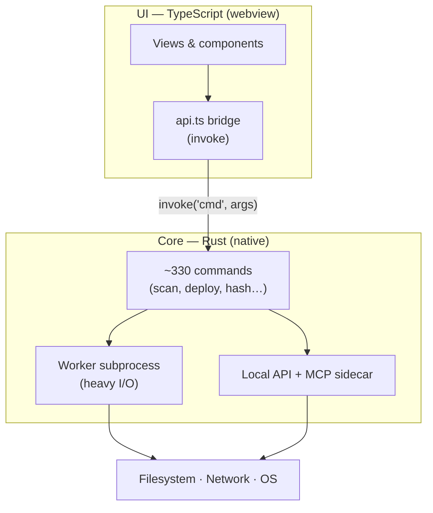

# Architecture

BMM is a **native desktop app that happens to have a web UI** — not a browser pretending to be an
app. That one choice is why it launches fast, idles at a few dozen MB, and can hash gigabytes
without freezing.

This page is the long version: what the stack is, and — where the code says so — **why**. Every
quoted rationale below is a comment from the source, not a reconstruction.

---

## The three layers

- **UI (TypeScript)** — everything you see. It never touches the disk directly; it asks the core
  to. State lives in the core, so the UI can be reloaded without losing anything.
- **Core (Rust)** — scanning, hashing, copying, networking. Native code, so it is fast and
  memory-lean.
- **The bridge** — one typed `invoke(command, args)` channel. If the bridge is not ready yet at
  startup, calls **wait** for it rather than failing:

    > *"The bridge is wired up by loadTauri(), but some boot code (e.g. loadLinks →
    > fetch_links_json) can invoke BEFORE loadTauri() has run. Rather than fail those with 'Tauri
    > bridge not initialized', invoke() awaits this promise first…"*

### Why not Electron?

An Electron app ships a whole copy of Chromium (~150 MB) and runs your logic in JavaScript. BMM
uses the **OS's own webview** and does the heavy lifting in Rust — a fraction of the size and
memory, with file operations at native speed.

The webview is then trimmed further, before it starts:

> *"WebView2 RAM trims — Set BEFORE WebView2 starts. Cuts ~50-150MB off the WebView2 footprint by
> disabling features BMM doesn't use: AudioServiceOutOfProcess… extensions / background pages…
> Translate / sync / default apps… background-networking… renderer-process-limit=2"*

The DevTools window is closable for the same reason — it is *"the ~480 MB msedgewebview2 'DevTools'
process"*, so it stays resident only while open.

### No bundler, no framework

The frontend is TypeScript compiled **1:1** to `frontend/js/` — same folders, same file names, no
bundling step. `frontendDist` points at the source tree, `beforeBuildCommand` is empty, and the
webview loads a single ES module entry and resolves the rest natively. `withGlobalTauri` is what
makes that work: the Tauri JS API arrives as a global, so nothing has to be bundled to reach it.

!!! note "This one is undocumented in the code"

    There is no comment anywhere explaining the no-bundler / no-framework decision — so this page
    will not invent a justification for it. What *is* enforced are its consequences: because the
    shipped artefact is the compiled `frontend/js/`, the UI-kit contract test deliberately runs
    against the compiled output *"so it exercises exactly what ships"*.

---

## Three processes

| Process | What it is |
|---|---|
| **Main window** | 1480×960, `decorations: false`, `transparent: true` — the titlebar is BMM's own |
| **MCP sidecar** | `bmm-mcp-server`, also the full CLI (`serve`, `profiles`, `mods`, `enable`, `crashes`, `generate-repo`, `api`…) |
| **Mod-IO worker** | The same binary re-executed as `--mod-worker IN OUT` for heavy copies |

### Why the worker is a separate process

> *"To keep the BMM UI responsive when applying / unapplying big mods on the OS drive, the heavy
> file IO is delegated to a separate worker process (re-execs the same exe with `--mod-worker IN
> OUT`). The worker runs with Windows BACKGROUND IO priority, so the kernel keeps disk bandwidth
> available for the UI process. Cancelling is a `taskkill /T` of the worker PID — instant and
> reliable, no matter how stuck the IO is."*

Three details follow from that:

- The worker **short-circuits before Tauri boots** — *"do the heavy file IO and exit without
  booting Tauri, WebView2, or anything else."*
- It self-demotes its own IO priority (`PROCESS_MODE_BACKGROUND_BEGIN`).
- Exit codes are the protocol: `0` ok, non-zero error, **`3` cancelled**. Cancelling a cancellable
  worker also spawns *"an inverse-op undo subprocess so any partial writes are reverted."*

### Why the MCP sidecar is a cargo `[[example]]`

Because as a `[[bin]]` it broke the installer:

> *"tauri-bundler harvests every cargo `[[bin]]` into the installer, but it IGNORES examples. As a
> `[[bin]]` this collided with the externalBin sidecar of the same name → WiX light.exe LGHT0091
> 'Duplicate symbol Component:bmm_mcp_server.exe' → the MSI failed to bundle."*

---

## Data & state

`data.json` is a single document: profiles, mods, active profile, tags, disk limits, settings,
launch packs, plugins, permissions, modpacks. Every field after the first few is
`#[serde(default)]`, so the schema evolves without migrations.

Alongside it, state that is deliberately **never persisted**:

> *"Cache for O(1) conflict detection (In-Memory only, not saved to JSON)"*

### Writes are crash-safe by construction

> *"Crash-safe write: write to a temp file, fsync, then atomically rename over the target. An
> interrupted write can never leave a half-written file."*

And the rolling backup depends on exactly that:

> *"Roll the current good file to .bak BEFORE replacing it. Because the write below is atomic
> (temp + rename), the live data.json is always a complete file, so the backup is always a
> complete prior version."*

On load:

> *"Load data.json, recovering from the rolling `.bak` if the main file is corrupt or missing — and
> NEVER silently resetting when a good backup exists. A corrupt main file is preserved as
> `data.corrupt-<ts>.json` for forensics."*

!!! note "Why a JSON document and not a database?"

    Also undocumented in the code. What the code *does* document is the durability strategy that
    stands in for a database's guarantees: atomic write, `fsync` before rename, a rolling `.bak`,
    corrupt-file preservation, and `serde(default)` schema evolution. Read it as *a single JSON
    document with hand-rolled ACID-ish write semantics* — which is an accurate description, and an
    honest one.

### Locking discipline

The one place ordering is stated: **Data → LastUpdate → Cache → Index**. Everywhere else the rule
is *drop the lock before doing anything slow*, and the comments say why:

> *"Release every lock BEFORE hashing so no other command blocks while we read file contents (this
> is what used to freeze the UI on big mods)."*

> *"We do NOT hash them here (that would run under 4 held locks and could freeze the UI on a big
> mod); we record them and hash AFTER the locks are released."*

The pattern has a name in the codebase — a snapshot struct: *"Lightweight snapshot of a mod's
fields — collected while holding the lock, then used after releasing it so the heavy file I/O never
blocks AppState."*

### `content_id` — identity, not a checksum

> *"Derives a stable cross-machine identifier for a mod folder. Priority: 1. `bmm.json` … with a
> non-empty `id` field 2. SHA-256 fingerprint of sorted (relative_path, file_size) pairs — fast, no
> content reads. The result is deterministic: same files on any machine → same content_id."*

Two consequences the code defends explicitly. An archived mod and its unpacked twin get the **same**
id — *"the (rel, size) pairs are identical to the unpacked folder"*. And it survived the hashing
migration on purpose:

> *"content_id is a cross-machine IDENTITY, not a content checksum… the SHA-256→BLAKE3 switch must
> NOT change a mod's identity (otherwise old and new installs of the same mod would stop matching
> across machines during the migration)."*

---

## The performance decisions

This is the richest seam in the codebase, and almost all of it is a **responsiveness-over-throughput
tradeoff**, deliberately.

### BLAKE3 *and* SHA-256

> *"BLAKE3 for fast local content hashing: a tree hash that parallelises WITHIN a single large file
> (mmap + rayon), unlike SHA-256. Used for file_hashes and the modpack hash-match index. Repo
> delta-sync keeps its own SHA-256 (wire format)."*

Digests are **self-describing**: local hashes are tagged `b3:`, and *"untagged digests are treated
as legacy SHA-256 so old baselines/modpacks still verify (dual-read)."* SHA-256 survives in three
roles — legacy baselines, the repo wire format, and the `content_id` fingerprint.

Then the subtle part. BLAKE3 was chosen *for* its in-file parallelism, and the hot path
**deliberately declines to use it**:

> *"A SIZE-CAPPED thread pool used for ALL mod hashing. BLAKE3 is so fast it will otherwise saturate
> every core (rayon defaults to all CPUs) and freeze the UI while importing/scanning many mods. We
> cap it to ~half the cores (max 4) so hashing always leaves headroom for the UI thread."*

> *"Sequential mmap (NOT update_mmap_rayon): per-file work stays on a single pool thread so a big
> file can't grab every core. Parallelism comes from the bounded pool processing several files at
> once."*

### Smart I/O — three copy paths

| Path | When | How |
|---|---|---|
| **Throttled** | a per-disk MB/s limit is set | 128 KB chunks, sleeps to hit the rate |
| **Smart I/O** | Smart I/O on | 1 MiB chunks, a tiny yield on a **byte budget** |
| **Full speed** | Smart I/O off, no limit | plain `std::fs::copy` |

The Smart I/O numbers are a measured decision, not a guess:

> *"1 MiB chunks (fewer read/write syscalls → closer to full-speed copy), and yield on a ~16 MiB
> *byte budget* rather than every chunk. The old 256 KB + per-chunk sleep cost ~37% vs full speed;
> budgeting the yield keeps the UI responsive while recovering most of that throughput."*

Parallelism is capped the same way — *"cap to 2 threads so file copies never saturate every CPU
core (which is what causes the 'Ne répond pas' UI freeze)"* — and the **system drive forces it**
regardless of the setting:

> *"Returns true if `path` lives on the same drive as the OS (typically C:). Used to dial parallel IO
> down to a single thread so Windows itself stays responsive during big mod copies."*

Every copy path polls a cancel flag *"so that the user's cancel click can interrupt big mod copies
almost instantly instead of waiting for the whole file to finish."*

### Archives stay compressed

> *"A mod may be stored as an ARCHIVE file … The archive is NEVER unpacked into the mods folder — it
> stays compressed. It is only extracted (to a cache dir) when needed… Because the extracted view
> contains exactly the same relative paths + sizes as the unpacked equivalent, every BMM feature
> (SHA / content-id / integrity report / conflicts) yields IDENTICAL results for an archived mod and
> its unpacked twin."*

The cache is keyed by *"the archive's name + size + mtime, so changing the archive busts it"*, and
listing an archive never extracts it (7z and rar are read from the header/index only) — which is
what makes the startup path safe.

Zip extraction is parallel, with a documented fallback:

> *"Extract a .zip across all cores. DEFLATE decompression is CPU-bound and was the app's slowest
> hot-path operation when serial… `ZipArchive` isn't `Sync`, so each rayon **worker thread** opens
> its own handle once — not once per entry — so the central directory is parsed ~once per core
> instead of once per file. Zip-Slip safe (`enclosed_name`); serial fallback for pathologically large
> archives."*

Even the **rejected** optimisation is recorded, with the blocking reason:

> *"NOTE: zlib-ng (the 2-3x SIMD backend) needs cmake to build libz-ng-sys, which can't target the
> installed VS 2026 toolchain — so it is intentionally NOT used."*

### Three rayon tiers, and the allocator

Rayon's global pool is deliberately **under**-provisioned:

> *"Prevent Rayon from hogging 100% CPU and lagging the OS. Cap thread count AND shrink each rayon
> worker's stack from the default 8MB down to 512KB — BMM's parallel work (file copy / hashing) never
> recurses deep, so 512KB is plenty and saves ~7MB of committed RSS per thread."*

So there are three tiers: the capped global pool, a ≤4-thread hashing pool, and a 1–2 thread Smart
I/O pool. `jwalk` handles the hot directory walks; `walkdir` is kept for cold paths.

And the allocator is a deliberate swap:

> *"Use mimalloc — drastically lower RSS on Windows vs the default HeapAlloc. Typical gain: 30–60%
> smaller process working set, plus much less fragmentation when many small allocs (string paths,
> hash entries) are allocated and freed during normal BMM use."*

### What used to be slow

Worth reading as a list, because each one is a fix with a stated cause:

- **Conflicts**: the UI called one command *per mod*, *"which on a big library meant hundreds of IPC
  round-trips + lock acquisitions on every refresh/import — the main source of UI lag."* Now one
  batched call.
- **Startup**: extracting a big `.zip` under the lock froze the UI — archives are now listed from
  their index instead.
- **Scanning**: re-hashing was synchronous; now a throttled background queue hashes *"one mod at a
  time, on the capped hash pool, with a pause between each."*
- **Logging**: `log_line` re-derived its path every call — *"the hottest path in the app"* — now
  cached.
- **Offline drives**: an unplugged drive listed zero files and re-queued pointless work — *"Keep
  whatever we already had and retry when the drive is back — don't churn state offline."*

---

## Security posture

**Every child process is spawned invisibly.**

> *"Console programs (cmd, powershell, python, bash, cscript, …) launched via the default `Command`
> pop a black console window for a split second in a release build… Routing every spawn through
> these helpers sets the `CREATE_NO_WINDOW` flag so they stay invisible."*

**Zip-slip is guarded independently per format.** For 7z and rar, BMM does not simply trust the
crate: *"an INDEPENDENT zip-slip guard for the formats whose crate we otherwise trust for path
safety — belt-and-suspenders mirroring the `enclosed_name()` guarantee we rely on for zip."* For 7z
the whole index is validated up front, *"so validate the index up front rather than trusting the
crate."*

**Path traversal (CWE-22) is guarded at each boundary** where a name becomes a filename — modpack
names, language files, crash reports, catalog downloads (*"a segment like `..\..\Startup\x.exe` could
escape storage_dir"*), and launch-pack names (*"so the shortcut can never be written outside the pack
dir (e.g. the Startup auto-run folder → persistence)"*).

**Filesystem scope is a user setting.** `full` grants recursive access over every mounted disk;
anything else grants only each profile's three folders, and only if they exist.

**The local API resolves identity from the token, never a header.**

> *"CWE-862/863: the API resolves a caller's identity (and thus permissions) from THIS map by token,
> not from the spoofable `X-BMM-Plugin-Id` header."*

Tokens are compared in constant time (*"avoids the early-exit timing leak of `==`"*) and re-read per
request so rotation is immediate. Custom scheduler commands *"never invoke a shell (args are passed
separately…), avoiding CWE-78."*

**`eval` cannot come back.** A build gate enforces it:

> *"Fails the build if dynamic-code-execution sinks reappear in the frontend source. The Debug Hub
> REPL `eval()` was removed during the CWE remediation; this guard makes sure it (or `new
> Function(...)`) is never reintroduced."*

**Updates fail closed.** The installer channel verifies an Ed25519 signature *before* touching
anything — *"the package MUST carry a valid Ed25519 signature for that key or the update is refused
*before* the install dir is touched (fail closed)"* — then snapshots and rolls back on error. Note it
is **opt-in per caller**: pinning happens when a publisher key is supplied.

---

## Subsystems

| Subsystem | In one line |
|---|---|
| Profiles & activation | A profile is three folders plus an ordered `active_mods` list; activation order *is* that order. See [Profiles & activation](doc-page:how-it-works/profiles-activation) |
| Conflict detection | Two in-memory maps — mod→files and the inverted file→mods — giving O(1) lookup, mtime-invalidated. See [Conflicts](doc-page:how-it-works/conflicts) |
| Mapper | Restructure a mod's internal layout to match the game tree. See [Mapper](doc-page:how-it-works/mapper) |
| Server repo | Publish a signed `repo.json`, chunked resumable delta sync, host it, or generate a standalone server. See [Sync & repos](doc-page:how-it-works/sync-repos) |
| Plugins & API | Per-plugin tokens + a permission map, a local HTTP API, and the `bmm://` scheme. See [API & deeplinks](doc-page:reference/api) |
| Scheduler | The engine lives in the **frontend**; Rust only persists it and runs opt-in external commands. See [Action reference](doc-page:reference/actions) |
| Themes | `--bmm-*` design tokens; the engine injects styles at runtime and never edits source files. Built-ins are files, not code |
| i18n | Flat key→string JSON per language, read through Rust so bundled and imported languages resolve identically |
| Telemetry & replay | Opt-in, local-first queue; rrweb captures the real DOM, masked by default. The session recorder **spools events to disk** as they happen and the core assembles the `.bmmreplay` by streaming, so the app never holds a session |
| Crash reporting | Circular buffer + realtime log, panic hook, and a clean-exit marker so a crash is distinguishable from a close |
| Benchmarks | Live sampling plus a per-operation suite (scan / hash / copy / extract). See [Performance](doc-page:how-it-works/performance) |
| App catalog & launch packs | Community app feeds with sanitised downloads; named bundles launched as one action |

---

## What CI actually guarantees

`npm run ci` chains five gates; the GitHub workflow runs a subset plus `cargo check`.

| Gate | Protects against |
|---|---|
| `security-guard` | `eval(` / `new Function(` reappearing — the XSS→RCE chain |
| i18n parity | `en.json` and `fr.json` drifting; it names the offending keys |
| hardcoded-colour lint | New un-themable literal text colours (baselined, so only *new* ones fail) |
| `tsc` | Type regressions, under `strict` |
| `check-kit` | XSS through a UI-kit factory, and class/state drift — run against the **compiled** output |
| `cargo check` (CI) | Rust compile regressions |

`cargo check` over clippy/fmt is a stated choice:

> *"The gate is 'does the Rust still compile?'… the codebase predates rustfmt + a clean clippy pass,
> and clippy's correctness lints are deny-by-default, so a clippy/fmt gate would fail on tons of
> pre-existing issues."*

!!! warning "Two gates are local-only"

    The colour lint and `check-kit` are in `npm run ci` but **not** in the GitHub workflow, so they
    only run if someone runs the npm script. And `npm run build` enforces neither — a release build
    runs `security-guard → tsc → tauri build → gen-update-manifest`.

---

## See also

- [API & deeplink reference](doc-page:reference/api) · [Action reference](doc-page:reference/actions)
- [Performance](doc-page:how-it-works/performance) · [Integrity & hashing](doc-page:how-it-works/integrity-hashing) · [Security](doc-page:how-it-works/security)

!!! info "See it in the app"
    Help & other → Developer → **The tech stack**, **Engine & threads**, **Lightweight
    architecture**, **BLAKE3 hashing**, **Disk I/O limiter**.
