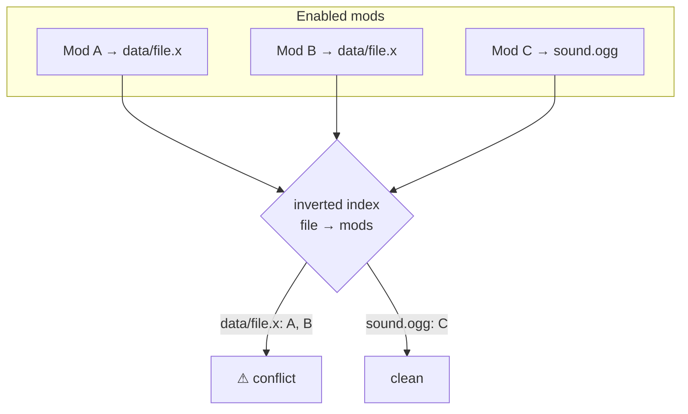
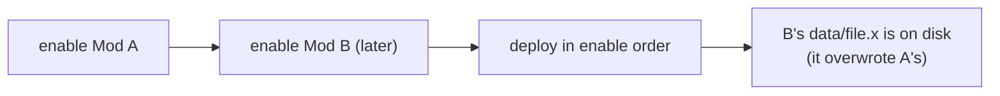
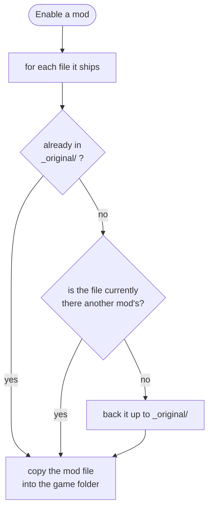
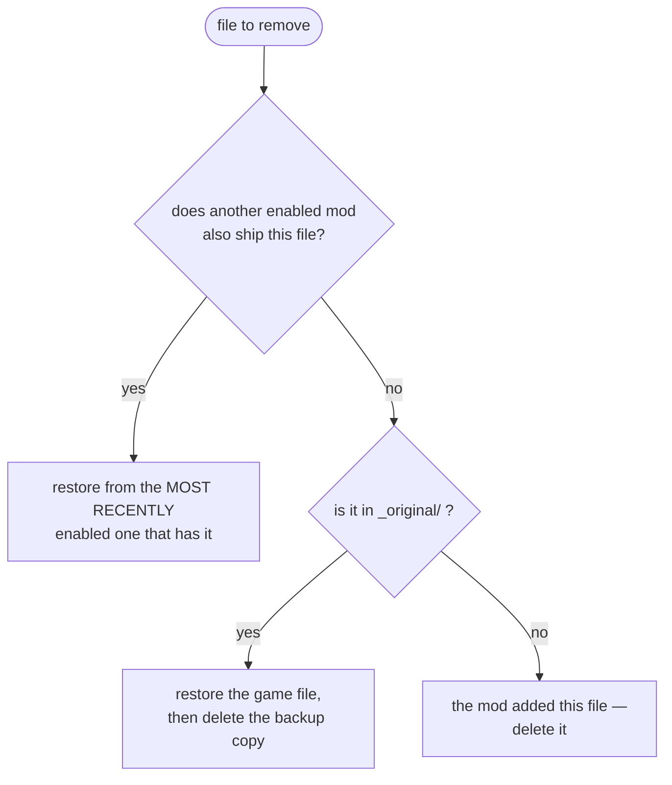

# Conflicts

Two mods are in **conflict** when they ship the same file. Some managers let one silently overwrite
the other. BMM detects the overlap *before* it writes anything and warns you — but the resolution
itself is deliberately simple, and the interesting engineering is in making detection free and
deactivation safe.

---

## Detection is an index lookup, never a disk read

BMM keeps **two in-memory maps**, and neither is ever written to `data.json`:

> *"Cache for O(1) conflict detection (In-Memory only, not saved to JSON)"*

| Map | Shape | Answers |
|---|---|---|
| File cache | mod → its set of files | "what does this mod ship?" |
| Conflict index | file → the mods claiming it | "who else claims this path?" |

The second is just the first inverted. Any path claimed by more than one enabled mod is a conflict,
so finding conflicts is a grouping operation over data already in RAM — no filesystem access at all.

Being in-memory only is a design decision, not an omission: the index is rebuilt from the file cache
whenever it could be stale, so it can never disagree with the mods folder in a way that survives a
restart.

!!! note "It used to be the app's biggest source of lag"

    The UI once asked for conflicts **one mod at a time**, which *"on a big library meant hundreds of
    IPC round-trips + lock acquisitions on every refresh/import — the main source of UI lag"*. It is
    now a single batched call, and the report carries **counts**, not file lists. The full file list
    for one conflict is a separate call, and it is **capped at 2000 entries** with a `truncated` flag
    — a pathological mod pair overlapping on 200 000 files can no longer build a payload big enough
    to hurt the window.

---

## Who wins: the last mod you enable

There is **no per-file winner picker and no priority list**. The rule is: **whichever mod you enable
last wins.** A profile's `active_mods` is an *ordered* list, deployment walks it in order, and a later
mod overwrites an earlier one on any shared path. Your only control is the order you enable in —
enable the one that should win last.

This is a genuine simplification compared to managers with priority trees. It buys you one thing:
there is never a hidden rule to reverse-engineer. What is on disk is what you enabled last.

---

## Nothing is lost — the backup rule

Before a mod overwrites a file, BMM copies the **original game file** into `_original/` inside the
profile's backup folder. The important detail is the guard that decides what counts as "original":

> *"CRITICAL: Check if the current file in game dir is actually from another mod … This is a mod
> file, NOT a game original. Don't backup."*

So a file is backed up **only the first time BMM replaces a genuine game file** in that profile. Mod
files overwriting other mod files never enter the backup — which is what stops the backup folder from
filling up with copies of mods you already have, and what stops a "restore" from ever putting another
mod's file back where the game's file belonged.

---

## Disabling: the three-way restore

Disabling is where last-wins stops being a problem. For every file the mod is removing, BMM asks
three questions in order:

1. **Another enabled mod ships it** → restore from that mod. The search walks the active list
   **in reverse**, so the most recently enabled mod wins — the same rule as deployment, applied
   backwards. Disabling the top mod correctly reveals the one underneath.
2. **Otherwise, `_original/` has it** → restore the game's own file, and then **delete the backup
   copy**: *"Space optimization: remove the backup file as it has been safely restored."* The backup
   folder shrinks as you disable, instead of growing forever.
3. **Otherwise** → the mod added a file the game never had, so it is deleted.

Two safety details in that cleanup:

- The list of files to remove is a **union of what BMM recorded at enable time and a fresh scan of
  the mod folder** (the code calls it *"Hybrid cleanup: Tracked files + Current physical files"*), so
  a file added to the mod folder after enabling still gets cleaned up.
- Emptied directories are removed deepest-first with `fs::remove_dir`, which *"only removes EMPTY
  dirs (errors → no-op on non-empty), so this can never delete data"*, and the paths are relative to
  the game folder *"so they can never escape it"*.

---

## What this means in practice

| You want | Do this |
|---|---|
| Mod B's version of a shared file | Enable B **after** A |
| To see what actually overlaps | Open the conflict view — the file list is exact, and free to compute |
| To undo everything | Disable in any order; each file falls back to the next mod that has it, then to the game's original |
| Per-file cherry-picking | Not supported — use the [Mapper](doc-page:how-it-works/mapper) to change what a mod ships, or edit the mod folder |

!!! info "See it in the app"
    Help & other → Developer → **Conflict management**; the **Conflicts** tutorial.
