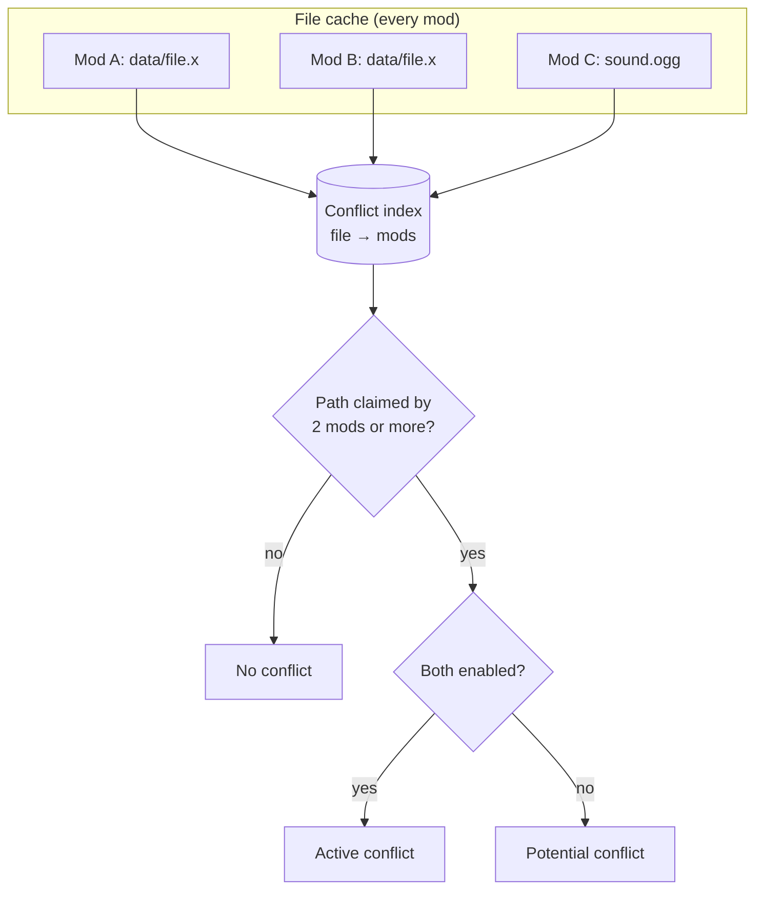
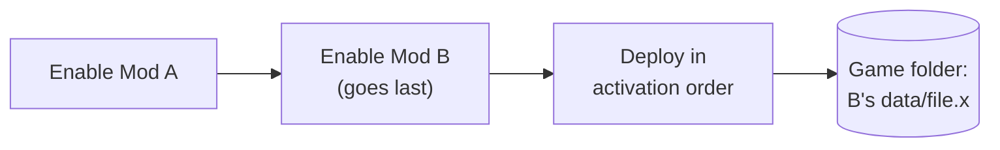
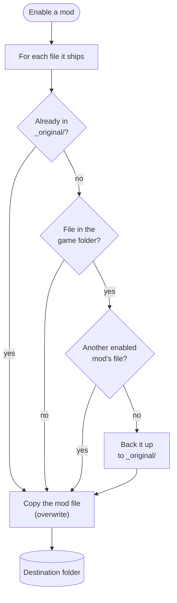
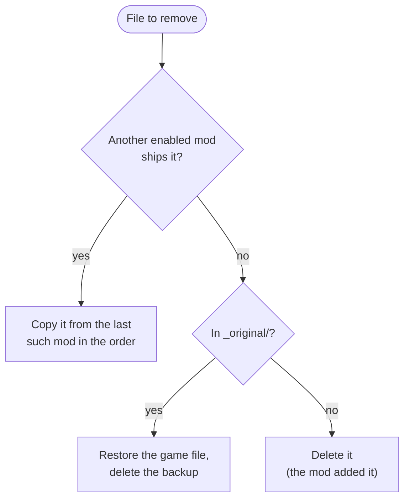

# Conflicts

Two mods are in **conflict** when they ship the same file. Some managers let one silently overwrite
the other. BMM detects the overlap *before* it writes anything and warns you — but the resolution
itself is deliberately simple, and the interesting engineering is in making detection free and
deactivation safe.

---

## Detection is an index lookup, never a disk read

BMM keeps **two in-memory maps**, and neither is ever written to `data.json`:

> *"Cache for O(1) conflict detection (In-Memory only, not saved to JSON)"*

| Map | Shape | Answers |
|---|---|---|
| File cache | mod → its set of files | "what does this mod ship?" |
| Conflict index | file → the mods claiming it | "who else claims this path?" |

The second is just the first inverted, and it covers every mod in the library, enabled or not. Any
path claimed by more than one mod is a conflict: **active** when both are enabled in the profile,
**potential** otherwise, reported for the same profile (*Intra*) or for another profile that deploys
to the same game folder (*Inter*). Finding conflicts is a grouping operation over data already in
RAM — no filesystem access at all.

```mermaid
flowchart TD
    subgraph LIB["File cache (every mod)"]
        A["Mod A: data/file.x"]
        B["Mod B: data/file.x"]
        C["Mod C: sound.ogg"]
    end
    A --> IDX[("Conflict index<br/>file → mods")]
    B --> IDX
    C --> IDX
    IDX --> SHARED{"Path claimed by<br/>2 mods or more?"}
    SHARED -- "no" --> OK["No conflict"]
    SHARED -- "yes" --> BOTH{"Both enabled?"}
    BOTH -- "yes" --> ACT["Active conflict"]
    BOTH -- "no" --> POT["Potential conflict"]
```

Being in-memory only is a design decision, not an omission: the index is rebuilt from the file cache
whenever it could be stale, so it can never disagree with the mods folder in a way that survives a
restart.

!!! note "It used to be the app's biggest source of lag"

    The UI once asked for conflicts **one mod at a time**, which *"on a big library meant hundreds of
    IPC round-trips + lock acquisitions on every refresh/import — the main source of UI lag"*. It is
    now a single batched call, and the report carries **counts**, not file lists. The full file list
    for one conflict is a separate call, and it is **capped at 2000 entries** with a `truncated` flag
    — a pathological mod pair overlapping on 200 000 files can no longer build a payload big enough
    to hurt the window.

---

## Who wins: the last mod in the activation order

There is **no per-file winner picker**. The rule is: **the mod applied last wins.** A profile's
`active_mods` is an *ordered* list — the [activation order](doc-page:how-it-works/load-order) — deployment walks it in
order, and a later mod overwrites an earlier one on any shared path. A newly enabled mod goes to the
end, so by default the one you enabled last wins; the order view lets you move any mod up or down,
and re-copies only the files that change hands.

```mermaid
flowchart LR
    E1["Enable Mod A"] --> E2["Enable Mod B<br/>(goes last)"]
    E2 --> DEPLOY["Deploy in<br/>activation order"]
    DEPLOY --> WIN[("Game folder:<br/>B's data/file.x")]
```

This is a genuine simplification compared to managers with priority trees. It buys you one thing:
there is never a hidden rule to reverse-engineer. What is on disk is the last mod in one visible list.

---

## Nothing is lost — the backup rule

Before a mod overwrites a file, BMM copies the **original game file** into `_original/` inside the
profile's backup folder. The important detail is the guard that decides what counts as "original":

> *"CRITICAL: Check if the current file in game dir is actually from another mod … This is a mod
> file, NOT a game original. Don't backup."*

So a file is backed up **only the first time BMM replaces a genuine game file** in that profile. Mod
files overwriting other mod files never enter the backup — which is what stops the backup folder from
filling up with copies of mods you already have, and what stops a "restore" from ever putting another
mod's file back where the game's file belonged.

```mermaid
flowchart TD
    APPLY(["Enable a mod"]) --> EACH["For each file it ships"]
    EACH --> HAVE{"Already in<br/>_original/?"}
    HAVE -- "no" --> THERE{"File in the<br/>game folder?"}
    THERE -- "yes" --> WHOSE{"Another enabled<br/>mod's file?"}
    WHOSE -- "no" --> BK["Back it up<br/>to _original/"]
    HAVE -- "yes" --> COPY["Copy the mod file<br/>(overwrite)"]
    THERE -- "no" --> COPY
    WHOSE -- "yes" --> COPY
    BK --> COPY
    COPY --> GAME[("Destination folder")]
```

*Another enabled mod's file* means a file shipped by a mod enabled on that game folder, in the active
profile **or in any other profile deploying there** (switching profiles moves no file, so theirs are on
disk too), or one this same enable has just placed (a dependency chain). The mod's copy always
overwrites.

---

## Disabling: the three-way restore

Disabling is where last-wins stops being a problem. For every file the mod is removing, BMM asks
three questions in order:

```mermaid
flowchart TD
    REM(["File to remove"]) --> OTHER{"Another enabled mod<br/>ships it?"}
    OTHER -- "yes" --> FROMMOD["Copy it from the last<br/>such mod in the order"]
    OTHER -- "no" --> ORIG{"In _original/?"}
    ORIG -- "yes" --> FROMORIG["Restore the game file,<br/>delete the backup"]
    ORIG -- "no" --> DEL["Delete it<br/>(the mod added it)"]
```

1. **Another enabled mod ships it** → restore from that mod: the **last** one in the activation
   order that has the file — the same rule as deployment. A mod another profile enabled on the same
   game folder counts too, below this profile's own ones. Disabling the top mod reveals the one
   directly underneath, archived (zipped) mods included: their copy is read from the extracted
   cache. (It used to restore the *oldest* copy, and to skip archived mods; both are fixed and
   tested — see [Activation order](doc-page:how-it-works/load-order).)
2. **Otherwise, `_original/` has it** (this profile's, or the backup folder of another profile on
   the same game folder, which holds it when that profile replaced the file first) → restore the
   game's own file, and then **delete the backup copy**: *"Space optimization: remove the backup file as it has been safely restored."* The backup
   folder shrinks as you disable, instead of growing forever.
3. **Otherwise** → the mod added a file the game never had, so it is deleted.

Two safety details in that cleanup:

- The list of files to remove is a **union of what BMM recorded at enable time and a fresh scan of
  the mod folder** (the code calls it *"Hybrid cleanup: Tracked files + Current physical files"*), so
  a file added to the mod folder after enabling still gets cleaned up.
- Emptied directories are removed deepest-first with `fs::remove_dir`, which *"only removes EMPTY
  dirs (errors → no-op on non-empty), so this can never delete data"*, and the paths are relative to
  the destination folder *"so they can never escape it"*.

---

## What this means in practice

| You want | Do this |
|---|---|
| Mod B's version of a shared file | Put B **below** A in the [activation order](doc-page:how-it-works/load-order) (or enable it after A) |
| To see what actually overlaps | Open the conflict view — the file list is exact, and free to compute |
| To undo everything | Disable in any order; each file falls back to the mod under it that has it, then to the game's original |
| Per-file cherry-picking | Not supported — use the [Mapper](doc-page:how-it-works/mapper) to change what a mod ships, or edit the mod folder |

!!! info "See it in the app"
    Help & other → Developer → **Conflict management**; the **Conflicts** tutorial.
