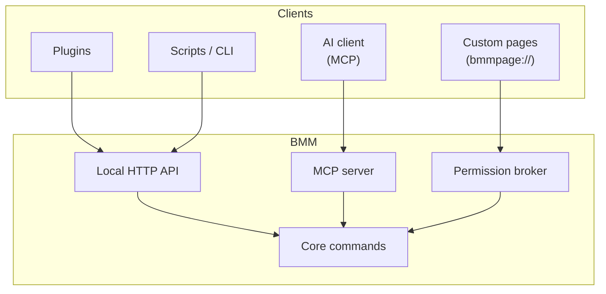
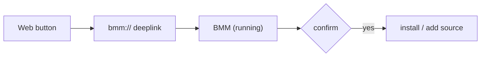
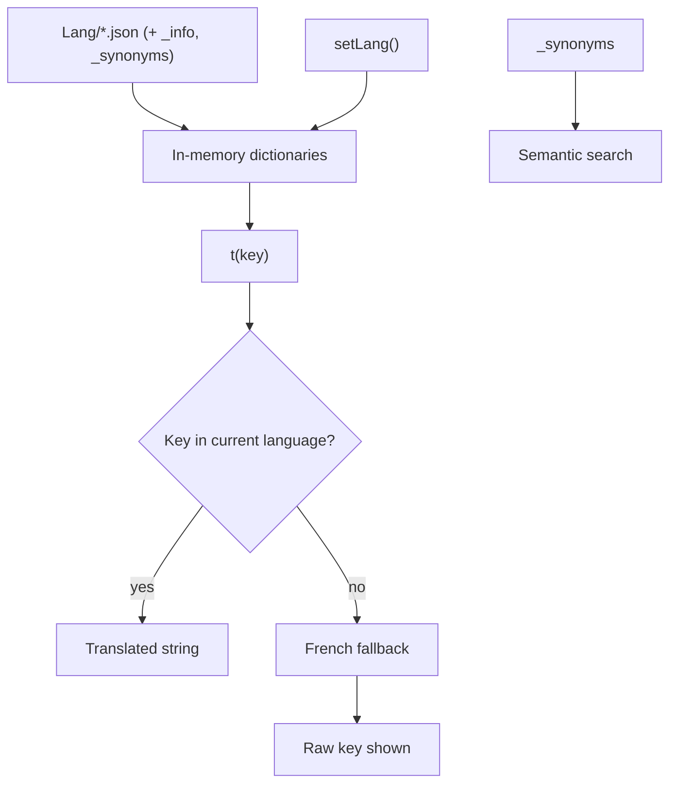

# Extending BMM

Everything the UI can do, it does by asking the core through one channel. That same channel is open
to **plugins, scripts and AI clients** — so anything BMM does, you can automate.

## Three ways in

- **Local API** — a small HTTP server on your machine. Plugins and scripts call it to scan,
  activate, build packs, read state, and more.
- **MCP server** — the same capabilities exposed as Model Context Protocol tools, so an AI assistant
  can drive BMM conversationally. It runs over stdio, not a public port.
- **Custom pages** — sandboxed `bmmpage://` mini-apps you pin to the navbar. They talk to BMM only
  through a **permission broker**, so a page gets exactly the access you grant it and nothing more.

## Deeplinks

Buttons on the web ("Install this mod in BMM") work through **deeplinks** — a URL scheme BMM
registers with the OS. Clicking one hands the request to the running app, which confirms and acts.

!!! info "See it in the app"
    Help &amp; other → Developer → **MCP server &amp; local API**, **Custom pages**,
    **One-click install**. Reference: [API](doc-page:../reference/api).

## Translations (i18n)

Every UI string resolves through `t(key)` against per-language JSON files in `Lang/` — plain
key→string maps loaded from disk at startup. Lookup order: the active language → the **French**
dictionary (FR is the base language) → the raw key itself, so a missing translation is visible
instead of silent.

- **Live switching** — changing language re-applies every `data-i18n` attribute immediately and
  fires a `langChanged` event for dynamic modules. No restart.
- **Adding a language** is dropping a new JSON file in `Lang/`: it appears in the picker (with
  the name/flag from its `_info`) without a rebuild.
- Each file can ship `_synonyms` groups — merged across languages to power the **semantic
  search** in the command palette and the docs.

