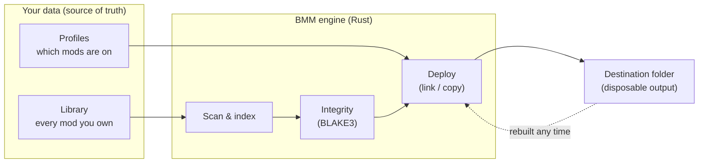

# How it works

The rest of the docs tell you **how to use** BMM. This section is for the other half of the
audience — the people who want to know **why it behaves the way it does**: contributors,
plugin authors, and the plainly curious.

You don't need any of this to use BMM. But if you've ever wondered why activating a profile is
instant, why a corrupted download never reaches your game, or how a server repo keeps a whole
squadron in sync, the answers are here — with diagrams.

## The one guarantee everything is built on

BMM is **non-destructive**. Your downloaded mods are the source of truth; the destination folder is
disposable output that BMM can rebuild at any time. Every design decision below falls out of
holding that line.

Because the destination folder is output, a game update, a reinstall, or a bad mod can wipe it and
lose nothing. You switch a profile back on; you never re-download.

:::tip[The whole app in one sentence]
Your mods are the source of truth; the destination folder is disposable output BMM can rebuild — so
nothing you do to the game can cost you a mod.
:::

## Map of this section

| Page | The question it answers |
|---|---|
| [Architecture](doc-page:how-it-works/architecture) | What is BMM actually made of, and why so small? |
| [Profiles & activation](doc-page:how-it-works/profiles-activation) | Why is switching profiles instant and safe? |
| [Scanning & the cache](doc-page:how-it-works/scanning-cache) | How does BMM know what changed without re-reading everything? |
| [Integrity & hashing](doc-page:how-it-works/integrity-hashing) | How is a corrupted file caught before your game sees it? |
| [Conflict resolution](doc-page:how-it-works/conflicts) | How does BMM know two mods fight — before you commit? |
| [The mapper](doc-page:how-it-works/mapper) | How is a mis-structured archive reshaped, repeatably? |
| [Sync & server repos](doc-page:how-it-works/sync-repos) | How does a whole group stay on the exact same setup? |
| [Performance](doc-page:how-it-works/performance) | Why does a huge deploy stay responsive? |
| [Extending BMM](doc-page:how-it-works/extending) | How do plugins, the API and MCP drive BMM? |
| [Security model](doc-page:how-it-works/security) | What are the trust boundaries, and what's signed? |

!!! tip "In the app"
    Every one of these systems has an **interactive diagram** inside BMM, under
    **Help & other → Developer**. Hover a node for a live explanation, or open the matching
    tutorial to see it happen on your own machine.
