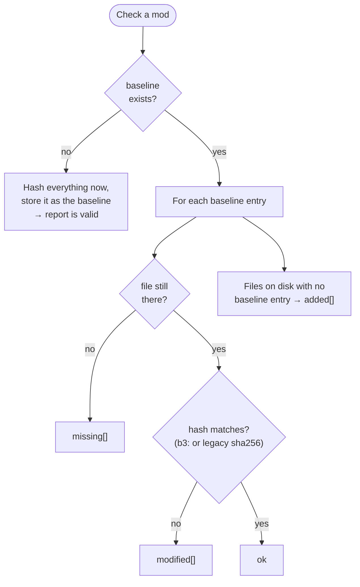
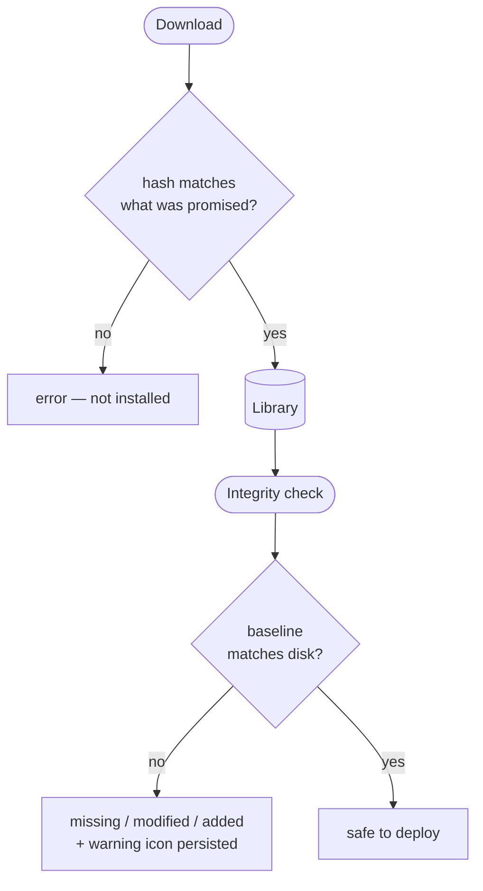

# Integrity & hashing

A mod is only useful if it's the *right* bytes. A truncated download, a flaky drive, or a tampered
file should never reach your game silently. BMM's answer is to hash everything and compare — and to
be precise about **which** hash, because it runs two of them on purpose.

---

## Two algorithms, and why both

| Algorithm | Used for | Why |
|---|---|---|
| **BLAKE3** | local file hashes, the modpack hash-match index | *"a tree hash that parallelises WITHIN a single large file (mmap + rayon), unlike SHA-256"* |
| **SHA-256** | legacy baselines, the repo wire format, the `content_id` fingerprint | compatibility — changing it would break things that already exist |

Digests are **self-describing**: a local BLAKE3 hash is stored tagged as `b3:…`, and *"untagged
digests are treated as legacy SHA-256 so old baselines/modpacks still verify (dual-read)"*. That is
why upgrading BMM never invalidates your existing baselines — an old SHA-256 baseline keeps
verifying with SHA-256, and only new hashes are BLAKE3.

### The subtle part: BLAKE3 was chosen for parallelism, then told not to use it

BLAKE3's headline feature is that it can spread one big file across every core. The hot path
**deliberately refuses**:

> *"A SIZE-CAPPED thread pool used for ALL mod hashing. BLAKE3 is so fast it will otherwise saturate
> every core (rayon defaults to all CPUs) and freeze the UI while importing/scanning many mods. We
> cap it to ~half the cores (max 4) so hashing always leaves headroom for the UI thread."*

> *"Sequential mmap (NOT update_mmap_rayon): per-file work stays on a single pool thread so a big
> file can't grab every core. Parallelism comes from the bounded pool processing several files at
> once."*

So hashing a library is parallel **across files**, not within one. That is slower on a single huge
file and much kinder to the machine — the same tradeoff as everywhere else in
[Performance](doc-page:how-it-works/performance).

---

## `content_id` — identity, not a checksum

Separate from file hashes, every mod gets a stable cross-machine identifier:

> *"Priority: 1. `bmm.json` … with a non-empty `id` field 2. SHA-256 fingerprint of sorted
> (relative_path, file_size) pairs — fast, no content reads. The result is deterministic: same files
> on any machine → same content_id."*

Two consequences the code defends explicitly:

- An **archived mod and its unpacked twin get the same id** — *"the (rel, size) pairs are identical
  to the unpacked folder"*.
- It **kept SHA-256 through the BLAKE3 migration on purpose**: *"content_id is a cross-machine
  IDENTITY, not a content checksum… the SHA-256→BLAKE3 switch must NOT change a mod's identity
  (otherwise old and new installs of the same mod would stop matching across machines during the
  migration)."*

Note that it reads **sizes, not contents** — so `content_id` answers *"is this the same mod?"*, never
*"are these bytes intact?"*. That second question is what file hashes are for.

---

## The integrity report

Checking a mod compares its stored baseline against what is on disk right now, and returns three
lists:

| Field | Meaning |
|---|---|
| `missing` | The baseline lists it; the disk doesn't have it |
| `modified` | Present, but the content hash no longer matches |
| `added` | On disk, but the baseline never knew about it |
| `total` | How many files are on disk now |
| `isValid` | All three lists empty |

Two behaviours worth knowing:

!!! note "The first check writes the baseline, it doesn't fail"

    A mod with no baseline yet is not reported as broken. BMM hashes everything, stores that as the
    baseline, and returns a valid report. So the first check on a freshly imported mod always passes
    — it is establishing the truth, not testing against it. Only the *second* check can fail.

!!! tip "The result is remembered"

    A failed check sets a flag on the mod entry, which is what draws the warning icon in the
    Library. It survives a restart, so a mod that failed yesterday still looks suspicious today —
    you don't have to re-run the check to see it.

For an **archived** mod, integrity is computed against the extracted cache view, so *"every BMM
feature (SHA / content-id / integrity report / conflicts) yields IDENTICAL results for an archived
mod and its unpacked twin"*.

---

## Where hashes are actually enforced

This is worth being precise about — a hash existing is not the same as a hash blocking something.

| Moment | What happens |
|---|---|
| **App catalog download** | The payload's SHA-256 is verified against the catalog **before it is ever run** (CWE-494). If the catalog entry carries **no** hash, BMM says so and asks — installing anyway is your explicit choice, and the log records the payload's actual hash |
| **Repo sync — before downloading** | Your local file's hash is compared with the remote's. Equal → the file is skipped entirely, nothing transfers |
| **Repo sync — per chunk** | Large files carry per-chunk SHA-256s, so a resumed or partial transfer re-fetches only the chunks that differ |
| **Repo sync — after downloading** | The downloaded file is re-hashed and compared. A mismatch is an error, not a warning |
| **Applying a modpack** | The integrity check runs, unless that modpack has *skip integrity check* set |
| **Enabling a mod by hand** | You get the prompt if something looks off |
| **Enabling from the scheduler** | **The check is bypassed** — a background run can't stop to ask you. Enable by hand if you want the prompt |

Because the check is content-based, it catches corruption no filename or size check would — two
files can share a name and a size and still differ by the one byte that matters. And because the
`content_id` fingerprint is size-based, the two answer different questions: identity vs integrity.

---

## Measuring it

The benchmark suite has a dedicated workload for exactly this — *"Integrity verification
(BLAKE3)"*, which *"re-hashes every file and compares it against the stored baseline — the integrity
check BMM runs to detect a tampered or corrupt mod"*. See [Performance](doc-page:how-it-works/performance).

!!! info "See it in the app"
    Help & other → Developer → **BLAKE3 hashing** and **Integrity engine**.
