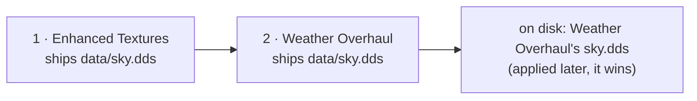

# Activation order

Two active mods that ship the same file do not merge: BMM copies files, so one of them is what the
game reads. Which one is decided by a single list per profile, the **activation order**: mods are
applied from the first to the last, and **the last one that ships a file wins it**.

---

## The model

The order is the profile's `active_mods` list. There is no second list and no priority number:

- position 0 is applied first, the last position is applied last and wins every file it shares;
- enabling a mod appends it at the end, which is why "the mod you enabled last wins" until you
  reorder;
- disabling a mod removes it from the list; enabling it again puts it back at the end.

Nothing had to be migrated when the order became editable. A profile's list was already the order
its mods had been enabled in, which is exactly what was on disk, so an existing profile opens with
its current order and nothing changes for somebody who never touches it.

---

## Changing it

Open the order from a profile card (the list icon), from the conflict window (**Open the
activation order**) or from the command palette (`Ctrl+K` → **Activation order**).

| To | Do |
|---|---|
| Move a mod | Drag its row, or select it and press `Alt+↑` / `Alt+↓` |
| Send it to the top or the bottom | The arrow buttons on the row, or `Alt+Home` / `Alt+End` |
| Start from a sensible order | **Sort**: by name, or by install date (oldest first puts newer mods on top) |
| Write it to the game | **Apply order** (`Ctrl+Enter`) |
| Throw the draft away | **Reset** |

Every shortcut is a command of the palette, listed and rebindable in Settings → Keyboard shortcuts;
they only act while the order view is open.

Each row says what it does to the others — *Overrides 12 file(s) from X*, *3 file(s) overridden by
Y* — and follows the draft as you drag, before anything is written. The footer counts the files that
would change hands.

---

## What "Apply order" writes

The new order is saved, then **only the files whose winner changed** are copied again, from their
new winner. A file two mods share whose winner is the same in both orders is not rewritten, and a
file only one mod ships is never touched.

The copy is a deploy like any other: it runs under the resource governor (a Deploy ticket, the
disk's speed rule, a cancel that stops between files) and one mod operation at a time.

If it fails half-way — a cancel, a file locked by the running game — the order is still saved and
the game folder is behind it. **Re-apply** copies the winner of every shared file again, which is
also the repair after anything edited the game folder by hand.

---

## Disabling follows the order

When a mod is disabled, each file it shipped is put back from the mod **directly under it** in the
order that ships the same file; if none does, from the game's original backup; and if the game never
had the file, it is removed. See [Conflicts](doc-page:how-it-works/conflicts) for the backup rule.

Archived mods (kept as a `.zip` in the mods folder) are providers like any other: their files are
read from the extracted cache when they have to come back.

!!! note "Two bugs this page used to hide"
    Before the order became editable, disabling a mod restored the **oldest** copy of a shared file
    rather than the one directly underneath (the fallback list was built newest-first and then read
    backwards), and an archived mod was never used as a fallback at all. Both are fixed and covered
    by tests that deploy real files.

---

## Modpacks

A modpack's list is an order too — the arrows in the modpack editor change it. When a pack is
applied, its mods are enabled and then placed **on top** of the profile's order, as one block in the
pack's sequence: the pack wins the files it shares with what the profile already had, the way it was
built. Nothing else in the profile moves.

---

## From scripts and tools

| Surface | Read | Write |
|---|---|---|
| Local API | `GET /api/mods/order` | `POST /api/mods/order` with `order[]`, `profileId`, `reapply` |
| MCP | `bmm_get_mod_order` | `bmm_set_mod_order` |
| CLI | `bmm mod-order` | `bmm mod-order --set a,b,c`, `bmm mod-order --reapply` |

A new order must contain exactly the active mods: a list with one missing or one extra is refused,
because applying it would leave files in the game that nothing claims.
