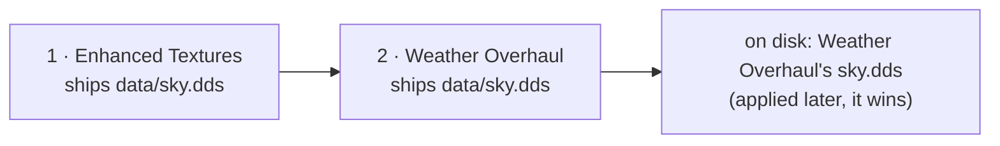

# Activation order

Two active mods that ship the same file do not merge: BMM copies files, so one of them is what the
game reads. Which one is decided by a single list per profile, the **activation order**: mods are
applied from the first to the last, and **the last one that ships a file wins it**.

---

## The model

The order is the profile's `active_mods` list. There is no second list and no priority number:

- position 0 is applied first, the last position is applied last and wins every file it shares;
- enabling a mod appends it at the end, which is why "the mod you enabled last wins" until you
  reorder;
- disabling a mod removes it from the list; enabling it again puts it back at the end.

Nothing had to be migrated when the order became editable. A profile's list was already the order
its mods had been enabled in, which is exactly what was on disk, so an existing profile opens with
its current order and nothing changes for somebody who never touches it.

---

## Changing it

Open the order from a profile card (the list icon), from the conflict window (**Open the
activation order**) or from the command palette (`Ctrl+K` → **Activation order**).

| To | Do |
|---|---|
| Move a mod | Drag its row, or select it and press `Alt+↑` / `Alt+↓` |
| Send it to the top or the bottom | The arrow buttons on the row, or `Alt+Home` / `Alt+End` |
| Start from a sensible order | **Sort**: by name, or by install date (oldest first puts newer mods on top) |
| Write it to the game | **Apply order** (`Ctrl+Enter`) |
| Throw the draft away | **Reset** |

Every shortcut is a command of the palette, listed and rebindable in Settings → Keyboard shortcuts;
they only act while the order view is open.

Each row says what it does to the others — *Overrides 12 file(s) from X*, *3 file(s) overridden by
Y* — and follows the draft as you drag, before anything is written. The footer counts the files that
would change hands.

---

## From the Mod Library

You do not have to leave the library to see or change the order of the profile it shows:

| Where | What you get |
|---|---|
| The list icon next to the sort menu | The full order view above, for the library's profile |
| A mod's detail panel | An **Activation order** box: its position (*Position 3 of 12*), whom it overrides and who overrides it, and Top / Up / Down / Bottom |
| Right-click on a mod card | The same four moves, and **Open the full order** |
| `Alt+↑` / `Alt+↓` / `Alt+Home` / `Alt+End` | Move the selected mod (library commands, rebindable like the others) |

A move made from the library is applied at once: there is no draft, the new order is saved and only
the files that change hands are copied again, exactly as **Apply order** does. The `#N` badge on
each active card is its position, and the **Activation Order** sort lists the library in that
order. A disabled mod has no position: enable it first, it joins at the end.

---

## What "Apply order" writes

The new order is saved, then **only the files whose winner changed** are copied again, from their
new winner. A file two mods share whose winner is the same in both orders is not rewritten, and a
file only one mod ships is never touched.

The copy is a deploy like any other: it runs under the resource governor (a Deploy ticket, the
disk's speed rule, a cancel that stops between files) and one mod operation at a time.

If it fails half-way — a cancel, a file locked by the running game — the order is still saved and
the game folder is behind it. **Re-apply** copies the winner of every shared file again, which is
also the repair after anything edited the game folder by hand.

---

## Disabling follows the order

When a mod is disabled, each file it shipped is put back from the mod **directly under it** in the
order that ships the same file; if none does, from the game's original backup; and if the game never
had the file, it is removed. See [Conflicts](doc-page:how-it-works/conflicts) for the backup rule.

Archived mods (kept as a `.zip` in the mods folder) are providers like any other: their files are
read from the extracted cache when they have to come back.

!!! note "Two bugs this page used to hide"
    Before the order became editable, disabling a mod restored the **oldest** copy of a shared file
    rather than the one directly underneath (the fallback list was built newest-first and then read
    backwards), and an archived mod was never used as a fallback at all. Both are fixed and covered
    by tests that deploy real files.

---

## When several mods turn on at once

A modpack, **Enable all**, a `.mm` mod list, a scheduled task, a BMMScript and a
`bmm://modpack/enable` link all end the same way: once their mods are on, one engine places them in
the order. It has three modes.

| Mode | In the app | What happens |
|---|---|---|
| `top` | **They win (placed last)** | The block goes after everything already active, in its own order: it wins what it shares. The default, and what modpacks always did. |
| `bottom` | **Yours win (placed first)** | The block goes before everything already active: the mods you had keep winning. |
| `keep` | **Nothing moves** | Mods already active keep their place; newly enabled ones stay where enabling put them, at the end. |

What counts as the block depends on who asks:

- a **modpack** places all its mods, in the pack's sequence (the arrows in its editor);
- **Enable all** and a **mod list** place only the mods they turned on, so a careful order is never
  reshuffled by a button that meant "turn the rest on".

Which mode applies:

1. the one the caller names: a task step's **Activation order** field, `placement:` in BMMScript,
   `order=` on a `bmm://modpack/enable` link, `order_mode` in the API;
2. otherwise the modpack's own **Activation order** (modpack editor), which travels with the pack
   (`.bmp` export, `.mm` lists, repos);
3. otherwise the default, **Bulk enable** in the order view (setting `order_bulk_mode`, `top` when
   never set).

Only the files that change hands are copied again, as with **Apply order**.

---

## Sharing an order

An id is what *this* machine calls a mod, and a path is only true here. A shared order names each
mod by what survives the trip: its content fingerprint, its repo id, its name and version (and the
local id, for a round trip on the same PC).

**Share** in the order view gives the same order four ways:

| Form | Looks like | For |
|---|---|---|
| Code | `BMMORDER1.eyJmb3Jt…` | a chat message: one line |
| Link | `bmm://order?d=BMMORDER1.…` | a click opens the import preview in BMM |
| List | `1. Enhanced Textures`, `2. Weather Overhaul` | a forum post; anyone can read it |
| File | `activation-order.json` | keeping it next to a pack |

**Import** reads any of them, a `.mm` list pasted whole, or a plain list of names (one per line;
`1.` and `-` bullets are fine). Each entry is matched by the strongest identity it has: local id,
then fingerprint, then repo id, then the name when exactly one mod has it (the version decides
between two of the same name). The preview then says:

- where each active mod lands, and by how many places it moves;
- how many files would change winner;
- what is **not installed** and what is **installed but not active**: an import never enables or
  disables anything, so enable those first if you want them placed;
- which active mods the list does not know: they **keep their place**.

The result becomes the view's draft. Nothing is written until **Apply order**. A `bmm://order` link
from a web page is safe for the same reason: it only fills the preview.

A `.mm` list carries its author's order (`load_order`, the mods it names). Applying the list
(scheduled **Apply a mod list**, **Import a file** with apply) places the mods it enabled by the
mode, then puts the ones it names in the author's order, unless the mode is `keep`.

---

## Kept with your data

The order is the profile's `active_mods`, so an app data export, an automatic export and a full
backup (`.databmm`) keep every profile's order, and restoring them brings it back. Switching
profiles changes nothing: each profile has its own order.

---

## From scripts and tools

| Surface | Read | Write |
|---|---|---|
| Local API | `GET /api/mods/order`, `GET /api/mods/order/export`, `GET /api/mods/order/mode` | `POST /api/mods/order` (`order[]`, `profileId`, `reapply`), `POST /api/mods/order/import` (`text`, `dryRun`), `POST /api/mods/order/arrange` (`ids[]`, `mode`), `POST /api/mods/order/mode` |
| MCP | `bmm_get_mod_order`, `bmm_export_mod_order` | `bmm_set_mod_order`, `bmm_import_mod_order`, `bmm_arrange_mod_order`, `bmm_order_bulk_mode` |
| CLI | `bmm mod-order`, `bmm mod-order --export [code, link, text or json]`, `bmm mod-order --bulk-mode` | `bmm mod-order --set a,b,c`, `--reapply`, `--import <code, link, file or ->` (`--dry-run`), `--arrange a,b --mode bottom`, `--mode keep` |
| Tasks, BMMScript | | `mods.order`, and `placement` on `modpack.enable`, `mods.enableAll`, `modlist.apply` |

A new order must contain exactly the active mods: a list with one missing or one extra is refused,
because applying it would leave files in the game that nothing claims. Import and arrange cannot
break that rule: they only move mods that are already active.
