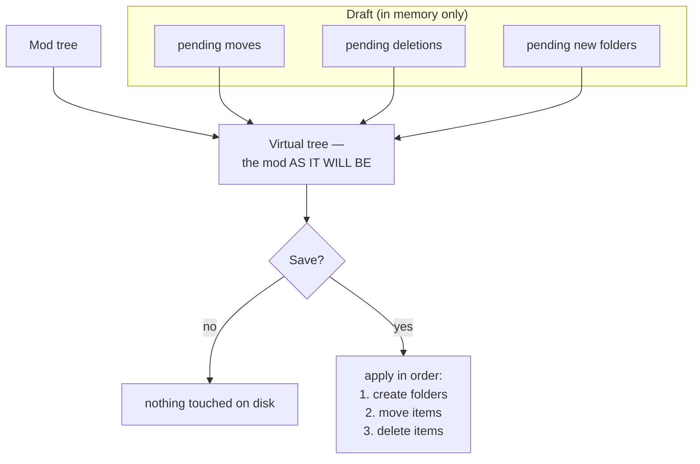

# The mapper


BMM deploys a mod by mirroring its folder tree into the game. That only works if the mod *has* the
right tree. Plenty of downloads don't — the author zipped from the wrong folder, or dumped loose files
at the root. The mapper fixes that.

---

## The expected shape

A stored mod must contain the full path the game expects, starting from the game root. For example:

```
\HD Texture Pack
   |_ Data
        |_ Textures
             |_ HD Texture Pack
```

`HD Texture Pack` is the mod; everything under it is the exact tree the files must land in. The folder
names here (`Data`, `Textures`, …) are just an example — use whatever path **your** game reads from.

Deployment is a plain mirror: for every file in the mod folder, copy it to the same relative path under
the destination folder. There is no clever matching step. That is why the shape has to be right *in the mod
folder*, and it is exactly what the mapper is for.

---

## What the mapper actually does

!!! warning "It rewrites the mod folder — it is not a mapping table applied at deploy time"

    This is worth being clear about, because the name suggests otherwise. The mapper does not store a
    "from → to" table that gets replayed each time you enable the mod. When you save, it **physically
    restructures the mod folder on disk**: it creates folders, moves items, and deletes what you marked.
    After saving, the mod folder simply *has* the right shape, and deployment is the same plain mirror
    it always was.

That has consequences worth planning around:

- **A new version of the mod has to be re-mapped.** Nothing is remembered to replay against a fresh
  download with the same wrong layout.
- **The mod's `content_id` changes.** That identifier is a fingerprint of sorted (relative path, size)
  pairs, so moving files changes it — unless the mod ships a `bmm.json` with an explicit `id`, which
  takes priority. If you care about a mod keeping the same cross-machine identity through a
  restructure, give it a `bmm.json` id. See [Integrity & hashing](doc-page:how-it-works/integrity-hashing).
- **Its integrity baseline no longer matches.** The next check will report the moved files as
  `missing` + `added`. Re-establish the baseline after mapping.

---

## Draft mode: nothing happens until you save

The mapper is built around a staging area, so you can restructure a messy mod in a dozen steps and see
the result before a single file moves.



The left pane always renders the **virtual tree** — your pending changes composed on top of the real
one — so what you see is the mod as it *will be*, not as it is. The Save button only appears once there
is something staged.

The commit order matters and is fixed: **new folders first** (so a move can target one), **then moves**,
**then deletions** (so you can't delete something a pending move still needs).

!!! note "A failed save can leave a partial result"

    The three phases run as a sequence of individual operations, not as a transaction. If one fails —
    a locked file, a permission error — the ones already done stay done, and you get the error. The
    tree is then re-read from disk, so what you see afterwards is the truth; re-stage what is left.

---

## Working the two panes

| | |
|---|---|
| **Left** | the mod's tree (virtual — includes your pending changes) |
| **Right** | the game's tree, so you can see the destination you're aiming at |

- **Select** items on the left — multi-select, plus a "select the mod root" action that grabs every
  top-level item so you can dump a whole badly-packed mod into one destination folder at once.
- **Move** by choosing a target folder on the right. With nothing selected, the action falls back to
  moving the mod root — which is the common case: "put all of this under `Data/Textures/`".
- **Filter** either tree by name when a mod has hundreds of files.
- **Right-click** for the per-item actions (new folder, rename, delete).
- **Expand all** is cancellable: collapsing while a large expand is still running stops it, so a mod
  with a deep tree can't lock the pane.

Both trees are cached and only re-read when the profile, the game path, or the mod folder actually
changes — so switching back and forth between mods is cheap.

---

## Before you start: the diagnostic

The user-facing [Mapper](doc-page:features/mapper) page covers the **Structure Diagnostic**, which
compares the mod's tree against the game's and tells you what the final deployed path *would* be. Run
it first. It answers the question that actually matters — "will the game find this?" — before you move
anything, and it is faster than reasoning about the trees by eye.

!!! info "See it in the app"
    Help & other → Developer → **Mod mapper**; the **Mapper** tutorial. And the user guide's
    [Mapper](doc-page:features/mapper) page for the hands-on walkthrough.
