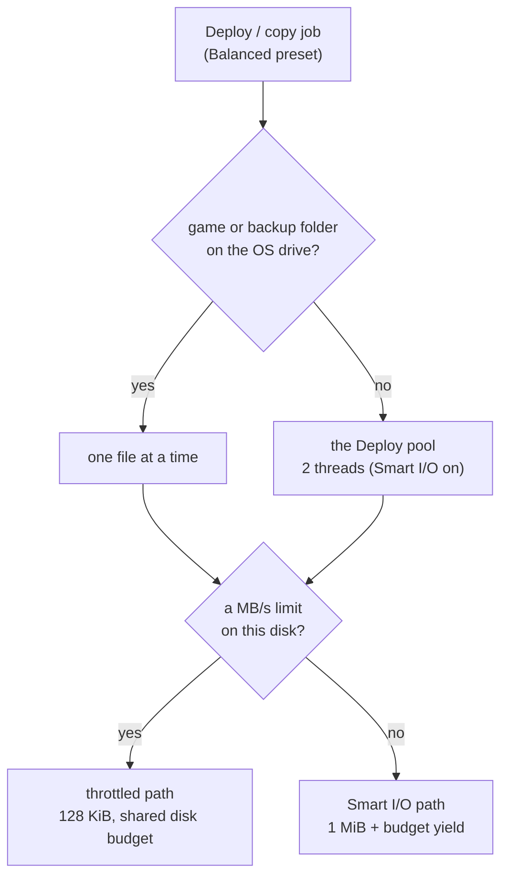
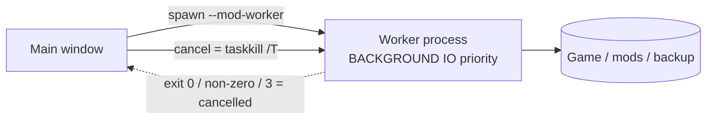

# Performance

Modding means moving a lot of bytes. BMM's job is to do that fast **and** keep your machine usable
while it happens — and when those two fight, **responsiveness wins**. Almost every number on this
page is a deliberate sacrifice of peak throughput to avoid a frozen window.

---

## The three copy paths

Every mod file copy goes through the [resource governor](doc-page:how-it-works/resources), and under the default
**Balanced** preset it takes exactly one of three routes, picked per call:

| Path | When | How |
|---|---|---|
| **Throttled** | the disk being written to has a MB/s limit | 128 KiB chunks, drawing on **one speed budget per disk** shared by every copy to it |
| **Smart I/O** | Smart I/O is on, no limit | 1 MiB chunks, a 150 µs yield on a **16 MiB byte budget** |
| **Full speed** | Smart I/O off, no limit | plain `std::fs::copy` — the OS does it all |

The Smart I/O numbers were measured, not guessed: the older loop, 256 KB chunks with a sleep after
every one, cost about 37% against a full-speed copy, and budgeting the yield recovered most of it
while keeping the window responsive.

The limit used to be paced by each copy on its own, so two copy threads wrote a 40 MB/s disk at
80 MB/s. The per-disk budget is what makes the number mean what it says. The other presets change
the buffer, the pause and the parallelism: see [Presets](doc-page:how-it-works/resources#presets).

!!! warning "BMM never hard-links or symlinks"

    Some managers deploy by linking files instead of copying them. BMM does **not** — there is no
    `hard_link` or symlink anywhere in the deploy path. Every enabled file is a real copy in your
    destination folder. That costs disk space, and it is what makes a BMM-managed destination folder work with any
    tool that doesn't understand links, survive a mods folder living on another drive, and stay
    intact if BMM is uninstalled.

---

## Never saturate the machine

Under Balanced, a deploy copies on **2 threads**, so file copies never saturate every CPU core,
which is what freezes a window into *Not responding*. And if either the destination folder or the
backup folder lives on the OS drive, it copies **one file at a time**, so Windows itself stays
responsive during a big mod copy. **Quiet** copies one file at a time everywhere; **Everything for
BMM** lifts both caps, except on a hard disk.

The thread pools are capped too, each for its own reason:

| Pool | Size | Why |
|---|---|---|
| Global rayon | capped, 512 KB stacks | *"Prevent Rayon from hogging 100% CPU and lagging the OS"* — BMM's parallel work never recurses deep, saving ~7 MB of committed RSS per thread |
| One per kind of work (governor) | under Balanced: hashing ≤ 4 (about half your cores), deploy 2, extract and compress the size of the global pool | Each kind gets its own, sized by the preset, so a hash job and a deploy never fight over one pool. BLAKE3 alone is fast enough to eat every core — see [Integrity & hashing](doc-page:how-it-works/integrity-hashing) |

The allocator is swapped too: **mimalloc** instead of Windows' default HeapAlloc, for a *"30–60%
smaller process working set, plus much less fragmentation"* — BMM allocates and frees a great many
small strings (paths, hash entries) during normal use.

---

## Getting the heavy work out of the window

Big applies and unapplies do not run in the app at all. They run in a **separate process** — the
same executable re-invoked as `--mod-worker IN OUT`, which short-circuits *"without booting Tauri,
WebView2, or anything else"*. Three things follow:

- It self-demotes to Windows **BACKGROUND IO priority**, so *"the kernel keeps disk bandwidth
  available for the UI process"*.
- Cancelling is a `taskkill /T` of the worker PID — *"instant and reliable, no matter how stuck the
  IO is"* — instead of waiting for a blocking call to return.
- Cancelling a cancellable worker also spawns *"an inverse-op undo subprocess so any partial writes
  are reverted"*. A cancelled deploy does not leave half a mod in your destination folder.

The worker is a separate process with its own governor, so the app hands it its resources
document: it copies under the same preset and the same per-disk limits as the app would.

Inside the app, a copy checks its governor ticket between chunks, so the user's cancel click
interrupts a big mod copy almost at once instead of waiting for the whole file to finish, and the
half-written file is removed. One global lock still means **one mod operation at a time** — no two
applies racing on the same destination folder.

---

## Locks are held for metadata, never for I/O

The rule stated all over the code: collect what you need under the lock, then let go before doing
anything slow.

> *"Release every lock BEFORE hashing so no other command blocks while we read file contents (this
> is what used to freeze the UI on big mods)."*

> *"We do NOT hash them here (that would run under 4 held locks and could freeze the UI on a big
> mod); we record them and hash AFTER the locks are released."*

The pattern has a name in the codebase — a snapshot struct: *"Lightweight snapshot of a mod's
fields — collected while holding the lock, then used after releasing it so the heavy file I/O never
blocks AppState."*

---

## What used to be slow — and what fixed it

Each of these is a real regression that was found and fixed, with the cause on record:

| Was slow | Cause | Fix |
|---|---|---|
| Every refresh / import | The UI called one conflict command **per mod** — *"hundreds of IPC round-trips + lock acquisitions on every refresh/import — the main source of UI lag"* | One batched call |
| Startup with archived mods | A big `.zip` was extracted **under the lock** | Archives are listed from their index instead; nothing is extracted |
| Scanning | Re-hashing ran synchronously | A throttled background queue hashes *"one mod at a time, on the capped hash pool, with a pause between each"* |
| Logging | `log_line` re-derived its path every call — *"the hottest path in the app"* | The path is cached |
| An unplugged drive | Listed zero files and re-queued pointless work | *"Keep whatever we already had and retry when the drive is back — don't churn state offline"* |
| `.zip` extraction | DEFLATE is CPU-bound and was *"the app's slowest hot-path operation when serial"* | Parallel across cores, one archive handle **per worker thread** (not per entry), so the central directory is parsed ~once per core |

!!! note "One optimisation was rejected, and the reason is in the code"

    > *"zlib-ng (the 2-3x SIMD backend) needs cmake to build libz-ng-sys, which can't target the
    > installed VS 2026 toolchain — so it is intentionally NOT used."*

    Worth knowing if you ever wonder why zip extraction isn't faster still.

---

## Nothing large passes through memory

The same discipline applies to bytes arriving from the network or leaving for an archive: they are
**streamed**, never buffered whole. That was not always true, and the failures were all the same
shape — peak memory equal to whatever the payload happened to be, with no cap and no size check:

| Path | Now |
|---|---|
| Adding a mod from a URL | Streams to a `.part`, sniffs the zip magic from the file, extracts through a reader. It used to buffer the whole mod **and keep that buffer alive** while extracting from a cursor over it |
| Repo sync, archived mod | Streams. The per-file path already did; the archive path — routinely the largest thing a sync moves — did not |
| App catalog install | Hashes incrementally while streaming, then renames after the SHA-256 gate |
| Modpack import | Streams to the temp zip it was always going to write anyway |
| Zip export | Copies each entry through a reader instead of reading whole files into memory |
| Session recording | Spooled to disk as it happens; the `.bmmreplay` is assembled by streaming (see [Privacy & telemetry](doc-page:features/privacy-telemetry)) |

The rule to keep: if the destination is a file, write to the file. A buffer in between buys nothing
and turns a large input into an out-of-memory crash.

## The WebView2 diet

Before the webview even starts, features BMM doesn't use are switched off — *"Cuts ~50-150MB off the
WebView2 footprint: AudioServiceOutOfProcess… extensions / background pages… Translate / sync /
default apps… background-networking… renderer-process-limit=2"*. The DevTools window is closable for
the same reason: it is *"the ~480 MB msedgewebview2 'DevTools' process"*, so it only costs you while
it's open.

---

## Measure it on your own hardware

BMM ships a real benchmark suite rather than asking you to trust these numbers. It measures the
things BMM actually does — **scan** a folder, **hash** content (BLAKE3), **copy / deploy**, and
**extract** an archive — plus an explicit *"Integrity verification (BLAKE3)"* workload that
*"re-hashes every file and compares it against the stored baseline"*, which is the check that
detects a tampered or corrupt mod.

Results stay local. You can also drive a benchmark from the [scheduler](doc-page:features/scheduler)
and branch on the result — measure a disk, and if it comes back under 50 MB/s, apply a cap or warn
yourself. See the [Action reference](doc-page:reference/actions).

!!! info "See it in the app"
    Help & other → Developer → **Disk I/O limiter**, **Engine & threads**, **BLAKE3 hashing**,
    **Lightweight architecture**.
