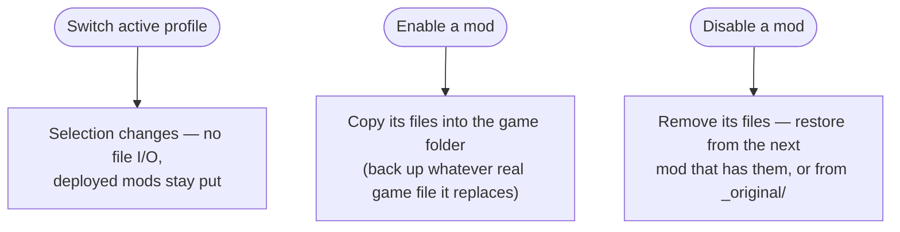
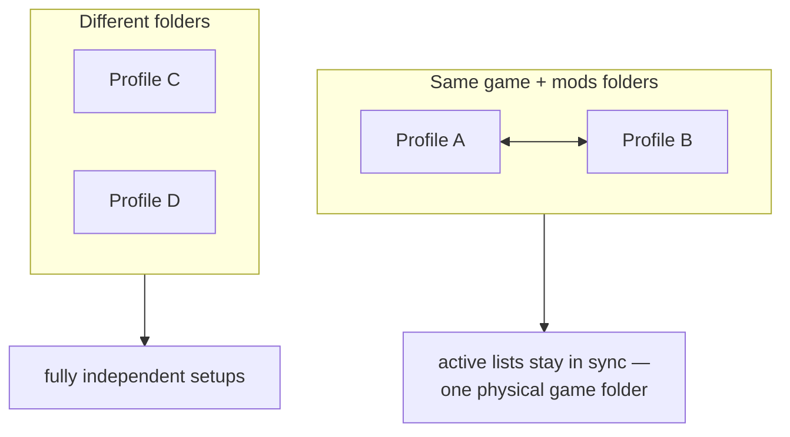
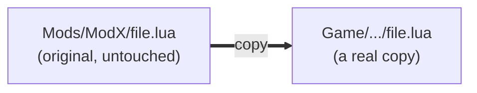

# Profiles & activation

A profile is a small record — a name, **three folders**, and an **ordered list of which mods are on**.
It stores no mod files itself. That's why you can have a dozen profiles and they cost almost nothing.

---

## The three folders

| Folder | What lives there |
|---|---|
| **Game** | where mods get deployed — the game's own tree |
| **Mods** | your library for this profile: one folder (or archive) per mod |
| **Backup** | the profile's `_original/` store, holding game files a mod replaced |

These are **absolute paths**, and they are what identifies a profile in practice. Two consequences
worth knowing up front:

- A mod belongs to a profile **by path prefix**, not by a stored id — a mod is "in" a profile when its
  folder sits under that profile's mods folder. Move a mod folder elsewhere and it leaves the profile.
- Because the paths are absolute, a drive letter that changes (`E:\Mods` → `F:\Mods`) has to be fixed
  by hand. See [Scanning & the cache](doc-page:scanning-cache) for what happens while the drive is away.

---

## Switching a profile vs. enabling a mod

Two actions are easy to confuse, and only one of them touches your files:

- **Switching the active profile** just changes *which profile you're working in*. It moves **no
  files** — whatever is already deployed in the game folder stays exactly where it is. The active
  profile is a single selection pointer, nothing more.
- **Enabling or disabling a mod** is the only thing that touches the game folder.

!!! warning "This is the single biggest source of confusion"

    Switching profiles does **not** swap your loadout. If profile A had ten mods deployed and you
    switch to profile B, those ten files are still in the game folder. What changes is which list BMM
    is now editing. To actually change what the game sees, you enable and disable.

---

## Profiles that share folders mirror each other

Enabled state is reconciled across profiles that point at the **same game folder and the same mods
folder**: enabling or disabling in one updates the others' active lists too. A mod cannot be enabled
in two of them at once, because there is only one game folder underneath and only one file can be at a
given path.

There is a related detail in the backup logic: when deciding whether a file it is about to overwrite
is a *genuine game file*, BMM looks at the mods enabled in **every profile sharing that game folder** —
not just the active one. Otherwise switching profiles could make it mistake another profile's mod file
for an original and back it up as one. See [Conflicts](doc-page:conflicts) for the full backup rule.

**So: to keep genuinely separate loadouts, give each profile its own mods folder.** Sharing folders is
supported, but it is one setup with several views, not two setups.

---

## Non-destructive by construction

Deploying never *moves* your originals out of the mods folder — it copies them into the game folder.
Your library keeps its pristine copy, always.

!!! warning "There are no hard-links or symlinks anywhere"

    Some managers deploy by linking. BMM does not — every deployed file is a **real copy**. So a
    deploy costs real disk space, and "disable" is a real delete-and-restore, not an unlink. The
    upside is that the game folder is plain files: it works with tools that don't understand links,
    it survives the mods folder living on another drive, and it stays intact if you uninstall BMM.

"Uninstall from a profile" is therefore "remove the deployed copies and put back what was underneath"
— the mod stays on the shelf in your mods folder, ready for another profile. The delete newcomers fear
really is an undo.

---

## What happens if an activation is interrupted

Be precise here, because it matters:

| Interruption | What happens |
|---|---|
| **You click cancel** | The worker process is killed with `taskkill /T`, then BMM spawns *"an inverse-op undo subprocess so any partial writes are reverted"*. A cancelled deploy does not leave half a mod behind |
| **BMM is force-quit, or the machine loses power mid-copy** | There is **no journal, so there is no automatic rollback.** The game folder can hold a partial deploy |

The second case is survivable rather than transactional, and the reason is the backup rule: the
`_original/` copies are written **before** the game file is overwritten. So your game's own files are
never the thing at risk — the worst case is a mod that is half-deployed. Re-enabling it completes the
copy (every copy force-overwrites), and disabling it cleans up using the union of *recorded* and
*currently present* files, so the partial state is fully removed either way.

One more guard: a single global lock means **one mod operation at a time**. Two applies can never race
on the same game folder, so a partial state can only ever come from one interrupted operation, never
from two half-finished ones interleaved.

---

## Activation order is the whole conflict story

Because `active_mods` is an **ordered** list and deployment walks it in order, the mod you enable last
wins any shared file. That is the entire conflict-resolution model — there is no priority tree. See
[Conflicts](doc-page:conflicts).

!!! info "See it in the app"
    Help & other → Developer → **Profile system**, and the **Profiles** tutorial.
