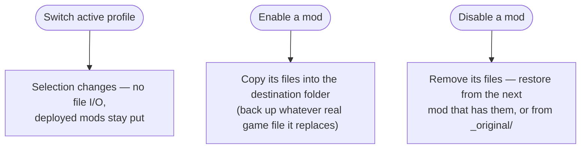
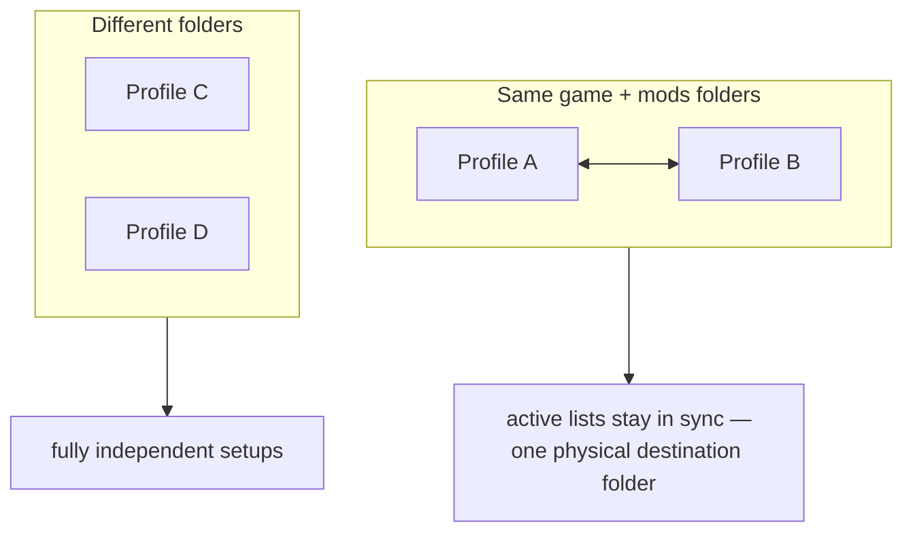
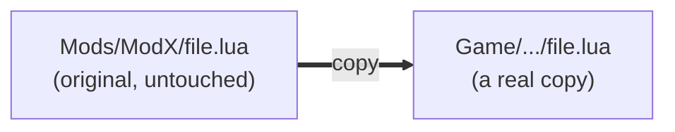

# Profiles & activation


A profile is a small record — a name, **three folders**, and an **ordered list of which mods are on**.
It stores no mod files itself. That's why you can have a dozen profiles and they cost almost nothing.

---

## The three folders

| Folder | What lives there |
|---|---|
| **Game** | where mods get deployed — the game's own tree |
| **Mods** | your library for this profile: one folder (or archive) per mod |
| **Backup** | the profile's `_original/` store, holding game files a mod replaced |

These are **absolute paths**, and they are what identifies a profile in practice. Two consequences
worth knowing up front:

- A mod belongs to a profile **by path prefix**, not by a stored id — a mod is "in" a profile when its
  folder sits under that profile's mods folder. Move a mod folder elsewhere and it leaves the profile.
- Because the paths are absolute, a drive letter that changes (`E:\Mods` → `F:\Mods`) has to be fixed
  by hand. See [Scanning & the cache](doc-page:how-it-works/scanning-cache) for what happens while the drive is away.

---

## Switching a profile vs. enabling a mod

Two actions are easy to confuse, and only one of them touches your files:

- **Switching the active profile** just changes *which profile you're working in*. It moves **no
  files** — whatever is already deployed in the destination folder stays exactly where it is. The active
  profile is a single selection pointer, nothing more.
- **Enabling or disabling a mod** is the only thing that touches the destination folder.


```mermaid
flowchart TB
    SW([Switch active profile]) --> PTR["Selection changes — no file I/O,<br/>deployed mods stay put"]
    EN([Enable a mod]) --> DEPLOY["Copy its files into the destination folder<br/>(back up whatever real game file it replaces)"]
    DIS([Disable a mod]) --> REMOVE["Remove its files — restore from the next<br/>mod that has them, or from _original/"]
```

!!! warning "This is the single biggest source of confusion"

    Switching profiles does **not** swap your loadout. If profile A had ten mods deployed and you
    switch to profile B, those ten files are still in the destination folder. What changes is which list BMM
    is now editing. To actually change what the game sees, you enable and disable.

---

## Profiles that share folders mirror each other

Enabled state is reconciled across profiles that point at the **same destination folder and the same mods
folder**: enabling or disabling in one updates the others' active lists too. A mod cannot be enabled
in two of them at once, because there is only one destination folder underneath and only one file can be at a
given path.


```mermaid
flowchart TB
    subgraph Same["Same game + mods folders"]
        P1["Profile A"] <--> P2["Profile B"]
    end
    subgraph Sep["Different folders"]
        P3["Profile C"]
        P4["Profile D"]
    end
    Same --> NOTE["active lists stay in sync —<br/>one physical destination folder"]
    Sep --> NOTE2["fully independent setups"]
```

There is a related detail in the backup logic: when deciding whether a file it is about to overwrite
is a *genuine game file*, BMM looks at the mods enabled in **every profile sharing that destination folder** —
not just the active one. Otherwise switching profiles could make it mistake another profile's mod file
for an original and back it up as one. See [Conflicts](doc-page:how-it-works/conflicts) for the full backup rule.

**So: to keep genuinely separate loadouts, give each profile its own mods folder.** Sharing folders is
supported, but it is one setup with several views, not two setups.

---

## Non-destructive by construction

Deploying never *moves* your originals out of the mods folder — it copies them into the destination folder.
Your library keeps its pristine copy, always.


```mermaid
flowchart LR
    LIBFILE["Mods/ModX/file.lua<br/>(original, untouched)"]
    GAMEFILE["Game/.../file.lua<br/>(a real copy)"]
    LIBFILE == "copy" ==> GAMEFILE
```

!!! warning "There are no hard-links or symlinks anywhere"

    Some managers deploy by linking. BMM does not — every deployed file is a **real copy**. So a
    deploy costs real disk space, and "disable" is a real delete-and-restore, not an unlink. The
    upside is that the destination folder is plain files: it works with tools that don't understand links,
    it survives the mods folder living on another drive, and it stays intact if you uninstall BMM.

"Uninstall from a profile" is therefore "remove the deployed copies and put back what was underneath"
— the mod stays on the shelf in your mods folder, ready for another profile. The delete newcomers fear
really is an undo.

---

## What happens if an activation is interrupted

Be precise here, because it matters:

| Interruption | What happens |
|---|---|
| **You click cancel** | The worker process is killed with `taskkill /T`, then BMM spawns *"an inverse-op undo subprocess so any partial writes are reverted"*. A cancelled deploy does not leave half a mod behind |
| **BMM is force-quit, or the machine loses power mid-copy** | There is **no journal, so there is no automatic rollback.** The destination folder can hold a partial deploy |

The second case is survivable rather than transactional, and the reason is the backup rule: the
`_original/` copies are written **before** the game file is overwritten. So your game's own files are
never the thing at risk — the worst case is a mod that is half-deployed. Re-enabling it completes the
copy (every copy force-overwrites), and disabling it cleans up using the union of *recorded* and
*currently present* files, so the partial state is fully removed either way.

One more guard: a single global lock means **one mod operation at a time**. Two applies can never race
on the same destination folder, so a partial state can only ever come from one interrupted operation, never
from two half-finished ones interleaved.

---

## Activations are background jobs

Turning mods on or off is owned by the app, not by the screen that asked
(`frontend/src/core/activation-jobs.ts`). Jobs queue and run one after another; inside a mod the
copy is parallel under the [resource governor](doc-page:how-it-works/resources)'s Deploy rules. **Only an explicit
cancel stops a job**: changing view, closing a dialog or redrawing the Library never does. The
title-bar activity pill and the Library cards both draw from the same feed.

**Progress.** For every mod an enable or disable touches (dependencies included, whoever asked:
a card, *Enable all*, an order list, the scheduler), the backend emits `bmm://mod-op-progress`:
`{ mod_id, mod_name, op: "enable" | "disable", phase: "start" | "copy" | "done" | "failed" | "cancelled", bytes_done, bytes_total }`.
The copy itself runs in the worker process, which prints its byte count on a pipe; the parent
turns it into `copy` events, **at most 10 a second** and only when the count moved.

**Cancel semantics.** The mod in flight is undone (its worker is killed and the inverse
operation reverts the partial copy, as in the table above); mods already done stay done; mods
not reached are not started. Other queued jobs still run.

**One cancel token per job.** Every job sends its own scope with its calls (`cancelScope`); its
Stop is `cancel_mod_ops({ scope })` and its end `clear_mod_op_cancel({ scope })`. Neither touches
the backend's global flag, so one job finishing its cancel can no longer lower the Stop of
another batch running at the same moment (that is what the single shared flag used to do). A
global *Cancel all* still reaches every job that began before it, and none that begins after:
nobody has to lower anything before the next one (`CancelScope` in `src-tauri/src/fs_utils.rs`).

### For developers: `runActivationJob`

```ts
import { runActivationJob } from '../../core/activation-jobs.js';

const job = runActivationJob({
  mods: [{ id, name }, …],     // in order; duplicates are dropped
  mode: 'enable',              // or 'disable'
  profileId,                   // optional; must be the ACTIVE profile, else every item fails with actjob.errNotActive
  label: 'List « Survival »',  // what the pill and the end toast call it
  bypassSha: false,            // optional
  silent: false,               // true = no end toast (you report the result yourself)
  refreshAfter: true,          // re-read the Library once when the queue drains
  source: 'order-list',
});
const summary = await job.done;   // never rejects
// summary.items[i].phase: 'done' | 'failed' | 'cancelled'; .error (MISSING_SHA|…, CRITICAL_SPACE|…), .warning (WARNING_SPACE|…)
// summary.done / .failed / .cancelled / .wasCancelled
await job.cancel();               // the explicit stop
```

Also exported: `onActivationChange(fn)` (coalesced to a frame), `modActivity(modId)` (what a card
shows), `isActivationBusy()`, `cancelActivationJob(id)`, `cancelAllActivationJobs()`, and
`announceExternal(ids, op)` / `clearAnnounced(ids)` for a screen that runs its own backend batch
and wants its cards to show *Queued* until the backend reaches them.

A batch the **backend** runs as one command is a job too: `runActivationBatch({ mods, mode, label,
run: (scope) => invoke(…, { cancelScope: scope }), failToast })`. The order lists' *Activate* is
one (`order_list_activate`: one plan, the enables with their dependencies, one order commit): it
queues behind the other jobs, its mods move through the pill and the cards from the progress
events, its Stop cancels its scope only, its end toast is the job manager's, and closing the
dialog or leaving the view does not stop it. `run` returns `{ failed, cancelled, toast }`.

### What an activation no longer pays for

| Cost per mod (before) | Now |
|---|---|
| `enable_mod` invalidated the file cache, so the **next** enable rebuilt the whole file → mods index under the data lock | Not invalidated: the cache is each mod's file list, which enabling does not change |
| `data.json` written (pretty JSON, `.bak` roll, fsync) **while holding the data lock**: every other command waited | Serialised under the lock, written outside it; an ordering lock keeps an older snapshot from ever landing over a newer one |
| A dependency chain read the next mod's "other mods' files" from the file cache, which leaving the Library flushed: the next mod backed the previous one's copies up as game originals | Read from what the worker reports it wrote; and leaving the Library no longer flushes the cache while a job runs |
| An error on the 3rd mod of a chain returned before the save: the first two were deployed but not recorded until a later save | The save runs on every way out |
| A blocking spinner over each card for the whole operation (every card of an *Enable all*) | A state label and a thin bar on the card; each progress event touches that one card, never the list |

The per-mod save is kept on purpose: a crash between two mods of a batch must leave `data.json`
knowing what is in the game folder.

---

## Activation order is the whole conflict story

Because `active_mods` is an **ordered** list and deployment walks it in order, the mod you enable last
wins any shared file — until you reorder it in the [activation order](doc-page:how-it-works/load-order). That is the entire
conflict-resolution model — there is no priority tree. See
[Conflicts](doc-page:how-it-works/conflicts).

!!! info "See it in the app"
    Help & other → Developer → **Profile system**, and the **Profiles** tutorial.
