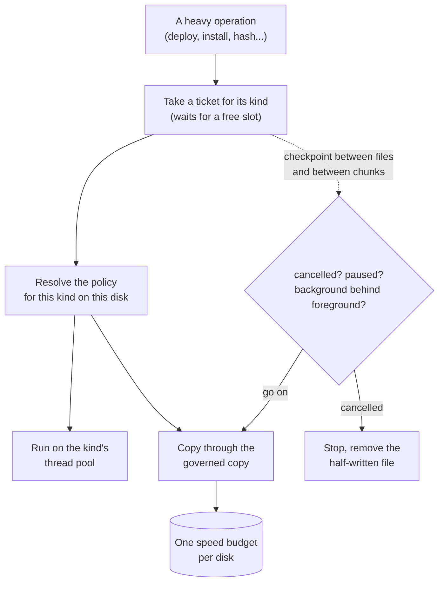
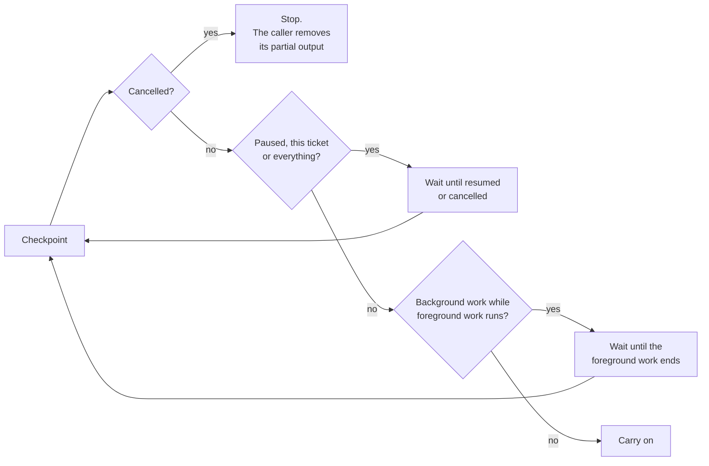
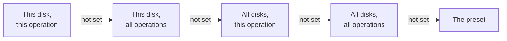
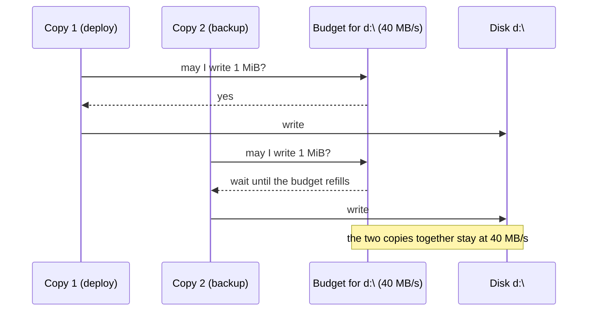
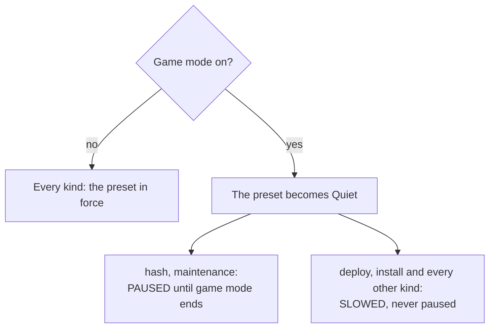
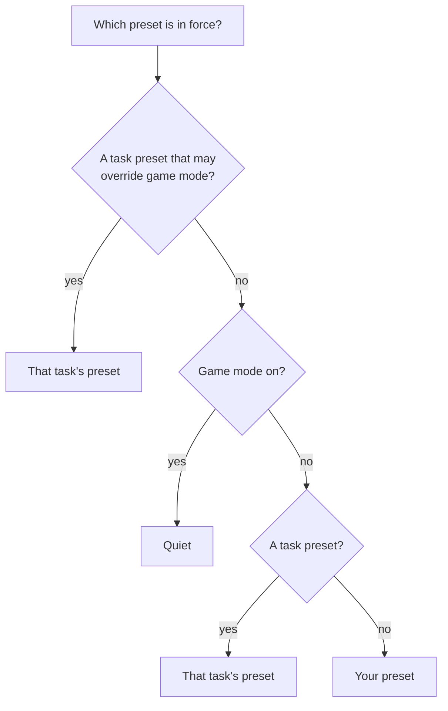
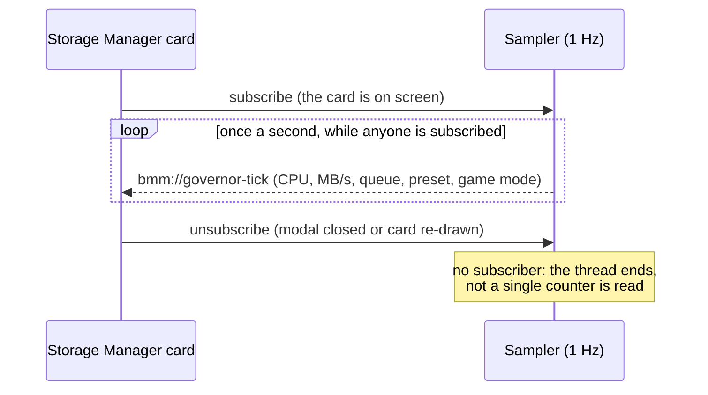

# The resource governor

Every heavy thing BMM does (enabling mods, installing, backing up originals, extracting and
compressing archives, scanning, hashing, downloading, cropping images, background maintenance)
asks one component for permission first: the **resource governor**. It decides how many of each
kind run at once, on how many threads, how fast they may write to each disk, and which ones step
aside when something more urgent starts.

Before it existed, each of those pieces set its own limits, and the limits did not add up. A disk
capped at 40 MB/s was written at 80 MB/s by two copy threads that each paced themselves. The
governor exists so that one number means one number.

!!! info "See it in the app"
    **Settings → Storage → Open Storage Manager.** The card at the top, *How hard BMM works*, is
    the governor: the preset, game mode, the live queue and, folded underneath, the per-disk rules.

---

## The shape of it

Three ideas carry the whole design:

- **A ticket per operation.** An operation takes a ticket for its kind before it starts and gives
  it back when it ends. The ticket is what the dashboard lists, what counts against the kind's
  slots, and what pause and cancel reach.
- **A policy per kind and per disk.** How fast, with what buffer, how many at once: resolved from
  the preset and your per-disk rules, then clamped into hard bounds nothing can cross.
- **A speed budget per disk.** A MB/s limit is a token bucket shared by every copy writing to that
  disk, so two parallel copies share the limit instead of doubling it.

The ten kinds are `deploy`, `install`, `backup`, `extract`, `compress`, `scan`, `hash`,
`download`, `image` and `maintenance`. They are the names the dashboard shows and the keys the
rules are stored under.

---

## Presets

A preset is a whole policy in one word. There are three to choose from, and a fourth that is not
a choice so much as a state:

| | **Quiet** (`silent`) | **Balanced** (`balanced`, the default) | **Everything for BMM** (`max`) |
|---|---|---|---|
| Operations of one kind at once | 1 | 2 | as many as its thread pool has threads (16 at most) |
| Threads per kind | 1 | 2 · hashing: half your cores, 1 to 4 · extract and compress: as many as BMM's general pool | every core but one |
| Deploy: one file at a time, or in parallel | one at a time | parallel, but one at a time when the game or backup folder is on the system drive | parallel, but one at a time on a hard disk |
| Copy buffer | 256 KiB | 1 MiB | 4 MiB |
| Short pause while copying | 150 µs every 16 MiB | 150 µs every 16 MiB | none |
| Folder walks (scans) | on one thread | as before | as before |

On a disk with a MB/s limit, Quiet and Balanced copy in 128 KiB chunks and let the limit do the
pacing, with no separate pause (unless a rule sets the buffer itself). That is the old throttled
path, kept as it was.

**Balanced is exactly what BMM did before the governor.** That is a test in the code, not a
promise: the default preset must reproduce the old copy rhythm, the old hash pool and the old
thread counts. Nobody's BMM changed speed on upgrade.

**Custom** (`custom`) means "my rules alone, on top of Balanced's values". The dashboard does not
offer it as a button; the API, the MCP server and the CLI accept it.

!!! note "Smart I/O still means something under Balanced"
    With **Smart I/O** off and Balanced chosen, BMM keeps its old full-speed path on a disk that
    has no MB/s limit: a plain operating-system copy on the general thread pool. Under any other
    preset the governor decides, whatever the Smart I/O switch says. See
    [Performance](doc-page:how-it-works/performance).

---

## Tickets, slots and checkpoints

Each kind has a number of **slots**. A ticket that finds its kind full waits; the dashboard shows
it as *waiting*. Kinds do not share slots: a hash job never waits for a deploy's slot.

While it runs, an operation calls a **checkpoint** between files, and the governed copy calls one
between chunks. A checkpoint asks three questions, in this order:

### Foreground and background

Two kinds are **foreground**: `deploy` and `install`, the work you are sitting in front of,
waiting for your game folder. Two are **background**: `hash` and `maintenance`, the work that can
finish a minute later. While any foreground ticket is running, background tickets hold at their
next checkpoint and pick up again when it ends. The other kinds are neither and are never held
this way.

A ticket taken inside another ticket of the same kind, on the same thread (an export that zips,
a sync that installs), takes no slot: under Quiet's single slot it would otherwise wait for
itself for ever. It is still listed, pausable and cancellable.

### Pause and cancel

Pause holds an operation at its next checkpoint; cancel makes that checkpoint fail, and a copy
cancelled mid-file deletes the half-written file. **Pause all** holds every ticket at once.

!!! warning "A deploy in the worker process can be cancelled, not paused"
    Big enables and disables run in a separate worker process
    ([Performance](doc-page:how-it-works/performance#getting-the-heavy-work-out-of-the-window)). The app holds the
    deploy ticket while the worker runs and watches it: cancelling that ticket stops the worker,
    exactly like the Cancel button does. The worker has no channel for a pause, so pausing that
    ticket changes its label and not the copy.

---

## Rules per disk, and where each value comes from

Under the preset sit your **rules**: a value for one disk and one kind of operation. Each field
(MB/s, how many at once, buffer, priority) is resolved on its own, from the most specific rule that
sets it:

Field by field means a rule that only sets *how many at once* for hashing on `D:` still inherits
the MB/s limit you gave the whole of `D:`. The advanced table shows, in grey in each empty cell,
the value in force and where it comes from (*this rule*, *this disk*, *all disks, this
operation*, *all disks*, *preset*), because a table of blank cells that nonetheless limits a
copy to 40 MB/s is a setting nobody can debug.

A disk is its lower-cased mount point (`d:\`), a network share (`\\nas\games\`), or `*` for all
disks. At most 64 disks can carry rules.

### What each column acts on

| Column | Acts on |
|---|---|
| **MB/s** | Copies BMM makes itself, for the disk being **written to**: deploying and restoring files, backing up originals, copying a mod folder in on install, and image copies |
| **Buffer KiB** | The same copies: the chunk size they read and write |
| **At once** | Deploys: when the value for the game folder's disk (Deploy) or for the backup folder's disk (Backup) is 1, a deploy copies one file at a time; above 1 it uses the Deploy thread pool, whose size the preset sets |
| **Priority** | Stored and resolved like the others, and shown in the table |

!!! warning "Two limits worth knowing before you fill the table in"
    Extracting, compressing, scanning, hashing and downloading do not copy through the governed
    copy. For those rows, a MB/s or buffer value is stored and displayed but slows nothing: what
    the governor controls for them is their slots, their thread pool and their checkpoints.

    The **Priority** column is not yet passed to Windows when BMM opens a file, in this version.
    Setting it to *low* changes the table, not the disk.

### The hard bounds

Whatever asks (the Settings screen, the API, the MCP server, a scheduled task, a hand-edited
data file), a resolved policy is clamped into these bounds:

| Bound | Value |
|---|---|
| MB/s | at least 1 (0 would mean "block for ever"); empty means no limit |
| Operations at once | 1 to 16 |
| Buffer | 64 KiB to 16 MiB |
| In flight | at once × buffer no more than 256 MiB (the buffer shrinks, never the count you asked for) |
| Thread pool | never every core: the interface keeps at least one |
| Slots per kind | 1 to 16 |

A rule that asks for more is **refused with the reason**, not quietly rewritten: 999 parallel
copies stored while the governor runs 16 is another setting nobody can debug.

### Where the old per-disk limits went

The per-disk MB/s limit on each Storage Manager card, the one auto-calibration sets, **is** the
rule *this disk, all operations*. On the first start with the governor, the old per-disk table was
carried into those rules once (a limit of 0 meant "unlimited" and became no rule). From then on
the card and the rule are the same number, whichever door changes it.

---

## One speed budget per disk

Every copy to a disk draws from that disk's bucket. It refills at the MB/s you set and holds at
most one second's worth, so a burst cannot run ahead of the limit for long. A chunk bigger than a
whole second's budget is let through and paid back afterwards, so a large buffer on a slow limit
still moves.

The limit that applies is the one of the disk being written to. Copying from a slow USB drive to
an NVMe disk is paced by the NVMe disk's rule.

---

## Game mode

Game mode is "a game is running: get out of the way". While it is on:

Deploys are slowed, never paused, on purpose: a half-modded game folder is worse than a slow one.
Background work paused for game mode is resumed when it ends, and only that work: an operation
you paused by hand stays paused.

You set it in the dashboard, with the same three choices a scheduled task has:

| Choice | Game mode |
|---|---|
| **Detect it** (`auto`) | follows detection (see below) |
| **Force on** (`on`) | on, whatever is running |
| **Force off** (`off`) | off, whatever is running |

!!! warning "Automatic detection is not connected yet"
    The rules for detection are written and tested: a game is an executable under one of your
    profiles' game folders, or one you list, compared without regard to case; game mode starts at
    once and ends after **30 seconds** without the game, so a launcher that restarts it or a
    loading screen that swaps processes does not flip BMM back and forth.

    What this version does not have yet is the part that lists running programs and feeds them to
    those rules. Until it does, **Detect it** never turns game mode on by itself. Use **Force on**
    before you play, or have a scheduled task do it (below).

### Who wins

Your manual choice decides whether game mode is on; game mode beats a preset a task asked for,
unless that task was explicitly allowed to override it; and a task preset beats your own preset
for the task's duration. Only a scheduled task can be given that override: a preset set through
the API or a link never overrides game mode.

---

## Presets for the length of a task

A scheduled task can set a preset **for good** (it is stored, like pressing the button) or **for
this task only**. A task-scoped preset:

- is never written to your settings: it lives in the governor, and the dashboard's *In force*
  line shows it while your own preset stays selected underneath;
- ends when the task ends, whether it succeeded or threw, because the scheduler clears it in the
  task's final cleanup;
- ends anyway after **2 hours** at most, which is the safety net for a task that dies without
  getting to its cleanup: a crashed task cannot leave BMM on *Everything for BMM* for good;
- can only be cleared by the task that set it. If a second task sets its own, the last one wins,
  and the first task's cleanup leaves the second one's preset alone.

A typical use: at 3 am, *Everything for BMM for this task only*, run the heavy maintenance, and
let the task's end put everything back. See [Scheduling & automation](doc-page:features/scheduler#how-hard-bmm-works).

---

## The live dashboard

The card in the Storage Manager shows four live curves (BMM's CPU, the whole PC's CPU, BMM's
reads and writes in MB/s), the preset in force and why, game mode, and the queue with *Pause*,
*Resume* and *Cancel* on each operation.

**The sampler costs nothing at rest.** It runs only while somebody is subscribed, and the card
subscribes only while it is on screen. With the Storage Manager closed, BMM does not measure
itself at all.

BMM's CPU is shown as a share of the whole machine (all cores = 100 %), so 12 % on an eight-core
PC is about one busy core.

---

## Who may change what

| From | May change |
|---|---|
| The Storage Manager | everything: the preset, game mode, the queue, every rule |
| A scheduled task | with the task permission **Resources**: the preset (for good or for the task), game mode, pausing or resuming the whole queue. Imported tasks arrive without it |
| A plugin or script with an API token | `resources.write`: a named preset, game mode, pause and resume; **cancelling** an operation also needs `mods.write`, because it throws work away |
| The admin token (API, MCP, CLI) | the above, plus fine-grained rules through `POST /api/resources/io-rule`, which no plugin token can call whatever its scopes |
| A `bmm://` link | open the Storage Manager, or pick a named preset (a link from outside BMM asks first, at most one question every 10 seconds); never a rule |

The routes, tools and commands are listed in the [API reference](doc-page:reference/api), the
[MCP server reference](doc-page:reference/mcp) and the [CLI reference](doc-page:reference/cli).

---

## For contributors

The governor lives in `src-tauri/src/governor/`: `config.rs` (presets, rules, bounds, pure),
`queue.rs` (tickets and slots), `io.rs` (the governed copy and the per-disk bucket),
`game_mode.rs` (the detection rules, pure), `runtime.rs` (the one instance every call site asks)
and `telemetry.rs` (the sampler).

A new place that starts heavy work (`par_iter`, `thread::spawn`, `spawn_blocking`, `fs::copy`,
`fs_extra::`, `ThreadPoolBuilder`, `update_mmap`, `io::copy`) must go through `runtime::global()` or be listed with a reason in
`scripts/governed-allowlist.json`: `scripts/check-governed.mjs`, part of `npm run ci`, counts those
constructs per file and fails on one nobody routed or listed.
