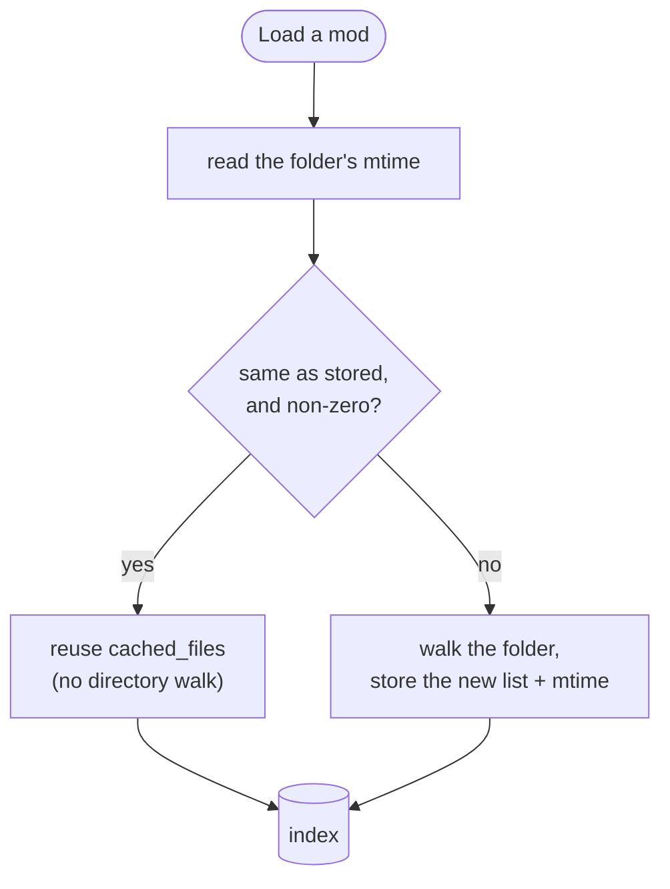

# Scanning & the cache

The first time BMM sees your mods folder it builds an **index**: for every mod, its file list, and
for every file a content hash. Everything else — conflict detection, integrity, "what changed?" —
reads that index instead of the disk.

---

## Two caches, two different keys

They are easy to confuse, so:

| Cache | Keyed on | Invalidated by | Persisted? |
|---|---|---|---|
| **File list** (`cached_files`) | the mod **folder's** mtime | the folder's mtime changing | yes, in `data.json` |
| **File hashes** (`file_hashes`) | the file's path | an explicit integrity check or re-hash | yes, in `data.json` |
| **Conflict index** | the file list | rebuilt whenever it could be stale | **no** — memory only |

The file-list cache is the one that makes startup fast. The check is deliberately cheap: read the
mod folder's modification time, and if it equals what was stored, reuse the stored list verbatim
without touching the disk further.

The `and non-zero` matters: if reading the metadata fails, BMM logs it and **resets the stored mtime**
rather than trusting a zero — *"Fragile mtime invalidation check … Resetting mtime"*. A failure
becomes a re-scan, never a false cache hit.

!!! warning "A folder's mtime does not always change when a file inside it does"

    This is the honest limitation of the design. On Windows, editing a file **in place** without
    adding, renaming or deleting anything can leave the *parent folder's* mtime untouched — so the
    cached file list stays valid (correctly, the list didn't change) but nothing prompts a re-hash.
    That is exactly why the file list and the hashes are separate caches with separate triggers: the
    list is cheap and refreshed opportunistically, and the **hashes** are what an
    [integrity check](doc-page:how-it-works/integrity-hashing) recomputes when you want the truth.

---

## Re-hashing is a background queue, not a scan step

Re-hashing used to run synchronously, which is what made scanning feel slow. Now it is deferred to a
throttled queue that hashes *"one mod at a time, on the capped hash pool, with a pause between
each"*. Three caps stack up here:

- **one mod at a time** — never a burst of concurrent hashing jobs,
- the **≤4-thread hash pool** (see [Integrity & hashing](doc-page:how-it-works/integrity-hashing)),
- a **pause between mods**, so a long queue can't monopolise the disk.

The result is that a large import finishes its *visible* work immediately and settles its hashes in
the background, instead of blocking on gigabytes of reads.

---

## Archives are listed, not extracted

An archived mod (`.zip`, `.7z`, `.rar`) is never unpacked into your mods folder. Listing its files
reads the **archive index only** — for 7z and rar, the header — so adding an archived mod costs a
metadata read, not an extraction. This was a real startup fix: extracting a big `.zip` under the
state lock used to freeze the window.

Extraction happens lazily, into a cache directory keyed by *"the archive's name + size + mtime, so
changing the archive busts it"*. And because the extracted view has the same relative paths and sizes
as an unpacked folder, *"every BMM feature (SHA / content-id / integrity report / conflicts) yields
IDENTICAL results for an archived mod and its unpacked twin"*.

---

## What happens when a drive is unplugged

A profile's folders can live on an external drive, and BMM handles it explicitly rather than
treating an absent drive as an empty one:

- The mod list is **not pruned**. A scan that finds no files on an unreachable root keeps the
  existing entries — *"Keep whatever we already had and retry when the drive is back — don't churn
  state offline."* Unplugging a drive does not wipe your mods or your active list.
- Hashing is **skipped** for an unreachable root rather than recording empty or failed hashes, so a
  later integrity check isn't poisoned by an offline scan.
- The cached file list is kept as-is, so the Library still shows you what is on that drive.

Plug it back in and the next scan reconciles normally. What BMM cannot fix for you is a **drive
letter that changed** — profiles store absolute paths, so `E:\Mods` becoming `F:\Mods` needs the path
edited by hand.

---

## What a scan never does

A scan is strictly **read-only**. It builds knowledge; it never modifies, moves, or deletes a mod.
Unrecognised files are listed for you to name or [map](doc-page:how-it-works/mapper), not touched. Nothing in the
scanning path writes to your game folder — that only happens when you enable something.

!!! info "See it in the app"
    Help & other → Developer → **mtime cache** and **Mod sync**; the **Scan** tutorial.
