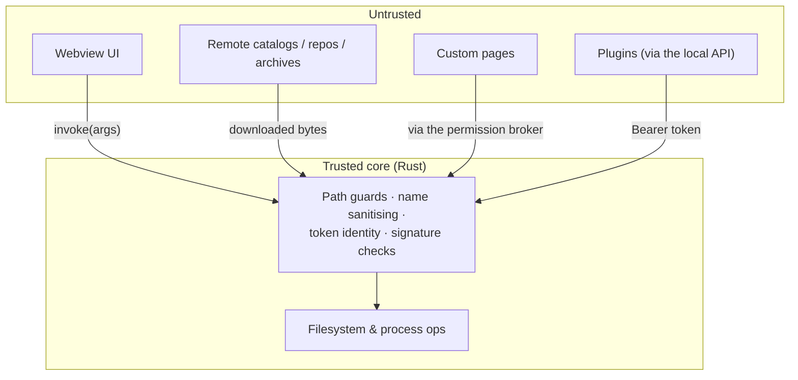
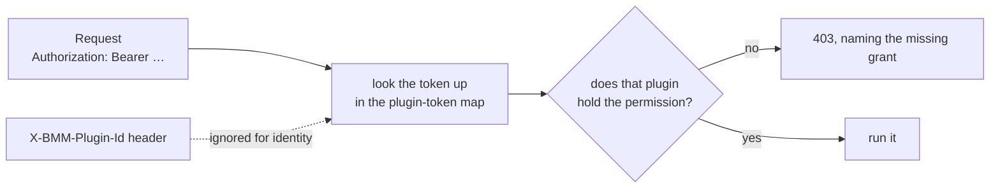
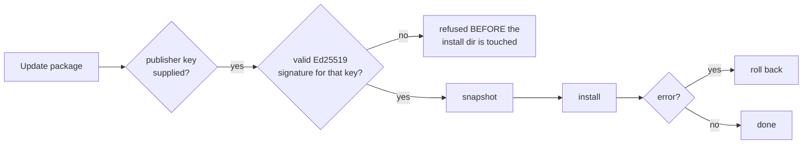

# Security model

BMM runs on your machine, with your files, and can reach the network. That earns it a clear set of
trust boundaries. The short version: **treat the UI and remote content as untrusted, verify at the
core, and never run anything that isn't confined.**

Every guard below is a real one in the code, most of them tagged with the weakness class they close.

---

## Trust boundaries

Every request that crosses into the core is validated **there**. The UI is never trusted to have done
the check — which matters, because the UI is a webview rendering names, descriptions and paths that
came from the internet.

---

## Path traversal (CWE-22) — guarded per boundary, not globally

Anywhere a *name* becomes a *filename*, it is sanitised at that point. The code names each one:

| Boundary | Why it's dangerous |
|---|---|
| Modpack names | a name becomes a file on disk |
| Language files | the filename becomes the language code |
| Crash reports | a report id becomes a path |
| Catalog downloads | *"a segment like `..\..\Startup\x.exe` could escape storage_dir"* |
| Launch pack names | *"so the shortcut can never be written outside the pack dir (e.g. the Startup auto-run folder → persistence)"* |
| Custom pages | resolved with a `..` check **and** symlinks resolved |

That last column is the point: the launch-pack guard exists specifically to stop a crafted name from
planting a shortcut in the Windows Startup folder — a persistence mechanism, not just a stray file.

### Archives get an independent zip-slip guard per format

For `.zip`, BMM relies on the crate's `enclosed_name()`. For 7z and rar it does **not** simply trust
the crate:

> *"an INDEPENDENT zip-slip guard for the formats whose crate we otherwise trust for path safety —
> belt-and-suspenders mirroring the `enclosed_name()` guarantee we rely on for zip."*

For 7z the whole index is checked up front — *"so validate the index up front rather than trusting the
crate"* — so a malicious archive is rejected before a single byte is written.

---

## Filesystem scope is a setting

Not everything is confined to the profile folders by default; it depends on the **filesystem security
mode**:

| Mode | Scope granted |
|---|---|
| `full` | recursive access over every mounted disk |
| anything else | only each profile's three folders, and only if they exist |

If you want the tighter boundary, that is a setting you choose — and it is worth knowing that it is a
setting, rather than assuming the narrow scope is always in force.

---

## The local API resolves identity from the token, never a header

> *"CWE-862/863: the API resolves a caller's identity (and thus permissions) from THIS map by token,
> not from the spoofable `X-BMM-Plugin-Id` header."*

So a plugin cannot escalate by forging or omitting that header. Supporting details:

- Tokens are compared in **constant time** — *"avoids the early-exit timing leak of `==`"* (CWE-208).
- The token is re-read on **every** request, so rotating one takes effect immediately.
- The server binds **`127.0.0.1` only**, never `0.0.0.0`.
- In a release build CORS is an allow-list (CWE-942); `tauri dev` allows any origin.
- There is **no rate limiting** — do not expose the port. See the [API reference](doc-page:../reference/api).

!!! danger "One endpoint is equivalent to admin"

    `GET /api/data` returns the whole document, `settings` included — and `settings` holds the admin
    token and every plugin token. Any caller that can read it can mint itself full access. Treat
    granting it as handing over admin rights.

---

## No shell, ever

Scheduler custom commands *"never invoke a shell (args are passed separately…), avoiding CWE-78"* —
arguments are passed as an argv array, so a name with `&&` or `;` in it is an argument, not a command.

And every child process BMM spawns is invisible by construction:

> *"Console programs (cmd, powershell, python, bash, cscript, …) launched via the default `Command`
> pop a black console window for a split second in a release build… Routing every spawn through these
> helpers sets the `CREATE_NO_WINDOW` flag so they stay invisible."*

That is a UX rule with a security benefit: a flashing console window is exactly what a user learns to
ignore, so making the legitimate ones silent means an unexpected one is meaningful.

---

## `eval` cannot come back

The frontend once had an `eval()`-based REPL in the Debug Hub. It was removed during a weakness
remediation pass, and a **build gate** keeps it gone:

> *"Fails the build if dynamic-code-execution sinks reappear in the frontend source. The Debug Hub
> REPL `eval()` was removed during the CWE remediation; this guard makes sure it (or `new
> Function(...)`) is never reintroduced."*

This runs in `npm run build` as well as `npm run ci`, so a release cannot be produced with it back.
Alongside it, `check-kit` verifies that the UI kit's factories escape what they render — and it runs
against the **compiled** output *"so it exercises exactly what ships"*.

---

## Updates fail closed

> *"the package MUST carry a valid Ed25519 signature for that key or the update is refused *before*
> the install dir is touched (fail closed)"*

Two honest caveats: the pinning is **opt-in per caller** — it happens when a publisher key is supplied
— and the snapshot-and-rollback protects against a failed install, not against a signed-but-malicious
package. What it does guarantee is that an intercepted or tampered payload never reaches your install
directory.

---

## What integrity checking does and does not block

Worth separating, because "everything is hash-verified" is too strong:

| Path | Enforced? |
|---|---|
| App catalog download | **Yes** — SHA-256 verified before it can run (CWE-494). If the catalog carries no hash, BMM says so and asks; the log records the payload's real hash |
| Repo sync | **Yes** — compared before download, per-chunk during, re-verified after |
| Modpack apply | **Yes**, unless that modpack has *skip integrity check* |
| Enabling a mod from the scheduler | **No** — the check is bypassed, because a background run can't stop to ask you |

See [Integrity & hashing](doc-page:integrity-hashing) for the full picture.

---

## Where secrets live

- **API tokens** — in `data.json`, on your machine. Rotatable from *Plugins & API*.
- **A GitHub PAT** — only ever needs read scope, stored locally, never sent anywhere but GitHub.
- **Repo download passwords** — sent as a header, not a URL parameter… **except** for the script
  generator's *Repo info* block, which puts it in the query string. Don't paste that generated line
  into a shared log or chat.
- **Telemetry and replays** — opt-in, local-first, and masked by default. A *Full* switch means
  **unmasked**: mod names, profile names and paths stop being `••••`. See
  [Privacy & telemetry](doc-page:../features/privacy-telemetry).

---

None of this asks you to trust the network. The network can only ever hand BMM bytes; whether those
bytes are allowed to become files on your disk, or a process on your machine, is decided by the core
against rules that don't move.

!!! info "See it in the app"
    Help & other → Developer → **Security model** and **Crash reporting**.
