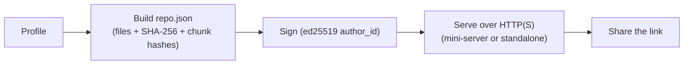
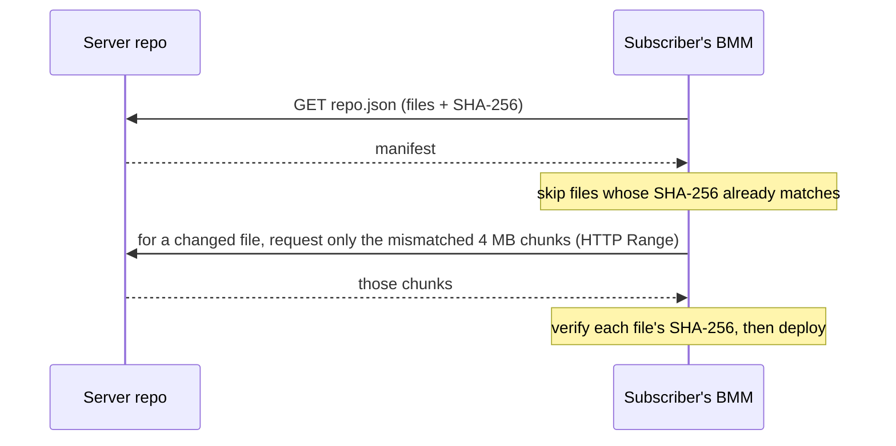

# Hosting & sync (server repos)

A server repo turns one person's profile into a **hosted source of truth**: everyone who subscribes
converges on the exact same mods, versions and order — and stays converged as the owner updates it.
There are two halves — hosting it, and syncing from it.

## Hosting

BMM turns the chosen profile into a servable repository:

- A **manifest** (`repo.json`) listing every file with its **SHA-256** hash, plus **4&nbsp;MB chunk
  hashes** (also SHA-256) so updates can be differential.
- A cryptographic **signature**: the manifest is signed with an **ed25519** key derived from the
  host's identity, and the public key is the repo's `author_id`. A subscriber can verify the
  signature to confirm the repo really came from that author.

You serve it either from BMM's **built-in mini-server** or a generated standalone server (Node, or a
`.bat`/`.sh` script) on a dedicated machine, over HTTP — **HTTPS is strongly recommended**.

### Access control (self-hosted)

A self-hosted repo is **public by default**. It can be restricted two ways:

- A **whitelist / ban list**, matched automatically against a subscriber's linked account or device
  identity.
- An optional **download password**. Set it when you generate the server; subscribers are then asked
  for it the first time they connect (BMM sends it as an `X-Repo-Password` header and remembers it for
  later syncs). Leave it blank for an open repo.

Keep the download password distinct from the `admin_password`: the latter only protects the *host's*
admin panel (pushing new versions) and is not a subscriber gate.

## Sync

The client never blindly re-downloads. It fetches the manifest and reconciles it with what it has.

A **version string** on the repo drives update *detection*: BMM flags a mod when the repo's published
version differs from the one installed. Applying the update re-runs the sync above — transferring only
the changed files (down to the changed chunks) and removing mods the host has dropped. That's why a
small update to a huge collection costs a few MB.

### What a sync actually guarantees

| Stage | Check |
|---|---|
| Before downloading a file | local hash **==** the manifest's → skip it entirely, nothing transfers |
| Per chunk | each 4 MB chunk's SHA-256 is compared, so a resumed transfer re-fetches only what differs |
| After downloading | the file is re-hashed and compared. A mismatch is an **error**, not a warning |

Three behaviours worth planning around:

- **One sync at a time.** A second request is refused (`409`) rather than queued.
- **Cancelling stops at the next mod boundary**, not mid-file, so you are never left with a
  half-written mod.
- **"Delete extra" is destructive by design.** It makes the local copy match the remote exactly, which
  means anything extra on your side is removed. Leave it off unless convergence is the point.

You can also cap the sync's **download rate**, which is the same per-disk pacing idea as
[Smart I/O](doc-page:how-it-works/performance) applied to the network.

---

## Generating a repo

"Generate" builds the repo folder *and*, optionally, a server to serve it. The options are worth
knowing because several change the shape of the output rather than just a setting:

| Option | What it changes |
|---|---|
| **Profiles** | which profiles become the repo's content — a repo can carry several |
| **Author name / seed** | feeds the `author_id` identity the manifest is signed with |
| **Generate server** | emit a runnable server next to the files, not just the files |
| **Server type** | a standard or an extended (`lux`) server template |
| **Lightweight** | a smaller server variant |
| **Port** | the port the generated server listens on |
| **Upload limit** | a bandwidth cap for the host side |
| **Admin password** | protects the *host's* admin panel, **not** subscriber downloads |
| **Auto-start** | the server starts itself when launched |
| **UPnP** | ask the router to map the port automatically — removed again when the server stops |
| **Cloudflare** | front the server with a tunnel instead of exposing the port |
| **Docker** | emit a container setup instead of a bare script, with an OS choice |
| **Zip output** | package the whole thing as one archive to move to the host machine |
| **Language** | the generated server's own interface language |

The generated server is a self-contained script (a `.bat` on Windows, a `.sh` elsewhere) — no BMM
install needed on the host machine. Generation is cancellable, and like sync it reports progress as it
goes.

!!! warning "Two different passwords"

    The **admin password** protects pushing new versions from the host's panel. The **download
    password** is the subscriber gate, sent as an `X-Repo-Password` header and remembered for later
    syncs. Setting one does not set the other, and confusing them is the usual cause of "why can
    anyone download this?".

---

!!! note "BetterCommunity is not the same thing"
    The BetterCommunity hub adds features a repo you host yourself does **not** have: a
    `BCR-XXXX-XXXX` repo fingerprint, account-based (email / password) access, and managed hosting.
    A plain self-hosted repo has the `author_id` signature above — not a BCR fingerprint.

!!! info "See it in the app"
    Help &amp; other → Developer → **Server mode** and **Hosting flow**. User guide:
    [Server Repo](doc-page:features/repo).
