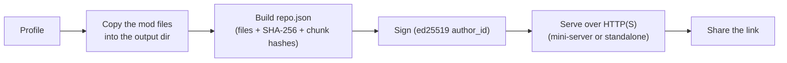
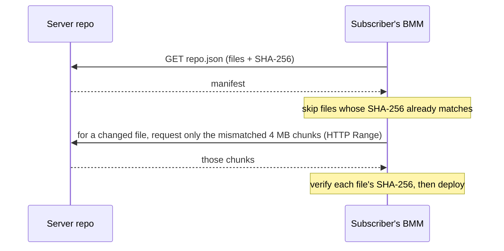

# Hosting & sync (server repos)

A server repo turns one person's profile into a **hosted source of truth**: everyone who subscribes
converges on the exact same mods, versions and order — and stays converged as the owner updates it.
There are two halves — hosting it, and syncing from it.

## Hosting

BMM turns the chosen profile into a servable repository. That word is literal: the export
**builds a directory**, it does not annotate one you already have.

- A **copy of every mod file**, written into the output folder under `mods/<id>/…`. The hashes
  are computed on those copies. This is the part people setting up hosting are usually
  surprised by — you point the export at a profile and get a complete repository out, which you
  then publish. It is not a manifest you drop next to files you already host.
- A **manifest** (`repo.json`) listing every file with its **SHA-256** hash, plus **4&nbsp;MB chunk
  hashes** (also SHA-256) so updates can be differential.
- A cryptographic **signature**: the manifest is signed with an **ed25519** key derived from the
  host's identity, and the public key is the repo's `author_id`. A subscriber can verify the
  signature to confirm the repo really came from that author.

    The same key now signs **every file BMM writes**, not just `repo.json` — mod lists
    (`.mm`), automations (`.bmmpa`), navbar bundles (`.bmmnav`), modpacks, session replays
    and the `.DATABMM` backup. JSON documents carry a `bmm_signature` block; ZIP formats
    (`.bmmplug`, `.bmmtheme`, and `.mm`) carry a `bmm_signature.json` entry listing every
    other file and its SHA-256, so swapping a script beside an untouched manifest is caught.
    A file with no signature reads as **unsigned**, never as invalid: everything written
    before this exists, and other tools write these formats too.

Serving it needs no software of BMM's at all: a client fetches `<your-url>/repo.json` and then
the files beneath it, so **any static web host works** — upload the exported directory and you
are done. BMM can also run it for you, from the **built-in mini-server** or a generated
standalone server (Node, or a `.bat`/`.sh` script) on a dedicated machine. Either way, over
HTTP — **HTTPS is strongly recommended**.

!!! warning "There is no way to publish a repo over files you already host"

    The local API's generation takes a `lightweight` flag that hashes the mods in place instead
    of copying them, and it is tempting to read that as "manifest for my existing hosting". It
    is not. It writes no `mods/` directory, records no chunk hashes (`chunks: None`, so no
    differential updates), and nothing in the manifest can point the files at another location.
    What you get is an **index of what an export would contain**, not something a client can
    sync from. If you already host your mods and do not want to upload them again, use
    [direct download links](doc-page:features/repo) instead — at the cost of update detection,
    since a direct download carries no version.

### Access control (self-hosted)

A self-hosted repo is **public by default**. It can be restricted two ways:

- A **whitelist / ban list**, matched automatically against a subscriber's linked account or device
  identity.
- An optional **download password**. Set it when you generate the server; subscribers are then asked
  for it the first time they connect (BMM sends it as an `X-Repo-Password` header and remembers it for
  later syncs). Leave it blank for an open repo.

Keep the download password distinct from the `admin_password`: the latter only protects the *host's*
admin panel (pushing new versions) and is not a subscriber gate.

## Sync

The client never blindly re-downloads. It fetches the manifest and reconciles it with what it has.

A **version string** on the repo drives update *detection*: BMM flags a mod when the repo's published
version differs from the one installed. Applying the update re-runs the sync above — transferring only
the changed files (down to the changed chunks) and removing mods the host has dropped. That's why a
small update to a huge collection costs a few MB.

### A server with no manifest

A host that simply serves a folder of mods has no `repo.json`, and until recently that made it
unusable even though every file was right there. BMM can now read the server's own directory
listing instead, and looks for a manifest to check it against in two places: beside the mods
folder, then one level up — where a generated repo puts it. The search stops there rather than
climbing, since a manifest further up belongs to a different repo.

What it finds decides what you get:

| Found | Result |
|---|---|
| A manifest whose signature verifies | Files it covers keep the guarantee they always had. |
| A manifest whose signature does **not** verify | Treated as absent. It vouches for nothing, so its hashes are no better than the files vouching for themselves. |
| No manifest | Everything is offered **unverified**. |

Unverified mods can be installed, and are marked. **One** uncovered file makes the whole mod
unverified — installing writes that file too, so partial coverage is not partial safety.

The mark is stored on the mod, not worked out later. It is only knowable at install time: a
later scan sees ordinary files on disk and would quietly promote them to the standing of mods
whose bytes were actually checked. Re-syncing from a repo that has since gained hashes clears
it, which is the same rule read the other way.

!!! warning "What unverified costs"
    A hash is what tells a good download from a corrupted, truncated or substituted one.
    Without one there is nothing to compare against, and all three look identical. Install
    unverified mods only from a host you trust.

### What a sync actually guarantees

| Stage | Check |
|---|---|
| Before downloading a file | local hash **==** the manifest's → skip it entirely, nothing transfers |
| Per chunk | each 4 MB chunk's SHA-256 is compared, so a resumed transfer re-fetches only what differs |
| After downloading | the file is re-hashed and compared. A mismatch is an **error**, not a warning |

Three behaviours worth planning around:

- **One sync at a time.** A second request is refused (`409`) rather than queued.
- **Cancelling stops at the next mod boundary**, not mid-file, so you are never left with a
  half-written mod.
- **"Delete extra" is destructive by design.** It makes the local copy match the remote exactly, which
  means anything extra on your side is removed. Leave it off unless convergence is the point.

You can also cap the sync's **download rate**, which is the same per-disk pacing idea as
[Smart I/O](doc-page:how-it-works/performance) applied to the network.

---

## Generating a repo

"Generate" builds the repo folder *and*, optionally, a server to serve it. The options are worth
knowing because several change the shape of the output rather than just a setting:

| Option | What it changes |
|---|---|
| **Profiles** | which profiles become the repo's content — a repo can carry several |
| **Author name / seed** | feeds the `author_id` identity the manifest is signed with |
| **Generate server** | emit a runnable server next to the files, not just the files |
| **Server type** | a standard or an extended (`lux`) server template |
| **Lightweight** | a smaller server variant |
| **Port** | the port the generated server listens on |
| **Upload limit** | a bandwidth cap for the host side |
| **Admin password** | protects the *host's* admin panel, **not** subscriber downloads |
| **Auto-start** | the server starts itself when launched |
| **UPnP** | ask the router to map the port automatically — removed again when the server stops |
| **Cloudflare** | front the server with a tunnel instead of exposing the port |
| **Docker** | emit a container setup instead of a bare script, with an OS choice |
| **Zip output** | package the whole thing as one archive to move to the host machine |
| **Language** | the generated server's own interface language |

The generated server is a self-contained script (a `.bat` on Windows, a `.sh` elsewhere) — no BMM
install needed on the host machine. Generation is cancellable, and like sync it reports progress as it
goes.

!!! warning "Two different passwords"

    The **admin password** protects pushing new versions from the host's panel. The **download
    password** is the subscriber gate, sent as an `X-Repo-Password` header and remembered for later
    syncs. Setting one does not set the other, and confusing them is the usual cause of "why can
    anyone download this?".

---

!!! note "BetterCommunity is not the same thing"
    The BetterCommunity hub adds features a repo you host yourself does **not** have: a
    `BCR-XXXX-XXXX` repo fingerprint, account-based (email / password) access, and managed hosting.
    A plain self-hosted repo has the `author_id` signature above — not a BCR fingerprint.

!!! info "See it in the app"
    Help &amp; other → Developer → **Server mode** and **Hosting flow**. User guide:
    [Server Repo](doc-page:features/repo).
