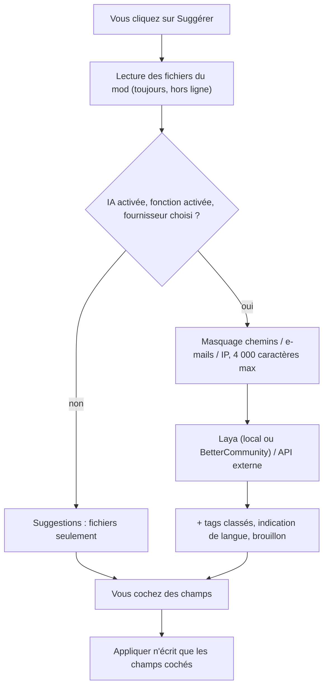

# IA optionnelle (Laya)

BMM peut vous aider à remplir les informations d'un mod et à vérifier un rapport de bug avant
de l'envoyer. **Tout est optionnel.** Avec **Laya intégré (hors ligne)** — installé par défaut
avec BMM — le classifieur tourne sur votre PC et *rien* n'est envoyé nulle part. Les autres
fournisseurs restent coupés tant que vous n'en choisissez pas un. La partie qui lit les
fichiers du mod fonctionne sans rien de tout ça.

## Ce que ça fait — et ce que ça ne fait pas

| Ça fait | Ça ne fait pas |
|---|---|
| Lire les fichiers du mod (manifeste, readme, `entry.lua`, `descriptor.mod`, `About.xml`, `ModInfo.xml`, `VERSION.txt`, le nom du dossier) et proposer nom, version, auteur, description, liens | Écrire quoi que ce soit tout seul : chaque suggestion est une ligne que vous cochez, et seul **Appliquer** écrit |
| Classer **vos tags existants** pour un mod (Laya choisit parmi les tags que vous avez créés) | Inventer de nouveaux tags, ou une catégorie que BMM n'a pas |
| Indiquer la langue du texte d'un mod et s'il ressemble à du contenu adulte | Enregistrer ces indications : BMM n'a pas ce champ, elles sont affichées puis oubliées |
| Masquer les données personnelles d'un rapport et vous signaler un rapport semblable déjà envoyé | Décider de ce que dit un rapport ni s'il part |
| Donner un indice pour un rapport : catégorie, gravité, « ressemble à votre rapport … » | Clôturer, orienter ou juger un rapport — le tri côté serveur est le travail de BetterCommunity |
| Demander un **brouillon** de description à **votre** API externe, si vous en configurez une | Tourner en arrière-plan : le modèle ne répond que quand vous cliquez |

### Pourquoi Laya n'écrit pas de descriptions

[Laya](https://huggingface.co/convaiinnovations/laya-multilingual) (`laya-multilingual`, plus de
100 langues) est un **classifieur** : il choisit une option dans une liste (`choice`), donne la
probabilité qu'une question oui/non soit vraie (`noul`), ou un score. Il ne génère pas de texte.
Donc dans BMM :

- une **description** vient des fichiers du mod, ou — seulement si vous en configurez une —
  d'une API compatible OpenAI que vous choisissez (affichée avec le badge **Brouillon**) ;
- les **tags** sont le choix de Laya parmi *vos* tags, chacun avec sa probabilité ;
- sa réponse est un **signal** : affichée avec une confiance, jamais appliquée sans votre clic.

### Laya intégré (hors ligne)

BMM peut faire tourner Laya **lui-même**, sans Python, sans serveur et sans aucun réseau pendant
qu'il travaille. C'est un **paquet de modèle** à part (327 Mo à télécharger, 404 Mo sur le disque) :

- le modèle `laya-multilingual` (révision `e4e9ddf`), exporté en ONNX et quantifié — chaque
  matrice de poids sur 8 bits, la table du vocabulaire sur 8 bits par ligne. Sur un jeu fixe de
  186 réponses en dix langues, il donne la même réponse que le modèle d'origine dans **98,9 %**
  des cas (les deux écarts étaient des quasi-égalités dans l'original), à 0,09 près au plus sur
  une probabilité ;
- son tokenizer, et ONNX Runtime 1.30 de Microsoft (`onnxruntime.dll`), chargé depuis le dossier
  du paquet — BMM coupe les événements de télémétrie d'ONNX Runtime.

**D'où il vient.** L'option de l'installeur *Laya hors ligne (IA locale, aucune donnée envoyée)*
est cochée par défaut : l'installation télécharge le paquet une fois, le refuse s'il ne
correspond pas à son SHA-256 épinglé, et le décompresse dans `<dossier d'installation>\models\laya`.
Si vous l'avez décochée, **Réglages → IA → Laya intégré → Installer le modèle** télécharge le même
paquet dans `%LOCALAPPDATA%\com.bettermm.desktop\models\laya` (avec une barre de progression ; un
téléchargement interrompu reprend). **Supprimer le modèle** efface cette copie ; celle de
l'installation part avec la désinstallation.

**Ce que ça coûte.** Rien tant que vous ne cliquez pas : le modèle est chargé à la première
question (environ 1,5 s), hors du fil de l'interface, sur deux cœurs, et libéré après 5 minutes
sans utilisation. Chargé, il occupe environ 0,5 à 0,75 Go de mémoire ; un mod prend environ
0,7 s sur un processeur de portable. Chaque fichier est vérifié contre son empreinte avant d'être chargé.

Quand le paquet est installé et que vous n'avez pas choisi de fournisseur vous-même, le moteur
intégré est le fournisseur. Chaque fonction attend toujours votre clic, et l'interrupteur
principal coupe toujours tout.

## Fournisseurs

| Fournisseur | Où part le texte | Ce qu'il faut |
|---|---|---|
| **Désactivé** | Nulle part. Les suggestions viennent des fichiers seulement | Rien |
| **Laya intégré (hors ligne)** (par défaut quand le modèle est installé) | **Nulle part** — lu sur ce PC par BMM lui-même | Le paquet de modèle (option de l'installeur, ou *Installer le modèle* dans les Réglages) |
| **BetterCommunity** | `bettercommunity.ch`, qui fait tourner Laya sur son serveur | Un compte BetterCommunity lié à BMM, et cocher la case de consentement dans les Réglages |
| **Mon propre serveur Laya** | Votre `laya-serve`, par défaut `http://127.0.0.1:8000` — ce PC | `pip install "laya[serve]"`, puis `laya-serve` (avec `LAYA_MODELS=multilingual`) |
| **API externe** (rédaction seulement) | L'adresse compatible OpenAI que vous indiquez | Son URL, un nom de modèle et votre clé |

Les règles que BMM applique avant tout envoi — dans le cœur Rust, pas dans la page :

- **http(s) uniquement**, jamais de `utilisateur:motdepasse@` dans l'adresse.
- **Laya local** doit être sur ce PC (`127.0.0.1`, `localhost`, `::1`). Une autre machine
  demande une case explicite, et BMM prévient que le texte quitte alors le PC.
- **L'API externe** doit utiliser `https://` (`http://` seulement sur ce PC), et une adresse
  privée ou réservée (`10.x`, `192.168.x`, `169.254.x`, …) est refusée : votre clé y partirait.
- Les requêtes **BetterCommunity** ne partent que vers `bettercommunity.ch`.
- Les requêtes ne suivent pas les redirections, expirent (20 s par défaut) et ne lisent pas
  plus de 1 Mo de réponse.
- Les clés sont stockées par le système — DPAPI sous Windows, ou le trousseau macOS/Linux — et
  ne sont plus jamais montrées à la page. Sans l'un ni l'autre, une clé n'est gardée que pour la
  session et redemandée la fois suivante.

## Ce qui est envoyé, et quand

Seulement quand **vous** cliquez : *Suggérer des infos* sur un mod, *Demander aussi un brouillon
de description*, ou *Obtenir un indice IA* sur un rapport. Jamais en arrière-plan.

- **Pour un mod :** son nom, son auteur, sa description, des extraits de son readme/manifeste,
  jusqu'à 40 noms de fichiers, et les noms de vos tags. Les noms d'utilisateur dans les chemins,
  les adresses e-mail et IP sont masqués d'abord ; le texte est limité à 4 000 caractères. La
  fenêtre montre le texte exact envoyé.
- **Pour un indice de rapport :** le texte du rapport, après masquage.
- **Jamais :** le contenu de vos fichiers, vos clés, votre liste de mods, quoi que ce soit tant
  que l'interrupteur est éteint.

## Suggérer les infos d'un mod

Ouvrez un mod, puis **Suggérer des infos (IA optionnelle)** au-dessus de *Sauvegarder*. Chaque
ligne montre :

- le champ et la valeur proposée (avec la valeur actuelle en dessous) ;
- sa **source** — *Fichier* (lequel), *Nom du dossier*, *Laya*, *BetterCommunity* ou *API externe* ;
- une **confiance** : pour un fichier, la fiabilité de ce type de fichier (un manifeste bat un
  nom de dossier) ; pour un modèle, sa propre probabilité.

Rien n'est coché. Cochez ce que vous voulez et cliquez sur **Appliquer la sélection** ; une
valeur par champ (cocher une seconde description décoche la première), les tags s'ajoutent
jusqu'aux trois habituels par mod, les liens s'ajoutent à la suite. Le changement est inscrit
dans l'historique d'activité du mod comme toute autre modification.

## Avant l'envoi d'un rapport

Quand vous cliquez sur **Envoyer** dans *Signaler un bug / Suggestion*, BMM vérifie d'abord le
texte, en local :

1. **Masquage** — tous les secrets que BMM détient (le même passage que les zips de plantage),
   les noms de dossier utilisateur dans les chemins, les adresses e-mail et IP, les noms de
   votre compte Windows et de votre PC. Vous voyez ce qui a été trouvé (des nombres seulement)
   et une case *Les masquer avant l'envoi*, cochée.
2. **Déjà envoyé ?** — comparaison avec les rapports envoyés depuis ce PC ces 30 derniers jours.
3. **Indice IA** (optionnel) — un bouton qui demande au classifieur une catégorie, une gravité et
   si le rapport ressemble à l'un des vôtres. Un indice : il ne change rien.

Si les deux premiers ne trouvent rien, le rapport part directement, comme avant. Sinon, cliquez
à nouveau sur **Envoyer** pour l'envoyer comme vous l'avez choisi. Les zips de plantage joints
à un rapport ont déjà été débarrassés de leurs secrets à leur écriture.

## Désactiver

- **Réglages → IA (optionnelle)** : l'interrupteur principal. Éteint, aucune requête réseau
  d'IA nulle part dans BMM ; c'est couvert par un test automatisé qui compte les requêtes.
- **L'installeur** : *Laya hors ligne (IA locale, aucune donnée envoyée)* sur la page
  d'options, cochée par défaut puisque rien ne quitte le PC. Cochée, elle installe le paquet de
  modèle et allume l'interrupteur principal avec le moteur intégré comme fournisseur ; décochée,
  aucun modèle n'est installé et l'IA reste coupée. En ligne de commande :
  `--set=ai_features=false` (ou `true`).
- **Pour une session** : lancez BMM avec `--no-ai`, ou définissez la variable d'environnement
  `BMM_NO_AI=1`. Les Réglages indiquent alors que l'IA est coupée pour cette session et
  l'interrupteur ne peut pas être allumé.

L'interrupteur est dans `ai-settings.json` à côté de `data.json` ; les clés sont dans
`ai-secrets.json` (scellées par DPAPI, Windows) ou dans le trousseau du système.

## Pour les clients IA (MCP) et la ligne de commande

| Outil MCP | CLI | Ce que ça fait |
|---|---|---|
| `bmm_ai_status` | `ai-status` | Les réglages et ce qui peut passer par le réseau (jamais une clé) |
| `bmm_ai_suggest_mod_metadata` | `ai-suggest <mod-id> [--offline] [--draft]` | Les mêmes suggestions que la fenêtre. **N'écrit rien** |
| `bmm_ai_apply_mod_metadata` | `ai-apply <mod-id> --fields '{…}'` | Écrit les champs nommés, avec la validation de la fenêtre |

Un agent doit vous montrer les suggestions et n'appliquer que ce que vous choisissez. Voir la
[référence MCP](doc-page:reference/mcp) et la [référence CLI](doc-page:reference/cli).

## Voir aussi

- [Confidentialité, télémétrie & hors ligne](doc-page:features/privacy-telemetry)
- [Retours & rapports de bug](doc-page:features/feedback)
- [Réglages](doc-page:features/settings)
