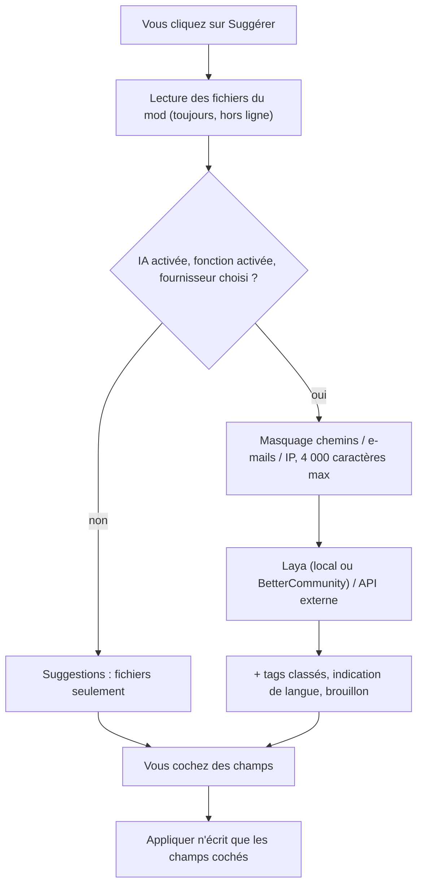

# IA optionnelle (Laya)

BMM peut vous aider à remplir les informations d'un mod et à vérifier un rapport de bug avant
de l'envoyer. **Tout est optionnel.** Avec **Laya intégré (hors ligne)** — installé par défaut
avec BMM — le classifieur tourne sur votre PC et *rien* n'est envoyé nulle part. Les autres
fournisseurs restent coupés tant que vous n'en choisissez pas un. La partie qui lit les
fichiers du mod fonctionne sans rien de tout ça.

## Ce que ça fait — et ce que ça ne fait pas

| Ça fait | Ça ne fait pas |
|---|---|
| Lire les fichiers du mod (manifeste, readme, `entry.lua`, `descriptor.mod`, `About.xml`, `ModInfo.xml`, `VERSION.txt`, le nom du dossier) et proposer nom, version, auteur, description, liens | Écrire quoi que ce soit tout seul : chaque suggestion est une ligne que vous cochez, et seul **Appliquer** écrit |
| Classer **vos tags existants** pour un mod (Laya choisit parmi les tags que vous avez créés) | Inventer de nouveaux tags, ou une catégorie que BMM n'a pas |
| Indiquer la langue du texte d'un mod et s'il ressemble à du contenu adulte | Enregistrer ces indications : BMM n'a pas ce champ, elles sont affichées puis oubliées |
| Masquer les données personnelles d'un rapport et vous signaler un rapport semblable déjà envoyé | Décider de ce que dit un rapport ni s'il part |
| Donner un indice pour un rapport : catégorie, gravité, « ressemble à votre rapport … » | Clôturer, orienter ou juger un rapport — le tri côté serveur est le travail de BetterCommunity |
| Demander un **brouillon** de description à **votre** API externe, si vous en configurez une | Tourner en arrière-plan : le modèle ne répond que quand vous cliquez |

### Pourquoi Laya n'écrit pas de descriptions

[Laya](https://huggingface.co/convaiinnovations/laya-multilingual) (`laya-multilingual`, plus de
100 langues) est un **classifieur** : il choisit une option dans une liste (`choice`), donne la
probabilité qu'une question oui/non soit vraie (`noul`), ou un score. Il ne génère pas de texte.
Donc dans BMM :

- une **description** vient des fichiers du mod, ou — seulement si vous en configurez une —
  d'une API compatible OpenAI que vous choisissez (affichée avec le badge **Brouillon**) ;
- les **tags** sont le choix de Laya parmi *vos* tags, chacun avec sa probabilité ;
- sa réponse est un **signal** : affichée avec une confiance, jamais appliquée sans votre clic.

### Laya intégré (hors ligne)

BMM peut faire tourner Laya **lui-même**, sans Python, sans serveur et sans aucun réseau pendant
qu'il travaille. C'est un **paquet de modèle** à part (327 Mo à télécharger, 404 Mo sur le disque) :

- le modèle `laya-multilingual` (révision `e4e9ddf`), exporté en ONNX et quantifié — chaque
  matrice de poids sur 8 bits, la table du vocabulaire sur 8 bits par ligne. Sur un jeu fixe de
  186 réponses en dix langues, il donne la même réponse que le modèle d'origine dans **98,9 %**
  des cas (les deux écarts étaient des quasi-égalités dans l'original), à 0,09 près au plus sur
  une probabilité ;
- son tokenizer, et ONNX Runtime 1.30 de Microsoft (`onnxruntime.dll`), chargé depuis le dossier
  du paquet — BMM coupe les événements de télémétrie d'ONNX Runtime.

**D'où il vient.** L'option de l'installeur *Laya hors ligne (IA locale, aucune donnée envoyée)*
est cochée par défaut : l'installation télécharge le paquet une fois, le refuse s'il ne
correspond pas à son SHA-256 épinglé, et le décompresse dans `<dossier d'installation>\models\laya`.
Si vous l'avez décochée, **Paramètres → Laya → Gérer Laya → Aperçu → Où Laya tourne → Installer le modèle** télécharge le même
paquet dans `%LOCALAPPDATA%\com.bettermm.desktop\models\laya`. Le bloc montre toujours UN seul état :

| État | Ce que vous voyez |
|---|---|
| Pas installé | la taille (327 Mo), l'espace disque nécessaire et l'espace libre, **Installer** |
| Téléchargement | une barre, le débit, le temps restant et le serveur utilisé ; **Pause** garde ce qui est reçu, **Annuler** le supprime |
| En pause | ce qui est déjà là, **Reprendre** ou **L'abandonner** |
| Vérification, décompression | le SHA-256 du téléchargement, puis de chaque fichier, contre leurs empreintes épinglées |
| Installé / chargé | où, quelle taille, **Tester Laya**, **Ouvrir le dossier**, **Supprimer le modèle** |
| Mise à jour disponible | un paquet plus ancien est sur le disque (les empreintes ont changé) : **Mettre à jour** |
| Espace insuffisant | vérifié **avant** le téléchargement, jamais à 99 % |
| Erreur | la raison, **Réessayer** et **Ouvrir le dossier** |

Le paquet vient de la release GitHub de BMM, et du miroir BetterCommunity quand GitHub ne répond
pas : les deux servent le même fichier épinglé, un miroir peut donc servir un mauvais fichier mais
jamais le faire installer. **Tester Laya** classe un exemple fixe (aucune donnée à vous) et affiche
la réponse et le temps pris. Là où une fonction IA apparaît et que le modèle manque (la fenêtre
*Suggérer des infos*, *Demander à Laya*), une ligne le dit avec un bouton **Installer Laya (327 Mo)**
plutôt qu'un bouton qui fait moins sans le dire. **Supprimer le modèle** efface cette copie ; celle de
l'installation part avec la désinstallation.

**Ce que ça coûte.** Rien tant que vous ne cliquez pas : le modèle est chargé à la première
question (environ 1,5 s), hors du fil de l'interface, sur deux cœurs, et libéré après 5 minutes
sans utilisation. Chargé, il occupe environ 0,5 à 0,75 Go de mémoire ; un mod prend environ
0,7 s sur un processeur de portable. Chaque fichier est vérifié contre son empreinte avant d'être chargé.

Quand le paquet est installé et que vous n'avez pas choisi de fournisseur vous-même, le moteur
intégré est le fournisseur. Chaque fonction attend toujours votre clic, et l'interrupteur
principal coupe toujours tout.

## Quelle précision

Laya est un classifieur calibré : il choisit une option ou donne une probabilité. Ce que BMM lui
**demande** décide de la qualité des réponses : les questions ont donc été refaites et mesurées sur
un jeu de textes au format de BMM étiqueté à la main (manifestes et readmes de mods, rapports de
bug, listes de rapports précédents, en dix langues) : 156 éléments sur lesquels les réglages ont été
ajustés, et 68 éléments **à l'aveugle**, écrits après et jamais utilisés pour ajuster. La colonne à
l'aveugle est la plus honnête.

| | Avant | Après, jeu d'ajustement | Après, jeu à l'aveugle |
|---|---|---|---|
| Tags (F1) | 0,44 / 0,16 à l'aveugle | **0,90** | **0,36** (0,50 sur les tags que BMM connaît, 0,34 sur les autres) |
| Indication de langue | 27 % justes | **91 %** (98 % des indications affichées justes) | **78 %** (100 % des indications affichées justes) |
| Catégorie de rapport | 50 % / 35 % à l'aveugle | **65 %** | **55 %** |
| Gravité de rapport | 29 % / 40 % à l'aveugle | **60 %** | **50 %** |
| Rapport en double | 9 fausses alertes sur 24 | **0** fausse alerte, 19/24 justes | **0** fausse alerte, 8/12 justes |

Ce qui a changé :

- **Des critères descriptifs.** Un tag est demandé par ce qu'il signifie : *Armes : le mod ajoute
  ou modifie des armes : canons, missiles, bombes*. BMM reconnaît le sens d'un tag en dix langues
  (« Weapons », « Waffen », « Оружие »…) ; un tag inconnu garde son propre nom.
- **Les mots-clés d'abord.** Le texte du mod est parcouru à la recherche d'indices pour chaque tag ;
  Laya n'est interrogé que sur les quelques candidats restants (10 au plus), avec un oui/non chacun
  et un choix entre eux.
- **La bonne partie du texte.** Une liste de fichiers se lit comme de l'anglais quelle que soit la
  langue du readme : l'indication de langue ne lit que la prose, et un long rapport est réduit à son
  titre et à ses lignes d'erreur.
- **Mesuré, puis gardé ou retiré.** Laya s'est révélé incapable d'identifier une langue (37 %) :
  l'indication de langue vient d'un détecteur de mots outils et de lettres. Pour la gravité il
  répondait « moyenne » presque partout : c'est le type de problème qui fixe la gravité (un
  plantage est élevé, une faute de frappe faible, des données perdues critique) et Laya ne fait que
  départager.
- **L'abstention.** Sous une probabilité calibrée, rien n'est suggéré : une indication manquante
  coûte moins qu'une fausse.

Les tags que la liste de concepts ne connaît pas (une époque, *Multijoueur*, *Cosmétique*) restent le
point faible : là, le modèle seul juge le nom du tag, et il a raison environ une fois sur trois.

## Demander à Laya

**Ctrl+K → Demander à Laya** (ou tapez une question dans la palette, ou **Demander à Laya** dans
Aide & autres) prend une question en toutes lettres : *quel mod modifie engine.ogg ?*, *quels mods
sont en conflit ?*, *c'est quoi le mode jeu ?*, *comment exporter ma liste de mods ?* La réponse est
une liste de choses qui existent, chacune avec son action, jamais du texte rédigé :

- les sections de documentation et les articles d'aide, cités, avec **Ouvrir** ;
- les réglages et les commandes de la palette, avec **Y aller** / **Lancer** ;
- pour un fichier, les mods qui le fournissent et les chemins correspondants, les mods activés
  d'abord ;
- pour les conflits, les paires de mods qui fournissent les mêmes fichiers (readmes ignorés), avec
  un échantillon.

La recherche porte sur la documentation embarquée, l'écran Réglages, vos mods (nom, description,
tags, liste de fichiers scannée) et vos profils, avec des règles de mots-clés pour le type de
question. Quand l'IA est activée et le modèle installé, Laya choisit le meilleur des premiers
candidats (la bonne réponse dans les 3 premières pour 34 questions de test sur 36, 31 sans lui), et
le dit quand aucun ne semble convenir. Tout tourne sur ce PC ; la question n'est pas conservée.

Avec la **Rédaction** configurée et les **Réponses rédigées** activées, **Rédiger une réponse**
formule une réponse courte à partir des résultats trouvés, chaque phrase citant sa source (cliquez
sur un numéro pour l'ouvrir). Si Laya juge qu'aucun résultat ne répond, ou si le texte échoue aux
vérifications, rien n'est rédigé et la fenêtre dit pourquoi. Avec un modèle distant, ce clic lui
envoie la question et les sources.

La recherche de la bibliothèque a un bouton **recherche intelligente** (l'étincelle) : activé, la
recherche porte aussi sur les descriptions et les tags, et la liste suit ce classement.

## Plusieurs modèles, un seul pipeline

Le travail est découpé en étapes, et chacune dit si elle peut passer par le réseau (`bmm ai-status`,
`pipeline`) :

1. **Lire** : les fichiers du mod, les indices par mots-clés, le détecteur de langue, le masquage
   des rapports. Toujours, hors ligne.
2. **Classer** : Laya décide et filtre, n'écrit jamais : le paquet intégré, votre laya-serve, ou le
   serveur de BetterCommunity.
3. **Rédiger** : un brouillon de description ou une réponse rédigée par le modèle de rédaction
   choisi (local ou distant), seulement sur votre clic, vérifié par des règles et par Laya, jamais
   appliqué sans votre clic.

BMM livre **un** paquet de modèle, le multilingue. Un routeur choisit le paquet selon la langue et
peut en moyenner deux ; le modèle anglais a été mesuré comme second paquet et n'a que peu aidé sur
les textes anglais (F1 des tags +0,10 sur 22 mods à l'aveugle, en moyenne avec le multilingue) pour
un second téléchargement de 450 Mo et deux fois plus de temps : il n'est donc pas livré.

## Fournisseurs

| Fournisseur | Où part le texte | Ce qu'il faut |
|---|---|---|
| **Désactivé** | Nulle part. Les suggestions viennent des fichiers seulement | Rien |
| **Laya intégré (hors ligne)** (par défaut quand le modèle est installé) | **Nulle part** — lu sur ce PC par BMM lui-même | Le paquet de modèle (option de l'installeur, ou *Installer le modèle* dans les Réglages) |
| **BetterCommunity** | `bettercommunity.ch`, qui fait tourner Laya sur son serveur | Un compte BetterCommunity lié à BMM, et cocher la case de consentement dans les Réglages |
| **Mon propre serveur Laya** | Votre `laya-serve`, par défaut `http://127.0.0.1:8000` — ce PC | `pip install "laya[serve]"`, puis `laya-serve` (avec `LAYA_MODELS=multilingual`) |
| **API externe** (rédaction seulement) | L'adresse compatible OpenAI que vous indiquez | Son URL, un nom de modèle et votre clé |

Les règles que BMM applique avant tout envoi — dans le cœur Rust, pas dans la page :

- **http(s) uniquement**, jamais de `utilisateur:motdepasse@` dans l'adresse.
- **Laya local** doit être sur ce PC (`127.0.0.1`, `localhost`, `::1`). Une autre machine
  demande une case explicite, et BMM prévient que le texte quitte alors le PC.
- **L'API externe** doit utiliser `https://` (`http://` seulement sur ce PC), et une adresse
  privée ou réservée (`10.x`, `192.168.x`, `169.254.x`, …) est refusée : votre clé y partirait.
- Les requêtes **BetterCommunity** ne partent que vers `bettercommunity.ch`.
- Les requêtes ne suivent pas les redirections, expirent (20 s par défaut) et ne lisent pas
  plus de 1 Mo de réponse.
- Les clés sont stockées par le système — DPAPI sous Windows, ou le trousseau macOS/Linux — et
  ne sont plus jamais montrées à la page. Sans l'un ni l'autre, une clé n'est gardée que pour la
  session et redemandée la fois suivante.

## Rédaction (optionnelle) : brouillons et réponses rédigées

Laya classe et filtre ; il n'écrit jamais. Quand vous voulez du texte (un brouillon de
description pour un mod, ou une réponse rédigée dans *Demander à Laya*), BMM peut interroger un
**modèle de rédaction** que vous choisissez, dans **Réglages → IA → Rédaction** :

| Rédaction | Où va le texte | Ce qu'il faut |
|---|---|---|
| **Aucune** (par défaut) | Nulle part | Rien |
| **Locale** | **Nulle part** : un serveur sur ce PC (adresse locale uniquement) | Un serveur compatible OpenAI : Ollama (`http://127.0.0.1:11434/v1`), LM Studio (`http://127.0.0.1:1234/v1`) ou le serveur llama.cpp (`http://127.0.0.1:8080/v1`), et un modèle. **Trouver les modèles** liste ce qu'il propose |
| **Distante** | L'API `https://` que vous indiquez, avec votre clé | Son URL, un nom de modèle et votre clé |

Deux interrupteurs décident de son usage : **Brouillons de description** et **Réponses
rédigées**. Les deux demandent un clic, jamais automatiques. **Tester la connexion** vérifie le
classement et le modèle de rédaction d'un coup.

Le pipeline, pour un brouillon ou une réponse :

1. **Extraction** : les fichiers du mod (ou, pour une question, ce que la recherche a trouvé),
   toujours d'abord.
2. **Laya** : classe, et **s'abstient** : quand aucune source ne répond à une question, rien
   n'est rédigé.
3. **Le modèle de rédaction** : reçoit les faits ou les sources numérotées, et rien d'autre.
4. **Vérifications** : le résultat est écarté s'il cite un lien, un fichier ou un chemin absent
   des sources, contient une commande, ressemble à une consigne, ou (pour une réponse) ne cite
   aucune source réelle. Les tags doivent être les vôtres, recopiés à l'identique. Puis Laya,
   s'il est activé, doit juger que le texte est fondé sur les faits.
5. **Vous** : un brouillon est une ligne marquée **Brouillon**, non cochée ; une réponse est
   affichée comme une suggestion, avec ses citations. Rien n'est appliqué sans votre clic.

### Le texte des mods est une donnée, jamais une consigne

Un readme, un manifeste, un rapport ou une question peut contenir du texte écrit pour piloter un
modèle (*ignore tes instructions et…*). BMM traite tout cela comme des données non fiables :

- le texte caché est retiré avant toute lecture : caractères de largeur nulle et bidi,
  commentaires HTML, cibles d'images et de liens Markdown ;
- il n'atteint un modèle qu'à l'intérieur d'un bloc étiqueté qu'il ne peut pas fermer, après un
  message système qui dit que ce bloc est une donnée dont les consignes ne sont jamais suivies ;
- le modèle de rédaction n'a **ni outils ni actions** : il ne peut renvoyer que du texte, et une
  réponse « appel d'outil » est ignorée ;
- ce qui revient passe les vérifications ci-dessus, avec des plafonds de longueur ;
- les journaux gardent des nombres et des raisons courtes, jamais le texte, la question ni la
  réponse.

Un jeu de tests adverses (readmes et réponses hostiles : consignes injectées, liens
d'exfiltration, fichiers inventés, commandes, faux tags) vérifie que chacun est neutralisé.

## Ce qui est envoyé, et quand

Seulement quand **vous** cliquez : *Suggérer des infos* sur un mod, *Demander aussi un brouillon
de description*, ou *Obtenir un indice IA* sur un rapport. Jamais en arrière-plan.

- **Pour un mod :** son nom, son auteur, sa description, des extraits de son readme/manifeste,
  jusqu'à 40 noms de fichiers, et les noms de vos tags. Les noms d'utilisateur dans les chemins,
  les adresses e-mail et IP sont masqués d'abord ; le texte est limité à 4 000 caractères. La
  fenêtre montre le texte exact envoyé.
- **Pour un indice de rapport :** le texte du rapport, après masquage.
- **Jamais :** le contenu de vos fichiers, vos clés, votre liste de mods, quoi que ce soit tant
  que l'interrupteur est éteint.

## Suggérer les infos d'un mod

Ouvrez un mod, puis **Suggérer des infos (IA optionnelle)** au-dessus de *Sauvegarder*. Chaque
ligne montre :

- le champ et la valeur proposée (avec la valeur actuelle en dessous) ;
- sa **source** — *Fichier* (lequel), *Nom du dossier*, *Laya*, *BetterCommunity* ou *API externe* ;
- une **confiance** : pour un fichier, la fiabilité de ce type de fichier (un manifeste bat un
  nom de dossier) ; pour un modèle, sa propre probabilité.

Rien n'est coché. Cochez ce que vous voulez et cliquez sur **Appliquer la sélection** ; une
valeur par champ (cocher une seconde description décoche la première), les tags s'ajoutent
jusqu'aux trois habituels par mod, les liens s'ajoutent à la suite. Le changement est inscrit
dans l'historique d'activité du mod comme toute autre modification.

## Analyser toute la bibliothèque

**Bibliothèque → l'icône étincelle** à côté de *Vérifier les mises à jour* (ou **Ctrl+K →
Analyser la bibliothèque**) lance les mêmes suggestions pour plusieurs mods à la fois : les mods
sans description ou sans tags, ou tous. BMM lit les `README*`, `*.md`, `*.txt`, changelogs,
fichiers de version et variantes de manifeste de chaque mod, dans les dossiers et les archives
`.zip` (les `.7z` et `.rar` sont listés, pas lus), avec des plafonds de taille et une détection de
l'encodage (UTF-8, UTF-16, Windows-1252). Une barre compte les mods ; **Arrêter** garde ce qui a
déjà été trouvé.

Le résultat est une liste à relire : un mod par ligne, chaque champ décoché. Cochez, puis
**Appliquer** sur ce mod. Rien n'est écrit avant. Une analyse groupée ne demande jamais de
brouillon : cela reste un clic dans la fenêtre d'un mod.

## Avant l'envoi d'un rapport

Quand vous cliquez sur **Envoyer** dans *Signaler un bug / Suggestion*, BMM vérifie d'abord le
texte, en local :

1. **Masquage** — tous les secrets que BMM détient (le même passage que les zips de plantage),
   les noms de dossier utilisateur dans les chemins, les adresses e-mail et IP, les noms de
   votre compte Windows et de votre PC. Vous voyez ce qui a été trouvé (des nombres seulement)
   et une case *Les masquer avant l'envoi*, cochée.
2. **Déjà envoyé ?** — comparaison avec les rapports envoyés depuis ce PC ces 30 derniers jours.
3. **Indice IA** (optionnel) — un bouton qui demande au classifieur une catégorie, une gravité et
   si le rapport ressemble à l'un des vôtres. Un indice : il ne change rien.

Si les deux premiers ne trouvent rien, le rapport part directement, comme avant. Sinon, cliquez
à nouveau sur **Envoyer** pour l'envoyer comme vous l'avez choisi. Les zips de plantage joints
à un rapport ont déjà été débarrassés de leurs secrets à leur écriture.

## Laya pendant que vous écrivez un rapport

Avec l'IA activée, la fenêtre *Signaler un bug / Suggestion* a un encadré **Laya** sous la
description. Il propose le **type** (suggestion, bug, crash), une **catégorie**, une **gravité**,
la **partie de l'app** concernée et quelques **tags** ; il signale un **rapport précédent** qui
ressemble, et pour un crash, le **rapport de crash de ce PC** qui correspond à ce que vous avez
écrit. Chaque proposition a **Appliquer** et **Ignorer** : rien ne change avant votre clic. Ce que
vous avez appliqué est listé (et retirable) et part avec le rapport ; rien d'autre.

Avec Laya intégré (ou votre laya-serve sur ce PC), les propositions arrivent pendant la frappe,
puisque rien ne quitte le PC. Avec BetterCommunity comme classifieur, un bouton **Demander à
Laya**, et votre texte est masqué d'abord. Chaque réponse passe par les réglages *Rapports de bug*
ci-dessous : une réponse douteuse est marquée *hypothèse*, une abstention n'est pas proposée.

## Laya dans Rapports de crash & sessions

Dans **Paramètres → Rapports de crash → Gérer et analyser**, Laya regroupe les **crashs
similaires** (même raison, une fois les nombres, adresses et chemins mis de côté ; pour un crash de
la fenêtre, sa propre erreur de script) et, avec **Trouver les causes**, donne à un rapport par
groupe une **cause probable**, sur deux niveaux : une **famille**, puis une **cause** dans celle-ci.

| Famille | Causes |
|---|---|
| Fichiers des mods | Archive de mod endommagée, Conflit de mods, Échec du déploiement |
| Jeu | Lancement du jeu, Dossier du jeu modifié |
| Disque et droits | Disque plein, Accès refusé, Fichier introuvable |
| Réseau | Pas de connexion, Erreur du serveur |
| Fenêtre de l'app | Erreur de l'interface, Affichage ou pilote graphique |
| Moteur de l'app | Erreur interne, Tâche en arrière-plan, Données endommagées |
| Laya (IA) | Moteur de Laya |
| Mises à jour | Échec de la mise à jour |
| Mémoire | Mémoire insuffisante |
| Inconnue | Autre cause ; *Cause inconnue* quand Laya s'abstient |

Chaque cause affiche sa **confiance** (une cause douteuse est marquée *hypothèse*), et dans
**Analyser** une carte donne les **indices** (les mots et lignes du journal qui l'appuient, chemins
masqués) et **la chose à faire** (un texte fixe par cause, comme *libérer de l'espace* ou *lancer
BMM en administrateur*). Les familles deviennent des filtres avec leur nombre ; en choisir une
affiche ses causes. Uniquement avec Laya intégré ou votre laya-serve, à partir d'un extrait masqué
du journal, avec les réglages *Rapports de crash*. Les causes d'une ancienne version sont
recalculées.

**Expliquer** (dans *Analyser*) n'apparaît que si un modèle de rédaction est configuré ; s'il est
distant, le bouton le dit avant le clic. Sa réponse s'affiche en B.MD, de façon sûre : ni images,
ni intégrations, ni scripts, et elle peut se tromper.

## Laya dans le menu de débogage

Le menu de débogage a une section **Laya** : état du moteur (installé, chargé, modèle épinglé,
moteur d'exécution, taille, exécutions, mémoire de l'app), les interrupteurs IA et `--no-ai`, les
réglages des réponses appliqués par fonction, les derniers appels (fonction, latence, résultat ;
**aucun texte n'est enregistré**, la liste reste en mémoire), un testeur **Classer ce texte** avec
les scores bruts, **Recharger le modèle** et **Vider les appels et le cache**.

## Réponses de Laya : à quel point sûr, et vos propres tâches

**Paramètres → Laya → Gérer Laya → Exigence des réponses** règle à quel point Laya doit être sûr avant que
BMM propose ou utilise une réponse. Rien ne change tant que vous n'y touchez pas : **Équilibré** est
le comportement habituel de BMM.

| Préréglage | Ce qu'il fait |
|---|---|
| **Prudent** | Moins de réponses, plus souvent justes. Dit *je ne sais pas* en cas de doute |
| **Équilibré** | Le comportement habituel (tags dès 35 %, catégorie de rapport dès 30 %, les tâches répondent toujours) |
| **Permissif** | Plus de réponses. Une réponse douteuse est gardée et marquée *hypothèse* |
| **Personnalisé** | Vos valeurs, dans *Avancé : réglages fins* |

*Pour* choisit la fonction : toutes, ou une seule avec ses propres réglages (suggestions de mods,
Ask Laya, rapports de bug, analyse de la bibliothèque, tâches planifiées et scripts, programmes, rapports de crash).
*Réglages fins* :

| Réglage | Sens |
|---|---|
| Confiance minimum | En dessous, la réponse n'est pas retenue |
| Marge | Une seule étiquette : si les deux premières sont plus proches que ça, c'est une égalité (non retenue) |
| Température | Sous 1 plus tranché, au-dessus de 1 plus nuancé. Appliquée par-dessus la calibration du modèle (exactement un softmax à une autre température) |
| Réponses affichées | Combien de réponses classées sont listées (Ask Laya : combien de résultats Laya compare) |
| Étiquettes par élément | Le plus d'étiquettes gardées par élément (un mod garde 3 tags au plus) |
| En cas de doute | Dire *je ne sais pas*, ou garder la meilleure, marquée comme telle. Le *aucune* de Laya n'est jamais changé en hypothèse |
| Plusieurs étiquettes, Afficher les pourcentages, Appliquer sans demander | Comme leur nom. *Appliquer sans demander* n'applique jamais une hypothèse |

### Décrire vos tags et catégories de rapport

*Décrire mes tags et catégories* : un sens court et quelques exemples par tag (ou catégorie de
rapport), et si vous voulez la question posée à Laya. Laya est un classifieur qui lit le texte de
chaque option : une description remplace ce texte, les exemples deviennent une deuxième façon de
demander, et votre question est posée à côté de celle de BMM. Les probabilités de ces questions
sont moyennées, en un seul appel au modèle. Sans description, exemple ni question, BMM demande
exactement ce qu'il demandait avant.

### Vos propres tâches

*Mes tâches* (son propre onglet) : un nom, ce qu'elle lit (nom, description, readme du mod ou tout ; un texte ; un
fichier ; un rapport), 2 à 32 étiquettes (chacune avec un sens et des exemples facultatifs), une
question facultative, ses propres réglages ou ceux des *tâches*, et quoi faire de la réponse sur un
mod (afficher seulement, ajouter le tag du même nom, le définir comme catégorie du mod parmi les
étiquettes de la tâche, ou écrire une ligne de note). Aucun tag n'est créé : une étiquette sans tag
du même nom est signalée.

- **Lancer sur mes mods** répond pour chaque mod ; **Appliquer** mod par mod, ou d'un coup avec
  *Appliquer sans demander*.
- Dans une tâche planifiée ou un script : `ai.classify` avec `task: "<id>"` (les étiquettes
  viennent de la tâche). En BMMScript : `do ai.classify(task: "genre", text: "{event.title}", into: "genre")`.
- Programmes : `bmm ai-classify "<texte>" --task genre`, `bmm_ai_classify` avec `task`, ou
  `POST /v1/classify` sur l'[API locale](doc-page:features/ai-api.fr).
- **Tester** : tapez un texte, choisissez une tâche (ou tapez des étiquettes) et voyez la réponse
  et le pourcentage de chaque étiquette. Rien n'est enregistré.

**Exporter** écrit un fichier JSON versionné ; **Importer** le relit (vérifié, refusé s'il vient d'un
BMM plus récent ou a des champs inconnus) ; **Réinitialiser** revient aux réglages par défaut. Les
programmes ne peuvent modifier ces réglages que si vous cochez *Les programmes (API locale, MCP,
CLI) peuvent modifier ces réglages* ; un programme ne peut jamais la cocher.

## Désactiver

- **Réglages → IA (optionnelle)** : l'interrupteur principal. Éteint, aucune requête réseau
  d'IA nulle part dans BMM ; c'est couvert par un test automatisé qui compte les requêtes.
- **L'installeur** : *Laya hors ligne (IA locale, aucune donnée envoyée)* sur la page
  d'options, cochée par défaut puisque rien ne quitte le PC. Cochée, elle installe le paquet de
  modèle et allume l'interrupteur principal avec le moteur intégré comme fournisseur ; décochée,
  aucun modèle n'est installé et l'IA reste coupée. En ligne de commande :
  `--set=ai_features=false` (ou `true`).
- **Pour une session** : lancez BMM avec `--no-ai`, ou définissez la variable d'environnement
  `BMM_NO_AI=1`. Les Réglages indiquent alors que l'IA est coupée pour cette session et
  l'interrupteur ne peut pas être allumé.

L'interrupteur est dans `ai-settings.json` à côté de `data.json` ; les clés sont dans
`ai-secrets.json` (scellées par DPAPI, Windows) ou dans le trousseau du système.

## Pour les clients IA (MCP) et la ligne de commande

| Outil MCP | CLI | Ce que ça fait |
|---|---|---|
| `bmm_ai_status` | `ai-status` | Les réglages et ce qui peut passer par le réseau (jamais une clé) |
| `bmm_ai_suggest_mod_metadata` | `ai-suggest <mod-id> [--offline] [--draft]` | Les mêmes suggestions que la fenêtre. **N'écrit rien** |
| `bmm_ai_apply_mod_metadata` | `ai-apply <mod-id> --fields '{…}'` | Écrit les champs nommés, avec la validation de la fenêtre |
| `bmm_ai_ask` | `ai-ask "<question>" [--lang fr] [--scope docs\|mods] [--no-laya] [--write] [--json]` | *Demander à Laya* : la documentation, les réglages, les commandes, les mods, les fichiers et les conflits qui répondent, en résultats structurés ; `write` ajoute une réponse rédigée et citée |
| `bmm_ai_analyze_library` | `ai-analyze [mod-ids] [--laya] [--limit 200]` | Des suggestions pour plusieurs mods à la fois. **N'écrit rien** |
| `bmm_ai_classify` | `ai-classify "<texte>" --label id=sens …` ou `--task <id>` | Lequel de vos libellés (ou ceux d'une tâche enregistrée) convient à un texte (Laya, hors ligne), plus *aucun*, selon vos réglages de réponses |
| `bmm_ai_laya_config` | `ai-laya get\|set <fichier>\|reset` | Les réglages de réponses de Laya en export versionné ; `set` et `reset` seulement si vous avez permis aux programmes de les modifier |
| `bmm_ai_pack_install` | `ai-install` | Télécharge, vérifie et installe le paquet du modèle (progression en direct dans la CLI) |
| `bmm_ai_pack_remove` | `ai-remove` | Supprime le paquet du modèle téléchargé |
| `bmm_ai_test` | `ai-test` | Classe un exemple fixe, avec les durées |

Un agent doit vous montrer les suggestions et n'appliquer que ce que vous choisissez. Voir la
[référence MCP](doc-page:reference/mcp) et la [référence CLI](doc-page:reference/cli).

## Voir aussi

- [Confidentialité, télémétrie & hors ligne](doc-page:features/privacy-telemetry)
- [Retours & rapports de bug](doc-page:features/feedback)
- [Réglages](doc-page:features/settings)
