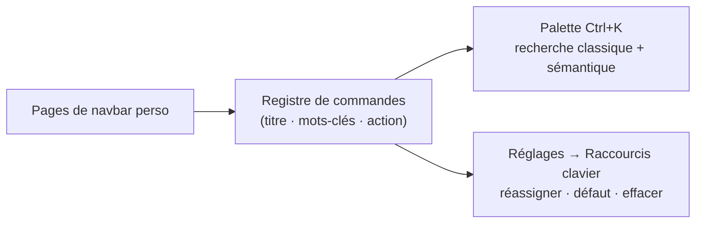

# Palette de commandes & raccourcis

Appuie sur <kbd>Ctrl</kbd>+<kbd>K</kbd> (<kbd>Cmd</kbd>+<kbd>K</kbd> sur macOS) n'importe où dans BMM
pour ouvrir la **palette de commandes** — une seule barre de recherche par-dessus toutes les pages et
toutes les actions. Tape quelques lettres, déplace-toi avec <kbd>↑</kbd> / <kbd>↓</kbd>, et appuie sur
<kbd>Entrée</kbd> pour exécuter.

## Ce qu'elle atteint

La palette est construite à partir de l'app en direct : elle correspond toujours à ce que tu as
réellement devant toi.

- **Aller à n'importe quel écran** — Bibliothèque, Profils, Modpacks, Dépôt Serveur, Listes .MM,
  App Catalog, Plugins, BetterCommunity, Help & other, Paramètres — **y compris tes propres
  [pages de navbar personnalisées](doc-page:features/plugins)**. Une page épinglée hier est cherchable aujourd'hui ;
  rien à déclarer à la main.
- **Lancer une action** sans chercher son bouton :
    - *Mods* — ajouter un mod, scanner le dossier, vérifier l'intégrité, afficher l'historique, tout activer/désactiver, vérifier les mises à jour.
    - *Profils* — nouveau profil, importer depuis OvGME / OMM, désactiver tous les profils.
    - *Dépôt Serveur* — ouvrir l'onglet Sync ou Héberger, parcourir les dépôts enregistrés, générer un serveur autonome, démarrer/arrêter le serveur intégré, ouvrir le monitoring, vérifier les dépôts suivis, copier ton ID créateur.
    - *Outils & Paramètres* — vérifier les mises à jour de l'app, relancer la visite d'accueil, ouvrir le stockage & l'espace disque, ouvrir les stats de hachage.

## Recherche classique vs. sémantique

Deux modes, à basculer dans la palette :

- **Classique** — correspondance littérale (sous-chaîne) sur le titre et les mots-clés de la commande.
- **Sémantique** — étend tes mots via une table de synonymes : `mise à jour` trouve aussi *upgrade* /
  *nouvelle version*, et `supprimer` trouve aussi *retirer*. Pratique quand tu sais *ce que* tu veux
  mais pas comment BMM l'appelle.

## Un seul registre derrière les deux

La palette et le gestionnaire de raccourcis ne sont pas deux listes qu'il faut garder synchronisées —
ce sont deux vues d'**un seul registre de commandes**. Une commande est enregistrée une fois, avec son
titre, ses mots-clés et la fonction qu'elle exécute ; la palette l'affiche comme résultat de recherche
et la page des raccourcis comme ligne réassignable.

C'est pour ça qu'une page perso ajoutée hier est cherchable *et* assignable aujourd'hui sans rien
enregistrer à la main, et pourquoi une commande ne peut jamais apparaître d'un côté et manquer de
l'autre.

## Réassigner n'importe quel raccourci

Les mêmes actions vivent dans **Paramètres → Raccourcis clavier**. Clique un raccourci, appuie sur les
touches voulues, et c'est lié ; les boutons de la ligne permettent aussi de **revenir au défaut** ou
d'**effacer**.

!!! tip "Les pages perso ont aussi des raccourcis"

    Tes pages de navbar personnalisées apparaissent dans cette liste : tu peux lier une touche qui
    saute directement à l'une d'elles. Les réassignations sont stockées par action, donc renommer ou
    réordonner la navbar les conserve.

!!! note "Utilise un modificateur"

    Les combinaisons avec <kbd>Ctrl</kbd> ou <kbd>Alt</kbd> sont recommandées — une simple lettre
    se déclencherait pendant que tu tapes dans un champ. Quand un champ de texte est actif, BMM ne
    déclenche **que** les accords portant Ctrl ou Alt ; le reste attend que tu quittes le champ.

    <kbd>Shift</kbd> ne compte pas ici. <kbd>Shift</kbd>+<kbd>S</kbd> est traité comme une lettre
    seule : il ne se déclenchera pas pendant la saisie — pratique si c'est ce que tu voulais, et
    surprenant si tu l'attendais partout.

## Arrêter quelque chose qui tourne déjà

Activer ou désactiver un mod copie des fichiers, et un gros mod prend du temps. Deux commandes
l'arrêtent :

| Commande | Par défaut | Ce qu'elle arrête |
|---|---|---|
| **Annuler l'opération en cours** | <kbd>Ctrl</kbd>+<kbd>Alt</kbd>+<kbd>Z</kbd> | Celle qui copie en ce moment. Ce qui attend derrière continue. |
| **Annuler toutes les opérations** | <kbd>Ctrl</kbd>+<kbd>Alt</kbd>+<kbd>Maj</kbd>+<kbd>Z</kbd> | Tout, y compris ce qui n'a pas commencé. |

Les deux défont ce qu'elles arrêtent — une activation à moitié faite est remise comme avant,
pas laissée à moitié appliquée — et ce sont les mêmes actions que le clic et le clic droit du
bouton Annuler.

!!! note "Pourquoi pas Ctrl+Z"

    Les raccourcis sont distribués à la capture, et un accord avec modificateur part même
    pendant que tu tapes dans un champ. <kbd>Ctrl</kbd>+<kbd>Z</kbd> lié globalement irait donc
    dans l'éditeur de tâches du planificateur annuler une étape de ton automatisation au lieu
    d'arrêter une copie. Relié-le si tu veux — c'est ton clavier — mais c'est pour ça que ce
    n'est pas le défaut.

    Appuyer dessus sans rien en cours te le dit, plutôt que de ne rien faire en silence.
