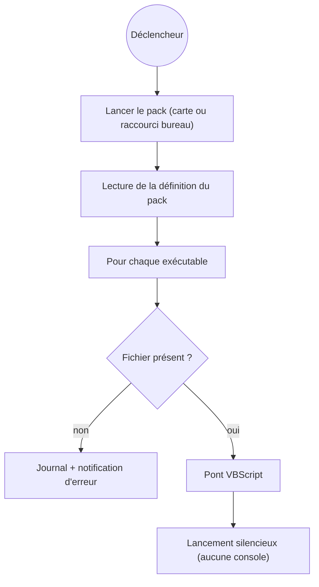

# Launch packs

Un **launch pack** est un groupe nommé d'**applications** lancées ensemble en un clic — ton jeu
plus les outils compagnons que tu ouvres toujours avec (une appli vocale, un tracker, un outil
de head-tracking…).

## En créer un

Dans **Paramètres**, crée un pack, nomme-le, puis ajoute des exécutables (`.exe`, `.bat`,
`.ps1`, `.cmd`, `.lnk`) de deux façons :

- le **sélecteur de fichiers** classique, ou
- le **sélecteur d'applis** intégré, qui liste tes programmes installés façon Steam (il lit les
  entrées d'applications installées du registre Windows et tes raccourcis du menu Démarrer,
  icônes comprises).

Ajoute une icône personnalisée si tu veux — elle est convertie en vrai `.ico`.

## Le lancer

- **Depuis la carte** dans Paramètres — chaque appli démarre **silencieusement** : aucune
  fenêtre de console qui clignote.
- **Depuis le bureau** — chaque pack reçoit aussi son propre **raccourci** généré, pour lancer
  tout le groupe sans ouvrir BMM.

Sous le capot, créer un pack génère un minuscule `launcher.vbs` qui démarre chaque exécutable
de façon invisible, et un raccourci `.lnk` qui pointe dessus :

!!! tip "Modifiable à tout moment"

    Modifier un pack régénère son lanceur et son raccourci sur place — le raccourci bureau
    continue de fonctionner. Supprimer un pack retire proprement son dossier et son raccourci.

## En donner un à quelqu'un

Le launch pack a longtemps été la seule chose dans BMM qu'on ne pouvait pas offrir. Les
modpacks, plugins, profils, thèmes, automatisations et catalogues entiers s'exportent tous ;
le pack — précisément la chose qu'on construit une fois et que quatre amis voudraient — devait
être refait à la main sur chaque machine.

**Exporter** écrit un `.bmmlaunch` depuis la carte du pack. **Importer** se trouve à côté de
*Nouveau launch pack*.

Ce que le fichier transporte, ce sont les **décisions** : le nom, quels programmes, et l'icône
inline en octets. Il ne transporte volontairement *pas* ce qu'un pack EST sur le disque — le
`launcher.vbs` est plein de chemins absolus et le `.lnk` pointe dans ton propre dossier de
données, donc rien de tout ça n'aurait de sens ailleurs. L'import régénère tout ça localement,
par le même code qui crée un pack de zéro, pour que le raccourci fonctionne sur la machine qui
l'a reçu.

!!! warning "Deux choses que l'import ne fera pas en silence"

    **Un fichier qui n'est pas des nôtres est refusé.** Un `.bmmlaunch` porte
    `kind: "bmm-launchpack"`. Un pack est une liste de programmes à lancer ; n'importe quel
    JSON avec un nom et un tableau de chaînes ne doit pas pouvoir se lire comme tel.

    **Les chemins absents ici sont signalés, pas jetés.** Un pack dont les jeux sont sur `D:`
    chez l'auteur et sur `C:` chez toi est le cas ordinaire d'un pack partagé. Importer un
    truc qui ne lance rien, et en jeter la moitié sans le dire, sont deux façons d'être pires
    que d'annoncer « 3 programmes introuvables à leur chemin sur ce PC ».

L'icône repasse par l'encodeur d'images plutôt que d'être écrite telle quelle en `icon.ico`,
et le nom par le même nettoyeur de nom de fichier qu'un nom tapé — tous deux arrivent
désormais d'un fichier écrit par un inconnu.

!!! tip "Le lire avant de le lancer"

    Colle un `.bmmlaunch` dans l'inspecteur de fichiers : il dit combien de programmes il
    lance, imprime chaque chemin exactement tel qu'écrit (sans jamais en résoudre ni en ouvrir
    un), et signale **lesquels passent par un shell** — un `.ps1` dans un pack s'exécute avec
    la stratégie d'exécution PowerShell contournée, et un `.bat` par `cmd`. Un `.exe` annonce
    qu'il est un programme ; le script de quelqu'un d'autre, non.

Un dépôt peut aussi transporter des launch packs — voir [Dépôts serveur](doc-page:features/repo.fr).

## Lancer un pack depuis l'extérieur de BMM

Un pack n'est pas seulement un bouton dans les Réglages. Il est adressable, et c'est ce qui le rend
utile dans une installation plus large :

| Depuis | Comment |
|---|---|
| Un lien, un `.bat`, un site, une autre app | `bmm://launchpack/run?id=<id du pack>` |
| L'API HTTP locale | `POST /api/launchpack/run` avec `{"id": "…"}` |
| Le planificateur | l'action *Exécuter un launch pack* — un pack peut donc partir sur un déclencheur, pas seulement sur un clic |
| Le générateur de scripts | la même action, émise en deeplink ou en appel HTTP |

Voir la [Référence des actions](doc-page:reference/actions) et la [Référence API](doc-page:reference/api).

## Pourquoi rien ne clignote

Chaque processus lancé par BMM passe par un helper qui pose le drapeau `CREATE_NO_WINDOW` de Windows.
Sans lui, les programmes console (`cmd`, `powershell`, `python`, un `.bat`…) font apparaître une
fenêtre noire une fraction de seconde en build release — exactement le genre de clignotement qu'un
utilisateur apprend à ignorer. Rendre les légitimes silencieuses est ce qui rend une fenêtre
inattendue signifiante.

!!! note "Un nom de pack est assaini avant de devenir un chemin"

    Le nom que tu tapes devient un dossier et un raccourci sur le disque, il est donc confiné au
    dossier du pack — *« pour que le raccourci ne puisse jamais être écrit hors du dossier du pack
    (ex. le dossier Démarrage auto-exécuté → persistance) »*. Cette garde existe précisément parce
    qu'un raccourci planté dans le dossier Démarrage de Windows est un mécanisme de persistance, pas
    juste un fichier égaré. Voir [Sécurité](doc-page:how-it-works/security).
