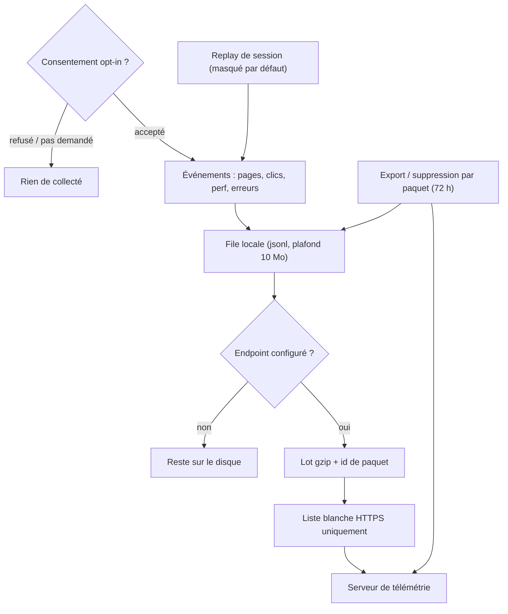
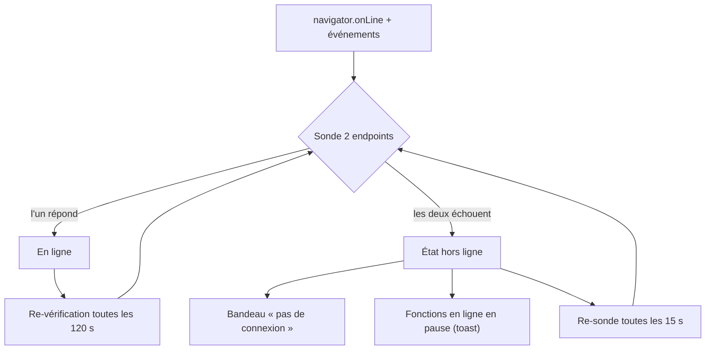

# Confidentialité, télémétrie & hors ligne

## La télémétrie est opt-in

Tant que tu n'acceptes pas explicitement la boîte de consentement, **rien n'est collecté du
tout** — le traqueur ne fait rien. Refuser (ou ne jamais répondre) = zéro donnée, et refuser
efface aussi tout ce qui aurait été mis en tampon.

## Si tu acceptes

- **Ce qui part :** pages visitées, clics (**libellés seulement — jamais ce que tu tapes**),
  échantillons de performance, erreurs, et un profil matériel anonyme. Pas de chemins de
  fichiers, pas de contenu de mods, ni nom ni e-mail ; ton identité est un id anonyme.
- Le **replay de session** (optionnel, actif par défaut quand la télémétrie l'est) enregistre
  l'UI **masquée** : noms de mods, de profils et chemins s'affichent en `••••`. Le démasquage
  est un interrupteur séparé et explicite.
- Tout s'accumule d'abord dans un **fichier local (plafond 10 Mo)** et n'est envoyé qu'en lots
  gzip via **HTTPS** — sans endpoint configuré, les données ne quittent jamais ta machine.

## À quoi ressemble vraiment un replay de session

Plutôt que de le décrire, en voici un. C'est un vrai `.bmmreplay` rejoué dans le navigateur par le
même lecteur rrweb que celui de l'app — le DOM est rejoué, ce n'est donc **pas une vidéo** : le texte
reste du texte, et tu vois le masquage à l'œuvre.

!!! note "Il se charge à la demande"

    Le lecteur ne récupère l'enregistrement que quand tu appuies sur lecture — un replay est un flux
    d'événements JSON et celui-ci pèse environ 25 Mo, il n'est donc jamais tiré à la simple ouverture
    de la page.

Remarque que les noms de mods et de profils s'affichent en `••••`. C'est le masquage par défaut, et
c'est ce qui est *enregistré* — les valeurs démasquées n'entrent jamais dans le fichier, il n'y a donc
rien à fuiter plus tard. L'interrupteur *Complet* est ce qui change ça, et il est délibérément séparé.

### Où vit un enregistrement pendant qu'il se fait

L'**enregistreur de session local** (celui qui alimente les rapports de crash et la liste des replays)
écrit sur le disque au fil de l'eau, au lieu de garder la session dans l'app :

| | |
|---|---|
| Pendant l'enregistrement | Les événements sont ajoutés à un spool sous `Spool/` dans le dossier de données, par lots de 512 Ko ou 200 événements au plus, vidés au moins toutes les 3 secondes |
| Coût mémoire | Environ un demi-mégaoctet, quelle que soit la durée — le `.bmmreplay` assemblé n'est jamais construit dans l'app, même à l'export |
| Historique conservé | Une fenêtre glissante de **512 Mo** sur le disque. Les plus vieux segments partent en premier, et chaque segment commence par un snapshot complet : ce qui reste se lit toujours |
| Si BMM est tué | Il manque au pire les dernières secondes. Une entrée finale à moitié écrite est détectée et ignorée à l'assemblage |
| Replays sauvegardés | Plafonnés séparément par tes réglages de rétention (nombre + taille totale) |

C'est pour ça qu'une session longue ou inactive ne te coûte plus rien : avant, tout restait en mémoire
et l'ensemble était re-sérialisé toutes les 45 secondes, ce qui rendait une longue session coûteuse et
la forçait à jeter son historique.

!!! note "Le Replay Studio des DevTools fonctionne autrement"

    Le Studio (un enregistrement délibéré et surveillé, avec cadre de capture, pause/reprise et trim)
    garde ses événements en mémoire, parce qu'il en a besoin pour compresser les pauses et appliquer le
    trim. Il est borné à 64 Mo et **arrête la prise** quand il y arrive, en te le disant — ce qu'il a
    déjà est complet et lisible.

## Tes contrôles (Paramètres → Confidentialité)

- Interrupteur principal, plus des interrupteurs séparés pour le rapport benchmark / matériel
  étendu (7 jours) et le replay de session.
- **Exporte** le tampon brut en JSON à tout moment.
- Consulte chaque **paquet envoyé** (noms et comptes d'événements seulement) et demande sa
  **suppression** — honorée sous 72 heures.

Les rapports de plantage et les replays enregistrés restent **locaux**, sous des limites de
rétention que tu contrôles (défaut : 30 sessions / 2 Go) — un rapport de plantage n'est partagé
que si *toi* tu l'exportes ou l'envoies.

## Mode hors ligne

BMM ne se fie pas au simple drapeau « connecté » de l'OS — il **sonde** deux endpoints légers ;
si aucun ne répond sous 5 secondes, tu es hors ligne.

- Un **bandeau « pas de connexion »** discret apparaît, et les fonctions réseau (synchros de
  dépôts, catalogues, vérifs de mise à jour) se mettent en pause avec un toast d'avertissement
  au lieu d'échouer cryptiquement.
- **Tout le local continue de fonctionner** — bibliothèque, profils, activation, mapper, thèmes.
- La reprise est automatique : hors ligne, BMM re-sonde toutes les **15 secondes** ; en ligne,
  une re-vérification toutes les 2 minutes attrape les connexions mortes en silence.

