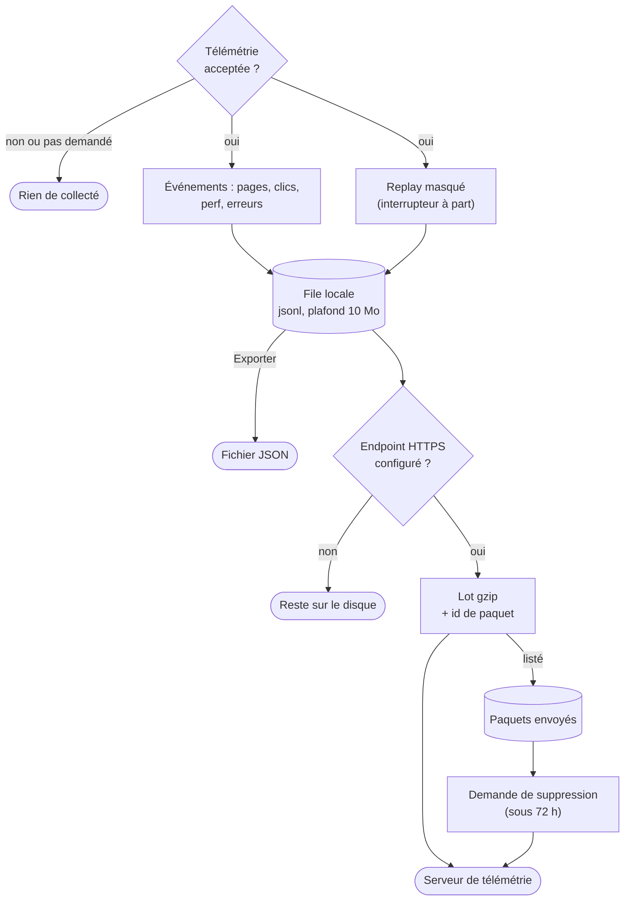
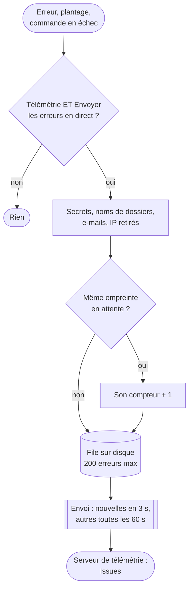
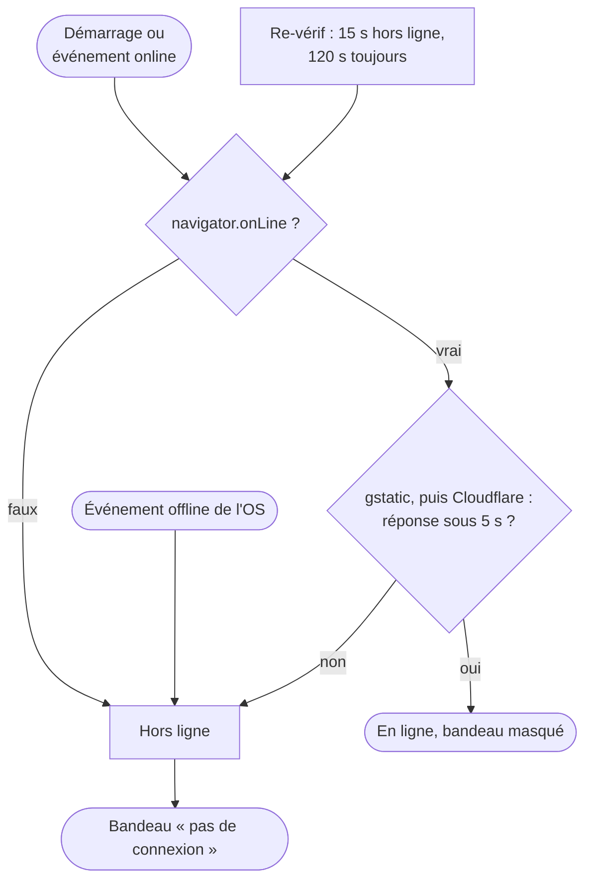

# Confidentialité, télémétrie & hors ligne

## La télémétrie est opt-in

Tant que tu n'acceptes pas explicitement la boîte de consentement, **rien n'est collecté du
tout** — le traqueur ne fait rien. Refuser (ou ne jamais répondre) = zéro donnée, et refuser
efface aussi tout ce qui aurait été mis en tampon.

La fenêtre a quatre boutons, et rien d'autre ne compte comme réponse (un clic à côté ne fait rien) :

| Bouton | Ce qu'il fait |
|---|---|
| **Tout activer** (recommandé) | Les cinq catégories ci-dessous |
| **Choisir** | Un interrupteur par catégorie, puis *Valider* |
| **Non merci** | Désactivée, mémorisé |
| **Plus tard** (ou Échap) | Rien d'enregistré, rien d'envoyé ; la question revient au prochain lancement |

```mermaid
flowchart TD
    CONSENT{"Télémétrie<br/>acceptée ?"} -- "non ou pas demandé" --> NOTHING(["Rien de collecté"])
    CONSENT -- "oui" --> EVENTS["Événements : pages, clics,<br/>perf, erreurs"]
    CONSENT -- "oui" --> REPLAY["Replay masqué<br/>(interrupteur à part)"]
    EVENTS --> QUEUE[("File locale<br/>jsonl, plafond 10 Mo")]
    REPLAY --> QUEUE
    QUEUE -- "Exporter" --> EXPORT(["Fichier JSON"])
    QUEUE --> ENDPOINT{"Endpoint HTTPS<br/>configuré ?"}
    ENDPOINT -- "non" --> LOCAL(["Reste sur le disque"])
    ENDPOINT -- "oui" --> GZIP["Lot gzip<br/>+ id de paquet"]
    GZIP --> SERVER(["Serveur de télémétrie"])
    GZIP -- "listé" --> SENT[("Paquets envoyés")]
    SENT --> DEL["Demande de suppression<br/>(sous 72 h)"]
    DEL --> SERVER
```

## Si tu acceptes

La télémétrie est découpée en catégories, chacune avec une ligne sur ce qu'elle envoie :

| Catégorie | Ce qui part |
|---|---|
| Statistiques d'utilisation | Pages et fonctions utilisées, clics, durée des sessions. Jamais ce que tu tapes |
| Performance | FPS, mémoire utilisée et temps de chargement |
| Erreurs en direct | Erreurs et plantages au moment où ils arrivent ([plus bas](#erreurs-envoyees-en-direct)) |
| Statistiques Laya | Fonction de Laya, fournisseur, vitesse, champs gardés ou refusés ; jamais de texte ([plus bas](#statistiques-dusage-de-laya)) |
| Replay de session (masqué) | La fenêtre de BMM seule, texte saisi masqué |

Deux options ne font jamais partie de *Tout activer* : le **rapport matériel hebdomadaire**
(identifiants matériels précis) et le **replay non masqué**. La liste complète, avec le contenu de
chacune, est dans la
[politique de confidentialité](https://github.com/FreeProject089/BetterModsManager/blob/main/PRIVACY_FR.md).

**Pas de recherche d'IP ni de localisation.** BMM ne met aucune adresse IP dans ce qu'il envoie
(ni l'adresse locale, ni l'adresse publique) et ne demande jamais à un service tiers où tu es. Le
serveur de télémétrie ne voit que l'adresse d'où vient la connexion, comme tout serveur web, et ne
la garde que réduite à son réseau.

- Le **replay de session** (actif par défaut quand la télémétrie l'est) enregistre
  l'UI **masquée** : noms de mods, de profils et chemins s'affichent en `••••`. Le démasquage
  est un interrupteur séparé et explicite.
- Tout s'accumule d'abord dans un **fichier local (plafond 10 Mo)** et n'est envoyé qu'en lots
  gzip via **HTTPS** — sans endpoint configuré, les données ne quittent jamais ta machine.

## À quoi ressemble vraiment un replay de session

Plutôt que de le décrire, en voici un. C'est un vrai `.bmmreplay` rejoué dans le navigateur par le
même lecteur rrweb que celui de l'app — le DOM est rejoué, ce n'est donc **pas une vidéo** : le texte
reste du texte, et tu vois le masquage à l'œuvre.

!!! note "Il se charge à la demande"

    Le lecteur ne récupère l'enregistrement que quand tu appuies sur lecture — un replay est un flux
    d'événements JSON et celui-ci pèse environ 25 Mo, il n'est donc jamais tiré à la simple ouverture
    de la page.

Remarque que les noms de mods et de profils s'affichent en `••••`. C'est le masquage par défaut, et
c'est ce qui est *enregistré* — les valeurs démasquées n'entrent jamais dans le fichier, il n'y a donc
rien à fuiter plus tard. L'interrupteur *Complet* est ce qui change ça, et il est délibérément séparé.

### Où vit un enregistrement pendant qu'il se fait

L'**enregistreur de session local** (celui qui alimente les rapports de crash et la liste des replays)
écrit sur le disque au fil de l'eau, au lieu de garder la session dans l'app :

| | |
|---|---|
| Pendant l'enregistrement | Les événements sont ajoutés à un spool sous `Spool/` dans le dossier de données, par lots de 512 Ko ou 200 événements au plus, vidés au moins toutes les 3 secondes |
| Coût mémoire | Environ un demi-mégaoctet, quelle que soit la durée — le `.bmmreplay` assemblé n'est jamais construit dans l'app, même à l'export |
| Historique conservé | Une fenêtre glissante de **512 Mo** sur le disque. Les plus vieux segments partent en premier, et chaque segment commence par un snapshot complet : ce qui reste se lit toujours |
| Si BMM est tué | Il manque au pire les dernières secondes. Une entrée finale à moitié écrite est détectée et ignorée à l'assemblage |
| Replays sauvegardés | Plafonnés séparément par tes réglages de rétention (nombre + taille totale) |

C'est pour ça qu'une session longue ou inactive ne te coûte plus rien : avant, tout restait en mémoire
et l'ensemble était re-sérialisé toutes les 45 secondes, ce qui rendait une longue session coûteuse et
la forçait à jeter son historique.

!!! note "Le Replay Studio des DevTools fonctionne autrement"

    Le Studio (un enregistrement délibéré et surveillé, avec cadre de capture, pause/reprise et trim)
    garde ses événements en mémoire, parce qu'il en a besoin pour compresser les pauses et appliquer le
    trim. Il est borné à 64 Mo et **arrête la prise** quand il y arrive, en te le disant — ce qu'il a
    déjà est complet et lisible.

## Erreurs envoyées en direct

Un interrupteur à part, **Envoyer les erreurs en direct**, permet à BMM de signaler une erreur à
l'équipe en quelques secondes, sans attendre un rapport de bug. Il ne marche que si la télémétrie
est activée : couper la télémétrie l'arrête et efface ce qui attendait d'être envoyé.

- **Activé avec la télémétrie.** Accepter la télémétrie l'active (*Tout activer*, ou
  l'interrupteur principal des Paramètres). *Choisir* permet de le laisser désactivé, et
  Paramètres → Confidentialité le coupe seul.
- **Ce qui est envoyé.** Les erreurs JavaScript, les plantages côté Rust, les commandes en échec
  sur une vraie erreur (une annulation, une absence de réseau ou un message déjà affiché ne sont pas
  signalés), et les déploiements, installations, sauvegardes et tâches planifiées en échec. Pour
  chacun : le message d'erreur, l'endroit du code de BMM concerné (fonction et fichier, sans numéro
  de ligne), la version de BMM et le système. Pour un plantage, le *nom* du rapport de plantage
  local, jamais son contenu.
- **Nettoyé sur ton PC d'abord.** Tous les secrets que BMM stocke (jetons, clés, ta clé
  BetterCommunity), le nom de ton dossier utilisateur, les adresses e-mail, les adresses IP et le
  nom de ton PC sont retirés avant tout envoi. Le serveur de télémétrie les retire une seconde fois
  à l'arrivée.
- **Regroupé, pas répété.** La même erreur dans les 10 minutes ajoute seulement 1 à un compteur.
  Au plus 60 nouvelles erreurs par heure sont envoyées, la file d'attente est limitée à 200 erreurs distinctes
  et gardée sur disque, pour qu'un PC hors ligne l'envoie plus tard.
- **Pas relié à ta télémétrie.** Le rapport porte une empreinte à sens unique de ton identifiant
  d'installation, que le tableau de bord ne peut rapprocher de rien d'autre. Une demande d'accès
  ou d'effacement le couvre quand même.

```mermaid
flowchart TD
    ERR(["Erreur, plantage,<br/>commande en échec"]) --> SWITCH{"Télémétrie ET Envoyer<br/>les erreurs en direct ?"}
    SWITCH -- "non" --> DROP(["Rien"])
    SWITCH -- "oui" --> CLEAN["Secrets, noms de dossiers,<br/>e-mails, IP retirés"]
    CLEAN --> SEEN{"Même empreinte<br/>en attente ?"}
    SEEN -- "oui" --> COUNT["Son compteur + 1"]
    SEEN -- "non" --> QUEUE[("File sur disque<br/>200 erreurs max")]
    COUNT --> QUEUE
    QUEUE --> SEND[["Envoi : nouvelles en 3 s,<br/>autres toutes les 60 s"]]
    SEND --> SERVER(["Serveur de télémétrie :<br/>Issues"])
```

## Statistiques d'usage de Laya

Une catégorie à part, pour que l'équipe voie si Laya aide vraiment. Sans contenu : pour chaque
utilisation d'une fonction de Laya, BMM envoie la fonction, où elle a tourné (intégrée, serveur
BetterCommunity, ton propre serveur, une API externe, ou des règles), une tranche de latence, si
elle a répondu ou s'est abstenue, le **nom** des champs suggérés et ceux que tu as gardés, le nombre
de résultats de Demander à Laya et le *type* de résultat ouvert, l'installation ou la suppression du
modèle, et les erreurs sous forme de codes courts.

Jamais ta question, la valeur d'une suggestion, un nom de mod, de fichier ou de profil, un
identifiant ni un message d'erreur. L'équipe les lit sur la page **Laya** du tableau de bord de
télémétrie (adoption, acceptation par champ, latence, fournisseurs, erreurs).

## Tes contrôles (Paramètres → Confidentialité)

- Interrupteur principal, puis un interrupteur par catégorie (avec **Tout activer** quand l'une est
  coupée), plus le rapport matériel hebdomadaire et le replay non masqué.
- **Exporte** le tampon brut en JSON à tout moment.
- Consulte chaque **paquet envoyé** (noms et comptes d'événements seulement) et demande sa
  **suppression** — honorée sous 72 heures.

Les rapports de plantage et les replays enregistrés restent **locaux**, sous des limites de
rétention que tu contrôles (défaut : 30 sessions / 2 Go) — un rapport de plantage n'est partagé
que si *toi* tu l'exportes ou l'envoies.

## Mode hors ligne

BMM ne se fie pas au simple drapeau « connecté » de l'OS — il **sonde** deux endpoints légers ;
si aucun ne répond sous 5 secondes, tu es hors ligne.

- Un **bandeau « pas de connexion »** discret apparaît. C'est un avis, pas un verrou : les
  fonctions réseau (synchros de dépôts, catalogues, vérifs de mise à jour) ne sont pas coupées,
  donc celle que tu lances hors ligne échoue avec sa propre erreur.
- **Tout le local continue de fonctionner** — bibliothèque, profils, activation, mapper, thèmes.
- La reprise est automatique : hors ligne, BMM re-sonde toutes les **15 secondes**, et une
  re-vérification toutes les 2 minutes, en ligne ou non, attrape les connexions mortes en silence.

```mermaid
flowchart TD
    START(["Démarrage ou<br/>événement online"]) --> NAV{"navigator.onLine ?"}
    TIMER["Re-vérif : 15 s hors ligne,<br/>120 s toujours"] --> NAV
    NAV -- "vrai" --> PROBE{"gstatic, puis Cloudflare :<br/>réponse sous 5 s ?"}
    NAV -- "faux" --> OFF["Hors ligne"]
    OSOFF(["Événement offline de l'OS"]) --> OFF
    PROBE -- "oui" --> ON(["En ligne, bandeau masqué"])
    PROBE -- "non" --> OFF
    OFF --> BANNER(["Bandeau « pas de connexion »"])
```
