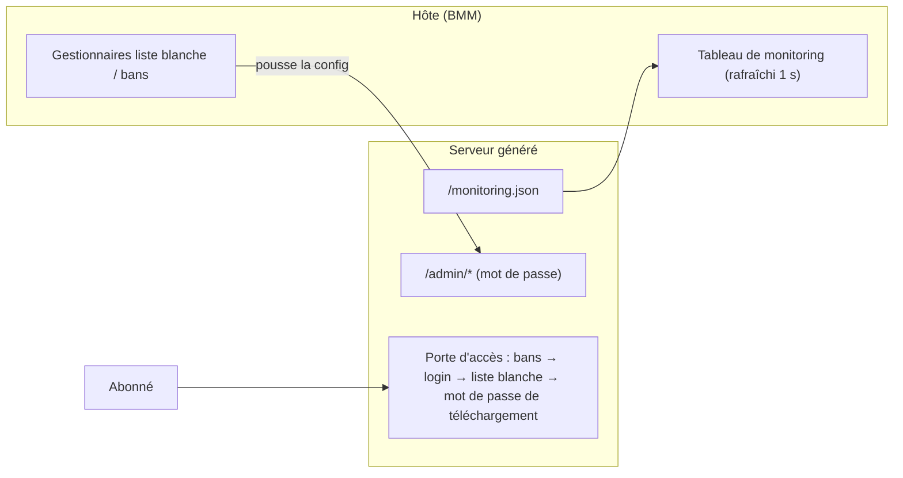

# Dépôt Serveur

Un **Dépôt Serveur** est une collection de mods partagée et versionnée. Deux flux le
traversent : tu **synchronises** des mods *depuis* un dépôt vers un profil, et BMM s'en sert
pour te prévenir quand ces mods ont une **mise à jour**. Tu peux aussi en **héberger** un
toi-même. Sans dépôt, un mod installé à la main reste à la version installée, indéfiniment, en
silence.

> Parcourir les dépôts serveur — dépôts officiels et partenaires.

| | | |
|---|---|---|
| **1** | **Liste des dépôts** | Les sources que tu as ajoutées. |
| **2** | **Parcourir** | Dépôts officiels et partenaires. |
| **3** | **Ajouter** | Pointe BMM vers l'URL d'un dépôt. |

## Se connecter à un dépôt

Parcours la liste officielle et partenaire, ou colle une URL de dépôt directement. Une fois
connecté, les mods du dépôt apparaissent dans ta [Bibliothèque](doc-page:features/library) à côté des tiens,
marqués du nom du dépôt.

## Synchroniser les mods d'un dépôt

Un dépôt protégé demande son **mot de passe de téléchargement** une fois — et si tu sais
déjà que le dépôt est protégé, ouvre la ligne *« Ce dépôt a un mot de passe de
téléchargement »* sous le champ URL et tape-le avant Fetch, au lieu de récupérer, échouer,
puis taper. Un serveur **sans `repo.json`** fonctionne aussi : Fetch lit son index de
dossiers à la place, et chaque mod trouvé s'installe marqué *non vérifié*, la carte le
disant en toutes lettres.

La synchro tire les mods du dépôt sur ta machine et dans un profil. BMM fait une
**synchro delta** : il compare ce que le dépôt a avec ce que tu as déjà et ne télécharge **que
les fichiers modifiés** — mettre à jour un dépôt de 5 Go après un petit patch coûte quelques
mégaoctets, pas cinq gigas. Une longue synchro peut être **annulée** en cours de route, et tu
peux plafonner sa vitesse de téléchargement pour ne pas saturer ta connexion.

## Détection de mises à jour

Une fois un mod lié à un dépôt, *Vérifier les mises à jour de mods* compare ta version
installée à la version courante du dépôt et propose la mise à jour quand elles diffèrent. Lier
est une étape distincte de se connecter :

> Lie ce mod à un ou plusieurs dépôts pour que BMM détecte ses mises à jour.

Un mod peut viser plusieurs dépôts. C'est voulu : si une source disparaît, le mod reste suivi
par l'autre. Il existe aussi un réglage de **dépôts de mise à jour globaux** dans les
[Paramètres](doc-page:features/settings) — mettez-y un dépôt et il s'ajoute à la vérification de chaque mod
qui porte **déjà** un identifiant de mod de dépôt.

!!! warning "Un dépôt global n'atteint que les mods déjà reliés"

    L'application énonce la règle : un dépôt global est apparié *par le `repo_mod_id` du mod*.
    Un mod que vous avez ajouté à la main depuis un `.zip` n'en a pas, donc aucun dépôt global
    ne le trouvera — reliez ce mod à un dépôt une fois, et les globaux s'appliquent ensuite.

### Un téléchargement direct n'a pas de version

À comprendre, parce que ça ressemble à un bug sans en être un :

> Aucune mise à jour détectée. Un téléchargement direct n'a pas de version, BMM ne peut donc
> pas savoir s'il est plus récent.

L'URL d'un fichier brut ne porte aucun numéro de version : BMM n'a rien à comparer. Il propose
un **retéléchargement direct** plutôt que de faire semblant de savoir. Pour une vraie détection
de mises à jour, lie le mod à un dépôt qui publie des versions.

## Héberger ton propre dépôt

Tu peux transformer tes propres mods en un dépôt d'où d'autres synchronisent. L'onglet Host
est séparé en deux : **produire le `repo.json`**, puis **servir les fichiers**.

### Trois façons de produire le manifeste

Ce sont des alternatives — choisis celle qui correspond à l'endroit où tes mods se trouvent
déjà.

| Voie | Ce qu'elle fait | Quand l'utiliser |
|---|---|---|
| **Export complet** | Copie chaque mod dans un dossier de sortie, à côté du manifeste. | Tu pars de zéro ; les mods sont sur cette machine. |
| **Manifeste seul** | Écrit seulement `repo.json` pour des dossiers que BMM peut lire ici — un, plusieurs, ou un ensemble de profils. **Rien n'est copié.** | Les mods sont déjà là où tu les veux. |
| **Mettre à jour depuis le serveur** | Lit l'index de ton serveur et écrit le manifeste sans rapatrier le dépôt. | Les mods n'existent que sur le serveur. |

Quelle que soit la voie, le manifeste liste chaque mod, sa version, les hachages SHA-256 par
fichier (plus des hachages de blocs de 4 Mo sur les gros fichiers) et le changelog éventuel,
et il est **signé avec ta clé de créateur** — pour que quiconque le synchronise confirme qu'il
vient de toi et n'a pas été altéré. Chaque génération resigne, y compris les mises à jour.

**Ton serveur n'a pas à bouger.** Le manifeste porte un gabarit de disposition — `{id}` et
`{path}`, par défaut `mods/{id}/{path}` — donc des fichiers déjà servis sous, par exemple,
`addons/<mod>/` sont décrits plutôt que déplacés. En *Manifeste seul*, la disposition est
déduite de la position du manifeste par rapport au dossier, si bien que `repo.json` et le
dossier restent portables ensemble.

**Plusieurs dossiers, un seul dépôt.** *Manifeste seul* prend une liste : ajoute autant de
dossiers de mods que tu veux, ou passe en *Depuis des profils* et coche-en plusieurs — des
profils rangés dans des dossiers de mods différents n'ont plus à devenir des dépôts séparés.
L'id d'un mod est son nom de dossier : deux dossiers contenant un dossier du même nom
décriraient deux choses différentes sous une seule id — la paire est signalée et rien n'est
écrit, plutôt que fusionnée en un dépôt où la moitié des fichiers répondent 404. Avec plus
d'un dossier la disposition n'est plus déduite (il n'y a pas de répertoire unique d'où la
déduire) — `mods/{id}/{path}` par défaut s'applique, et le rapport dit ce que chaque dossier
a apporté, y compris ceux qui n'ont rien apporté.

### Mettre à jour

Relance la même génération. Le dépôt garde son identité — même seed, même id — donc les
abonnés voient une mise à jour et non un dépôt inconnu, et on te dit ce qui a été **ajouté**,
**modifié** et **retiré**. Ce dernier compte : un chemin mal tapé écrit un manifeste
parfaitement valide décrivant un serveur vide.

Il n'y a aucun numéro de version à incrémenter ; les changements sont détectés par hachage.

*Mettre à jour depuis le serveur* va plus loin : elle compare les tailles et dates du listing
à ton dernier manifeste et ne télécharge que ce qui a réellement changé, réutilisant le
hachage enregistré pour le reste. Elle sépare **ce qui manque au manifeste** de ce qui a
simplement changé — un dépôt incomplet et un dépôt périmé sont deux problèmes différents.
Elle écrit `repo.json` en local ; tu envoies ce seul fichier avec le client dont tu te sers
déjà, donc BMM n'a jamais besoin d'un accès en écriture à ton serveur.

Tu n'as pas besoin d'un manifeste local pour commencer. Donne-lui une URL de base et, si le
serveur publie déjà un `repo.json`, BMM va le chercher comme point de départ à la place de ta
dernière copie — un dépôt que tu héberges mais dont tu n'as plus le manifeste sur cette
machine reste donc mettable à jour, et une machine qui n'a jamais vu le dépôt peut en produire
un correct. Sans chemin local, le résultat est écrit dans `RemoteRepos/` plutôt qu'à côté de
fichiers que tu n'as pas choisis.

!!! note "Nécessite l'index de répertoire"
    *Mettre à jour depuis le serveur* lit l'index de ton serveur : `autoindex on` (nginx) ou
    l'équivalent doit être activé. Sans lui, BMM ne peut pas voir ce que le serveur contient.

**Héberger.** Sers le dépôt généré via le serveur HTTP intégré de BMM pour que d'autres y
accèdent. Des options facultatives le rendent public sans gymnastique de port-forwarding :

| Option | Rôle |
|---|---|
| **Tunnel Cloudflare** | Expose ton serveur local à une URL publique sans config routeur. |
| **UPnP** | Ouvre le port sur ton routeur automatiquement, pour une connexion directe. |
| **Limite d'upload** | Plafonne la vitesse sortante pour que l'hébergement n'affame pas ta connexion. |
| **Mot de passe de téléchargement** | Optionnel. Les abonnés doivent le saisir à la première connexion (envoyé en `X-Repo-Password`) ; vide = dépôt ouvert. Distinct du mot de passe admin. |

Les propriétaires disposent aussi d'un **contrôle d'accès** — listes d'autorisation et bans
par IP, par clé de créateur, ou par **compte BetterCommunity** — pour qu'un dépôt privé reste
privé.

Les entrées par compte sont à préférer. `X-Creator-ID` est fourni par l'appelant : un ban
dessus se contourne en retirant l'en-tête, et une liste d'autorisation se franchit en
réclamant un id qui y figure. Une entrée par compte est vérifiée contre une attestation
courte signée par BetterCommunity et validée hors ligne, et elle correspond à **tous** les
identifiants de ce compte — son bcid, ses clés de créateur et ses comptes Discord liés — donc
bannir le compte suit la personne plutôt qu'un seul de ses pseudonymes. Ces entrées ne
s'appliquent que si le dépôt exige un compte, seul cas où une identité signée existe.

## Panneau d'admin & monitoring

L'hébergement s'accompagne de deux outils côté hôte, tous deux sur l'écran Dépôt Serveur :

**Monitoring** — un tableau en direct rafraîchi chaque seconde : IP de chaque client connecté,
creator ID, protocole (**Local / LAN / WAN**), fichier en cours avec progression et vitesse,
plus les sessions inactives et les totaux (clients, vitesse cumulée, fichiers actifs). Depuis
chaque ligne, tu peux **autoriser** (liste blanche) ou **bannir** ce client en un clic. Il
agrège aussi le `monitoring.json` d'un serveur autonome en cours — les deux serveurs au même
endroit.

**Liste blanche & bans** — deux gestionnaires avec recherche, ajout manuel (par IP et/ou clé
créateur), retrait en un clic et export JSON. La liste blanche a un interrupteur on/off :
off = tout le monde peut télécharger (moins les bannis) ; on = seules les identités listées
passent.

Le serveur autonome généré expose les endpoints correspondants :

| Endpoint | Accès |
|---|---|
| `/dashboard`, `/monitoring.json` | Public, état en lecture seule. |
| `/admin/data`, `/admin/update`, `/admin/logs` | Mot de passe admin (header Authorization, comparaison en temps constant). |

### Publier une nouvelle version

Quand tu mets à jour tes mods, utilise **Mettre à jour un dépôt existant** : un flux
incrémental qui monte les versions et te laisse écrire un changelog par mod (montré aux
utilisateurs quand la mise à jour est détectée). Il ne réécrit que ce qui a changé, en miroir
de la synchro delta côté téléchargement. Le pas-à-pas côté auteur vit dans le guide développeur
*Rendre ton mod actualisable*.
