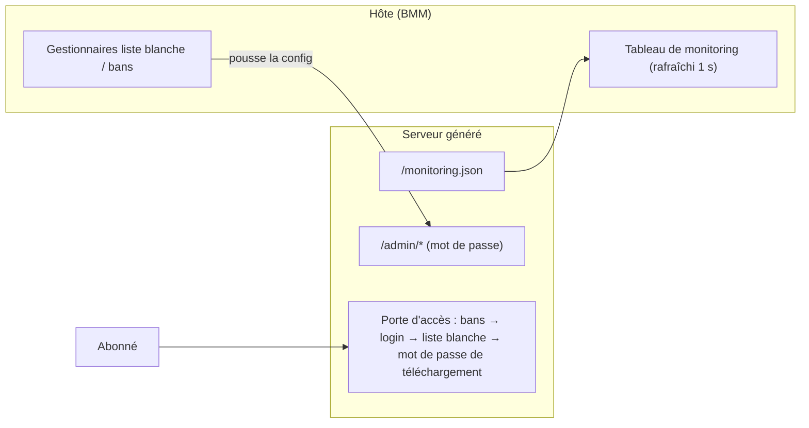

# Dépôt Serveur

Un **Dépôt Serveur** est une collection de mods partagée et versionnée. Deux flux le
traversent : tu **synchronises** des mods *depuis* un dépôt vers un profil, et BMM s'en sert
pour te prévenir quand ces mods ont une **mise à jour**. Tu peux aussi en **héberger** un
toi-même. Sans dépôt, un mod installé à la main reste à la version installée, indéfiniment, en
silence.

> Parcourir les dépôts serveur — dépôts officiels et partenaires.

| | | |
|---|---|---|
| **1** | **Liste des dépôts** | Les sources que tu as ajoutées. |
| **2** | **Parcourir** | Dépôts officiels et partenaires. |
| **3** | **Ajouter** | Pointe BMM vers l'URL d'un dépôt. |

## Se connecter à un dépôt

Parcours la liste officielle et partenaire, ou colle une URL de dépôt directement. Une fois
connecté, les mods du dépôt apparaissent dans ta [Bibliothèque](doc-page:features/library) à côté des tiens,
marqués du nom du dépôt.

## Synchroniser les mods d'un dépôt

La synchro tire les mods du dépôt sur ta machine et dans un profil. BMM fait une
**synchro delta** : il compare ce que le dépôt a avec ce que tu as déjà et ne télécharge **que
les fichiers modifiés** — mettre à jour un dépôt de 5 Go après un petit patch coûte quelques
mégaoctets, pas cinq gigas. Une longue synchro peut être **annulée** en cours de route, et tu
peux plafonner sa vitesse de téléchargement pour ne pas saturer ta connexion.

## Détection de mises à jour

Une fois un mod lié à un dépôt, *Vérifier les mises à jour de mods* compare ta version
installée à la version courante du dépôt et propose la mise à jour quand elles diffèrent. Lier
est une étape distincte de se connecter :

> Lie ce mod à un ou plusieurs dépôts pour que BMM détecte ses mises à jour.

Un mod peut viser plusieurs dépôts. C'est voulu : si une source disparaît, le mod reste suivi
par l'autre. Il existe aussi un réglage de **dépôts de mise à jour globaux** dans les
[Paramètres](doc-page:features/settings) — mets-y un dépôt et *chaque* mod installé est vérifié contre lui.

### Un téléchargement direct n'a pas de version

À comprendre, parce que ça ressemble à un bug sans en être un :

> Aucune mise à jour détectée. Un téléchargement direct n'a pas de version, BMM ne peut donc
> pas savoir s'il est plus récent.

L'URL d'un fichier brut ne porte aucun numéro de version : BMM n'a rien à comparer. Il propose
un **retéléchargement direct** plutôt que de faire semblant de savoir. Pour une vraie détection
de mises à jour, lie le mod à un dépôt qui publie des versions.

## Héberger ton propre dépôt

Tu peux transformer tes propres mods en un dépôt d'où d'autres synchronisent. Ça se fait en
deux étapes :

**Générer.** BMM construit un dépôt à partir des profils que tu choisis — un dossier `mods/`
plus un manifeste `repo.json` qui liste chaque mod, sa version, les hachages SHA-256 par
fichier, et un changelog d'auteur. Le manifeste est **signé cryptographiquement avec ta clé de
créateur**, pour que quiconque le synchronise puisse confirmer qu'il vient bien de toi et n'a
pas été altéré.

**Héberger.** Sers le dépôt généré via le serveur HTTP intégré de BMM pour que d'autres y
accèdent. Des options facultatives le rendent public sans gymnastique de port-forwarding :

| Option | Rôle |
|---|---|
| **Tunnel Cloudflare** | Expose ton serveur local à une URL publique sans config routeur. |
| **UPnP** | Ouvre le port sur ton routeur automatiquement, pour une connexion directe. |
| **Limite d'upload** | Plafonne la vitesse sortante pour que l'hébergement n'affame pas ta connexion. |
| **Mot de passe de téléchargement** | Optionnel. Les abonnés doivent le saisir à la première connexion (envoyé en `X-Repo-Password`) ; vide = dépôt ouvert. Distinct du mot de passe admin. |

Les propriétaires disposent aussi d'un **contrôle d'accès** — listes blanches et bans par IP
ou clé de créateur — pour qu'un dépôt privé reste privé.

## Panneau d'admin & monitoring

L'hébergement s'accompagne de deux outils côté hôte, tous deux sur l'écran Dépôt Serveur :

**Monitoring** — un tableau en direct rafraîchi chaque seconde : IP de chaque client connecté,
creator ID, protocole (**Local / LAN / WAN**), fichier en cours avec progression et vitesse,
plus les sessions inactives et les totaux (clients, vitesse cumulée, fichiers actifs). Depuis
chaque ligne, tu peux **autoriser** (liste blanche) ou **bannir** ce client en un clic. Il
agrège aussi le `monitoring.json` d'un serveur autonome en cours — les deux serveurs au même
endroit.

**Liste blanche & bans** — deux gestionnaires avec recherche, ajout manuel (par IP et/ou clé
créateur), retrait en un clic et export JSON. La liste blanche a un interrupteur on/off :
off = tout le monde peut télécharger (moins les bannis) ; on = seules les identités listées
passent.

Le serveur autonome généré expose les endpoints correspondants :

| Endpoint | Accès |
|---|---|
| `/dashboard`, `/monitoring.json` | Public, état en lecture seule. |
| `/admin/data`, `/admin/update`, `/admin/logs` | Mot de passe admin (header Authorization, comparaison en temps constant). |

### Publier une nouvelle version

Quand tu mets à jour tes mods, utilise **Mettre à jour un dépôt existant** : un flux
incrémental qui monte les versions et te laisse écrire un changelog par mod (montré aux
utilisateurs quand la mise à jour est détectée). Il ne réécrit que ce qui a changé, en miroir
de la synchro delta côté téléchargement. Le pas-à-pas côté auteur vit dans le guide développeur
*Rendre ton mod actualisable*.
