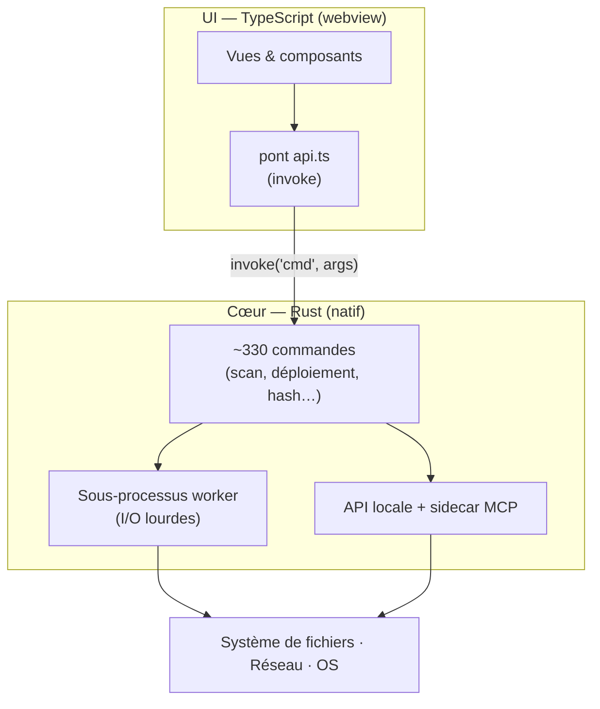

# Architecture

BMM est une **application native de bureau qui a une interface web** — pas un navigateur qui se fait
passer pour une app. Ce seul choix explique pourquoi il démarre vite, tourne au repos à quelques
dizaines de Mo, et peut hacher des gigaoctets sans se figer.

Cette page est la version longue : ce qu'est la stack, et — là où le code le dit — **pourquoi**.
Chaque justification citée ci-dessous est un commentaire du code source, pas une reconstruction.

---

## Les trois couches

- **UI (TypeScript)** — tout ce que tu vois. Elle ne touche jamais au disque directement ; elle
  demande au cœur de le faire. L'état vit dans le cœur, donc l'UI peut être rechargée sans rien
  perdre.
- **Cœur (Rust)** — scan, hachage, copie, réseau. Du code natif, donc rapide et sobre en mémoire.
- **Le pont** — un unique canal typé `invoke(commande, args)`. Si le pont n'est pas encore prêt au
  démarrage, les appels **attendent** au lieu d'échouer :

    > *« Le pont est câblé par loadTauri(), mais du code de boot (ex. loadLinks →
    > fetch_links_json) peut appeler invoke AVANT que loadTauri() ait tourné. Plutôt que de les
    > faire échouer sur "Tauri bridge not initialized", invoke() attend d'abord cette promesse… »*

### Pourquoi pas Electron ?

Une app Electron embarque une copie entière de Chromium (~150 Mo) et exécute sa logique en
JavaScript. BMM utilise le **webview de l'OS** et fait le travail lourd en Rust — une fraction de la
taille et de la mémoire, avec des opérations fichier à vitesse native.

Le webview est ensuite dégraissé, avant même son démarrage :

> *« Réductions RAM WebView2 — à poser AVANT le démarrage de WebView2. Retire ~50-150 Mo de
> l'empreinte WebView2 en désactivant ce dont BMM ne se sert pas : AudioServiceOutOfProcess…
> extensions / background pages… Translate / sync / default apps… background-networking…
> renderer-process-limit=2 »*

La fenêtre DevTools est fermable pour la même raison — c'est *« le processus msedgewebview2
"DevTools" d'environ 480 Mo »*, il ne reste donc résident que tant qu'il est ouvert.

### Pas de bundler, pas de framework

Le frontend est du TypeScript compilé **1:1** vers `frontend/js/` — mêmes dossiers, mêmes noms de
fichiers, aucune étape de bundling. `frontendDist` pointe sur l'arborescence source,
`beforeBuildCommand` est vide, et le webview charge un unique module ES d'entrée puis résout le reste
nativement. C'est `withGlobalTauri` qui rend ça possible : l'API JS de Tauri arrive comme une
globale, donc rien n'a besoin d'être bundlé pour l'atteindre.

!!! note "Celui-là n'est pas documenté dans le code"

    Il n'existe aucun commentaire expliquant le choix « sans bundler / sans framework » — cette page
    ne va donc pas inventer une justification. Ce qui *est* imposé, ce sont ses conséquences : parce
    que l'artefact livré est le `frontend/js/` compilé, le test de contrat du kit UI tourne
    délibérément sur la sortie compilée *« pour exercer exactement ce qui est livré »*.

---

## Trois processus

| Processus | Ce que c'est |
|---|---|
| **Fenêtre principale** | 1480×960, `decorations: false`, `transparent: true` — la barre de titre est celle de BMM |
| **Sidecar MCP** | `bmm-mcp-server`, également le CLI complet (`serve`, `profiles`, `mods`, `enable`, `crashes`, `generate-repo`, `api`…) |
| **Worker mod-IO** | Le même binaire ré-exécuté en `--mod-worker IN OUT` pour les copies lourdes |

### Pourquoi le worker est un processus séparé

> *« Pour garder l'UI de BMM réactive lors de l'application / désapplication de gros mods sur le
> disque système, les I/O fichier lourdes sont déléguées à un processus worker séparé (ré-exécute le
> même exe avec `--mod-worker IN OUT`). Le worker tourne en priorité I/O BACKGROUND sous Windows, le
> noyau garde donc de la bande passante disque pour le processus UI. Annuler = un `taskkill /T` du
> PID du worker — instantané et fiable, quel que soit le degré de blocage des I/O. »*

Trois détails en découlent :

- Le worker **court-circuite avant le boot de Tauri** — *« faire les I/O fichier lourdes et sortir
  sans démarrer Tauri, WebView2, ni quoi que ce soit d'autre. »*
- Il rétrograde lui-même sa priorité I/O (`PROCESS_MODE_BACKGROUND_BEGIN`).
- Les codes de sortie sont le protocole : `0` ok, non nul erreur, **`3` annulé**. Annuler un worker
  annulable lance aussi *« un sous-processus d'annulation en opération inverse pour que toute
  écriture partielle soit revertie. »*

### Pourquoi le sidecar MCP est un `[[example]]` cargo

Parce qu'en `[[bin]]` il cassait l'installeur :

> *« tauri-bundler récolte chaque `[[bin]]` cargo dans l'installeur, mais il IGNORE les examples. En
> `[[bin]]` ça entrait en collision avec le sidecar externalBin du même nom → WiX light.exe LGHT0091
> "Duplicate symbol Component:bmm_mcp_server.exe" → le MSI échouait au bundling. »*

---

## Données & état

`data.json` est un document unique : profils, mods, profil actif, tags, limites disque, réglages,
launch packs, plugins, permissions, modpacks. Chaque champ au-delà des premiers est
`#[serde(default)]`, le schéma évolue donc sans migrations.

À côté, de l'état délibérément **jamais persisté** :

> *« Cache pour la détection de conflits en O(1) (en mémoire uniquement, pas sauvegardé dans le
> JSON) »*

### Les écritures sont crash-safe par construction

> *« Écriture crash-safe : écrire dans un fichier temporaire, fsync, puis renommer atomiquement
> par-dessus la cible. Une écriture interrompue ne peut jamais laisser un fichier à moitié écrit. »*

Et la sauvegarde tournante en dépend exactement :

> *« Faire tourner le fichier courant valide vers .bak AVANT de le remplacer. Parce que l'écriture
> ci-dessous est atomique (temp + rename), le data.json vivant est toujours un fichier complet, donc
> la sauvegarde est toujours une version antérieure complète. »*

Au chargement :

> *« Charger data.json, en récupérant depuis le `.bak` tournant si le fichier principal est corrompu
> ou absent — et NE JAMAIS réinitialiser silencieusement quand une bonne sauvegarde existe. Un
> fichier principal corrompu est conservé sous `data.corrupt-<ts>.json` pour analyse. »*

!!! note "Pourquoi un document JSON et pas une base de données ?"

    Également non documenté dans le code. Ce que le code *documente*, en revanche, c'est la stratégie
    de durabilité qui tient lieu des garanties d'une base : écriture atomique, `fsync` avant le
    rename, un `.bak` tournant, conservation du fichier corrompu, et évolution de schéma par
    `serde(default)`. À lire comme *un document JSON unique avec une sémantique d'écriture
    quasi-ACID faite main* — ce qui est une description exacte, et honnête.

### Discipline de verrouillage

Le seul endroit où un ordre est énoncé : **Data → LastUpdate → Cache → Index**. Partout ailleurs la
règle est *relâcher le verrou avant toute opération lente*, et les commentaires disent pourquoi :

> *« Relâcher tous les verrous AVANT de hacher pour qu'aucune autre commande ne bloque pendant qu'on
> lit le contenu des fichiers (c'est ce qui figeait l'UI sur les gros mods). »*

> *« On ne les hache PAS ici (ça tournerait sous 4 verrous tenus et pourrait figer l'UI sur un gros
> mod) ; on les enregistre et on hache APRÈS la libération des verrous. »*

Le motif a un nom dans le code — une structure snapshot : *« Instantané léger des champs d'un mod —
collectés en tenant le verrou, puis utilisés après l'avoir relâché, pour que les I/O fichier lourdes
ne bloquent jamais AppState. »*

### `content_id` — une identité, pas une somme de contrôle

> *« Dérive un identifiant stable inter-machines pour un dossier de mod. Priorité : 1. `bmm.json` …
> avec un champ `id` non vide 2. Empreinte SHA-256 des paires (chemin_relatif, taille) triées —
> rapide, aucune lecture de contenu. Le résultat est déterministe : mêmes fichiers sur n'importe
> quelle machine → même content_id. »*

Deux conséquences que le code défend explicitement. Un mod archivé et son jumeau décompressé
obtiennent le **même** id — *« les paires (rel, size) sont identiques au dossier décompressé »*. Et
il a survécu à la migration de hachage volontairement :

> *« content_id est une IDENTITÉ inter-machines, pas une somme de contrôle de contenu… le passage
> SHA-256→BLAKE3 ne DOIT PAS changer l'identité d'un mod (sinon les anciennes et nouvelles
> installations du même mod cesseraient de correspondre entre machines pendant la migration). »*

---

## Les décisions de performance

C'est la veine la plus riche du code, et presque tout y est un **arbitrage réactivité contre débit**,
délibérément.

### BLAKE3 *et* SHA-256

> *« BLAKE3 pour le hachage rapide de contenu local : un hash en arbre qui parallélise À L'INTÉRIEUR
> d'un seul gros fichier (mmap + rayon), contrairement à SHA-256. Utilisé pour file_hashes et l'index
> de correspondance de hash des modpacks. La synchro delta des dépôts garde son propre SHA-256
> (format de transport). »*

Les empreintes sont **auto-descriptives** : les hashs locaux sont préfixés `b3:`, et *« les
empreintes non préfixées sont traitées comme du SHA-256 legacy pour que les anciens
baselines/modpacks se vérifient encore (double lecture). »* SHA-256 survit dans trois rôles : les
baselines legacy, le format de transport des dépôts, et l'empreinte `content_id`.

Puis la partie subtile. BLAKE3 a été choisi *pour* sa parallélisation intra-fichier, et le chemin
chaud **refuse délibérément** de s'en servir :

> *« Un pool de threads PLAFONNÉ EN TAILLE utilisé pour TOUT le hachage de mods. BLAKE3 est si rapide
> qu'il saturerait sinon tous les cœurs (rayon prend tous les CPU par défaut) et figerait l'UI
> pendant l'import/scan de nombreux mods. On le plafonne à ~la moitié des cœurs (max 4) pour que le
> hachage laisse toujours de la marge au thread UI. »*

> *« mmap séquentiel (PAS update_mmap_rayon) : le travail par fichier reste sur un seul thread du
> pool, un gros fichier ne peut donc pas rafler tous les cœurs. Le parallélisme vient du pool borné
> qui traite plusieurs fichiers à la fois. »*

### Smart I/O — trois chemins de copie

| Chemin | Quand | Comment |
|---|---|---|
| **Bridé** | une limite Mo/s par disque est réglée | blocs de 128 Ko, pauses pour tenir le débit |
| **Smart I/O** | Smart I/O activé | blocs de 1 Mio, un micro-yield sur un **budget d'octets** |
| **Pleine vitesse** | Smart I/O désactivé, aucune limite | `std::fs::copy` nu |

Les chiffres de Smart I/O sont une décision mesurée, pas une intuition :

> *« Blocs de 1 Mio (moins d'appels système read/write → plus proche de la copie pleine vitesse), et
> yield sur un *budget d'octets* de ~16 Mio plutôt qu'à chaque bloc. L'ancien 256 Ko + sleep par bloc
> coûtait ~37% par rapport à la pleine vitesse ; budgétiser le yield garde l'UI réactive tout en
> récupérant l'essentiel de ce débit. »*

Le parallélisme est plafonné de la même façon — *« plafonner à 2 threads pour que les copies de
fichiers ne saturent jamais tous les cœurs CPU (ce qui est la cause du gel "Ne répond pas" de
l'UI) »* — et le **disque système l'impose**, quel que soit le réglage :

> *« Renvoie true si `path` vit sur le même disque que l'OS (typiquement C:). Sert à réduire les I/O
> parallèles à un seul thread pour que Windows lui-même reste réactif pendant les grosses copies de
> mods. »*

Chaque chemin de copie interroge un drapeau d'annulation *« pour que le clic d'annulation de
l'utilisateur puisse interrompre les grosses copies de mods presque instantanément au lieu
d'attendre la fin du fichier entier. »*

### Les archives restent compressées

> *« Un mod peut être stocké comme un fichier ARCHIVE … L'archive n'est JAMAIS décompressée dans le
> dossier mods — elle reste compressée. Elle n'est extraite (vers un dossier de cache) que si
> nécessaire… Parce que la vue extraite contient exactement les mêmes chemins relatifs + tailles que
> l'équivalent décompressé, chaque fonctionnalité de BMM (SHA / content-id / rapport d'intégrité /
> conflits) donne des résultats IDENTIQUES pour un mod archivé et son jumeau décompressé. »*

Le cache est indexé par *« le nom + la taille + la mtime de l'archive, donc modifier l'archive
l'invalide »*, et lister une archive ne l'extrait jamais (7z et rar sont lus depuis l'en-tête /
l'index seuls) — c'est ce qui rend le chemin de démarrage sûr.

L'extraction zip est parallèle, avec un repli documenté :

> *« Extraire un .zip sur tous les cœurs. La décompression DEFLATE est CPU-bound et était
> l'opération la plus lente du chemin chaud de l'app quand elle était sérielle… `ZipArchive` n'est
> pas `Sync`, donc chaque **thread worker** rayon ouvre son propre handle une fois — pas une fois par
> entrée — le répertoire central est donc analysé ~une fois par cœur au lieu d'une fois par fichier.
> Sûr contre le Zip-Slip (`enclosed_name`) ; repli sériel pour les archives pathologiquement
> grosses. »*

Même l'optimisation **rejetée** est consignée, avec la raison du blocage :

> *« NOTE : zlib-ng (le backend SIMD 2-3x) a besoin de cmake pour compiler libz-ng-sys, qui ne sait
> pas cibler la toolchain VS 2026 installée — il n'est donc volontairement PAS utilisé. »*

### Trois étages rayon, et l'allocateur

Le pool global de rayon est volontairement **sous**-dimensionné :

> *« Empêcher Rayon de monopoliser 100% du CPU et de faire ramer l'OS. Plafonner le nombre de threads
> ET réduire la pile de chaque worker rayon de 8 Mo par défaut à 512 Ko — le travail parallèle de BMM
> (copie / hachage de fichiers) ne récurse jamais profondément, 512 Ko suffisent largement et ça
> économise ~7 Mo de RSS engagé par thread. »*

Il y a donc trois étages : le pool global plafonné, un pool de hachage à ≤4 threads, et un pool
Smart I/O à 1–2 threads. `jwalk` traite les parcours de répertoires chauds ; `walkdir` est gardé pour
les chemins froids.

Et l'allocateur est un remplacement délibéré :

> *« Utiliser mimalloc — RSS radicalement plus faible sous Windows que le HeapAlloc par défaut. Gain
> typique : working set du processus 30 à 60% plus petit, plus beaucoup moins de fragmentation quand
> de nombreuses petites allocations (chaînes de chemins, entrées de hash) sont allouées et libérées
> pendant l'usage normal de BMM. »*

### Ce qui était lent avant

À lire comme une liste, parce que chaque point est un correctif avec sa cause énoncée :

- **Conflits** : l'UI appelait une commande *par mod*, *« ce qui, sur une grosse bibliothèque,
  signifiait des centaines d'aller-retours IPC + acquisitions de verrou à chaque
  rafraîchissement/import — la principale source de lag de l'UI. »* Désormais un appel groupé.
- **Démarrage** : extraire un gros `.zip` sous verrou figeait l'UI — les archives sont maintenant
  listées depuis leur index.
- **Scan** : le re-hachage était synchrone ; c'est maintenant une file d'attente de fond bridée qui
  hache *« un mod à la fois, sur le pool de hash plafonné, avec une pause entre chacun. »*
- **Journalisation** : `log_line` recalculait son chemin à chaque appel — *« le chemin le plus chaud
  de l'app »* — désormais mis en cache.
- **Disques hors ligne** : un disque débranché listait zéro fichier et remettait en file du travail
  inutile — *« Garder ce qu'on avait déjà et réessayer quand le disque revient — ne pas brasser
  l'état hors ligne. »*

---

## Posture de sécurité

**Chaque processus enfant est lancé de façon invisible.**

> *« Les programmes console (cmd, powershell, python, bash, cscript, …) lancés via le `Command` par
> défaut font apparaître une fenêtre console noire une fraction de seconde en build release…
> Faire passer chaque spawn par ces helpers pose le drapeau `CREATE_NO_WINDOW` pour qu'ils restent
> invisibles. »*

**Le zip-slip est gardé indépendamment par format.** Pour 7z et rar, BMM ne se contente pas de faire
confiance à la crate : *« une garde zip-slip INDÉPENDANTE pour les formats dont on fait par ailleurs
confiance à la crate pour la sûreté des chemins — ceinture et bretelles, en miroir de la garantie
`enclosed_name()` sur laquelle on s'appuie pour le zip. »* Pour 7z l'index entier est validé en
amont, *« donc valider l'index en amont plutôt que de faire confiance à la crate. »*

**La traversée de chemin (CWE-22) est gardée à chaque frontière** où un nom devient un nom de
fichier : noms de modpacks, fichiers de langue, rapports de crash, téléchargements de catalogue
(*« un segment comme `..\..\Startup\x.exe` pourrait s'échapper de storage_dir »*), et noms de launch
packs (*« pour que le raccourci ne puisse jamais être écrit hors du dossier du pack (ex. le dossier
Démarrage auto-exécuté → persistance) »*).

**La portée du système de fichiers est un réglage utilisateur.** `full` accorde un accès récursif à
tous les disques montés ; toute autre valeur n'accorde que les trois dossiers de chaque profil, et
seulement s'ils existent.

**L'API locale résout l'identité depuis le token, jamais depuis un en-tête.**

> *« CWE-862/863 : l'API résout l'identité d'un appelant (et donc ses permissions) depuis CETTE map
> par token, pas depuis l'en-tête `X-BMM-Plugin-Id` falsifiable. »*

Les tokens sont comparés en temps constant (*« évite la fuite temporelle par sortie anticipée de
`==` »*) et relus à chaque requête, la rotation est donc immédiate. Les commandes personnalisées du
planificateur *« n'invoquent jamais un shell (les arguments sont passés séparément…), évitant la
CWE-78. »*

**`eval` ne peut pas revenir.** Une barrière de build l'impose :

> *« Fait échouer le build si des puits d'exécution de code dynamique réapparaissent dans les sources
> frontend. Le REPL `eval()` du Debug Hub a été retiré pendant la remédiation CWE ; cette garde
> s'assure qu'il (ou `new Function(...)`) n'est jamais réintroduit. »*

**Les mises à jour échouent en mode fermé.** Le canal installeur vérifie une signature Ed25519
*avant* de toucher à quoi que ce soit — *« le paquet DOIT porter une signature Ed25519 valide pour
cette clé ou la mise à jour est refusée *avant* que le dossier d'installation soit touché (fail
closed) »* — puis prend un instantané et rollback en cas d'erreur. À noter : c'est **opt-in par
appelant** — l'épinglage a lieu quand une clé d'éditeur est fournie.

---

## Sous-systèmes

| Sous-système | En une ligne |
|---|---|
| Profils & activation | Un profil, c'est trois dossiers plus une liste ordonnée `active_mods` ; l'ordre d'activation *est* cet ordre. Voir [Profils & activation](doc-page:how-it-works/profiles-activation) |
| Détection de conflits | Deux maps en mémoire — mod→fichiers et l'inverse fichier→mods — donnant un accès O(1), invalidées par mtime. Voir [Conflits](doc-page:how-it-works/conflicts) |
| Mapper | Restructure la disposition interne d'un mod pour coller à l'arborescence du jeu. Voir [Mapper](doc-page:how-it-works/mapper) |
| Dépôt serveur | Publier un `repo.json` signé, synchro delta reprenable par chunks, l'héberger, ou générer un serveur autonome. Voir [Synchro & dépôts](doc-page:how-it-works/sync-repos) |
| Plugins & API | Tokens par plugin + une map de permissions, une API HTTP locale, et le schéma `bmm://`. Voir [API & deeplinks](doc-page:reference/api) |
| Planificateur | Le moteur vit dans le **frontend** ; Rust ne fait que persister et exécuter les commandes externes opt-in. Voir [Référence des actions](doc-page:reference/actions) |
| Thèmes | Tokens de design `--bmm-*` ; le moteur injecte les styles à l'exécution et ne modifie jamais les fichiers source. Les thèmes intégrés sont des fichiers, pas du code |
| i18n | Un JSON plat clé→chaîne par langue, lu à travers Rust pour que les langues intégrées et importées se résolvent identiquement |
| Télémétrie & replay | Opt-in, file locale d'abord ; rrweb capture le vrai DOM, masqué par défaut. L'enregistreur de session **écrit ses événements sur le disque** au fil de l'eau et le cœur assemble le `.bmmreplay` en streaming : l'app ne détient jamais une session |
| Rapports de crash | Buffer circulaire + journal temps réel, hook de panique, et un marqueur de sortie propre pour distinguer un crash d'une fermeture |
| Benchmarks | Échantillonnage live plus une suite par opération (scan / hash / copie / extraction). Voir [Performance](doc-page:how-it-works/performance) |
| Catalogue d'apps & launch packs | Flux d'apps communautaires avec téléchargements assainis ; des lots nommés lancés en une action |

---

## Ce que la CI garantit réellement

`npm run ci` enchaîne cinq barrières ; le workflow GitHub en exécute un sous-ensemble plus
`cargo check`.

| Barrière | Protège contre |
|---|---|
| `security-guard` | La réapparition de `eval(` / `new Function(` — la chaîne XSS→RCE |
| Parité i18n | La dérive entre `en.json` et `fr.json` ; elle nomme les clés fautives |
| Lint couleurs en dur | Les nouvelles couleurs de texte littérales non thémables (avec baseline, seules les *nouvelles* échouent) |
| `tsc` | Les régressions de typage, en `strict` |
| `check-kit` | Le XSS via une factory du kit UI, et la dérive classe/état — exécuté sur la sortie **compilée** |
| `cargo check` (CI) | Les régressions de compilation Rust |

`cargo check` plutôt que clippy/fmt est un choix énoncé :

> *« La barrière c'est "est-ce que le Rust compile encore ?"… le code est antérieur à rustfmt + une
> passe clippy propre, et les lints de correction de clippy sont deny-par-défaut, donc une barrière
> clippy/fmt échouerait sur des tonnes de problèmes préexistants. »*

!!! warning "Deux barrières sont locales uniquement"

    Le lint couleurs et `check-kit` sont dans `npm run ci` mais **pas** dans le workflow GitHub :
    ils ne tournent donc que si quelqu'un lance le script npm. Et `npm run build` n'en impose aucun
    des deux — un build release fait `security-guard → tsc → tauri build → gen-update-manifest`.

---

## Voir aussi

- [Référence API & deeplinks](doc-page:reference/api) · [Référence des actions](doc-page:reference/actions)
- [Performance](doc-page:how-it-works/performance) · [Intégrité & hachage](doc-page:how-it-works/integrity-hashing) · [Sécurité](doc-page:how-it-works/security)

!!! info "À voir dans l'app"
    Aide & autres → Développeur → **La stack technique**, **Moteur & threads**, **Architecture
    légère**, **Hachage BLAKE3**, **Limiteur d'I/O disque**.
