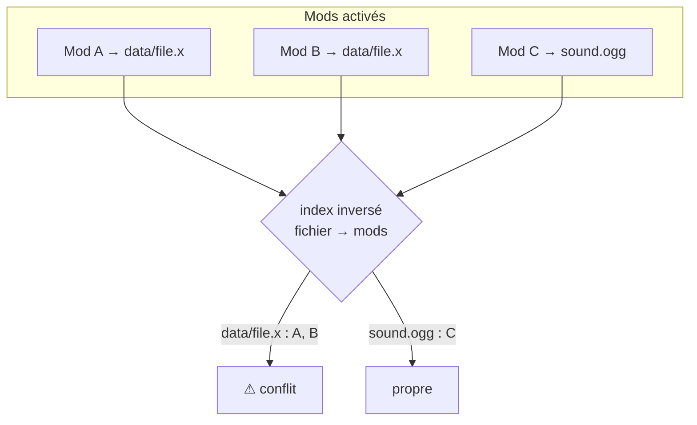
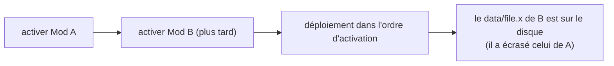
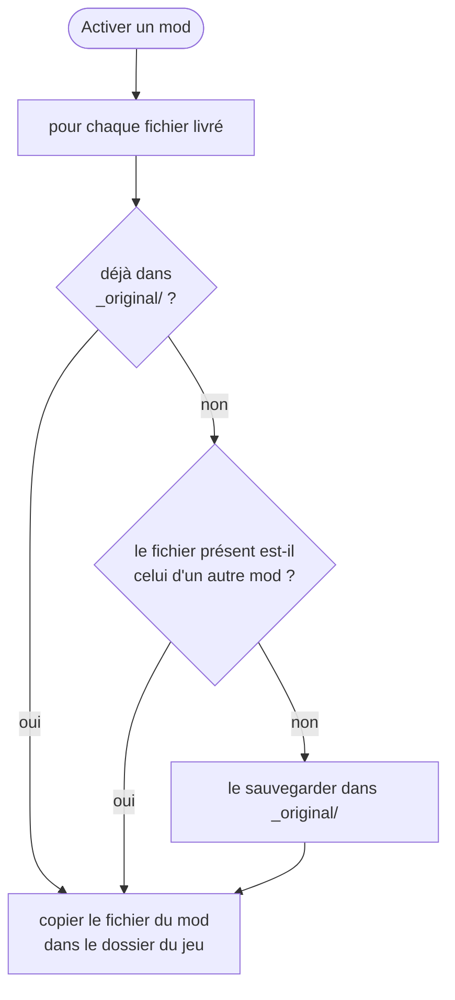
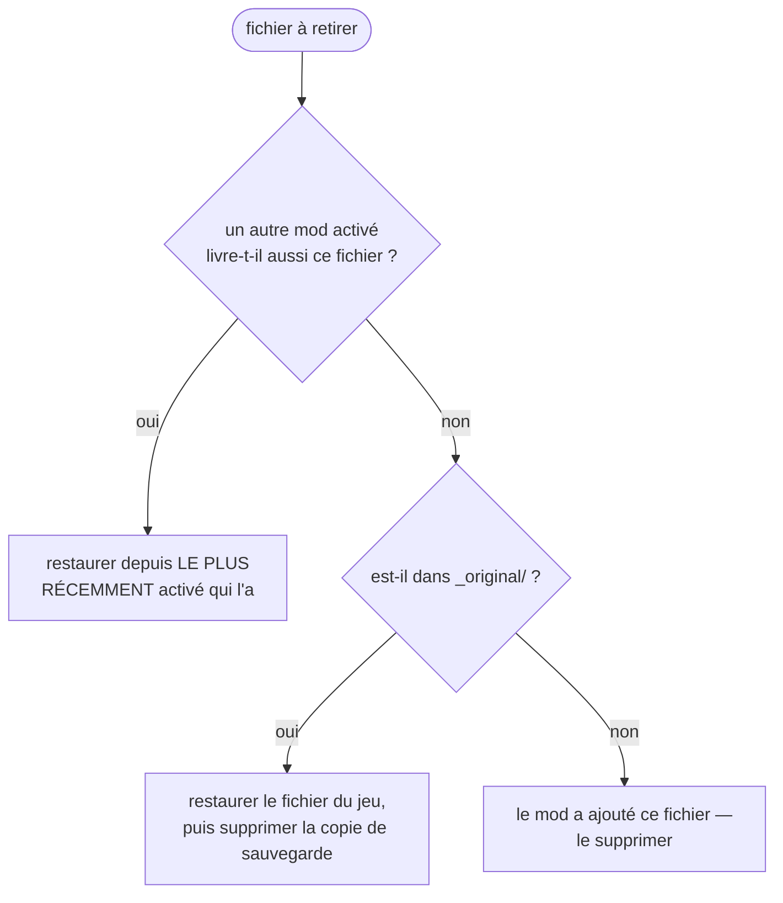

# Conflits

Deux mods sont en **conflit** quand ils livrent le même fichier. Certains gestionnaires laissent l'un
écraser l'autre en silence. BMM détecte le recouvrement *avant* d'écrire quoi que ce soit et te
prévient — mais la résolution elle-même est délibérément simple, et l'ingénierie intéressante est
ailleurs : rendre la détection gratuite et la désactivation sûre.

---

## La détection est une consultation d'index, jamais une lecture disque

BMM garde **deux maps en mémoire**, et aucune n'est jamais écrite dans `data.json` :

> *« Cache pour la détection de conflits en O(1) (en mémoire uniquement, pas sauvegardé dans le
> JSON) »*

| Map | Forme | Répond à |
|---|---|---|
| Cache de fichiers | mod → son ensemble de fichiers | « que livre ce mod ? » |
| Index de conflits | fichier → les mods qui le réclament | « qui d'autre réclame ce chemin ? » |

La seconde est juste l'inverse de la première. Tout chemin réclamé par plus d'un mod activé est un
conflit : trouver les conflits est donc un regroupement sur des données déjà en RAM — aucun accès au
système de fichiers.

Être en mémoire seulement est une décision de conception, pas un oubli : l'index est reconstruit depuis
le cache de fichiers dès qu'il pourrait être périmé, il ne peut donc jamais diverger du dossier mods
d'une façon qui survivrait à un redémarrage.

!!! note "C'était la plus grosse source de lag de l'app"

    L'UI demandait autrefois les conflits **un mod à la fois**, ce qui *« sur une grosse bibliothèque
    signifiait des centaines d'aller-retours IPC + acquisitions de verrou à chaque
    rafraîchissement/import — la principale source de lag de l'UI »*. C'est maintenant un seul appel
    groupé, et le rapport porte des **compteurs**, pas des listes de fichiers. La liste complète d'un
    conflit est un appel séparé, et elle est **plafonnée à 2000 entrées** avec un drapeau `truncated`
    — une paire de mods pathologique se recouvrant sur 200 000 fichiers ne peut plus construire un
    payload assez gros pour faire mal à la fenêtre.

---

## Qui gagne : le dernier mod activé

Il n'y a **aucun sélecteur de gagnant par fichier ni liste de priorités**. La règle est : **celui que
tu actives en dernier gagne.** La liste `active_mods` d'un profil est *ordonnée*, le déploiement la
parcourt dans l'ordre, et un mod plus tardif écrase un plus ancien sur tout chemin partagé. Ton seul
levier est l'ordre d'activation — active en dernier celui qui doit gagner.

C'est une vraie simplification par rapport aux gestionnaires à arbre de priorités. Elle t'achète une
chose : il n'y a jamais de règle cachée à reconstituer. Ce qui est sur le disque est ce que tu as
activé en dernier.

---

## Rien n'est perdu — la règle de sauvegarde

Avant qu'un mod écrase un fichier, BMM copie le **fichier de jeu d'origine** dans `_original/` à
l'intérieur du dossier de sauvegarde du profil. Le détail important est la garde qui décide de ce qui
compte comme « original » :

> *« CRITIQUE : vérifier si le fichier actuellement dans le dossier du jeu vient en fait d'un autre
> mod … C'est un fichier de mod, PAS un original du jeu. Ne pas sauvegarder. »*

Un fichier n'est donc sauvegardé **que la première fois où BMM remplace un véritable fichier de jeu**
dans ce profil. Les fichiers de mod qui écrasent d'autres fichiers de mod n'entrent jamais dans la
sauvegarde — c'est ce qui évite que le dossier de sauvegarde se remplisse de copies de mods que tu as
déjà, et ce qui évite qu'une « restauration » remette un jour le fichier d'un autre mod à la place du
fichier du jeu.

---

## Désactiver : la restauration à trois voies

La désactivation est l'endroit où le « dernier gagne » cesse d'être un problème. Pour chaque fichier
que le mod retire, BMM pose trois questions dans l'ordre :

1. **Un autre mod activé le livre** → restaurer depuis ce mod. La recherche parcourt la liste active
   **à l'envers**, donc le mod activé le plus récemment gagne — la même règle que le déploiement,
   appliquée en marche arrière. Désactiver le mod du dessus révèle correctement celui du dessous.
2. **Sinon, `_original/` l'a** → restaurer le fichier du jeu, puis **supprimer la copie de
   sauvegarde** : *« Optimisation d'espace : retirer le fichier de sauvegarde puisqu'il a été
   restauré en sécurité. »* Le dossier de sauvegarde rétrécit à mesure que tu désactives, au lieu de
   grossir indéfiniment.
3. **Sinon** → le mod a ajouté un fichier que le jeu n'a jamais eu, il est donc supprimé.

Deux détails de sûreté dans ce nettoyage :

- La liste des fichiers à retirer est une **union de ce que BMM avait enregistré à l'activation et
  d'un scan frais du dossier du mod** (le code parle de *« Nettoyage hybride : fichiers suivis +
  fichiers physiques actuels »*), donc un fichier ajouté au dossier du mod après l'activation est
  quand même nettoyé.
- Les dossiers vidés sont retirés du plus profond au plus superficiel avec `fs::remove_dir`, qui *« ne
  retire que les dossiers VIDES (erreur → sans effet si non vide), donc ça ne peut jamais supprimer de
  données »*, et les chemins sont relatifs au dossier du jeu *« donc ils ne peuvent jamais en
  sortir »*.

---

## Ce que ça veut dire en pratique

| Tu veux | Fais ça |
|---|---|
| La version du fichier partagé de Mod B | Active B **après** A |
| Voir ce qui se recouvre réellement | Ouvre la vue des conflits — la liste est exacte, et gratuite à calculer |
| Tout annuler | Désactive dans n'importe quel ordre ; chaque fichier retombe sur le mod suivant qui l'a, puis sur l'original du jeu |
| Choisir fichier par fichier | Non supporté — utilise le [Mapper](doc-page:how-it-works/mapper) pour changer ce qu'un mod livre, ou édite le dossier du mod |

!!! info "À voir dans l'app"
    Aide & autres → Développeur → **Gestion des conflits** ; le tutoriel **Conflits**.
