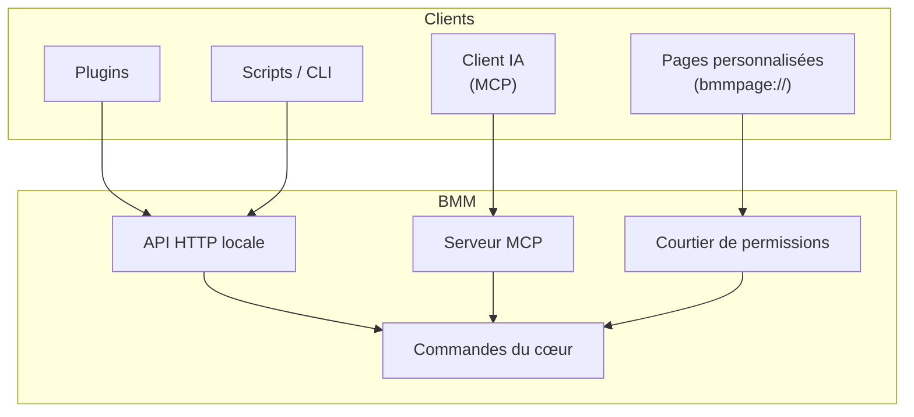
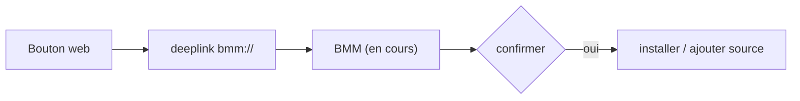
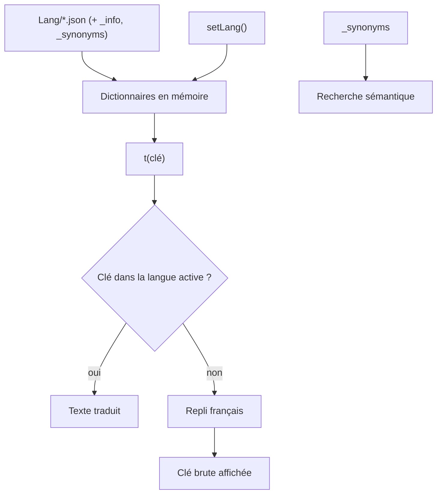

# Étendre BMM

Tout ce que l'interface sait faire, elle le fait en demandant au cœur via un unique canal. Ce même
canal est ouvert aux **plugins, scripts et clients IA** — donc tout ce que BMM fait, vous pouvez
l'automatiser.

## Trois portes d'entrée

- **API locale** — un petit serveur HTTP sur votre machine. Plugins et scripts l'appellent pour
  scanner, activer, construire des packs, lire l'état, etc.
- **Serveur MCP** — les mêmes capacités exposées comme outils Model Context Protocol, pour qu'un
  assistant IA pilote BMM en conversation. Il fonctionne via stdio, pas un port public.
- **Pages personnalisées** — des mini-apps `bmmpage://` en sandbox que vous épinglez à la barre de
  navigation. Elles ne parlent à BMM qu'à travers un **courtier de permissions**, donc une page
  obtient exactement l'accès que vous accordez, et rien de plus.

## Deeplinks

Les boutons sur le web (« Installer ce mod dans BMM ») fonctionnent via des **deeplinks** — un schéma
d'URL que BMM enregistre auprès de l'OS. Cliquer sur l'un transmet la requête à l'app en cours, qui
confirme et agit.

!!! info "À voir dans l'app"
    Aide &amp; autre → Développeur → **Serveur MCP et API locale**, **Pages personnalisées**,
    **Installation en un clic**. Référence : [API](doc-page:../reference/api).

## Traductions (i18n)

Chaque texte de l'UI se résout via `t(clé)` contre des fichiers JSON par langue dans `Lang/` —
de simples maps clé→texte chargées du disque au démarrage. Ordre de résolution : la langue
active → le dictionnaire **français** (le FR est la langue de base) → la clé brute elle-même,
pour qu'une traduction manquante soit visible plutôt que silencieuse.

- **Bascule en direct** — changer de langue ré-applique immédiatement chaque attribut
  `data-i18n` et émet un événement `langChanged` pour les modules dynamiques. Sans redémarrage.
- **Ajouter une langue** = déposer un nouveau JSON dans `Lang/` : elle apparaît dans le
  sélecteur (avec le nom/drapeau de son `_info`) sans recompilation.
- Chaque fichier peut fournir des groupes `_synonyms` — fusionnés entre langues pour alimenter
  la **recherche sémantique** de la palette de commandes et des docs.

