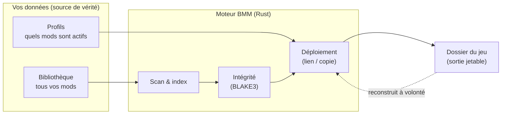

# Comment ça marche

Le reste de la documentation explique **comment utiliser** BMM. Cette section s'adresse à l'autre
moitié du public — ceux qui veulent savoir **pourquoi il se comporte ainsi** : contributeurs,
auteurs de plugins, et les simples curieux.

Rien de tout cela n'est nécessaire pour utiliser BMM. Mais si vous vous êtes déjà demandé pourquoi
activer un profil est instantané, pourquoi un téléchargement corrompu n'atteint jamais votre jeu, ou
comment un dépôt serveur garde toute une escadrille synchronisée, les réponses sont ici — avec des
diagrammes.

## La garantie sur laquelle tout repose

BMM est **non destructif**. Vos mods téléchargés sont la source de vérité ; le dossier du jeu est une
sortie jetable que BMM peut reconstruire à tout moment. Chaque décision de conception ci-dessous
découle de cette règle.

Comme le dossier du jeu est une sortie, une mise à jour du jeu, une réinstallation ou un mauvais mod
peut l'effacer sans rien perdre. Vous réactivez un profil ; vous ne re-téléchargez jamais.

## Plan de cette section

| Page | La question à laquelle elle répond |
|---|---|
| [Architecture](doc-page:architecture) | De quoi BMM est-il fait, et pourquoi si léger ? |
| [Profils & activation](doc-page:profiles-activation) | Pourquoi changer de profil est-il instantané et sûr ? |
| [Scan & cache](doc-page:scanning-cache) | Comment BMM sait-il ce qui a changé sans tout relire ? |
| [Intégrité & hachage](doc-page:integrity-hashing) | Comment un fichier corrompu est-il attrapé avant le jeu ? |
| [Résolution de conflits](doc-page:conflicts) | Comment BMM sait-il que deux mods s'affrontent, avant de valider ? |
| [Le mappeur](doc-page:mapper) | Comment une archive mal structurée est-elle remise en forme, de façon répétable ? |
| [Synchro & dépôts serveur](doc-page:sync-repos) | Comment tout un groupe reste-t-il sur la même configuration ? |
| [Performances](doc-page:performance) | Pourquoi un gros déploiement reste-t-il réactif ? |
| [Étendre BMM](doc-page:extending) | Comment plugins, API et MCP pilotent-ils BMM ? |
| [Modèle de sécurité](doc-page:security) | Quelles sont les frontières de confiance, et qu'est-ce qui est signé ? |

!!! tip "Dans l'application"
    Chacun de ces systèmes possède un **diagramme interactif** dans BMM, sous
    **Aide & autre → Développeur**. Survolez un nœud pour une explication en direct, ou ouvrez le
    tutoriel correspondant pour le voir se produire sur votre propre machine.
