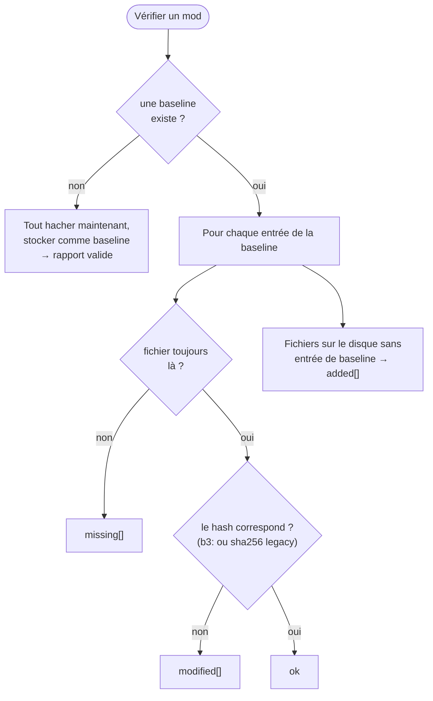
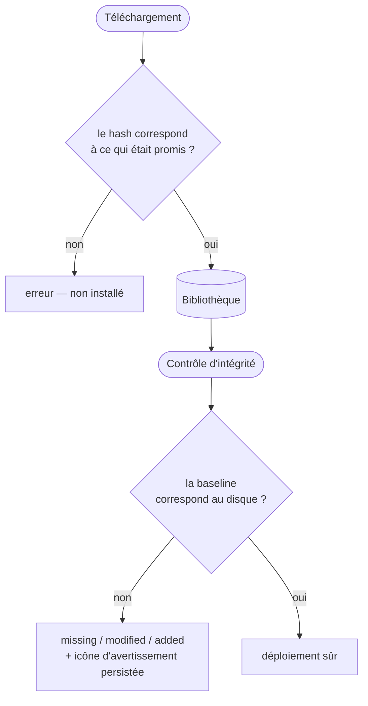

# Intégrité & hachage

Un mod n'est utile que s'il contient les *bons* octets. Un téléchargement tronqué, un disque
capricieux ou un fichier altéré ne doivent jamais atteindre ton jeu silencieusement. La réponse de
BMM : hacher tout et comparer — et être précis sur **quel** hash, parce qu'il en fait tourner deux
exprès.

---

## Deux algorithmes, et pourquoi les deux

| Algorithme | Sert à | Pourquoi |
|---|---|---|
| **BLAKE3** | les hashs de fichiers locaux, l'index de correspondance des modpacks | bien plus rapide que SHA-256 par octet, et adossé à mmap pour ne pas faire transiter le fichier par l'espace utilisateur |
| **SHA-256** | les baselines legacy, le format de transport des dépôts, l'empreinte `content_id` | compatibilité — le changer casserait des choses qui existent déjà |

!!! note "Parallèle entre fichiers, délibérément pas à l'intérieur d'un seul"

    BLAKE3 *sait* paralléliser à l'intérieur d'un fichier (`update_mmap_rayon`), et BMM ne
    l'utilise volontairement pas : `compute_file_hash` appelle le `update_mmap` séquentiel,
    parce que *« le travail par fichier reste sur un seul thread du pool, pour qu'un gros
    fichier ne puisse pas accaparer tous les cœurs. Le parallélisme vient du pool borné qui
    traite plusieurs fichiers à la fois. »* C'est la même idée de pool borné que
    [Smart I/O](doc-page:features/storage) : garder la machine utilisable pendant un long
    traitement, plutôt que gagner un benchmark sur un fichier unique.

Les empreintes sont **auto-descriptives** : un hash BLAKE3 local est stocké préfixé `b3:…`, et *« les
empreintes non préfixées sont traitées comme du SHA-256 legacy pour que les anciens
baselines/modpacks se vérifient encore (double lecture) »*. C'est pour ça que mettre BMM à jour
n'invalide jamais tes baselines existantes — une ancienne baseline SHA-256 continue de se vérifier en
SHA-256, et seuls les nouveaux hashs sont en BLAKE3.

### Le point subtil : BLAKE3 choisi pour sa parallélisation, puis prié de ne pas s'en servir

L'atout phare de BLAKE3 est de pouvoir répartir un seul gros fichier sur tous les cœurs. Le chemin
chaud **refuse délibérément** :

> *« Un pool de threads PLAFONNÉ EN TAILLE utilisé pour TOUT le hachage de mods. BLAKE3 est si rapide
> qu'il saturerait sinon tous les cœurs (rayon prend tous les CPU par défaut) et figerait l'UI pendant
> l'import/scan de nombreux mods. On le plafonne à ~la moitié des cœurs (max 4) pour que le hachage
> laisse toujours de la marge au thread UI. »*

> *« mmap séquentiel (PAS update_mmap_rayon) : le travail par fichier reste sur un seul thread du
> pool, un gros fichier ne peut donc pas rafler tous les cœurs. Le parallélisme vient du pool borné
> qui traite plusieurs fichiers à la fois. »*

Donc hacher une bibliothèque est parallèle **entre fichiers**, pas à l'intérieur d'un seul. C'est plus
lent sur un unique fichier énorme et bien plus doux pour la machine — le même arbitrage que partout
ailleurs dans [Performances](doc-page:how-it-works/performance).

---

## `content_id` — une identité, pas une somme de contrôle

Indépendamment des hashs de fichiers, chaque mod reçoit un identifiant stable inter-machines :

> *« Priorité : 1. `bmm.json` … avec un champ `id` non vide 2. Empreinte SHA-256 des paires
> (chemin_relatif, taille) triées — rapide, aucune lecture de contenu. Le résultat est déterministe :
> mêmes fichiers sur n'importe quelle machine → même content_id. »*

Deux conséquences que le code défend explicitement :

- Un **mod archivé et son jumeau décompressé obtiennent le même id** — *« les paires (rel, size) sont
  identiques au dossier décompressé »*.
- Il a **gardé SHA-256 à travers la migration BLAKE3 exprès** : *« content_id est une IDENTITÉ
  inter-machines, pas une somme de contrôle de contenu… le passage SHA-256→BLAKE3 ne DOIT PAS changer
  l'identité d'un mod (sinon les anciennes et nouvelles installations du même mod cesseraient de
  correspondre entre machines pendant la migration). »*

Note qu'il lit des **tailles, pas des contenus** — `content_id` répond donc à *« est-ce le même
mod ? »*, jamais à *« ces octets sont-ils intacts ? »*. Cette seconde question, c'est le rôle des hashs
de fichiers.

---

## Le rapport d'intégrité

Vérifier un mod compare sa baseline stockée à ce qui est sur le disque maintenant, et renvoie trois
listes :

| Champ | Signification |
|---|---|
| `missing` | La baseline le liste ; le disque ne l'a pas |
| `modified` | Présent, mais le hash de contenu ne correspond plus |
| `added` | Sur le disque, mais la baseline ne l'a jamais connu |
| `total` | Combien de fichiers sont sur le disque maintenant |
| `isValid` | Les trois listes sont vides |

Deux comportements à connaître :

!!! note "La première vérification écrit la baseline, elle n'échoue pas"

    Un mod sans baseline n'est pas signalé comme cassé. BMM hache tout, le stocke comme baseline, et
    renvoie un rapport valide. La première vérification d'un mod fraîchement importé passe donc
    toujours — elle établit la vérité, elle ne teste pas contre elle. Seule la *deuxième* peut échouer.

!!! tip "Le résultat est mémorisé"

    Une vérification échouée pose un drapeau sur l'entrée du mod, et c'est ce qui dessine l'icône
    d'avertissement dans la Bibliothèque. Il survit à un redémarrage : un mod qui a échoué hier a
    toujours l'air suspect aujourd'hui, tu n'as pas besoin de relancer le contrôle pour le voir.

Pour un mod **archivé**, l'intégrité est calculée sur la vue extraite en cache, si bien que *« chaque
fonctionnalité de BMM (SHA / content-id / rapport d'intégrité / conflits) donne des résultats
IDENTIQUES pour un mod archivé et son jumeau décompressé »*.

---

## Où les hashs sont réellement appliqués

Ça vaut la peine d'être précis — qu'un hash existe n'est pas la même chose qu'un hash qui bloque
quelque chose.

| Moment | Ce qui se passe |
|---|---|
| **Téléchargement depuis le catalogue d'apps** | Le SHA-256 du payload est vérifié contre le catalogue **avant toute exécution** (CWE-494). Si l'entrée du catalogue ne porte **aucun** hash, BMM le dit et demande — installer quand même est ton choix explicite, et le journal enregistre le hash réel du payload |
| **Synchro de dépôt — avant de télécharger** | Le hash de ton fichier local est comparé à celui du distant. Égal → le fichier est ignoré, rien ne transite |
| **Synchro de dépôt — par chunk** | Les gros fichiers portent des SHA-256 par chunk, donc un transfert reprisé ou partiel ne re-télécharge que les chunks qui diffèrent |
| **Synchro de dépôt — après téléchargement** | Le fichier téléchargé est re-haché et comparé. Une divergence est une erreur, pas un avertissement |
| **Application d'un modpack** | Le contrôle d'intégrité tourne, sauf si ce modpack a *ignorer le contrôle d'intégrité* |
| **Activation d'un mod à la main** | Tu reçois la question si quelque chose ne colle pas |
| **Activation depuis le planificateur** | **Le contrôle est contourné** — une exécution de fond ne peut pas s'arrêter pour te demander. Active à la main si tu veux la question |

Parce que le contrôle porte sur le contenu, il attrape une corruption qu'aucun contrôle de nom ou de
taille ne verrait — deux fichiers peuvent partager un nom et une taille et différer par l'octet qui
compte. Et parce que l'empreinte `content_id` est basée sur les tailles, les deux répondent à des
questions différentes : identité contre intégrité.

---

## Le mesurer

La suite de benchmarks a une charge dédiée à exactement ça — *« Vérification d'intégrité (BLAKE3) »*,
qui *« re-hache chaque fichier et le compare à la baseline stockée — le contrôle d'intégrité que BMM
exécute pour détecter un mod altéré ou corrompu »*. Voir [Performances](doc-page:how-it-works/performance).

!!! info "À voir dans l'app"
    Aide & autres → Développeur → **Hachage BLAKE3** et **Moteur d'intégrité**.
