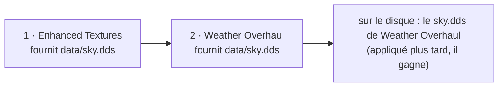

# Ordre d'activation

Deux mods actifs qui fournissent le même fichier ne fusionnent pas : BMM copie des fichiers, donc
l'un des deux est celui que le jeu lit. Lequel, c'est une seule liste par profil qui le décide,
l'**ordre d'activation** : les mods sont appliqués du premier au dernier, et **le dernier qui fournit
un fichier le gagne**.

---

## Le modèle

L'ordre, c'est la liste `active_mods` du profil. Il n'y a ni seconde liste ni numéro de priorité :

- la position 0 est appliquée en premier, la dernière position en dernier et gagne chaque fichier
  qu'elle partage ;
- activer un mod l'ajoute à la fin, d'où « le dernier mod activé gagne » tant que tu ne réordonnes
  pas ;
- désactiver un mod le retire de la liste ; le réactiver le remet à la fin.

Rien n'a dû être migré quand l'ordre est devenu modifiable. La liste d'un profil était déjà l'ordre
dans lequel ses mods avaient été activés, c'est-à-dire exactement ce qui était sur le disque : un
profil existant s'ouvre avec son ordre actuel, et rien ne change pour qui n'y touche pas.

---

## Le changer

Ouvre l'ordre depuis une carte de profil (l'icône de liste), depuis la fenêtre de conflit
(**Ouvrir l'ordre d'activation**) ou depuis la palette de commandes (`Ctrl+K` → **Ordre
d'activation**).

| Pour | Fais |
|---|---|
| Déplacer un mod | Glisse sa ligne, ou sélectionne-la et appuie sur `Alt+↑` / `Alt+↓` |
| L'envoyer tout en haut ou tout en bas | Les flèches de la ligne, ou `Alt+Début` / `Alt+Fin` |
| Partir d'un ordre raisonnable | **Trier** : par nom, ou par date d'installation (le plus ancien d'abord met les mods récents en haut) |
| L'écrire dans le jeu | **Appliquer l'ordre** (`Ctrl+Entrée`) |
| Abandonner le brouillon | **Réinitialiser** |

Chaque raccourci est une commande de la palette, listée et réassignable dans Paramètres → Raccourcis
clavier ; ils n'agissent que quand la vue de l'ordre est ouverte.

Chaque ligne dit ce qu'elle fait aux autres — *Écrase 12 fichier(s) de X*, *3 fichier(s) écrasé(s)
par Y* — et suit le brouillon pendant que tu glisses, avant que rien ne soit écrit. Le pied de la
fenêtre compte les fichiers qui changeraient de main.

---

## Depuis la Bibliothèque de mods

Pas besoin de quitter la bibliothèque pour voir ou changer l'ordre du profil qu'elle affiche :

| Où | Ce que tu obtiens |
|---|---|
| L'icône de liste à côté du menu de tri | La vue complète de l'ordre ci-dessus, pour le profil de la bibliothèque |
| Le panneau de détail d'un mod | Un encadré **Ordre d'activation** : sa position (*Position 3 sur 12*), qui il écrase et qui l'écrase, et En haut / Monter / Descendre / En bas |
| Clic droit sur la carte d'un mod | Les mêmes quatre déplacements, et **Ouvrir l'ordre complet** |
| `Alt+↑` / `Alt+↓` / `Alt+Début` / `Alt+Fin` | Déplacer le mod sélectionné (commandes de la bibliothèque, réassignables comme les autres) |

Un déplacement fait depuis la bibliothèque s'applique tout de suite : pas de brouillon, le nouvel
ordre est enregistré et seuls les fichiers qui changent de main sont recopiés, exactement comme
**Appliquer l'ordre**. Le badge `#N` de chaque carte active est sa position, et le tri **Ordre
d'Activation** range la bibliothèque dans cet ordre. Un mod désactivé n'a pas de position : active-le
d'abord, il rejoint la fin.

---

## Ce qu'écrit « Appliquer l'ordre »

Le nouvel ordre est enregistré, puis **seuls les fichiers dont le gagnant a changé** sont recopiés,
depuis leur nouveau gagnant. Un fichier partagé dont le gagnant est le même dans les deux ordres n'est
pas réécrit, et un fichier fourni par un seul mod n'est jamais touché.

La copie est un déploiement comme un autre : elle passe par le gouverneur de ressources (un ticket
Deploy, la règle de vitesse du disque, une annulation qui s'arrête entre deux fichiers) et une seule
opération de mod à la fois.

Si elle échoue en route — une annulation, un fichier verrouillé par le jeu lancé — l'ordre est quand
même enregistré et le dossier du jeu est en retard sur lui. **Réappliquer** recopie le gagnant de
chaque fichier partagé, ce qui est aussi la réparation après une modification à la main du dossier du
jeu.

---

## La désactivation suit l'ordre

Quand un mod est désactivé, chaque fichier qu'il fournissait est remis depuis le mod **juste en
dessous** dans l'ordre qui fournit le même fichier ; s'il n'y en a aucun, depuis la sauvegarde
d'origine du jeu ; et si le jeu n'avait pas ce fichier, il est retiré. Voir [Conflits](doc-page:how-it-works/conflicts)
pour la règle de sauvegarde.

Les mods archivés (gardés en `.zip` dans le dossier des mods) sont des fournisseurs comme les autres :
leurs fichiers sont lus depuis le cache extrait quand ils doivent revenir.

!!! note "Deux bugs que cette page cachait"
    Avant que l'ordre devienne modifiable, désactiver un mod remettait la copie **la plus ancienne**
    d'un fichier partagé au lieu de celle juste en dessous (la liste de repli était construite du plus
    récent au plus ancien, puis lue à l'envers), et un mod archivé n'était jamais utilisé comme
    repli. Les deux sont corrigés et couverts par des tests qui déploient de vrais fichiers.

---

## Modpacks

La liste d'un modpack est aussi un ordre — les flèches de l'éditeur de modpack le changent. Quand un
pack est appliqué, ses mods sont activés puis placés **en haut** de l'ordre du profil, en un seul bloc
dans la séquence du pack : le pack gagne les fichiers qu'il partage avec ce que le profil avait déjà,
tel qu'il a été construit. Rien d'autre du profil ne bouge.

---

## Depuis les scripts et les outils

| Surface | Lire | Écrire |
|---|---|---|
| API locale | `GET /api/mods/order` | `POST /api/mods/order` avec `order[]`, `profileId`, `reapply` |
| MCP | `bmm_get_mod_order` | `bmm_set_mod_order` |
| CLI | `bmm mod-order` | `bmm mod-order --set a,b,c`, `bmm mod-order --reapply` |

Un nouvel ordre doit contenir exactement les mods actifs : une liste avec un mod en moins ou en trop
est refusée, parce que l'appliquer laisserait dans le jeu des fichiers que rien ne revendique.
