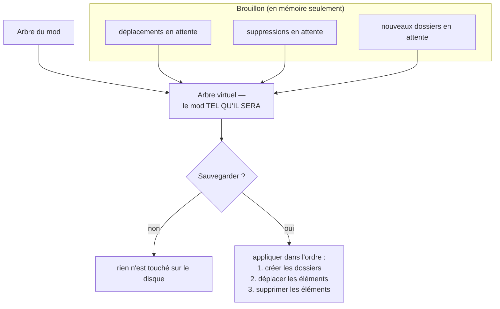

# Le mappeur


BMM déploie un mod en recopiant son arborescence dans le jeu. Cela ne marche que si le mod *possède* la
bonne arborescence. Beaucoup de téléchargements non — l'auteur a zippé depuis le mauvais dossier, ou a
jeté des fichiers en vrac à la racine. Le mappeur corrige ça.

---

## La forme attendue

Un mod stocké doit contenir le chemin complet que le jeu attend, en partant de la racine du jeu. Par
exemple :

```
\HD Texture Pack
   |_ Data
        |_ Textures
             |_ HD Texture Pack
```

`HD Texture Pack` est le mod ; tout ce qui est en dessous est l'arborescence exacte où les fichiers
doivent atterrir. Les noms de dossiers ici (`Data`, `Textures`, …) sont un exemple — utilise le chemin
que **ton** jeu lit réellement.

Le déploiement est une simple recopie : pour chaque fichier du dossier du mod, le copier au même chemin
relatif sous le dossier du jeu. Il n'y a aucune étape de correspondance intelligente. C'est pour ça que
la forme doit être correcte *dans le dossier du mod*, et c'est exactement à ça que sert le mappeur.

---

## Ce que le mappeur fait réellement

!!! warning "Il réécrit le dossier du mod — ce n'est pas une table appliquée au déploiement"

    Ça mérite d'être clair, parce que le nom suggère le contraire. Le mappeur ne stocke pas une table
    « de → vers » rejouée à chaque activation du mod. Quand tu sauvegardes, il **restructure
    physiquement le dossier du mod sur le disque** : il crée des dossiers, déplace des éléments, et
    supprime ce que tu as marqué. Après la sauvegarde, le dossier du mod *a* simplement la bonne forme,
    et le déploiement reste la même simple recopie qu'avant.

Ça a des conséquences à anticiper :

- **Une nouvelle version du mod doit être re-mappée.** Rien n'est mémorisé pour être rejoué contre un
  téléchargement frais au même mauvais agencement.
- **Le `content_id` du mod change.** Cet identifiant est une empreinte des paires (chemin relatif,
  taille) triées : déplacer des fichiers le change — sauf si le mod embarque un `bmm.json` avec un `id`
  explicite, qui a priorité. Si tu veux qu'un mod garde la même identité inter-machines à travers une
  restructuration, donne-lui un id dans `bmm.json`. Voir [Intégrité & hachage](doc-page:integrity-hashing).
- **Sa baseline d'intégrité ne correspond plus.** Le prochain contrôle signalera les fichiers déplacés
  en `missing` + `added`. Rétablis la baseline après le mappage.

---

## Mode brouillon : rien ne se passe avant la sauvegarde

Le mappeur est construit autour d'une zone de préparation, pour que tu puisses restructurer un mod
bordélique en une dizaine d'étapes et voir le résultat avant qu'un seul fichier bouge.



Le volet de gauche affiche toujours l'**arbre virtuel** — tes changements en attente composés par-dessus
le vrai — donc ce que tu vois est le mod tel qu'il *sera*, pas tel qu'il est. Le bouton Sauvegarder
n'apparaît qu'une fois qu'il y a quelque chose en attente.

L'ordre de validation compte et il est fixe : **les nouveaux dossiers d'abord** (pour qu'un déplacement
puisse en cibler un), **puis les déplacements**, **puis les suppressions** (pour que tu ne puisses pas
supprimer quelque chose dont un déplacement en attente a encore besoin).

!!! note "Une sauvegarde en échec peut laisser un résultat partiel"

    Les trois phases s'exécutent comme une séquence d'opérations individuelles, pas comme une
    transaction. Si l'une échoue — fichier verrouillé, erreur de permission — celles déjà faites restent
    faites, et tu reçois l'erreur. L'arbre est alors relu depuis le disque, donc ce que tu vois ensuite
    est la vérité ; remets en attente ce qui reste.

---

## Travailler avec les deux volets

| | |
|---|---|
| **Gauche** | l'arbre du mod (virtuel — inclut tes changements en attente) |
| **Droite** | l'arbre du jeu, pour voir la destination visée |

- **Sélectionne** des éléments à gauche — sélection multiple, plus une action « sélectionner la racine
  du mod » qui prend tous les éléments de premier niveau, pour verser d'un coup un mod mal empaqueté
  dans un dossier du jeu.
- **Déplace** en choisissant un dossier cible à droite. Sans rien de sélectionné, l'action retombe sur
  le déplacement de la racine du mod — c'est le cas courant : « mets tout ça sous `Data/Textures/` ».
- **Filtre** l'un ou l'autre arbre par nom quand un mod a des centaines de fichiers.
- **Clic droit** pour les actions par élément (nouveau dossier, renommer, supprimer).
- **Tout déplier** est annulable : replier pendant qu'un grand dépliage tourne encore l'arrête, donc un
  mod à l'arbre profond ne peut pas bloquer le volet.

Les deux arbres sont mis en cache et relus seulement quand le profil, le chemin du jeu ou le dossier du
mod change réellement — passer d'un mod à l'autre est donc bon marché.

---

## Avant de commencer : le diagnostic

La page utilisateur [Mapper](doc-page:../features/mapper) couvre le **Diagnostic de structure**, qui compare
l'arbre du mod à celui du jeu et te dit quel serait le chemin final déployé. Lance-le d'abord. Il répond
à la question qui compte vraiment — « est-ce que le jeu va trouver ça ? » — avant que tu déplaces quoi
que ce soit, et c'est plus rapide que de raisonner sur les arbres à l'œil.

!!! info "À voir dans l'app"
    Aide & autres → Développeur → **Mappeur de mods** ; le tutoriel **Mapper**. Et la page
    [Mapper](doc-page:../features/mapper) du guide utilisateur pour la démonstration pas à pas.
