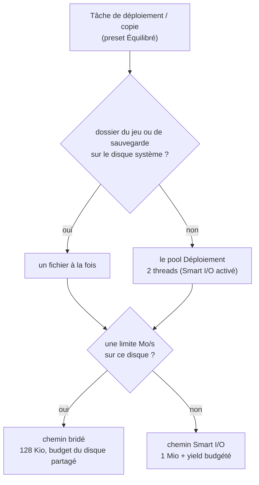
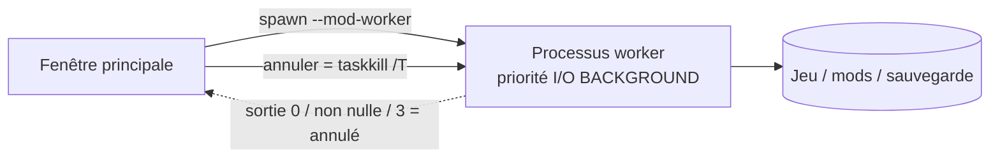

# Performances

Modder, c'est déplacer beaucoup d'octets. Le rôle de BMM est de le faire vite **et** de garder ta
machine utilisable pendant ce temps — et quand ces deux objectifs s'opposent, **la réactivité
gagne**. Presque tous les chiffres de cette page sont un sacrifice délibéré de débit maximal pour
éviter une fenêtre figée.

---

## Les trois chemins de copie

Chaque copie de fichier de mod passe par le [gouverneur de ressources](doc-page:how-it-works/resources), et sous le
preset par défaut **Équilibré** elle prend exactement l'une des trois routes, choisie à chaque appel :

| Chemin | Quand | Comment |
|---|---|---|
| **Bridé** | le disque sur lequel on écrit a une limite en Mo/s | blocs de 128 Kio, qui puisent dans **un budget de vitesse par disque** partagé par toutes les copies vers lui |
| **Smart I/O** | Smart I/O activé, aucune limite | blocs de 1 Mio, un yield de 150 µs sur un **budget de 16 Mio** |
| **Pleine vitesse** | Smart I/O désactivé, aucune limite | `std::fs::copy` nu — l'OS fait tout |

Les chiffres de Smart I/O ont été mesurés, pas devinés : l'ancienne boucle, des blocs de 256 Ko avec
une pause après chacun, coûtait environ 37 % par rapport à une copie pleine vitesse, et budgétiser le
yield en a récupéré l'essentiel tout en gardant la fenêtre réactive.

Avant, chaque copie cadençait la limite de son côté, si bien que deux threads de copie écrivaient un
disque limité à 40 Mo/s à 80 Mo/s. Le budget par disque, c'est ce qui fait que le chiffre veut dire
ce qu'il dit. Les autres presets changent le tampon, la pause et le parallélisme : voir
[Les presets](doc-page:how-it-works/resources#les-presets).

!!! warning "BMM ne fait jamais de hard-link ni de lien symbolique"

    Certains gestionnaires déploient en liant les fichiers au lieu de les copier. BMM **non** — il n'y
    a aucun `hard_link` ni symlink dans le chemin de déploiement. Chaque fichier activé est une vraie
    copie dans ton dossier de destination. Ça coûte de l'espace disque, et c'est ce qui fait qu'un dossier de
    jeu géré par BMM fonctionne avec n'importe quel outil qui ne comprend pas les liens, survit à un
    dossier mods sur un autre disque, et reste intact si BMM est désinstallé.

---

## Ne jamais saturer la machine

Sous Équilibré, un déploiement copie sur **2 threads**, pour que les copies de fichiers ne saturent
jamais tous les cœurs CPU, ce qui fige une fenêtre en *Ne répond pas*. Et si le dossier de
destination ou le dossier de sauvegarde vit sur le disque système, il copie **un fichier à la fois**,
pour que Windows lui-même reste réactif pendant une grosse copie de mods. **Silencieux** copie un
fichier à la fois partout ; **Tout pour BMM** lève ces deux plafonds, sauf sur un disque dur.

Les pools de threads sont plafonnés aussi, chacun pour sa propre raison :

| Pool | Taille | Pourquoi |
|---|---|---|
| Rayon global | plafonné, piles de 512 Ko | *« Empêcher Rayon de monopoliser 100% du CPU et de faire ramer l'OS »* — le travail parallèle de BMM ne récurse jamais profondément, ce qui économise ~7 Mo de RSS engagé par thread |
| Un par sorte de travail (gouverneur) | sous Équilibré : empreintes ≤ 4 (environ la moitié des cœurs), déploiement 2, extraction et compression la taille du pool global | Chaque sorte a le sien, dimensionné par le preset, pour qu'un calcul d'empreintes et un déploiement ne se disputent jamais un pool. BLAKE3 seul est assez rapide pour manger tous les cœurs — voir [Intégrité & hachage](doc-page:how-it-works/integrity-hashing) |

L'allocateur est aussi remplacé : **mimalloc** à la place du HeapAlloc par défaut de Windows, pour un
*« working set du processus 30 à 60% plus petit, plus beaucoup moins de fragmentation »* — BMM alloue
et libère énormément de petites chaînes (chemins, entrées de hash) en usage normal.

---

## Sortir le travail lourd de la fenêtre

Les grosses applications et désapplications ne tournent pas du tout dans l'app. Elles tournent dans un
**processus séparé** — le même exécutable réinvoqué en `--mod-worker IN OUT`, qui court-circuite
*« sans démarrer Tauri, WebView2, ni quoi que ce soit d'autre »*. Trois conséquences :

- Il se rétrograde lui-même en **priorité I/O BACKGROUND** Windows, donc *« le noyau garde de la
  bande passante disque pour le processus UI »*.
- Annuler = un `taskkill /T` du PID du worker — *« instantané et fiable, quel que soit le degré de
  blocage des I/O »* — au lieu d'attendre le retour d'un appel bloquant.
- Annuler un worker annulable lance aussi *« un sous-processus d'annulation en opération inverse pour
  que toute écriture partielle soit revertie »*. Un déploiement annulé ne laisse pas la moitié d'un
  mod dans ton dossier de destination.

Le worker est un processus séparé qui a son propre gouverneur : l'app lui transmet donc son
document de ressources, et il copie sous le même preset et avec les mêmes limites par disque que
l'app.

Dans l'app, une copie vérifie son ticket du gouverneur entre deux blocs : le clic d'annulation
interrompt une grosse copie de mod presque aussitôt au lieu d'attendre la fin du fichier entier, et
le fichier à moitié écrit est supprimé. Un verrou global signifie toujours **une seule opération de
mod à la fois** — jamais deux applications en course sur le même dossier de destination.

---

## Les verrous servent aux métadonnées, jamais aux I/O

La règle énoncée partout dans le code : collecter ce qu'il faut sous le verrou, puis le relâcher avant
toute opération lente.

> *« Relâcher tous les verrous AVANT de hacher pour qu'aucune autre commande ne bloque pendant qu'on
> lit le contenu des fichiers (c'est ce qui figeait l'UI sur les gros mods). »*

> *« On ne les hache PAS ici (ça tournerait sous 4 verrous tenus et pourrait figer l'UI sur un gros
> mod) ; on les enregistre et on hache APRÈS la libération des verrous. »*

Le motif a un nom dans le code — une structure snapshot : *« Instantané léger des champs d'un mod —
collectés en tenant le verrou, puis utilisés après l'avoir relâché, pour que les I/O fichier lourdes
ne bloquent jamais AppState. »*

---

## Ce qui était lent — et ce qui l'a corrigé

Chacun de ces points est une vraie régression trouvée puis corrigée, avec la cause consignée :

| Était lent | Cause | Correctif |
|---|---|---|
| Chaque rafraîchissement / import | L'UI appelait une commande de conflits **par mod** — *« des centaines d'aller-retours IPC + acquisitions de verrou à chaque rafraîchissement/import — la principale source de lag de l'UI »* | Un seul appel groupé |
| Démarrage avec des mods archivés | Un gros `.zip` était extrait **sous le verrou** | Les archives sont listées depuis leur index ; rien n'est extrait |
| Le scan | Le re-hachage était synchrone | Une file de fond bridée hache *« un mod à la fois, sur le pool de hash plafonné, avec une pause entre chacun »* |
| La journalisation | `log_line` recalculait son chemin à chaque appel — *« le chemin le plus chaud de l'app »* | Le chemin est mis en cache |
| Un disque débranché | Listait zéro fichier et remettait en file du travail inutile | *« Garder ce qu'on avait déjà et réessayer quand le disque revient — ne pas brasser l'état hors ligne »* |
| L'extraction `.zip` | DEFLATE est CPU-bound et c'était *« l'opération la plus lente du chemin chaud de l'app quand elle était sérielle »* | Parallèle sur tous les cœurs, un handle d'archive **par thread worker** (pas par entrée), le répertoire central est donc analysé ~une fois par cœur |

!!! note "Une optimisation a été rejetée, et la raison est dans le code"

    > *« zlib-ng (le backend SIMD 2-3x) a besoin de cmake pour compiler libz-ng-sys, qui ne sait pas
    > cibler la toolchain VS 2026 installée — il n'est donc volontairement PAS utilisé. »*

    Bon à savoir si tu te demandes un jour pourquoi l'extraction zip n'est pas encore plus rapide.

---

## Rien de gros ne passe par la mémoire

La même discipline s'applique aux octets qui arrivent du réseau ou partent vers une archive : ils sont
**streamés**, jamais bufferisés en entier. Ça n'a pas toujours été le cas, et les défaillances avaient
toutes la même forme — un pic mémoire égal à la taille du payload, sans plafond ni vérification :

| Chemin | Maintenant |
|---|---|
| Ajouter un mod depuis une URL | Streame vers un `.part`, renifle la signature zip depuis le fichier, extrait via un reader. Avant, il bufferisait le mod entier **et gardait ce tampon vivant** pendant l'extraction depuis un curseur dessus |
| Synchro de dépôt, mod archivé | Streame. Le chemin par fichier le faisait déjà ; le chemin archive — souvent la plus grosse chose qu'une synchro déplace — non |
| Installation depuis le catalogue d'apps | Hache au fil du streaming, puis renomme après le contrôle SHA-256 |
| Import de modpack | Streame vers le zip temporaire qu'il allait de toute façon écrire |
| Export zip | Copie chaque entrée via un reader au lieu de lire les fichiers entiers en mémoire |
| Enregistrement de session | Spoolé sur disque au fil de l'eau ; le `.bmmreplay` est assemblé en streaming (voir [Confidentialité & télémétrie](doc-page:features/privacy-telemetry)) |

La règle à retenir : si la destination est un fichier, écris dans le fichier. Un tampon intermédiaire
n'apporte rien et transforme une grosse entrée en plantage mémoire.

## Le régime de WebView2

Avant même que le webview démarre, les fonctionnalités dont BMM ne se sert pas sont coupées — *« Retire
~50-150 Mo de l'empreinte WebView2 : AudioServiceOutOfProcess… extensions / background pages…
Translate / sync / default apps… background-networking… renderer-process-limit=2 »*. La fenêtre
DevTools est fermable pour la même raison : c'est *« le processus msedgewebview2 "DevTools" d'environ
480 Mo »*, il ne te coûte donc que tant qu'il est ouvert.

---

## Mesure-le sur ton propre matériel

BMM embarque une vraie suite de benchmarks plutôt que de te demander de croire ces chiffres. Elle
mesure ce que BMM fait réellement — **scanner** un dossier, **hacher** du contenu (BLAKE3),
**copier / déployer**, et **extraire** une archive — plus une charge explicite *« Vérification
d'intégrité (BLAKE3) »* qui *« re-hache chaque fichier et le compare à la baseline stockée »*, c'est-à-dire
le contrôle qui détecte un mod altéré ou corrompu.

Les résultats restent locaux. Tu peux aussi lancer un benchmark depuis le
[planificateur](doc-page:features/scheduler) et brancher sur le résultat — mesure un disque, et s'il
revient sous 50 Mo/s, applique un plafond ou préviens-toi. Voir la
[Référence des actions](doc-page:reference/actions).

!!! info "À voir dans l'app"
    Aide & autres → Développeur → **Limiteur d'I/O disque**, **Moteur & threads**, **Hachage
    BLAKE3**, **Architecture légère**.
