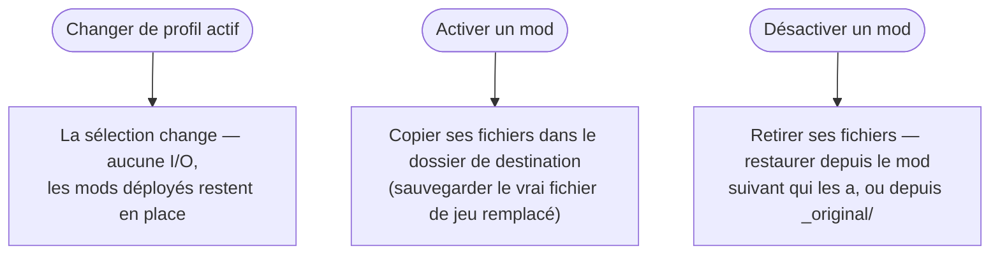
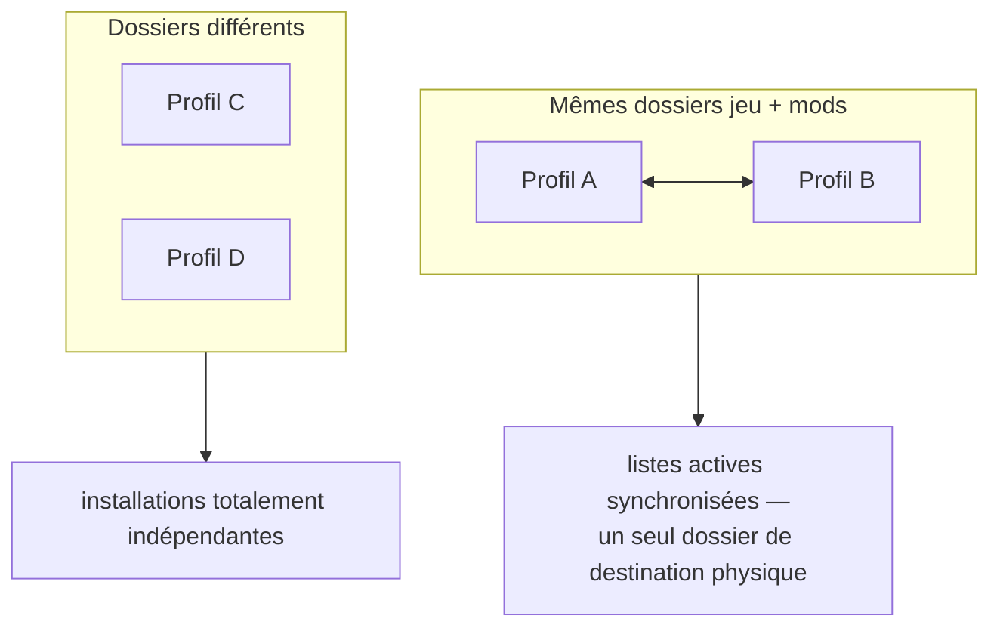
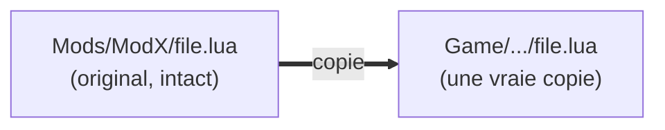

# Profils & activation

Un profil est un petit enregistrement — un nom, **trois dossiers**, et une **liste ordonnée des mods
activés**. Il ne stocke aucun fichier de mod. C'est pour ça que tu peux avoir une douzaine de profils
pour presque rien.

---

## Les trois dossiers

| Dossier | Ce qui y vit |
|---|---|
| **Jeu** | là où les mods sont déployés — l'arborescence du jeu |
| **Mods** | ta bibliothèque pour ce profil : un dossier (ou une archive) par mod |
| **Sauvegarde** | le magasin `_original/` du profil, avec les fichiers de jeu qu'un mod a remplacés |

Ce sont des **chemins absolus**, et c'est ce qui identifie un profil en pratique. Deux conséquences à
connaître d'emblée :

- Un mod appartient à un profil **par préfixe de chemin**, pas par un id stocké — un mod est « dans » un
  profil quand son dossier se trouve sous le dossier mods de ce profil. Déplace le dossier du mod
  ailleurs et il quitte le profil.
- Parce que les chemins sont absolus, une lettre de lecteur qui change (`E:\Mods` → `F:\Mods`) doit être
  corrigée à la main. Voir [Scan & cache](doc-page:how-it-works/scanning-cache) pour ce qui se passe pendant que le disque
  est absent.

---

## Changer de profil ≠ activer un mod

Deux actions faciles à confondre, et une seule touche tes fichiers :

- **Changer le profil actif** change juste *dans quel profil tu travailles*. Ça ne déplace **aucun
  fichier** — ce qui est déjà déployé dans le dossier de destination reste exactement où il est. Le profil actif
  est un simple pointeur de sélection, rien de plus.
- **Activer ou désactiver un mod** est la seule chose qui touche au dossier de destination.

!!! warning "C'est la plus grosse source de confusion"

    Changer de profil ne **permute pas** ton loadout. Si le profil A avait dix mods déployés et que tu
    passes au profil B, ces dix fichiers sont toujours dans le dossier de destination. Ce qui change, c'est la
    liste que BMM édite désormais. Pour changer réellement ce que le jeu voit, tu actives et désactives.

---

## Les profils qui partagent des dossiers se synchronisent

L'état d'activation est réconcilié entre les profils qui pointent sur le **même dossier de destination et le
même dossier mods** : activer ou désactiver dans l'un met aussi à jour les listes actives des autres. Un
mod ne peut pas être activé dans deux d'entre eux à la fois, parce qu'il n'y a qu'un seul dossier de destination
en dessous et qu'un seul fichier peut occuper un chemin donné.

Il y a un détail lié dans la logique de sauvegarde : pour décider si un fichier qu'il va écraser est un
*véritable fichier de jeu*, BMM regarde les mods activés dans **tous les profils partageant ce dossier
de jeu** — pas seulement l'actif. Sinon, changer de profil pourrait lui faire prendre le fichier de mod
d'un autre profil pour un original et le sauvegarder comme tel. Voir [Conflits](doc-page:how-it-works/conflicts) pour la
règle de sauvegarde complète.

**Donc : pour garder des loadouts vraiment séparés, donne à chaque profil son propre dossier mods.**
Partager des dossiers est supporté, mais c'est une seule installation avec plusieurs vues, pas deux
installations.

---

## Non destructif par construction

Le déploiement ne *déplace* jamais tes originaux hors du dossier mods — il les copie dans le dossier de destination. Ta bibliothèque garde toujours sa copie intacte.

!!! warning "Il n'y a aucun hard-link ni lien symbolique"

    Certains gestionnaires déploient en liant. BMM non — chaque fichier déployé est une **vraie copie**.
    Un déploiement coûte donc du vrai espace disque, et « désactiver » est une vraie suppression suivie
    d'une restauration, pas un délien. L'avantage : le dossier de destination ne contient que des fichiers
    ordinaires — ça marche avec les outils qui ne comprennent pas les liens, ça survit à un dossier mods
    sur un autre disque, et ça reste intact si tu désinstalles BMM.

« Désinstaller d'un profil » veut donc dire « retirer les copies déployées et remettre ce qu'il y avait
en dessous » — le mod reste sur l'étagère dans ton dossier mods, prêt pour un autre profil. La
suppression que craignent les débutants est bel et bien une annulation.

---

## Ce qui se passe si une activation est interrompue

Soyons précis, parce que ça compte :

| Interruption | Ce qui se passe |
|---|---|
| **Tu cliques sur annuler** | Le processus worker est tué par `taskkill /T`, puis BMM lance *« un sous-processus d'annulation en opération inverse pour que toute écriture partielle soit revertie »*. Un déploiement annulé ne laisse pas la moitié d'un mod |
| **BMM est tué de force, ou la machine perd le courant en pleine copie** | Il n'y a **aucun journal, donc aucun rollback automatique.** Le dossier de destination peut contenir un déploiement partiel |

Le second cas est survivable plutôt que transactionnel, et la raison est la règle de sauvegarde : les
copies `_original/` sont écrites **avant** que le fichier de jeu soit écrasé. Les fichiers propres du jeu
ne sont donc jamais ce qui est en danger — le pire cas est un mod à moitié déployé. Le réactiver termine
la copie (chaque copie écrase de force), et le désactiver nettoie en utilisant l'union des fichiers
*enregistrés* et *présents*, l'état partiel est donc entièrement retiré dans les deux cas.

Une garde de plus : un verrou global signifie **une seule opération de mod à la fois**. Deux
activations ne peuvent jamais courir sur le même dossier de destination, un état partiel ne peut donc venir que
d'une seule opération interrompue, jamais de deux inachevées entrelacées.

---

## L'ordre d'activation, c'est toute l'histoire des conflits

Parce que `active_mods` est une liste **ordonnée** et que le déploiement la parcourt dans l'ordre, le mod
activé en dernier gagne tout fichier partagé. C'est tout le modèle de résolution de conflits — il n'y a
pas d'arbre de priorités. Voir [Conflits](doc-page:how-it-works/conflicts).

!!! info "À voir dans l'app"
    Aide & autres → Développeur → **Système de profils**, et le tutoriel **Profils**.
