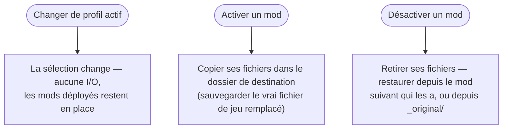
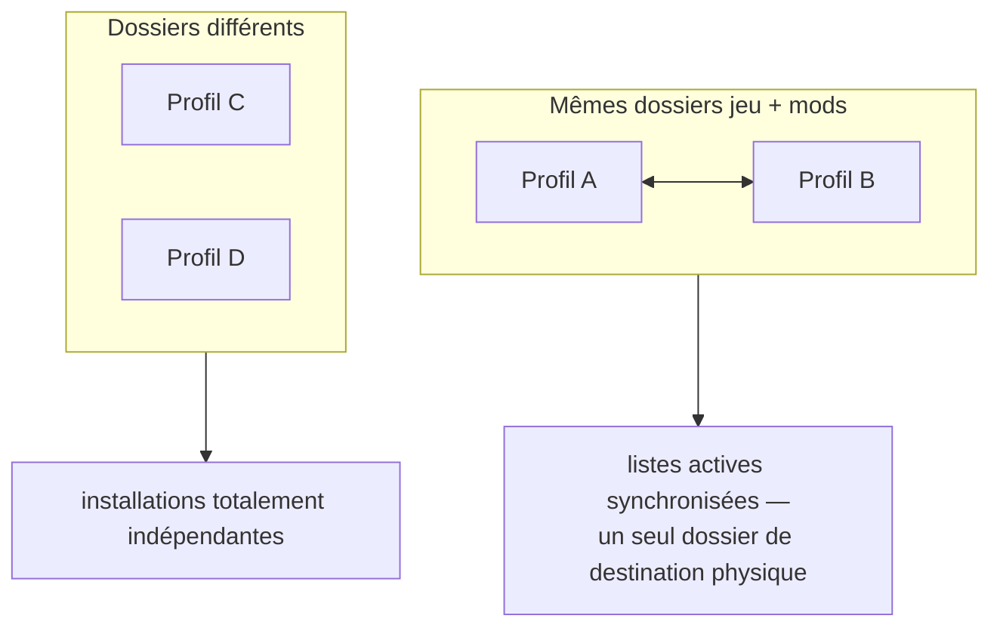
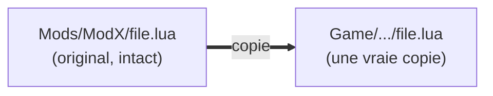

# Profils & activation


Un profil est un petit enregistrement — un nom, **trois dossiers**, et une **liste ordonnée des mods
activés**. Il ne stocke aucun fichier de mod. C'est pour ça que tu peux avoir une douzaine de profils
pour presque rien.

---

## Les trois dossiers

| Dossier | Ce qui y vit |
|---|---|
| **Jeu** | là où les mods sont déployés — l'arborescence du jeu |
| **Mods** | ta bibliothèque pour ce profil : un dossier (ou une archive) par mod |
| **Sauvegarde** | le magasin `_original/` du profil, avec les fichiers de jeu qu'un mod a remplacés |

Ce sont des **chemins absolus**, et c'est ce qui identifie un profil en pratique. Deux conséquences à
connaître d'emblée :

- Un mod appartient à un profil **par préfixe de chemin**, pas par un id stocké — un mod est « dans » un
  profil quand son dossier se trouve sous le dossier mods de ce profil. Déplace le dossier du mod
  ailleurs et il quitte le profil.
- Parce que les chemins sont absolus, une lettre de lecteur qui change (`E:\Mods` → `F:\Mods`) doit être
  corrigée à la main. Voir [Scan & cache](doc-page:how-it-works/scanning-cache) pour ce qui se passe pendant que le disque
  est absent.

---

## Changer de profil ≠ activer un mod

Deux actions faciles à confondre, et une seule touche tes fichiers :

- **Changer le profil actif** change juste *dans quel profil tu travailles*. Ça ne déplace **aucun
  fichier** — ce qui est déjà déployé dans le dossier de destination reste exactement où il est. Le profil actif
  est un simple pointeur de sélection, rien de plus.
- **Activer ou désactiver un mod** est la seule chose qui touche au dossier de destination.


```mermaid
flowchart TB
    SW([Changer de profil actif]) --> PTR["La sélection change — aucune I/O,<br/>les mods déployés restent en place"]
    EN([Activer un mod]) --> DEPLOY["Copier ses fichiers dans le dossier de destination<br/>(sauvegarder le vrai fichier de jeu remplacé)"]
    DIS([Désactiver un mod]) --> REMOVE["Retirer ses fichiers — restaurer depuis le mod<br/>suivant qui les a, ou depuis _original/"]
```

!!! warning "C'est la plus grosse source de confusion"

    Changer de profil ne **permute pas** ton loadout. Si le profil A avait dix mods déployés et que tu
    passes au profil B, ces dix fichiers sont toujours dans le dossier de destination. Ce qui change, c'est la
    liste que BMM édite désormais. Pour changer réellement ce que le jeu voit, tu actives et désactives.

---

## Les profils qui partagent des dossiers se synchronisent

L'état d'activation est réconcilié entre les profils qui pointent sur le **même dossier de destination et le
même dossier mods** : activer ou désactiver dans l'un met aussi à jour les listes actives des autres. Un
mod ne peut pas être activé dans deux d'entre eux à la fois, parce qu'il n'y a qu'un seul dossier de destination
en dessous et qu'un seul fichier peut occuper un chemin donné.


```mermaid
flowchart TB
    subgraph Same["Mêmes dossiers jeu + mods"]
        P1["Profil A"] <--> P2["Profil B"]
    end
    subgraph Sep["Dossiers différents"]
        P3["Profil C"]
        P4["Profil D"]
    end
    Same --> NOTE["listes actives synchronisées —<br/>un seul dossier de destination physique"]
    Sep --> NOTE2["installations totalement indépendantes"]
```

Il y a un détail lié dans la logique de sauvegarde : pour décider si un fichier qu'il va écraser est un
*véritable fichier de jeu*, BMM regarde les mods activés dans **tous les profils partageant ce dossier
de jeu** — pas seulement l'actif. Sinon, changer de profil pourrait lui faire prendre le fichier de mod
d'un autre profil pour un original et le sauvegarder comme tel. Voir [Conflits](doc-page:how-it-works/conflicts) pour la
règle de sauvegarde complète.

**Donc : pour garder des loadouts vraiment séparés, donne à chaque profil son propre dossier mods.**
Partager des dossiers est supporté, mais c'est une seule installation avec plusieurs vues, pas deux
installations.

---

## Non destructif par construction

Le déploiement ne *déplace* jamais tes originaux hors du dossier mods — il les copie dans le dossier de destination. Ta bibliothèque garde toujours sa copie intacte.


```mermaid
flowchart LR
    LIBFILE["Mods/ModX/file.lua<br/>(original, intact)"]
    GAMEFILE["Game/.../file.lua<br/>(une vraie copie)"]
    LIBFILE == "copie" ==> GAMEFILE
```

!!! warning "Il n'y a aucun hard-link ni lien symbolique"

    Certains gestionnaires déploient en liant. BMM non — chaque fichier déployé est une **vraie copie**.
    Un déploiement coûte donc du vrai espace disque, et « désactiver » est une vraie suppression suivie
    d'une restauration, pas un délien. L'avantage : le dossier de destination ne contient que des fichiers
    ordinaires — ça marche avec les outils qui ne comprennent pas les liens, ça survit à un dossier mods
    sur un autre disque, et ça reste intact si tu désinstalles BMM.

« Désinstaller d'un profil » veut donc dire « retirer les copies déployées et remettre ce qu'il y avait
en dessous » — le mod reste sur l'étagère dans ton dossier mods, prêt pour un autre profil. La
suppression que craignent les débutants est bel et bien une annulation.

---

## Ce qui se passe si une activation est interrompue

Soyons précis, parce que ça compte :

| Interruption | Ce qui se passe |
|---|---|
| **Tu cliques sur annuler** | Le processus worker est tué par `taskkill /T`, puis BMM lance *« un sous-processus d'annulation en opération inverse pour que toute écriture partielle soit revertie »*. Un déploiement annulé ne laisse pas la moitié d'un mod |
| **BMM est tué de force, ou la machine perd le courant en pleine copie** | Il n'y a **aucun journal, donc aucun rollback automatique.** Le dossier de destination peut contenir un déploiement partiel |

Le second cas est survivable plutôt que transactionnel, et la raison est la règle de sauvegarde : les
copies `_original/` sont écrites **avant** que le fichier de jeu soit écrasé. Les fichiers propres du jeu
ne sont donc jamais ce qui est en danger — le pire cas est un mod à moitié déployé. Le réactiver termine
la copie (chaque copie écrase de force), et le désactiver nettoie en utilisant l'union des fichiers
*enregistrés* et *présents*, l'état partiel est donc entièrement retiré dans les deux cas.

Une garde de plus : un verrou global signifie **une seule opération de mod à la fois**. Deux
activations ne peuvent jamais courir sur le même dossier de destination, un état partiel ne peut donc venir que
d'une seule opération interrompue, jamais de deux inachevées entrelacées.

---

## Les activations sont des tâches de fond

Activer ou désactiver des mods appartient à l'app, pas à l'écran qui l'a demandé
(`frontend/src/core/activation-jobs.ts`). Les tâches se mettent en file et passent l'une après
l'autre ; à l'intérieur d'un mod, la copie est parallèle sous les règles Deploy du
[gouverneur de ressources](doc-page:how-it-works/resources). **Seul un Annuler explicite arrête une tâche** : changer
de vue, fermer une boîte de dialogue ou redessiner la Bibliothèque ne le fait jamais. La pastille
d'activité de la barre de titre et les cartes de la Bibliothèque lisent le même flux.

**Progression.** Pour chaque mod qu'une activation ou une désactivation touche (dépendances
comprises, quel que soit le demandeur : une carte, *Tout activer*, une liste d'ordre, le
planificateur), le backend émet `bmm://mod-op-progress` :
`{ mod_id, mod_name, op: "enable" | "disable", phase: "start" | "copy" | "done" | "failed" | "cancelled", bytes_done, bytes_total }`.
La copie elle-même tourne dans le processus worker, qui écrit son compte d'octets sur un tube ; le
parent en fait des événements `copy`, **10 par seconde au plus** et seulement quand le compte a
bougé.

**Ce que fait Annuler.** Le mod en cours est défait (son worker est tué et l'opération inverse
revert la copie partielle, comme dans le tableau ci-dessus) ; les mods déjà faits le restent ; ceux
pas encore atteints ne sont pas lancés. Les autres tâches en file passent quand même.

**Un jeton d'annulation par tâche.** Chaque tâche envoie sa propre portée avec ses appels
(`cancelScope`) ; son Arrêt est `cancel_mod_ops({ scope })` et sa fin
`clear_mod_op_cancel({ scope })`. Aucun des deux ne touche le drapeau global du backend : une tâche
qui termine son annulation ne peut plus baisser l'Arrêt d'un autre lot qui tourne au même moment
(ce que faisait l'unique drapeau partagé). Un *Tout annuler* global atteint toujours chaque tâche
commencée avant lui, et aucune de celles qui commencent après : personne n'a rien à baisser avant
la suivante (`CancelScope` dans `src-tauri/src/fs_utils.rs`).

### Pour les développeurs : `runActivationJob`

```ts
import { runActivationJob } from '../../core/activation-jobs.js';

const job = runActivationJob({
  mods: [{ id, name }, …],     // dans l'ordre ; les doublons sont retirés
  mode: 'enable',              // ou 'disable'
  profileId,                   // optionnel ; doit être le profil ACTIF, sinon chaque élément échoue avec actjob.errNotActive
  label: 'Liste « Survie »',   // le nom donné par la pastille et le toast de fin
  bypassSha: false,            // optionnel
  silent: false,               // true = pas de toast de fin (tu rapportes le résultat toi-même)
  refreshAfter: true,          // relire la Bibliothèque une fois la file vide
  source: 'order-list',
});
const summary = await job.done;   // ne rejette jamais
// summary.items[i].phase : 'done' | 'failed' | 'cancelled' ; .error (MISSING_SHA|…, CRITICAL_SPACE|…), .warning (WARNING_SPACE|…)
// summary.done / .failed / .cancelled / .wasCancelled
await job.cancel();               // l'arrêt explicite
```

Exportés aussi : `onActivationChange(fn)` (regroupé par frame), `modActivity(modId)` (ce qu'une
carte affiche), `isActivationBusy()`, `cancelActivationJob(id)`, `cancelAllActivationJobs()`, et
`announceExternal(ids, op)` / `clearAnnounced(ids)` pour un écran qui lance son propre lot côté
backend et veut que ses cartes affichent *En attente* jusqu'à ce que le backend les atteigne.

Un lot que le **backend** exécute en une seule commande est aussi une tâche :
`runActivationBatch({ mods, mode, label, run: (scope) => invoke(…, { cancelScope: scope }), failToast })`.
*Activer* des listes d'ordre en est un (`order_list_activate` : un plan, les activations avec leurs
dépendances, un seul commit de l'ordre) : il attend derrière les autres tâches, ses mods avancent
dans la pastille et sur les cartes au fil des événements de progression, son Arrêt n'annule que sa
portée, son toast de fin est celui du gestionnaire de tâches, et fermer la fenêtre ou changer de vue
ne l'arrête pas. `run` renvoie `{ failed, cancelled, toast }`.

### Ce qu'une activation ne paie plus

| Coût par mod (avant) | Maintenant |
|---|---|
| `enable_mod` invalidait le cache de fichiers, donc l'activation **suivante** reconstruisait tout l'index fichier → mods sous le verrou des données | Plus invalidé : le cache est la liste de fichiers de chaque mod, qu'une activation ne change pas |
| `data.json` écrit (JSON indenté, rotation `.bak`, fsync) **en tenant le verrou des données** : toutes les autres commandes attendaient | Sérialisé sous le verrou, écrit en dehors ; un verrou d'ordre empêche qu'un instantané plus ancien n'écrase jamais un plus récent |
| Une chaîne de dépendances lisait les « fichiers des autres mods » dans le cache, que quitter la Bibliothèque vidait : le mod suivant sauvegardait les copies du précédent comme originaux du jeu | Lu dans ce que le worker dit avoir écrit ; et quitter la Bibliothèque ne vide plus le cache pendant une tâche |
| Une erreur sur le 3ᵉ mod d'une chaîne sortait avant la sauvegarde : les deux premiers étaient déployés mais pas enregistrés jusqu'à une sauvegarde ultérieure | La sauvegarde a lieu quelle que soit la sortie |
| Un spinner bloquant sur chaque carte pendant toute l'opération (toutes les cartes d'un *Tout activer*) | Une étiquette d'état et une fine barre sur la carte ; chaque événement de progression touche cette seule carte, jamais la liste |

La sauvegarde par mod est gardée exprès : un plantage entre deux mods d'un lot doit laisser
`data.json` au courant de ce qui est dans le dossier du jeu.

---

## L'ordre d'activation, c'est toute l'histoire des conflits

Parce que `active_mods` est une liste **ordonnée** et que le déploiement la parcourt dans l'ordre, le mod
activé en dernier gagne tout fichier partagé — tant que tu ne le réordonnes pas dans l'[ordre
d'activation](doc-page:how-it-works/load-order). C'est tout le modèle de résolution de conflits — il n'y a pas d'arbre de
priorités. Voir [Conflits](doc-page:how-it-works/conflicts).

!!! info "À voir dans l'app"
    Aide & autres → Développeur → **Système de profils**, et le tutoriel **Profils**.
