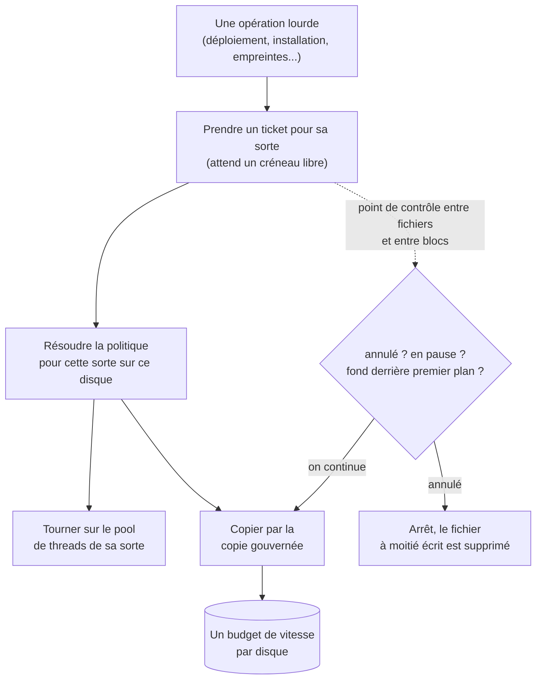
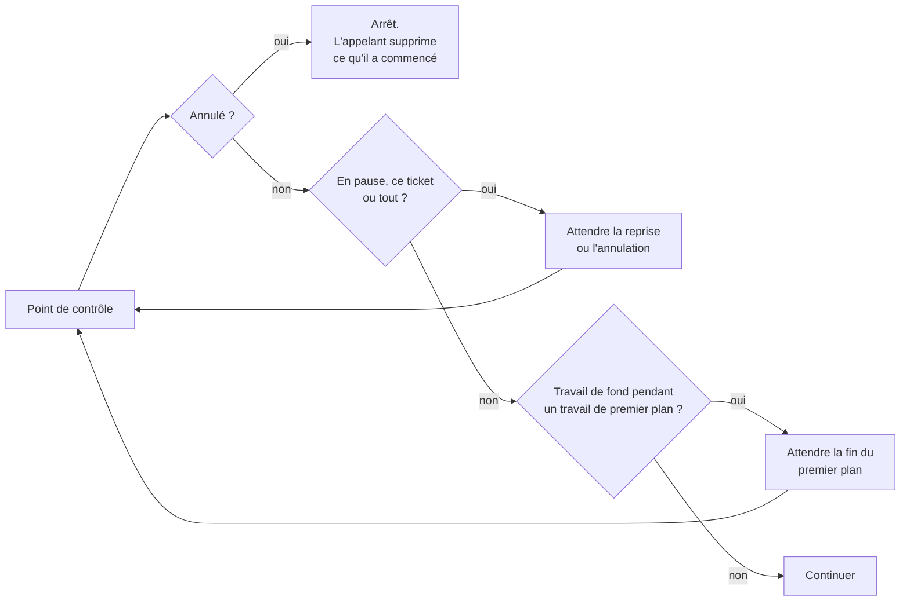
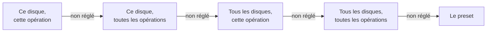
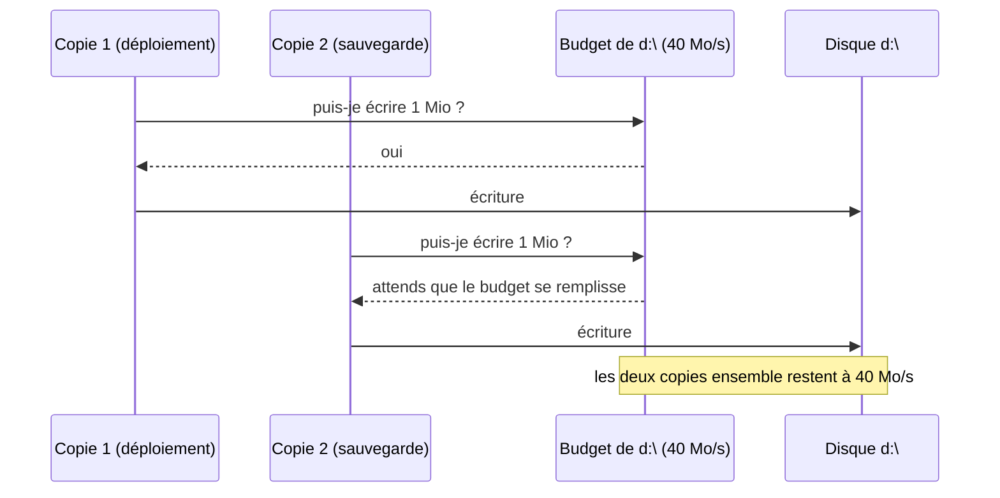
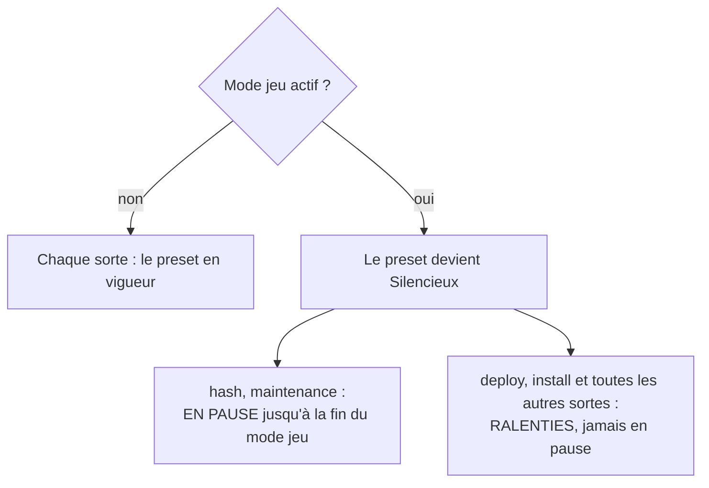
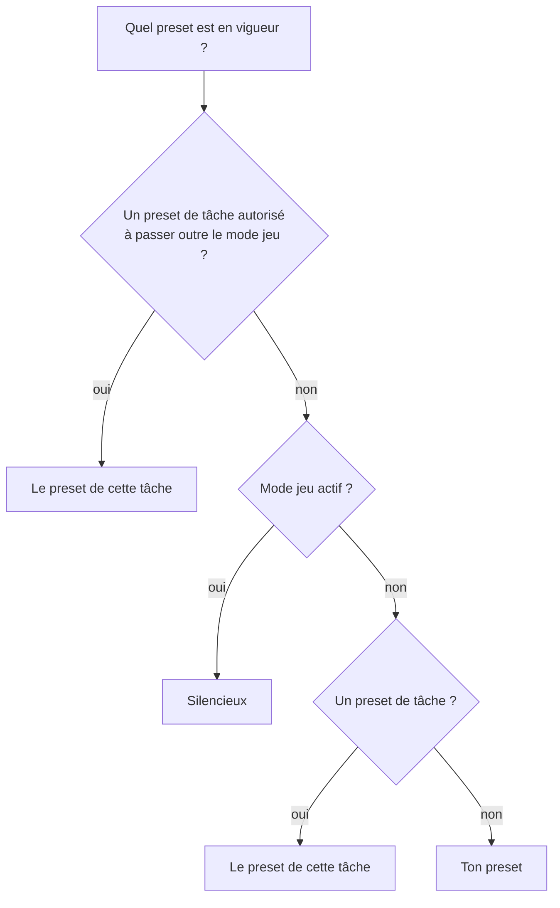
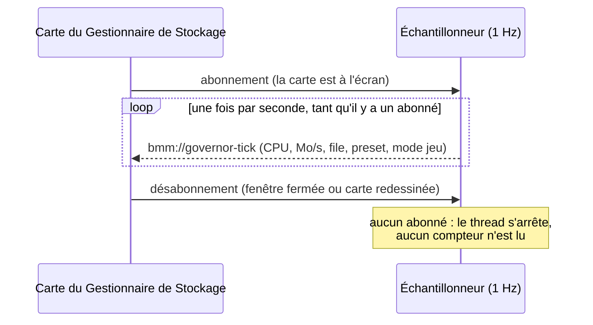

# Le gouverneur de ressources

Tout ce que BMM fait de lourd (activer des mods, installer, sauvegarder les originaux, extraire et
compresser des archives, analyser, calculer des empreintes, télécharger, recadrer des images, la
maintenance de fond) demande d'abord la permission à un seul composant : le **gouverneur de
ressources**. Il décide combien d'opérations de chaque sorte tournent en même temps, sur combien de
threads, à quelle vitesse elles peuvent écrire sur chaque disque, et lesquelles s'effacent quand
quelque chose de plus urgent démarre.

Avant lui, chacun de ces morceaux fixait ses propres limites, et les limites ne s'additionnaient pas.
Un disque limité à 40 Mo/s était écrit à 80 Mo/s par deux threads de copie qui se cadençaient chacun
de leur côté. Le gouverneur existe pour qu'un chiffre veuille dire un chiffre.

!!! info "Le voir dans l'app"
    **Réglages → Stockage → Ouvrir le Gestionnaire de Stockage.** La carte du haut, *Intensité de
    travail de BMM*, c'est le gouverneur : le preset, le mode jeu, la file en direct et, repliées
    en dessous, les règles par disque.

---

## Vue d'ensemble

Trois idées portent tout le reste :

- **Un ticket par opération.** Une opération prend un ticket pour sa sorte avant de démarrer et le
  rend à la fin. Le ticket, c'est ce que le tableau de bord liste, ce qui compte dans les créneaux
  de la sorte, et ce que la pause et l'annulation atteignent.
- **Une politique par sorte et par disque.** Quelle vitesse, quel tampon, combien en même temps :
  résolu à partir du preset et de tes règles par disque, puis ramené dans des bornes dures que rien
  ne franchit.
- **Un budget de vitesse par disque.** Une limite en Mo/s est un seau de jetons partagé par tout ce
  qui écrit sur ce disque : deux copies en parallèle se partagent la limite au lieu de la doubler.

Les dix sortes sont `deploy`, `install`, `backup`, `extract`, `compress`, `scan`, `hash`,
`download`, `image` et `maintenance`. Ce sont les noms que montre le tableau de bord et les clés
sous lesquelles les règles sont enregistrées.

---

## Les presets

Un preset, c'est une politique entière en un mot. Il y en a trois au choix, et un quatrième qui est
moins un choix qu'un état :

| | **Silencieux** (`silent`) | **Équilibré** (`balanced`, par défaut) | **Tout pour BMM** (`max`) |
|---|---|---|---|
| Opérations d'une même sorte en même temps | 1 | 2 | autant que son pool a de threads (16 au plus) |
| Threads par sorte | 1 | 2 · empreintes : la moitié de tes cœurs, de 1 à 4 · extraction et compression : autant que le pool général de BMM | tous les cœurs sauf un |
| Déploiement : un fichier à la fois, ou en parallèle | un à la fois | en parallèle, mais un à la fois quand le dossier du jeu ou de sauvegarde est sur le disque système | en parallèle, mais un à la fois sur un disque dur |
| Tampon de copie | 256 Kio | 1 Mio | 4 Mio |
| Courte pause pendant la copie | 150 µs tous les 16 Mio | 150 µs tous les 16 Mio | aucune |
| Priorité des threads de la sorte | mode arrière-plan | normale · empreintes et maintenance : mode arrière-plan | normale |
| Priorité d'E/S des fichiers qu'une copie ouvre | basse | normale | normale |
| Parcours de dossiers (analyses) | sur un seul thread | comme avant | comme avant |

Sur un disque qui a une limite en Mo/s, Silencieux et Équilibré copient par blocs de 128 Kio et
laissent la limite cadencer, sans pause séparée (sauf si une règle fixe elle-même le tampon). C'est
l'ancien chemin bridé, gardé tel quel.

**Équilibré, c'est exactement ce que faisait BMM avant le gouverneur.** C'est un test dans le code,
pas une promesse : le preset par défaut doit reproduire l'ancien rythme de copie, l'ancien pool
d'empreintes et les anciens nombres de threads. Personne n'a vu son BMM changer de vitesse à la mise
à jour.

**Personnalisé** (`custom`) veut dire « mes règles seules, par-dessus les valeurs d'Équilibré ». Le
tableau de bord ne le propose pas comme bouton ; l'API, le serveur MCP et le CLI l'acceptent.

!!! note "Smart I/O compte encore sous Équilibré"
    Avec **Smart I/O** désactivé et Équilibré choisi, BMM garde son ancien chemin pleine vitesse sur
    un disque sans limite en Mo/s : une copie simple du système, sur le pool de threads général.
    Sous tout autre preset, c'est le gouverneur qui décide, quoi que dise l'interrupteur Smart I/O.
    Voir [Performances](doc-page:how-it-works/performance).

---

## Tickets, créneaux et points de contrôle

Chaque sorte a un nombre de **créneaux**. Un ticket qui trouve sa sorte pleine attend ; le tableau
de bord l'affiche *en attente*. Les sortes ne partagent pas leurs créneaux : un calcul d'empreintes
n'attend jamais le créneau d'un déploiement.

Pendant qu'elle tourne, une opération appelle un **point de contrôle** entre deux fichiers, et la
copie gouvernée en appelle un entre deux blocs. Un point de contrôle pose trois questions, dans cet
ordre :

### Premier plan et arrière-plan

Deux sortes sont de **premier plan** : `deploy` et `install`, le travail devant lequel tu attends,
celui de ton dossier de jeu. Deux sont d'**arrière-plan** : `hash` et `maintenance`, le travail qui
peut bien finir une minute plus tard. Tant qu'un ticket de premier plan tourne, les tickets de fond
s'arrêtent à leur prochain point de contrôle et reprennent quand il se termine. Les autres sortes ne
sont ni l'un ni l'autre et ne sont jamais retenues de cette façon.

Un ticket pris à l'intérieur d'un autre ticket de la même sorte, sur le même thread (un export qui
zippe, une synchronisation qui installe), ne prend pas de créneau : sous le créneau unique de
Silencieux, il s'attendrait lui-même pour toujours. Il reste listé, suspendable et annulable.

### Pause et annulation

La pause retient une opération à son prochain point de contrôle ; l'annulation fait échouer ce point
de contrôle, et une copie annulée au milieu d'un fichier supprime le fichier à moitié écrit. **Tout
suspendre** retient tous les tickets d'un coup.

!!! warning "Un déploiement dans le processus séparé s'annule, il ne se suspend pas"
    Les grosses activations et désactivations tournent dans un processus séparé
    ([Performances](doc-page:how-it-works/performance#sortir-le-travail-lourd-de-la-fenetre)). L'app garde le ticket
    du déploiement pendant que ce processus tourne et le surveille : annuler ce ticket arrête le
    processus, exactement comme le bouton Annuler. Ce processus n'a aucun canal pour une pause :
    suspendre ce ticket change son libellé, pas la copie.

---

## Règles par disque, et d'où vient chaque valeur

Sous le preset, il y a tes **règles** : une valeur pour un disque et une sorte d'opération. Chaque
champ (Mo/s, en même temps, tampon, priorité) est résolu à part, depuis la règle la plus précise qui
le fixe :

Champ par champ, cela veut dire qu'une règle qui ne fixe que le *en même temps* des empreintes sur
`D:` hérite quand même de la limite en Mo/s donnée à tout `D:`. Le tableau avancé montre en gris,
dans chaque case vide, la valeur en vigueur et d'où elle vient (*cette règle*, *ce disque*, *tous
les disques, cette opération*, *tous les disques*, *preset*), parce qu'un tableau de cases vides qui
limite pourtant une copie à 40 Mo/s est un réglage que personne ne peut déboguer.

Un disque, c'est son point de montage en minuscules (`d:\`), un partage réseau (`\\nas\games\`), ou
`*` pour tous les disques. 64 disques au plus peuvent porter des règles.

### Sur quoi agit chaque colonne

| Colonne | Agit sur |
|---|---|
| **Mo/s** | Ce que cette sorte écrit sur le disque, cadencé pour le disque **sur lequel on écrit**. Les copies que BMM fait lui-même : déployer et restaurer des fichiers, sauvegarder les originaux, copier le dossier d'un mod à l'installation, les copies d'images, les copies de fichiers d'un export de dépôt. L'**extraction**, tous formats, sur ce qu'elle écrit : zip, tar et 7z au fil des octets, rar une fois chaque fichier sorti (sa bibliothèque écrit un fichier d'un seul appel). Les **zip que BMM écrit** (les zip d'un dépôt, le réarchivage d'un mod, un paquet de catalogue), payés après chaque fichier sur ce qu'il a empaqueté. Les **téléchargements de synchronisation de dépôt et de modpack**, au fil des morceaux reçus |
| **Tampon Kio** | La taille des blocs que lisent et écrivent les copies de BMM, et le tampon d'écriture de chaque fichier que crée une extraction zip (jamais plus grand que le fichier lui-même) |
| **En même temps** | Les déploiements : quand la valeur pour le disque du dossier du jeu (Déploiement) ou pour celui du dossier de sauvegarde (Sauvegarde) vaut 1, un déploiement copie un fichier à la fois ; au-dessus de 1, il utilise le pool de threads Déploiement, dont le preset fixe la taille |
| **Priorité** | *Basse* pose l'indication de priorité d'E/S de Windows sur les fichiers qu'ouvrent les copies de BMM (le fichier lu et le fichier écrit) et sur chaque fichier que crée une extraction zip. NTFS sur un disque local la respecte ; les partages réseau et la plupart des disques cloud l'ignorent |

Un débit fixé pour **tout le disque** (*ce disque, toutes les opérations*, le nombre de la carte du
disque) est un seul budget, partagé par toutes les sortes qui en héritent. Un débit fixé pour
**une opération** (*ce disque, cette opération* ou *tous les disques, cette opération*) est un
budget à part sur ce disque : une limite de 5 Mo/s sur les téléchargements ne ralentit pas un
déploiement vers le même disque, et le déploiement ne mange pas les 5 Mo/s du téléchargement.

Une case dont la colonne n'agit sur rien pour cette opération est **grisée**, et le survol le dit,
plutôt que d'accepter une valeur qui ne changerait rien.

!!! warning "Ce que le tableau n'atteint pas encore"
    - **Analyse** et **Empreintes** sont grisées en entier. Une analyse parcourt des dossiers et ne
      déplace aucun octet ; les empreintes lisent des fichiers depuis une dizaine d'endroits de BMM
      qui ne passent pas encore par une seule boucle. Ce que le gouverneur contrôle pour elles, ce
      sont leurs créneaux, leur pool de threads, sa priorité et leurs points de contrôle.
    - **Téléchargement** : un mod téléchargé depuis un lien (le téléchargement de la Bibliothèque,
      l'installation d'une modlist) et l'installation d'un plugin ne sont pas encore cadencés par le
      débit ; la synchronisation de dépôt et les modpacks le sont. Le tampon et la priorité sont
      grisés : un téléchargement s'écrit au rythme où le réseau le livre.
    - **Compression** : le débit agit sur l'écriture du zip ; le tampon et la priorité n'agissent
      que sur les copies de fichiers d'un export de dépôt, pas sur l'écriture du zip elle-même.

### Les bornes dures

Quelle que soit la source (l'écran Réglages, l'API, le serveur MCP, une tâche planifiée, un fichier
de données modifié à la main), une politique résolue est ramenée dans ces bornes :

| Borne | Valeur |
|---|---|
| Mo/s | au moins 1 (0 voudrait dire « bloquer pour toujours ») ; vide = pas de limite |
| Opérations en même temps | de 1 à 16 |
| Tampon | de 64 Kio à 16 Mio |
| En vol | en même temps × tampon ne dépasse pas 256 Mio (c'est le tampon qui rétrécit, jamais le nombre demandé) |
| Pool de threads | jamais tous les cœurs : l'interface en garde au moins un |
| Créneaux par sorte | de 1 à 16 |

Une règle qui demande plus est **refusée avec la raison**, pas réécrite en silence : 999 copies en
parallèle enregistrées alors que le gouverneur en fait tourner 16, c'est encore un réglage que
personne ne peut déboguer.

### Où sont passées les anciennes limites par disque

La limite en Mo/s de chaque carte du Gestionnaire de Stockage, celle que règle l'auto-calibration,
**est** la règle *ce disque, toutes les opérations*. Au premier démarrage avec le gouverneur,
l'ancienne table par disque a été reportée une fois dans ces règles (une limite de 0 voulait dire
« illimité » et n'est devenue aucune règle). Depuis, la carte et la règle sont le même chiffre, quelle
que soit la porte par laquelle on le change.

---

## Un budget de vitesse par disque

Chaque copie vers un disque puise dans le seau de ce disque (tout comme l'extraction, les zip que
BMM écrit et les téléchargements de dépôt et de modpack, voir [le tableau](#sur-quoi-agit-chaque-colonne)).
Il se remplit au débit en Mo/s que tu as fixé et contient au plus une seconde de débit, donc une rafale ne peut pas devancer la limite
longtemps. Un bloc plus gros qu'une seconde entière de budget passe quand même et se rembourse
après, pour qu'un gros tampon sur une petite limite avance malgré tout.

La limite qui s'applique est celle du disque sur lequel on écrit. Une copie d'une clé USB lente vers
un disque NVMe est cadencée par la règle du disque NVMe.

---

## Le mode jeu

Le mode jeu, c'est « un jeu tourne : pousse-toi ». Tant qu'il est actif :

Les déploiements sont ralentis, jamais suspendus, exprès : un dossier de jeu à moitié moddé est pire
qu'un dossier lent. Le travail de fond suspendu pour le mode jeu reprend quand il se termine, et
seulement celui-là : une opération que tu as suspendue à la main reste suspendue.

Tu le règles dans le tableau de bord, avec les trois mêmes choix qu'une tâche planifiée :

| Choix | Mode jeu |
|---|---|
| **Le détecter** (`auto`) | suit la détection (voir plus bas) |
| **Forcer** (`on`) | actif, quoi qu'il tourne |
| **Arrêter** (`off`) | inactif, quoi qu'il tourne |

### Comment marche la détection

Avec **Le détecter**, BMM regarde toutes les **5 secondes**. Il liste les programmes lancés (une
seule liste de processus, gardée et rafraîchie, qui ne lit le chemin d'un programme que la première
fois qu'elle le voit) et compte un jeu quand l'exécutable d'un programme est :

- n'importe où sous **le dossier de jeu d'un de tes profils** (`D:\Games\Skyrim\SkyrimSE.exe` pour
  un profil dont le dossier de jeu est `D:\Games\Skyrim` ; `D:\Games\SkyrimTools\x.exe` n'est pas
  dessous) ;
- dans la liste **Jeux surveillés par BMM**, repliée sous le choix du mode jeu sur la carte : un nom
  d'exécutable (`eldenring.exe`, où qu'il tourne) ou un chemin complet, un par ligne, 64 au plus.

BMM lui-même ne compte jamais, même rangé dans un dossier de jeu, et un dossier de jeu qui est un
disque entier (`C:\`) ne compte pour rien : tous les programmes dessus seraient des jeux.

Il demande aussi à Windows si un programme tourne **en plein écran exclusif avec Direct3D**, ce qui
compte comme un jeu même hors de toute liste. Les jeux en fenêtre sans bordure ne se voient pas
ainsi ; ce sont les deux listes qui les attrapent.

La comparaison ne tient pas compte de la casse. Le mode jeu démarre dès que le jeu est vu et se
termine après **30 secondes** sans lui, pour qu'un lanceur qui le redémarre ou un écran de
chargement qui change de processus ne fasse pas basculer BMM dans un sens puis dans l'autre. Un
profil que tu enregistres ou une liste que tu modifies compte au regard suivant. Quand il démarre ou
se termine, le preset en vigueur, les pools de threads et le travail de fond suspendu suivent
aussitôt.

Avec **Forcer** ou **Arrêter**, et quand aucun profil n'a de dossier de jeu et que la liste est
vide, BMM ne liste pas les programmes du tout.

### Qui l'emporte

Ton choix manuel décide si le mode jeu est actif ; le mode jeu l'emporte sur un preset demandé par
une tâche, sauf si cette tâche a explicitement le droit de passer outre ; et un preset de tâche
l'emporte sur ton propre preset pendant la durée de la tâche. Seule une tâche planifiée peut recevoir
ce droit : un preset choisi par l'API ou par un lien ne passe jamais outre le mode jeu.

---

## Des presets pour la durée d'une tâche

Une tâche planifiée peut choisir un preset **pour de bon** (il est enregistré, comme en appuyant sur
le bouton) ou **pour cette tâche seulement**. Un preset de tâche :

- n'est jamais écrit dans tes réglages : il vit dans le gouverneur, et la ligne *En vigueur* du
  tableau de bord le montre pendant que ton propre preset reste sélectionné en dessous ;
- se termine avec la tâche, qu'elle ait réussi ou levé une erreur, parce que le planificateur
  l'efface dans le nettoyage final de la tâche ;
- se termine de toute façon au bout de **2 heures** au plus : c'est le filet pour une tâche qui meurt
  sans arriver à son nettoyage, une tâche plantée ne peut pas laisser BMM sur *Tout pour BMM* pour
  toujours ;
- ne peut être effacé que par la tâche qui l'a posé. Si une deuxième tâche pose le sien, la dernière
  l'emporte, et le nettoyage de la première laisse celui de la deuxième tranquille.

Un usage typique : à 3 h du matin, *Tout pour BMM pour cette tâche seulement*, lancer la maintenance
lourde, et laisser la fin de la tâche tout remettre en place. Voir
[Planification & automatisation](doc-page:features/scheduler#lintensite-de-travail-de-bmm).

---

## Le tableau de bord en direct

La carte du Gestionnaire de Stockage montre quatre courbes en direct (le CPU de BMM, le CPU de tout
le PC, les lectures et écritures de BMM en Mo/s), le preset en vigueur et pourquoi, le mode jeu, et
la file avec *Suspendre*, *Reprendre* et *Annuler* sur chaque opération.

**L'échantillonneur ne coûte rien au repos.** Il ne tourne que tant que quelqu'un est abonné, et la
carte ne s'abonne que tant qu'elle est à l'écran. Gestionnaire de Stockage fermé, BMM ne se mesure
pas du tout.

Le CPU de BMM est affiché en part de toute la machine (tous les cœurs = 100 %) : 12 % sur un PC à
huit cœurs, c'est à peu près un cœur occupé.

---

## Qui peut changer quoi

| Depuis | Peut changer |
|---|---|
| Le Gestionnaire de Stockage | tout : le preset, le mode jeu et les jeux qu'il surveille, la file, chaque règle |
| Une tâche planifiée | avec la permission de tâche **Ressources** : le preset (pour de bon ou pour la tâche), le mode jeu, suspendre ou reprendre toute la file. Les tâches importées arrivent sans elle |
| Un plugin ou un script avec un jeton d'API | `resources.write` : un preset nommé, le mode jeu, suspendre et reprendre ; **annuler** une opération demande aussi `mods.write`, parce que ça jette du travail |
| Le jeton admin (API, MCP, CLI) | tout ce qui précède, plus les règles fines par `POST /api/resources/io-rule`, qu'aucun jeton de plugin ne peut appeler, quels que soient ses scopes |
| Un lien `bmm://` | ouvrir le Gestionnaire de Stockage, ou choisir un preset nommé (un lien venu de l'extérieur de BMM demande d'abord, une question toutes les 10 secondes au plus) ; jamais une règle |

Les routes, outils et commandes sont listés dans la [Référence API](doc-page:reference/api), la
[Référence du serveur MCP](doc-page:reference/mcp) et la [Référence CLI](doc-page:reference/cli).

---

## Pour les contributeurs

Le gouverneur vit dans `src-tauri/src/governor/` : `config.rs` (presets, règles, bornes, pur),
`queue.rs` (tickets et créneaux), `io.rs` (la copie gouvernée et le seau par disque),
`game_mode.rs` (les règles de détection, pur), `procs.rs` (l'échantillonneur de processus qui les
alimente, toutes les 5 s), `win.rs` (priorité des threads, indication de priorité d'E/S, signal
plein écran), `runtime.rs` (l'instance unique que chaque site d'appel interroge) et
`telemetry.rs` (l'échantillonneur du tableau de bord).

L'extraction atteint le gouverneur par un crochet : `archive.rs` est compilé tel quel par les
benchmarks, il ne peut donc pas nommer le gouverneur, et l'app lui prête un `ExtractControl` au
démarrage (`commands/mod_archive.rs`), qui tient le ticket ainsi que le budget, le tampon et la
priorité du disque de destination. Une boucle d'octets hors de la copie gouvernée demande son
budget à `runtime::global().limiter(kind, path)`.

Un nouvel endroit qui lance du travail lourd (`par_iter`, `thread::spawn`, `spawn_blocking`,
`fs::copy`, `fs_extra::`, `ThreadPoolBuilder`, `update_mmap`, `io::copy`) doit passer par
`runtime::global()` ou être listé avec une raison dans `scripts/governed-allowlist.json` :
`scripts/check-governed.mjs`, qui fait partie de `npm run ci`, compte ces constructions fichier par
fichier et échoue sur celle que personne n'a routée ni listée.
