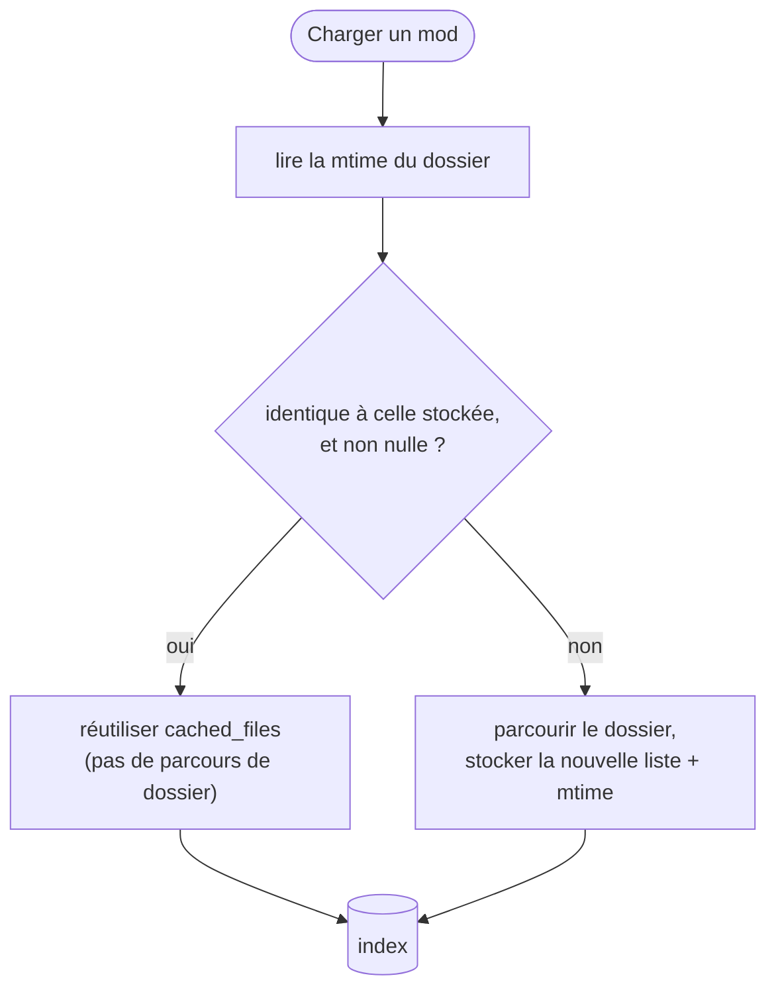

# Scan & cache

La première fois que BMM voit ton dossier de mods, il construit un **index** : pour chaque mod, sa
liste de fichiers, et pour chaque fichier un hash de contenu. Tout le reste — détection de conflits,
intégrité, « qu'est-ce qui a changé ? » — lit cet index au lieu du disque.

---

## Deux caches, deux clés différentes

Faciles à confondre, donc :

| Cache | Clé | Invalidé par | Persisté ? |
|---|---|---|---|
| **Liste de fichiers** (`cached_files`) | la mtime du **dossier** du mod | la mtime du dossier qui change | oui, dans `data.json` |
| **Hashs de fichiers** (`file_hashes`) | le chemin du fichier | un contrôle d'intégrité explicite ou un re-hachage | oui, dans `data.json` |
| **Index de conflits** | la liste de fichiers | reconstruit dès qu'il pourrait être périmé | **non** — mémoire seulement |
| **Badges de conflit** (`bmm_conflict_cache`) | l'index ci-dessus | reconstruits avec l'index | oui, dans `localStorage` |

La dernière ligne est celle qui surprend : l'*index* de conflits est reconstruit de zéro à
chaque session, mais les petits badges Intra/Inter des cartes sont conservés dans le
`localStorage`, pour être à l'écran avant la fin du rescan. Si un badge semble faux, c'est
cette copie que vous voyez, et la reconstruction suivante la remplace.

Le cache de liste de fichiers est celui qui rend le démarrage rapide. Le contrôle est délibérément
bon marché : lire la date de modification du dossier du mod, et si elle égale celle stockée, réutiliser
la liste stockée telle quelle sans toucher davantage au disque.

Le « et non nulle » compte : si la lecture des métadonnées échoue, BMM le journalise et **remet à zéro
la mtime stockée** plutôt que de faire confiance à un zéro — *« Contrôle d'invalidation mtime fragile
… Réinitialisation de la mtime »*. Un échec devient un re-scan, jamais un faux succès de cache.

!!! warning "La mtime d'un dossier ne change pas toujours quand un fichier dedans change"

    C'est la limite honnête de ce design. Sous Windows, éditer un fichier **sur place** sans rien
    ajouter, renommer ni supprimer peut laisser la mtime du *dossier parent* intacte — la liste de
    fichiers en cache reste donc valide (à juste titre, la liste n'a pas changé) mais rien ne déclenche
    un re-hachage. C'est exactement pour ça que la liste de fichiers et les hashs sont deux caches
    séparés avec des déclencheurs séparés : la liste est bon marché et rafraîchie à l'occasion, et les
    **hashs** sont ce qu'un [contrôle d'intégrité](doc-page:how-it-works/integrity-hashing) recalcule quand tu veux la
    vérité.

---

## Le re-hachage est une file de fond, pas une étape du scan

Le re-hachage tournait autrefois de façon synchrone, et c'est ce qui rendait le scan lent. Il est
maintenant reporté dans une file bridée qui hache *« un mod à la fois, sur le pool de hash plafonné,
avec une pause entre chacun »*. Trois plafonds s'empilent ici :

- **un mod à la fois** — jamais une rafale de jobs de hachage concurrents,
- le **pool de hash à ≤4 threads** (voir [Intégrité & hachage](doc-page:how-it-works/integrity-hashing)),
- une **pause entre les mods**, pour qu'une longue file ne monopolise pas le disque.

Résultat : un gros import termine son travail *visible* immédiatement et pose ses hashs en arrière-plan,
au lieu de bloquer sur des gigaoctets de lectures.

---

## Les archives sont listées, pas extraites

Un mod archivé (`.zip`, `.7z`, `.rar`) n'est jamais décompressé dans ton dossier mods. Lister ses
fichiers lit **l'index de l'archive seulement** — pour 7z et rar, l'en-tête — donc ajouter un mod
archivé coûte une lecture de métadonnées, pas une extraction. C'était un vrai correctif de démarrage :
extraire un gros `.zip` sous le verrou d'état figeait la fenêtre.

L'extraction est paresseuse, vers un dossier de cache indexé par *« le nom + la taille + la mtime de
l'archive, donc modifier l'archive l'invalide »*. Et parce que la vue extraite a les mêmes chemins
relatifs et les mêmes tailles qu'un dossier décompressé, *« chaque fonctionnalité de BMM (SHA /
content-id / rapport d'intégrité / conflits) donne des résultats IDENTIQUES pour un mod archivé et son
jumeau décompressé »*.

---

## Ce qui se passe quand un disque est débranché

Les dossiers d'un profil peuvent vivre sur un disque externe, et BMM le gère explicitement au lieu de
traiter un disque absent comme un disque vide :

- La liste de mods n'est **pas purgée**. Un scan qui ne trouve aucun fichier sur une racine
  inaccessible garde les entrées existantes — *« Garder ce qu'on avait déjà et réessayer quand le
  disque revient — ne pas brasser l'état hors ligne. »* Débrancher un disque n'efface ni tes mods ni
  ta liste active.
- Le hachage est **sauté** pour une racine inaccessible, au lieu d'enregistrer des hashs vides ou
  ratés : un contrôle d'intégrité ultérieur n'est donc pas empoisonné par un scan hors ligne.
- La liste de fichiers en cache est conservée telle quelle, la Bibliothèque continue donc de te montrer
  ce qui est sur ce disque.

Rebranche-le et le scan suivant réconcilie normalement. Ce que BMM ne peut pas corriger pour toi, c'est
une **lettre de lecteur qui change** — les profils stockent des chemins absolus, donc `E:\Mods` devenu
`F:\Mods` demande de corriger le chemin à la main.

---

## Ce qu'un scan ne fait jamais

Un scan est strictement **en lecture seule**. Il construit de la connaissance ; il ne modifie, ne
déplace et ne supprime jamais un mod. Les fichiers non reconnus sont listés pour que tu les nommes ou
les [mappes](doc-page:how-it-works/mapper), pas touchés. Rien dans le chemin de scan n'écrit dans ton dossier de jeu —
ça n'arrive que quand tu actives quelque chose.

!!! info "À voir dans l'app"
    Aide & autres → Développeur → **Cache mtime** et **Synchro des mods** ; le tutoriel **Scan**.
