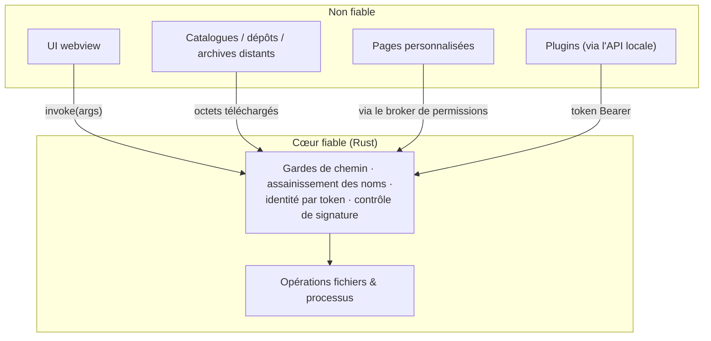
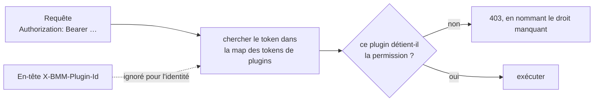
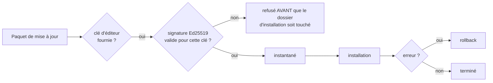

# Modèle de sécurité

BMM tourne sur ta machine, avec tes fichiers, et peut atteindre le réseau. Cela impose des frontières de
confiance nettes. En version courte : **traiter l'UI et le contenu distant comme non fiables, valider
dans le cœur, et n'exécuter jamais rien qui ne soit confiné.**

Chaque garde ci-dessous existe vraiment dans le code, la plupart étiquetées avec la classe de faiblesse
qu'elles ferment.

---

## Frontières de confiance

Chaque requête qui franchit la frontière est validée **là**. L'UI n'est jamais présumée avoir fait le
contrôle — ce qui compte, car l'UI est un webview qui affiche des noms, des descriptions et des chemins
venus d'Internet.

---

## Traversée de chemin (CWE-22) — gardée par frontière, pas globalement

Partout où un *nom* devient un *nom de fichier*, il est assaini à cet endroit. Le code nomme chaque cas :

| Frontière | Pourquoi c'est dangereux |
|---|---|
| Noms de modpacks | un nom devient un fichier sur le disque |
| Fichiers de langue | le nom de fichier devient le code de langue |
| Rapports de crash | un id de rapport devient un chemin |
| Téléchargements de catalogue | *« un segment comme `..\..\Startup\x.exe` pourrait s'échapper de storage_dir »* |
| Noms de launch packs | *« pour que le raccourci ne puisse jamais être écrit hors du dossier du pack (ex. le dossier Démarrage auto-exécuté → persistance) »* |
| Pages personnalisées | résolues avec un contrôle `..` **et** les liens symboliques résolus |

La dernière colonne est le point clé : la garde des launch packs existe précisément pour empêcher un nom
forgé de planter un raccourci dans le dossier Démarrage de Windows — un mécanisme de persistance, pas
juste un fichier égaré.

### Les archives ont une garde zip-slip indépendante par format

Pour `.zip`, BMM s'appuie sur `enclosed_name()` de la crate. Pour 7z et rar il ne fait **pas** que faire
confiance à la crate :

> *« une garde zip-slip INDÉPENDANTE pour les formats dont on fait par ailleurs confiance à la crate pour
> la sûreté des chemins — ceinture et bretelles, en miroir de la garantie `enclosed_name()` sur laquelle
> on s'appuie pour le zip. »*

Pour 7z, l'index entier est contrôlé en amont — *« donc valider l'index en amont plutôt que de faire
confiance à la crate »* — une archive malveillante est donc rejetée avant qu'un seul octet soit écrit.

---

## La portée du système de fichiers est un réglage

Tout n'est pas confiné aux dossiers de profil par défaut ; ça dépend du **mode de sécurité du système de
fichiers** :

| Mode | Portée accordée |
|---|---|
| `full` | accès récursif sur tous les disques montés |
| autre chose | seulement les trois dossiers de chaque profil, et seulement s'ils existent |

Si tu veux la frontière plus stricte, c'est un réglage que tu choisis — et il vaut la peine de savoir
que c'en est un, plutôt que de supposer que la portée étroite est toujours en vigueur.

---

## L'API locale résout l'identité depuis le token, jamais depuis un en-tête

> *« CWE-862/863 : l'API résout l'identité d'un appelant (et donc ses permissions) depuis CETTE map par
> token, pas depuis l'en-tête `X-BMM-Plugin-Id` falsifiable. »*

Un plugin ne peut donc pas s'élever en forgeant ou en omettant cet en-tête. Détails associés :

- Les tokens sont comparés en **temps constant** — *« évite la fuite temporelle par sortie anticipée de
  `==` »* (CWE-208).
- Le token est relu à **chaque** requête : la rotation prend effet immédiatement.
- Le serveur écoute sur **`127.0.0.1` uniquement**, jamais `0.0.0.0`.
- En build release, CORS est une liste blanche (CWE-942) ; `tauri dev` autorise toutes les origines.
- Il n'y a **aucune limitation de débit** — n'expose pas ce port. Voir la
  [référence API](doc-page:../reference/api).

!!! danger "Un endpoint équivaut aux droits admin"

    `GET /api/data` renvoie tout le document, `settings` inclus — et `settings` contient le token admin
    et tous les tokens de plugins. N'importe quel appelant capable de le lire peut se fabriquer un accès
    total. Accorder cet endpoint, c'est céder les droits admin.

---

## Jamais de shell

Les commandes personnalisées du planificateur *« n'invoquent jamais un shell (les arguments sont passés
séparément…), évitant la CWE-78 »* — les arguments sont passés en tableau argv, donc un nom contenant
`&&` ou `;` est un argument, pas une commande.

Et chaque processus enfant lancé par BMM est invisible par construction :

> *« Les programmes console (cmd, powershell, python, bash, cscript, …) lancés via le `Command` par
> défaut font apparaître une fenêtre console noire une fraction de seconde en build release… Faire
> passer chaque spawn par ces helpers pose le drapeau `CREATE_NO_WINDOW` pour qu'ils restent
> invisibles. »*

C'est une règle d'UX avec un bénéfice de sécurité : une fenêtre console qui clignote est exactement ce
qu'un utilisateur apprend à ignorer, donc rendre les légitimes silencieuses rend une fenêtre inattendue
signifiante.

---

## `eval` ne peut pas revenir

Le frontend a eu un REPL basé sur `eval()` dans le Debug Hub. Il a été retiré pendant une passe de
remédiation, et une **barrière de build** le maintient dehors :

> *« Fait échouer le build si des puits d'exécution de code dynamique réapparaissent dans les sources
> frontend. Le REPL `eval()` du Debug Hub a été retiré pendant la remédiation CWE ; cette garde s'assure
> qu'il (ou `new Function(...)`) n'est jamais réintroduit. »*

Elle tourne dans `npm run build` autant que dans `npm run ci` : une release ne peut donc pas être
produite avec lui de retour. À côté, `check-kit` vérifie que les factories du kit UI échappent ce
qu'elles rendent — et il tourne sur la sortie **compilée** *« pour exercer exactement ce qui est
livré »*.

---

## Les mises à jour échouent en mode fermé

> *« le paquet DOIT porter une signature Ed25519 valide pour cette clé ou la mise à jour est refusée
> *avant* que le dossier d'installation soit touché (fail closed) »*

Deux réserves honnêtes : l'épinglage est **opt-in par appelant** — il a lieu quand une clé d'éditeur est
fournie — et l'instantané + rollback protège d'une installation échouée, pas d'un paquet signé mais
malveillant. Ce qui est garanti, c'est qu'un payload intercepté ou altéré n'atteint jamais ton dossier
d'installation.

---

## Ce que le contrôle d'intégrité bloque, et ce qu'il ne bloque pas

À séparer, parce que « tout est vérifié par hash » est trop fort :

| Chemin | Appliqué ? |
|---|---|
| Téléchargement depuis le catalogue d'apps | **Oui** — SHA-256 vérifié avant toute exécution (CWE-494). Si le catalogue ne porte aucun hash, BMM le dit et demande ; le journal enregistre le hash réel du payload |
| Synchro de dépôt | **Oui** — comparé avant le téléchargement, par chunk pendant, re-vérifié après |
| Application d'un modpack | **Oui**, sauf si ce modpack a *ignorer le contrôle d'intégrité* |
| Activation d'un mod depuis le planificateur | **Non** — le contrôle est contourné, une exécution de fond ne pouvant pas s'arrêter pour demander |

Voir [Intégrité & hachage](doc-page:integrity-hashing) pour le tableau complet.

---

## Où vivent les secrets

- **Tokens d'API** — dans `data.json`, sur ta machine. Rotation depuis *Plugins & API*.
- **Un PAT GitHub** — n'a jamais besoin que du scope lecture, stocké localement, jamais envoyé ailleurs
  qu'à GitHub.
- **Mots de passe de téléchargement de dépôt** — envoyés en en-tête, pas en paramètre d'URL… **sauf**
  pour le bloc *Repo info* du générateur de scripts, qui le met dans la query string. Ne colle pas cette
  ligne générée dans un journal partagé ou un chat.
- **Télémétrie et replays** — opt-in, locaux d'abord, masqués par défaut. Un interrupteur *Complet*
  signifie **démasqué** : noms de mods, noms de profils et chemins ne sont plus `••••`. Voir
  [Confidentialité & télémétrie](doc-page:../features/privacy-telemetry).

---

Rien de tout ça ne te demande de faire confiance au réseau. Le réseau ne peut jamais que tendre des
octets à BMM ; que ces octets soient autorisés à devenir des fichiers sur ton disque, ou un processus sur
ta machine, est décidé par le cœur contre des règles qui ne bougent pas.

!!! info "À voir dans l'app"
    Aide & autres → Développeur → **Modèle de sécurité** et **Rapports de crash**.
