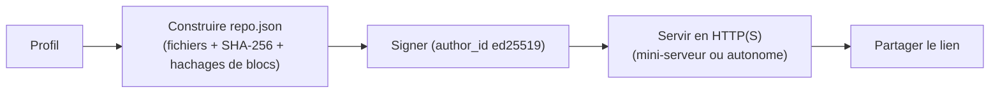
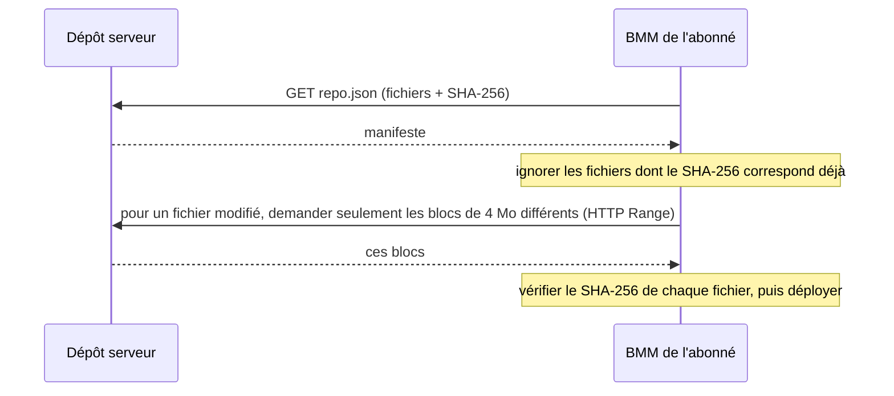

# Hébergement & synchro (dépôts serveur)

Un dépôt serveur transforme le profil d'une personne en **source de vérité hébergée** : tous les
abonnés convergent vers exactement les mêmes mods, versions et ordre — et le restent à mesure que le
propriétaire met à jour. Deux moitiés : l'héberger, et s'y synchroniser.

## Hébergement

BMM transforme le profil choisi en un dépôt servable :

- Un **manifeste** (`repo.json`) listant chaque fichier avec son hachage **SHA-256**, plus des
  **hachages de blocs de 4&nbsp;Mo** (SHA-256 aussi) pour des mises à jour différentielles.
- Une **signature** cryptographique : le manifeste est signé avec une clé **ed25519** dérivée de
  l'identité de l'hôte, et la clé publique est l'`author_id` du dépôt. Un abonné peut vérifier la
  signature pour confirmer que le dépôt vient bien de cet auteur.

Vous le servez soit depuis le **mini-serveur intégré** de BMM, soit via un serveur autonome généré
(Node, ou un script `.bat`/`.sh`) sur une machine dédiée, en HTTP — **le HTTPS est fortement
recommandé**.

### Contrôle d'accès (auto-hébergé)

Un dépôt auto-hébergé est **public par défaut**. Il peut être restreint de deux façons :

- Une **liste blanche / liste de bannis**, comparée automatiquement au compte lié ou à l'identité
  d'appareil d'un abonné.
- Un **mot de passe de téléchargement** optionnel. Définissez-le à la génération du serveur ; les
  abonnés se le voient alors demander à la première connexion (BMM l'envoie dans un en-tête
  `X-Repo-Password` et le retient pour les synchros suivantes). Laissez-le vide pour un dépôt ouvert.

Ne confondez pas ce mot de passe de téléchargement avec l'`admin_password` : ce dernier ne protège
que le panneau d'admin de l'*hôte* (pousser de nouvelles versions) et n'est pas une barrière pour les
abonnés.

## Synchro

Le client ne re-télécharge jamais à l'aveugle. Il récupère le manifeste et le réconcilie avec ce
qu'il possède.

Une **chaîne de version** sur le dépôt pilote la *détection* des mises à jour : BMM signale un mod
quand la version publiée du dépôt diffère de celle installée. Appliquer la mise à jour relance la
synchro ci-dessus — en ne transférant que les fichiers modifiés (jusqu'aux blocs modifiés) et en
retirant les mods que l'hôte a supprimés. D'où le coût de quelques Mo pour une petite mise à jour
d'une énorme collection.

### Ce qu'une synchro garantit réellement

| Étape | Contrôle |
|---|---|
| Avant de télécharger un fichier | hash local **==** celui du manifeste → fichier ignoré, rien ne transite |
| Par bloc | le SHA-256 de chaque bloc de 4 Mo est comparé : un transfert repris ne récupère que ce qui diffère |
| Après le téléchargement | le fichier est re-haché et comparé. Une divergence est une **erreur**, pas un avertissement |

Trois comportements à anticiper :

- **Une seule synchro à la fois.** Une seconde demande est refusée (`409`), pas mise en file.
- **Annuler s'arrête à la prochaine frontière de mod**, pas au milieu d'un fichier : tu ne te
  retrouves jamais avec un mod à moitié écrit.
- ***Supprimer les extras* est destructif par conception.** Ça aligne exactement la copie locale sur
  le distant, donc tout ce qui est en trop chez toi est retiré. Laisse-le coupé sauf si la convergence
  est précisément le but.

Tu peux aussi plafonner le **débit de téléchargement** de la synchro — la même idée de cadencement que
[Smart I/O](doc-page:performance), appliquée au réseau.

---

## Générer un dépôt

« Générer » construit le dossier du dépôt *et*, optionnellement, un serveur pour le servir. Les options
méritent d'être connues, car plusieurs changent la forme de la sortie et pas seulement un réglage :

| Option | Ce que ça change |
|---|---|
| **Profils** | quels profils deviennent le contenu du dépôt — un dépôt peut en porter plusieurs |
| **Nom d'auteur / seed** | alimente l'identité `author_id` avec laquelle le manifeste est signé |
| **Générer un serveur** | produire un serveur exécutable à côté des fichiers, pas seulement les fichiers |
| **Type de serveur** | un modèle de serveur standard ou étendu (`lux`) |
| **Léger** | une variante de serveur plus petite |
| **Port** | le port sur lequel le serveur généré écoute |
| **Limite d'upload** | un plafond de bande passante côté hôte |
| **Mot de passe admin** | protège le panneau d'administration de l'*hôte*, **pas** les téléchargements |
| **Démarrage auto** | le serveur se lance tout seul au démarrage |
| **UPnP** | demander au routeur de mapper le port automatiquement — retiré quand le serveur s'arrête |
| **Cloudflare** | passer par un tunnel au lieu d'exposer le port |
| **Docker** | produire une configuration conteneurisée plutôt qu'un script nu, avec un choix d'OS |
| **Sortie zip** | empaqueter le tout en une archive à transporter vers la machine hôte |
| **Langue** | la langue d'interface du serveur généré |

Le serveur généré est un script autonome (un `.bat` sous Windows, un `.sh` ailleurs) — aucune
installation de BMM nécessaire sur la machine hôte. La génération est annulable et, comme la synchro,
rapporte sa progression.

!!! warning "Deux mots de passe différents"

    Le **mot de passe admin** protège la publication de nouvelles versions depuis le panneau de l'hôte.
    Le **mot de passe de téléchargement** est la barrière pour les abonnés, envoyé en en-tête
    `X-Repo-Password` et mémorisé pour les synchros suivantes. Poser l'un ne pose pas l'autre, et les
    confondre est la cause habituelle du « pourquoi tout le monde peut télécharger ça ? ».

!!! note "BetterCommunity, ce n'est pas la même chose"
    Le hub BetterCommunity ajoute des fonctions qu'un dépôt que vous hébergez vous-même n'a **pas** :
    une empreinte `BCR-XXXX-XXXX`, un accès par compte (e-mail / mot de passe), et de l'hébergement
    géré. Un dépôt auto-hébergé a la signature `author_id` ci-dessus — pas une empreinte BCR.

!!! info "À voir dans l'app"
    Aide &amp; autre → Développeur → **Mode serveur** et **Flux d'hébergement**. Guide utilisateur :
    [Dépôt Serveur](doc-page:../features/repo).
